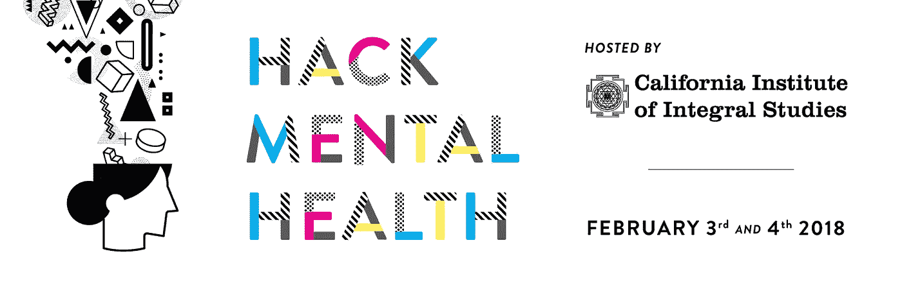
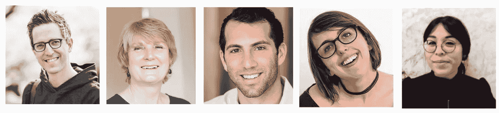
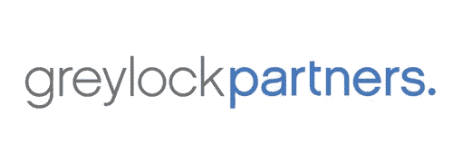
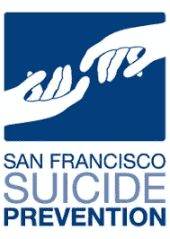
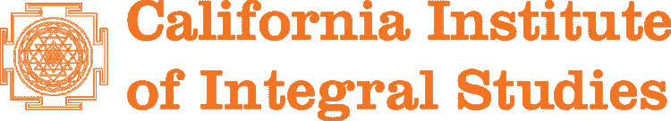
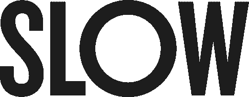
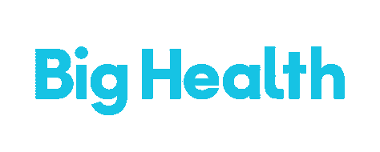

# 宣布黑客健康——硅谷的心理健康黑客马拉松

> 原文：<https://medium.com/hackernoon/announcing-hackmentalhealth-silicon-valleys-mental-health-hackathon-1f886fbd3c5c>

在即将到来的世纪，心理健康是我们国家面临的最大挑战之一。根据 [**全国精神病联盟**](https://nami.org/Learn-More/Mental-Health-By-the-Numbers) **:**

*   每五个美国成年人中就有一个在某一年经历过精神疾病。
*   自杀是美国 15-24 岁人群的第二大死因。
*   46%的无家可归成年人患有严重的精神疾病和/或物质滥用障碍。

# 走到一起

有才华的、鼓舞人心的心理健康从业者在第一线解决心理健康问题。技术领域有一些聪明的头脑，他们渴望在改善数百万美国人的健康方面产生真正的影响。有些幸存者和亲人的朋友患有精神疾病。在这场对话中，每个人都扮演着重要的角色。

让我们一起来创新心理健康。

# 该事件

HackMentalHealth 将于 2018 年 2 月 3 日至 4 日举办一场 24 小时的活动，重点是实践学习和与心理健康领域的合作，包括学术界、工业界和企业家。

我们的评委包括来自不同学科的领导者:

*   [戴夫·莫兰](https://medium.com/u/652de9fe92e3?source=post_page-----1f886fbd3c5c--------------------------------)，Slow Ventures[创始人兼合伙人](https://medium.com/u/c118cc4dcd75?source=post_page-----1f886fbd3c5c--------------------------------)和 Sunrise 创始人
*   利兹·比文，加州积分研究所的教务长
*   [塞思·罗森伯格](https://medium.com/u/6a54160e13ba?source=post_page-----1f886fbd3c5c--------------------------------)，格雷洛克合伙人[的投资者](https://medium.com/u/f3955f4bf101?source=post_page-----1f886fbd3c5c--------------------------------)
*   康特妮·布朗，旧金山自杀热线主任
*   旧金山心理健康协会的交流专家 Nicollette Maristela 说

一些致力于改善我国精神健康状况的领先公司和组织也加入了我们的行列:

*   **Tech** : [TokBox](https://medium.com/u/669a1133a124?source=post_page-----1f886fbd3c5c--------------------------------) ， [LinkedIn](http://linkedin.com) ，LinkedIn Wellness， [Greylock Partners](https://medium.com/u/f3955f4bf101?source=post_page-----1f886fbd3c5c--------------------------------) ， [DevRelate.io](http://devrelate.io)
*   **心理健康:** [SF 自杀预防](http://www.sfsuicide.org/)，[大健康](https://medium.com/u/99d83dfc3e50?source=post_page-----1f886fbd3c5c--------------------------------)，[灯笼](https://medium.com/u/411e9ef90668?source=post_page-----1f886fbd3c5c--------------------------------)，[井](https://well-women.org/)，[提示](http://mhprompt.org/)，[篝火](https://medium.com/u/6633f86d016e?source=post_page-----1f886fbd3c5c--------------------------------)，[兰花](http://tryorchid.com/)，[SF 心理健康协会](http://Mentalhealthsf.org)
*   **学术:**加州综合研究所
*   **个人:**杰西卡·利文斯顿， [Y Combinator](http://www.ycombinator.com/) 的创始合伙人
*   **食物&饮料:** [暗示水](https://medium.com/u/bbf2165d4296?source=post_page-----1f886fbd3c5c--------------------------------)，[卡萨印度餐馆](https://kasaindian.com/)， [Soylent](https://medium.com/u/70b7d2a0dc5f?source=post_page-----1f886fbd3c5c--------------------------------) ， [Guayakí](http://guayaki.com/)
*   ***注*** *:完整的赞助商名单可在* [*我们的网站*](http://hackmentalhealth.care/partners/) 获得

# 这不是普通的黑客马拉松

大多数黑客马拉松都要求参与者是程序员，并通宵喝红牛才能参加。因为我们相信心理健康的重要性，所以我们确保这次黑客马拉松与众不同:

*   我们将制定一个“代码冻结”来鼓励参与者睡觉。
*   我们没有选择红牛，而是与 Hint Water 和 Soylent 等注重健康的公司合作。
*   我们的活动包括瑜伽工作坊、表达艺术疗法，甚至还有针灸课程！

我们希望 HackMentalHealth 可以改变黑客马拉松的方向，使其更注重健康，对参与者的健康更无害。

# 我如何加入？

这次黑客马拉松对所有学科和背景开放。您可以在我们的网站[http://www . hackmental health . care](http://www.hackmentalhealth.care)了解更多信息，并在我们的 [**Eventbrite 报名页面**](http://hackmentalhealth.care/join/) **报名参加。**

如果您想进一步参与，您可以:

*   [像我们的脸书页](https://www.facebook.com/hackmentalhealth/)。
*   在 Twitter 上关注我们。
*   [申请加入我们脸书小组的参与者](https://www.facebook.com/groups/756324717898965/)。
*   如果你有兴趣帮助这次活动取得成功，请随时在 Twitter 上给我们发一个 DM。
*   把这篇文章放到媒体上，这样别人就可以看到了。