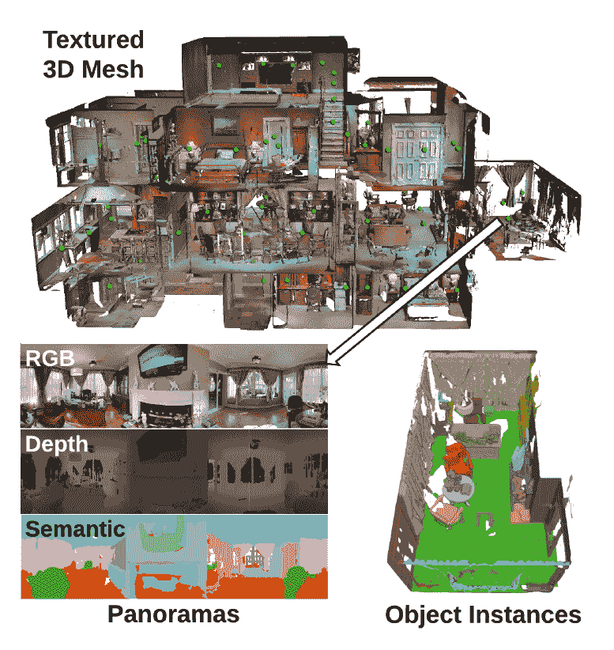
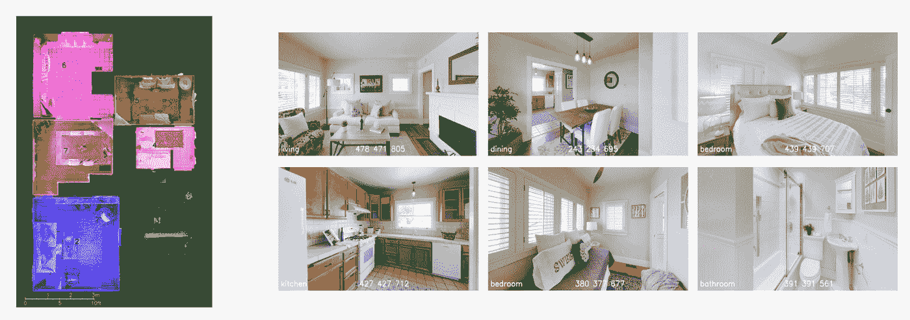
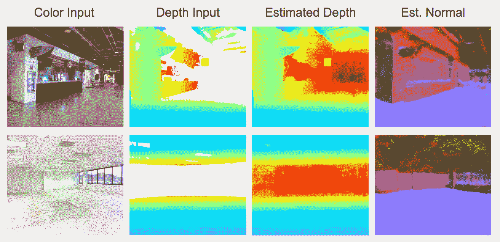
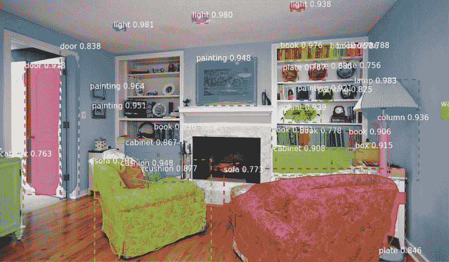
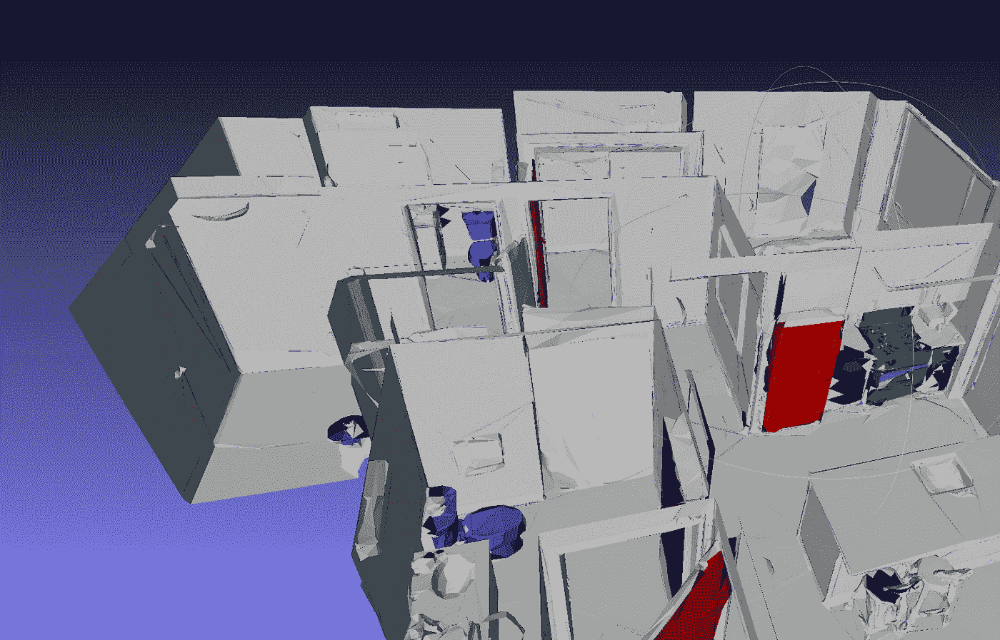
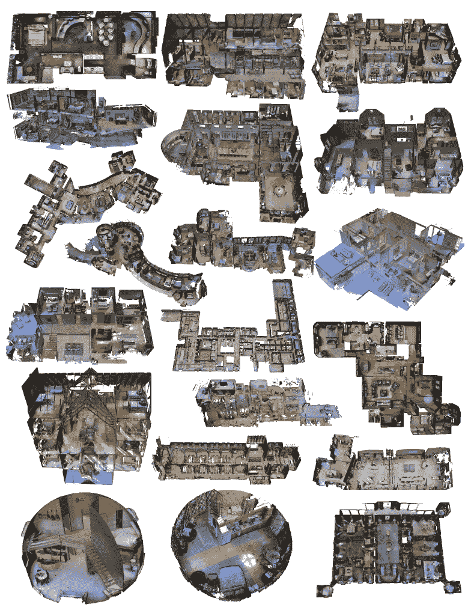

# 宣布 Matterport3D 研究数据集

> 原文：<https://medium.com/hackernoon/announcing-the-matterport3d-research-dataset-815cae932939>

在 Matterport，我们已经亲眼目睹了 3D 数据在深度学习的几个领域中的巨大力量。我们已经在这个领域做了一段时间的研究，并希望发布一部分数据供研究人员使用。令我们感到兴奋的是，斯坦福大学、普林斯顿大学和 TUM 的团队煞费苦心地手工标记了客户提供的大量空间，并将这些标记的空间以 Matterport 3D 数据集的形式公之于众。

**这是世界上同类数据中最大的公共数据集，标注这个数据集是一项非常重要的工作。**

ImageNet 和 COCO 等超大型 2D 数据集的存在有助于在 2010 年代中期创建高度精确的 2D 图像分类系统，我们预计这种带标签的 3D+2D 数据集的可用性将对提高人工智能系统感知、理解和导航 3D 世界的能力产生类似的巨大影响。这意味着从增强现实到机器人到三维重建，再到更好地理解 2D 图像的方方面面。你可以在这里访问数据集和样本代码[，在这里](https://niessner.github.io/Matterport/)阅读论文[。](https://arxiv.org/pdf/1709.06158.pdf)

**数据集中有什么？**

该数据集包含 10，800 个对齐的 3D 全景视图(每像素 RGB +深度),来自 90 个建筑规模场景的 194，400 个 RGB +深度图像。所有这些场景都是用 Matterport 的 Pro 3D 相机拍摄的。场景的 3D 模型已经用实例级对象分割手工标记。你可以在[https://matterport.com/gallery](https://matterport.com/gallery)互动探索各种各样的物质端口 3D 重建。

**为什么 3D 数据很重要？**

3D 是我们人类感知世界的关键。它使我们能够轻松地在视觉上分离物体，快速地模拟我们环境的结构，并毫不费力地在杂乱的空间中导航。

对于构建系统来理解图像内容的研究人员来说，拥有这个 3D 训练数据集为图像内容的大小和形状提供了大量的基础事实标签。它还提供了相同对象和房间的多个对齐视图，允许研究人员在视点变化时查看算法的鲁棒性。

对于构建旨在解释来自 3D 传感器的数据的系统的研究人员(例如，增强现实护目镜、机器人、具有立体或深度感应的手机，或者像我们这样的 3D 相机)，拥有一系列真实的 3D 空间进行训练和测试会使开发过程更容易。

**这个数据集能做什么？**

很多东西！我将分享 Matterport 正在做的几个研究领域。

我们已经在内部使用它来构建一个系统，该系统将用户捕获的空间划分为房间，并对每个房间进行分类。它甚至能够处理两种类型的房间(如厨房和餐厅)共用一个没有门或隔断的外壳的情况。在[未来的](https://hackernoon.com/tagged/future)，这将帮助我们的客户跳过在平面图中标记房间的任务。

我们还在尝试使用深度学习来填充我们的 3D 传感器无法覆盖的区域。这可以让我们的用户更快地捕捉大型开放空间，如仓库、购物中心、商业地产和工厂，并捕捉新类型的空间。这里有一个初步的例子，其中我们的算法使用颜色和部分深度来预测深度传感器无法拾取的距离太远的区域的深度值和表面方向(法向量)。

我们还利用它开始将顾客捕捉的空间完全分割成物品。与我们现在的 3D 模型不同，这些完全分段的模型可以让你精确地识别空间的内容。这让你可以做很多事情，包括自动生成一个空间的内容和特征的详细列表，并自动查看不同家具的空间外观。

最终，我们希望为现实世界做谷歌为网络所做的事情——让任何空间都能被索引、搜索、排序和理解，让你准确地找到你想要的东西。想找一个有三个大卧室、一个时尚的现代厨房、一个可以看到池塘的阳台、一个带内置壁炉的客厅和落地窗的住处吗？没问题！想要清点办公室中的所有家具，或者将建筑工地的管道和 HVAC 安装与 CAD 模型进行比较？也轻松！

该论文还展示了一系列其他用例，包括通过基于深度学习的特征改进特征匹配，从 2D 图像进行表面法线向量估计，以及在基于体素的模型中识别建筑特征和对象。

**为什么这比合成 3D 数据集更可取？**

合成数据集是一个令人兴奋的研究和开发领域，尽管它们在纯合成数据集上训练的系统如何在真实数据上工作方面有局限性。真实世界中各种各样的场景外观很难模拟，我们发现合成数据集在真实数据训练前的第一轮训练中最有用，而不是主要的训练步骤。

下一步是什么？

我们很高兴听到你们最终将如何处理这些数据！如上所述，您可以在这里访问数据、代码和 3DV 会议论文[，我们很高兴能与研究机构在一系列项目上合作。](https://niessner.github.io/Matterport/)

如果你对 3D 充满热情，并对更大的数据集感兴趣，Matterport 内部拥有的 3D 数据大约是这个数据集的 7500 倍，我们正在为一系列深度学习、SLAM、计算几何和其他相关的计算机视觉职位招聘[。](https://matterport.com/careers/)

我们要感谢 Matthias Niessner、Thomas Funkhouser、Angela Dai、Zhang、、Manolis Savva、Maciej Halber、Song 和 Andy Zeng 在标记该数据集和开发算法以在其上运行方面所做的工作。我们还要感谢所有 Matterport 相机的所有者，他们允许我们将他们的 3D 模型包含在这个数据集中。

瓦利德·阿卜杜拉、·张和贡纳·霍夫登使马特波特在这一领域的内部工作成为可能。

享受这些空间创造的世界吧！我们当然有！