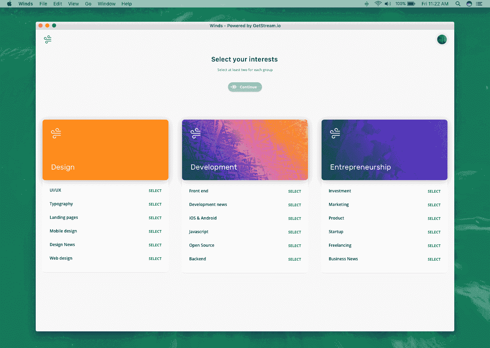

# 发布 Winds 2.0——一款支持 RSS 和播客的电子应用

> 原文：<https://medium.com/hackernoon/announcing-winds-2-0-an-electron-app-with-support-for-rss-podcasts-d13dbe812477>

**更新**:[https://medium . com/@ npar sons 08/winds-2-0-public-beta-f0d 27634 ef 91](/@nparsons08/winds-2-0-public-beta-f0d27634ef91)

2016 年末，我们宣布发布 Winds，这是一款用 [React](https://reactjs.org/) 、 [Redux](http://redux.js.org/) 、 [Sails](https://sailsjs.com) 和 [Stream](https://getstream.io) 构建的开源 RSS 阅读器。该应用发布在 GitHub 上，并附有一个在 [GetStream.io](https://getstream.io/) 域上的完全托管版本。该项目变得如此受欢迎，以至于 GitHub 拉请求为其做出贡献并对其进行改进成了每天都会发生的事情，Winds 很快成为拥有数千个 GitHub 明星的知识库。更令人印象深刻的是，showcase 应用程序还有一个非常重要的用途；这使得我们的网站每天都有数百人注册。

**接下来是什么？**

今年，我们决定重新审视这个项目，开发 Winds 2.0，这是该应用程序的一个全新版本。我们想再次引起轰动，为此，我们需要一些令人兴奋的东西。我们很高兴地宣布，我们决定在 Winds 应用程序中引入播客发现和回放支持。虽然添加播客支持听起来微不足道，但从设计和开发的角度来看，这实际上是一项非常困难的任务。将两种截然不同的内容形式结合起来也是一个美学挑战。谢天谢地，我们的首席设计师提出了一个美丽的，统一的设计。

**开发堆栈**

鉴于我们正在构建一个开源应用程序，使用开源技术才有意义。对于 Winds 2.0，我们使用类似的 React / Redux 堆栈，但有一点需要注意；我们团队正在用 [Express](http://expressjs.com/) 代替 Sails 构建 2.0，并借助 GitHub 的精彩[electronic](https://electron.atom.io/)项目作为跨平台桌面应用。

我们决定使用纯桌面版本的应用程序(特别是电子版)有很多原因:

1.  JavaScript 的普遍使用使得它向桌面的迁移成为一个自然的下一步。它的 API 是 100%的 JavaScript！👍
2.  有了电子，就不需要为各种浏览器写代码了。Electron 位于 Chromium 之上，允许我们编写现代的 CSS，而没有各种厂商前缀和额外的膨胀。👨‍💻
3.  通过单一代码库轻松定位多个平台(Mac、Windows、Linux)。🖥
4.  电子由 GitHub 维护，有一个活跃的社区。👩‍🔧
5.  太牛逼了。😎

**预计 2.0 级大风何时到来**

该项目正在积极开发中，我们大约在两周前破土动工。这个版本的范围比 Winds 1.0 要复杂得多，因此，它将需要更长的时间来构建。然而，我们预计 11 月底至 12 月初发布(与我们去年发布的时间框架大致相同)。

**最后的想法**

我们将继续写博客，让社区了解我们的最新进展，并且非常兴奋我们能够推出 Winds 的第二个版本。如果你对 Winds 2.0 有任何疑问，或者你有兴趣听听我们正在构建的细节，请在下面的评论中自由发表。

和往常一样，我们鼓励您查看 getstream . io，这是一个用于在很短的时间内构建可伸缩的新闻和活动提要的 API，其成本和开发资源只是正常情况下的一小部分。我们有一个很棒的 [5 分钟教程，可以帮助您在 Stream 网站上开始](https://getstream.io/get_started/)。