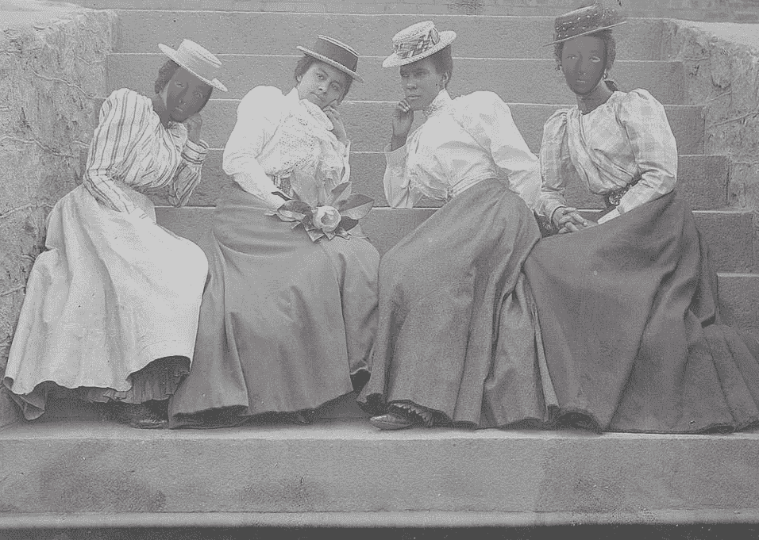
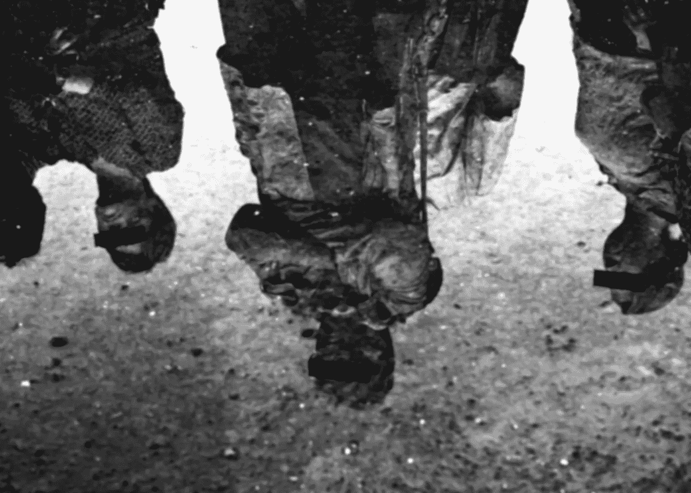

# 虚拟现实中的匿名

> 原文：<https://medium.com/hackernoon/anonymity-in-virtual-reality-eb065d72bae5>

不管是好是坏，匿名是网上冲浪的一个基本部分。无论我们是在论坛上发帖还是在网上约会，我们的人物角色都是精心设计的。

父母怀有敌意的跨性别男孩可以在互联网上做自己，永远不会被自己的外表贴上标签。经历过古代冲突的老兵可以了解他战斗过的文化，亲眼目睹下一代在建设什么。这个脸颊长有雀斑的小镇女孩可以为科学评论做出贡献，从来没有人告诉她太年轻(或太女性化)以至于不知道自己在说什么。

但同样，愤怒的年轻人也可以从暗处发起攻击。本应因尖叫而变得粗糙的声音永远无法真正被压制。在拥挤的房间里永远不会说的笑话被发现了，被分享，再被分享。

我们制作了一系列的面具，在这些面具里，我们以一种与我们自己的皮肤完全不同的方式运作。我们更大胆。我们不那么害怕了。我们说出我们的真相，不管是好是坏，我们尽我们所能避免其他人丑陋的真相。这不仅仅是互联网的重要组成部分——它曾经定义了我们在互联网上的每一次互动。

这种情况正在慢慢开始改变。脸书制定了严格的规定，禁止使用“[真实的](https://www.theguardian.com/technology/2015/nov/02/facebook-real-name-policy-protest)名字，现在这已经成为其他服务的标准登录方式。例如，网上约会经常链接回脸书，以确保没有人被诱骗。朋友们越来越有可能通过 Musical.ly 和 Snapchat 等服务进行交流，在这些服务中，他们的外表无法隐藏，他们可能遇到的唯一陌生人是朋友的朋友。甚至在线评论区也试图通过[禁止匿名评论](http://www.cbc.ca/news/canada/new-brunswick/cbc-comment-policy-name-expensive-1.3497239)来反击网络钓鱼，取而代之的是要求登录至少可以追踪用户评论历史，如果不能追溯到他们的真实身份的话。

但是虚拟现实会跟随这些趋势中的哪一个呢？在这个世界上，一半的冒险是你可以成为你想成为的任何人，我们会强迫人们做自己吗？

这不是一个容易回答的问题。远离匿名的举动在很大程度上是由在线欺凌和骚扰推动的，我们已经看到这是虚拟现实没有消除的问题。心理学研究表明，网上钓鱼的动机是缺乏谴责；当匿名被取消时，对指责的恐惧会增加，而欺骗会减少。如果是这样的话，在 VR 中允许匿名是一个潜在的严重问题。

但是其他批评家不同意。他们说，在线钓鱼与[在线去抑制效应](http://en.wikipedia.org/wiki/Online_disinhibition_effect)联系更紧密，这实质上意味着，因为我们通过缺乏面部表情、语调和肢体语言与现实世界的自我分离，所以滥用者不会在他们通常会后退的时候后退。如果是这样的话，足够真实的虚拟现实应该会产生与现实世界中相同的“离开”感觉，这意味着一旦我们开始拥有真正真实的化身，我们就会看到更少的虚拟诱惑。

当我们开始建立虚拟社区时，匿名是否值得冒险是一个重要的问题。大多数网站目前允许用户使用他们想要的任何别名来建立他们想要的任何类型的虚拟形象。虽然有些与现实世界的身份(如 Steam 帐户或脸书登录)相关，但简单地创建一个新的电子邮件并登录大多数这些服务还是相对容易的。现在我们趋向于匿名，这意味着一个虚拟的沙盒，任何人都可以在里面玩。例如，Oculus 正在使用性别中立的化身，而其他服务正在让我们体验被男性包围的女性是什么样的，反之亦然。研究表明，只要照照镜子，看到另一种肤色的人，就能帮助[对抗种族偏见](https://phys.org/news/2017-05-immersive-virtual-reality-racial-bias.html)，当然，永远不知道你在和谁交流意味着会遇到你可能永远不会接触到的人。它有可能帮助我们建立乐观科幻小说中梦想的光辉乌托邦式的未来。

但是虚拟现实中的骚扰是真实存在的，当我们走向未来时，保护高危人群是非常重要的。诀窍是找到一种方法来保护这些群体，同时又不丧失创造自我的魔力。一个可能的解决方案是现实主义——通过让人们忘记他们在线来打击钓鱼。另一个是像“英雄姿态”这样的保护机制，惩罚巨魔，给受害者力量。

无论我们做出什么决定，都应该由社区做出明智而有意识的决定。因为骚扰太严重了，不容忽视。自我发明的力量太珍贵了，不能扔掉。

【鹪鹩手执】为【www.hammerandtusk.com】**所写的*。***