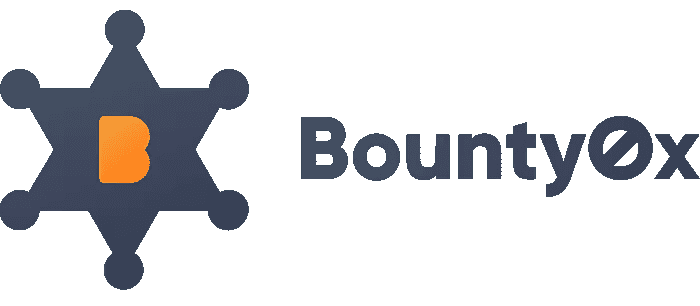

# Bounty0x 将改变人们用密码赚钱的方式

> 原文：<https://medium.com/hackernoon/another-great-project-you-should-keep-an-eye-on-is-bounty0x-2c34389da119>

你应该关注的另一个伟大项目是 Bounty0x。他们有一个已经运行的平台，现有的用户群和一个有交付项目记录的团队。

有几家交易所希望很快将这种代币上市，一定要将这种代币留在你的视线中。

# 自己研究关于 Bounty0x 的有用信息

**硬币名称:**奖金 0x 代币(BNTY)

**总供应量:** 500，000，000 赏金 0x 币(BNTY)

**循环供给:**114967118 BNTY

市值:1850 万美元

**Ico 前价格:** 1 BNTY = 0.0132 美元

**Ico 价格:**1 BNTY = 0.0165 美元

**白皮书:**https://bounty0x.io/whitepaper.pdf

# **关于赏金 0x 的信息:**

**Bounty0x 推出了一个分散的赏金猎人网络，该网络采用基于赌注和令牌燃烧的审查系统，由区块链技术公司驱动。Bounty0x Coin (BTNY)是一种可交易的代币，它将提供一个平台，赏金猎人将能够通过完成 ICO 初创公司的赏金任务来获得代币付款。**

Bounty0x 为在线营销、软件开发、咨询和研究提供解决方案。它将通过利用影响者营销来解决广告盲的问题。该平台将为开发人员提供一种有效的方法来识别他们代码中的错误，方法是提供审查，并且只在发现实际错误时才付费。Bounty0x 将分散咨询行业，使专家能够接受全球最新行业趋势的培训。像治疗乳腺癌这样的事情可以得到政府、企业或非政府组织的资助。。

这一独特的平台提供了一种高效的方式来审查任务、处理所有付款、在需要时提供个人帮助，并吸引更多的广告和营销受众。自由职业者有多个平台，但 Bounty0x 是第一个专门为奖金设计的平台，是为奖金管理而构建的。

平台内的奖金有 3 种类型，简单奖金可由奖金 0x 算法和 API 自动检查，无需人工参与。警长奖金是警长通过完成正确的验证来获得代币的一种方式。最后一个级别是超级奖金，它需要被项目所有者或管理员接受，并将用于高度技术性的任务或主观奖金。

# **CoinMarketCap 网址/网站网址:**

 [## 奖金 0x (BNTY)价格、图表、市值和其他指标| CoinMarketCap

### 获取奖金 0x 价格、图表和其他加密货币信息

coinmarketcap.com](https://coinmarketcap.com/currencies/bounty0x/) 

https://bounty0x.io

# **社交媒体信息:**

**脸书 **

网址:[https://www.facebook.com/bounty0x/](https://www.facebook.com/bounty0x/)

喜欢: **177** *喜欢* 和 **183** *关注者*

***推特***

网址:[https://twitter.com/bounty0x](https://twitter.com/bounty0x)

追随者:**15.4k**追随者

过去 7 天有多少条推文/转发: **10 条**T30 条推文/转发

***电报***

网址:[https://t.me/bounty0x](https://t.me/bounty0x)

用户:**2596**40】成员

***Reddit***

网址:[https://www.reddit.com/r/Bounty0x/](https://www.reddit.com/r/Bounty0x/)

读者: **137** 读者*读者*

***Youtube***

网址:[https://www.youtube.com/channel/UCz6Sy-x4BhFR8CDT2bjGrLw](https://www.youtube.com/channel/UCz6Sy-x4BhFR8CDT2bjGrLw)

订阅者:**20**60】关注者

***中等***

网址:[https://blog.bounty0x.io/](https://blog.bounty0x.io/)

追随者:(出版物)

最近 7 天有多少更新:**3**帖子

***领英***

网址:[https://www.linkedin.com/company/bounty0xnetwork/](https://www.linkedin.com/company/bounty0xnetwork/)

从动轮 **: 9 个**从动轮*从动轮*

**GitHub**

网址:[https://github.com/bounty0x](https://github.com/bounty0x)

最近 7 天有多少更新:**1**帖子

***不和***

网址:[https://discord.gg/MkzjzaU](https://discord.gg/MkzjzaU)

# **员工/团队信息:**

名称:**安杰洛·亚当**

头衔:**联合创始人——运营**

额外链接:[http://www.dcldc.org/](http://www.dcldc.org/)

姓名:**帕斯卡尔·希尔曼**

头衔:**联合创始人——销售、营销和公关**

领英:[https://www.linkedin.com/in/pascalthellmann/](https://www.linkedin.com/in/pascalthellmann/)

电报:[https://twitter.com/pascalthellmann?lang=en](https://twitter.com/pascalthellmann?lang=en)

姓名:**德尼兹·达尔基利奇**

头衔:**联合创始人——首席开发人员**

领英:[https://twitter.com/dnzdlklc](https://twitter.com/dnzdlklc)

额外链接:[https://www.linkedin.com/in/denizdalkilic/](https://www.linkedin.com/in/denizdalkilic/)

姓名:**托马斯·坎贝尔**

标题:**全栈开发者**

领英:[https://www.linkedin.com/in/campbelltj/](https://www.linkedin.com/in/campbelltj/)

姓名**三郎太铃木**

标题:**全栈开发者**

领英:[https://www.linkedin.com/in/saburo-suzuki-626859154/](https://www.linkedin.com/in/saburo-suzuki-626859154/)

姓名:**西蒙·克鲁斯**

头衔:**社区经理**

领英:[https://www.linkedin.com/in/simon-kruse-959287154/](https://www.linkedin.com/in/simon-kruse-959287154/)

额外链接:[https://twitter.com/crusoes?ref _ src = tw src % 5 egoogle % 7 ctw camp % 5 eserp % 7 ctw gr % 5 e author](https://twitter.com/crusoes?ref_src=twsrc%5Egoogle%7Ctwcamp%5Eserp%7Ctwgr%5Eauthor)

名称:**乌韦·泰尔曼**

头衔:**顾问**

领英:【https://twitter.com/uwethellmann?lang=en】T42

额外链接:[https://www.linkedin.com/in/uwethellmann/?locale=de_DE](https://www.linkedin.com/in/uwethellmann/?locale=de_DE)

姓名:**陶喆**

头衔:**顾问**

领英:[https://www.linkedin.com/in/cathy-tao-31411419/](https://www.linkedin.com/in/cathy-tao-31411419/)

名称:**沙哈夫吧-格芬**

头衔:**顾问**

领英:[https://www.linkedin.com/in/shahafbg/](https://www.linkedin.com/in/shahafbg/)

姓名:**肖恩·霍格**

头衔:**顾问**

领英:[https://www.linkedin.com/in/sean-hoge-08b95393/](https://www.linkedin.com/in/sean-hoge-08b95393/)

姓名:**乔治李**

头衔:**顾问**

领英:[https://twitter.com/gliinbox](https://twitter.com/gliinbox)

额外链接:[https://www.linkedin.com/in/ligeorge/](https://www.linkedin.com/in/ligeorge/)

希望这些信息对你有帮助！让我知道我该如何改进这个研究过程，以及作为一名投资者，你还需要哪些数据来做出正确的投资决策。请在下面的部分留下您的反馈意见:)