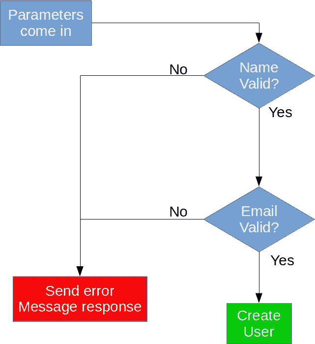

# 再看长生不老药

> 原文：<https://medium.com/hackernoon/another-look-at-elixirs-with-cbd70ccd8ba4>

最近我写了一篇关于使用 Elixir 的`with`语法的文章:

 [## 使用灵药

### 这是一篇简短的文章，展示了在 Elixir 中使用 with 关键字的示例。

medium.com](/@shdblowers/using-elixirs-with-bccf39bac279) 

我在那篇文章的结尾说，我确信`with`是有用处的，但是我在努力寻找它们。作为对那篇文章的更新，我发现了对`with`语句的一个很好的使用，[模型](https://hackernoon.com/tagged/model)净化！

下面是一个流程图，展示了这篇文章将以多种方式编写的逻辑:

正如您所看到的，逻辑分支到两个不同的最终结论，要么参数有效，可以创建用户，要么存在错误，应该通知用户。我在代码中寻找的是尽可能清晰简明地表达这一思想。

下面是一个使用`with`的例子，它通过使用一个结构创建一个用户，同时依次净化来自请求的每个[参数](https://hackernoon.com/tagged/parameter):

上面我已经定义了函数`create/1`,它获取包括`"Name"`和`"Email"`的用户属性映射，并返回一个创建的用户结构。对于每个添加的参数，都要通过一个验证函数，该函数将返回`{:ok, property}`或`{:error, message}`。

使用`with`这些函数可以链接在一起，如果出现问题，共享一个`else`子句。此外，每个函数产生的值都可以被捕获并在`do`语句中使用，如上所示。

还要注意，`else`子句在上面的代码中实际上是可选的。因为该子句返回它所捕获的内容，所以当省略了`else`子句时，这种行为得以保持。

将`create/1`功能与流程图进行比较，可以清楚地看到，使用`with`可以简洁地表达逻辑。它清楚地显示了逻辑想要走的快乐之路，以及它是否到达了那条路的尽头。

让我们看看`with`的替代方案，如前一篇文章所示，它们是使用函数或`case`。再次查看了这两种选择，我看不出单独使用函数是一种合理的选择，因为它不能恰当地表达正在发生的分支逻辑。

下面是使用`case`表达的逻辑示例:

上述方法有两个关键问题。首先也是最重要的，在`create/1`函数中最重要的代码行，创建`User`结构的代码行隐藏在函数中间的嵌套深处。目前，如果有两个参数，可读性不是很好，想象一下如果有更多的参数，比如 10 个？那看起来很可怕。另一个问题是我不得不一次又一次地重新定义如何处理一个错误，而不是对所有事情都指定一次。

最后，我收回我说过的关于`with`语法的话。这是一个很好的语法糖，我期待着在未来发现它的更多用途。

> [黑客中午](http://bit.ly/Hackernoon)是黑客如何开始他们的下午。我们是 [@AMI](http://bit.ly/atAMIatAMI) 家庭的一员。我们现在[接受投稿](http://bit.ly/hackernoonsubmission)并乐意[讨论广告&赞助](mailto:partners@amipublications.com)机会。
> 
> 如果你喜欢这个故事，我们推荐你阅读我们的[最新科技故事](http://bit.ly/hackernoonlatestt)和[趋势科技故事](https://hackernoon.com/trending)。直到下一次，不要把世界的现实想当然！

