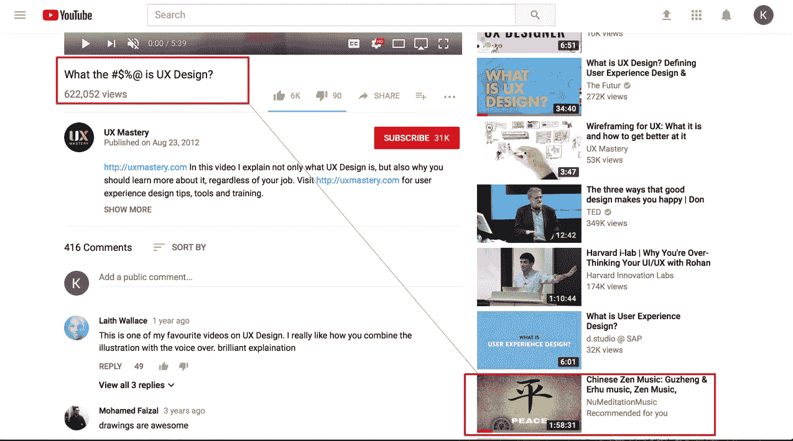
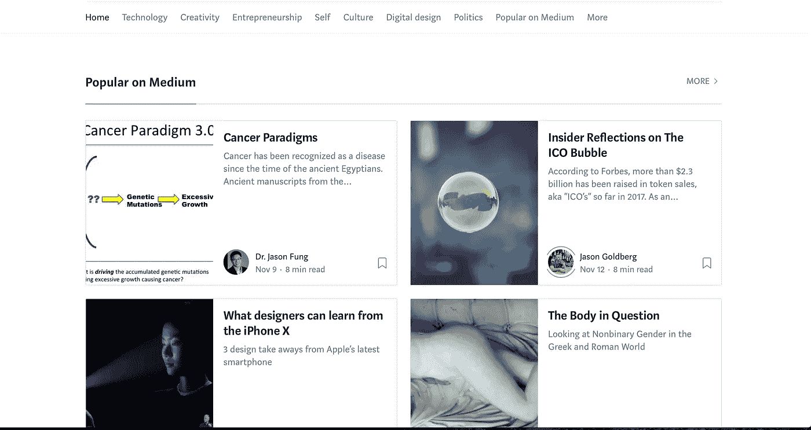
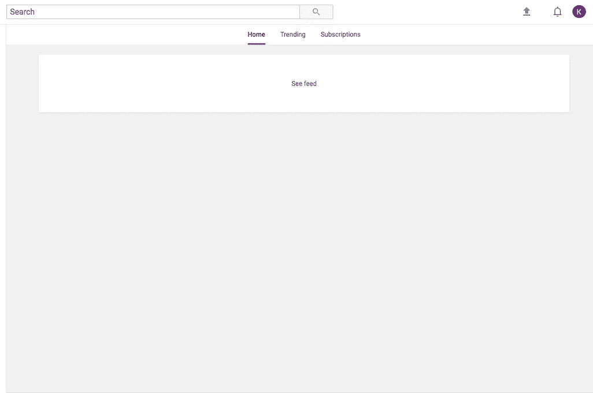
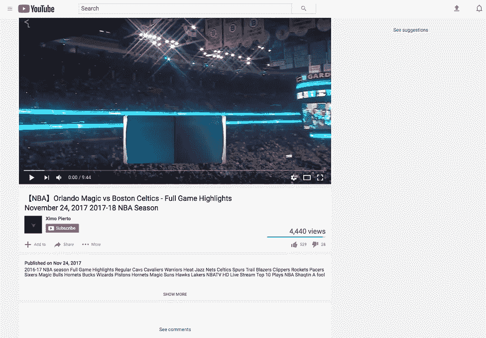
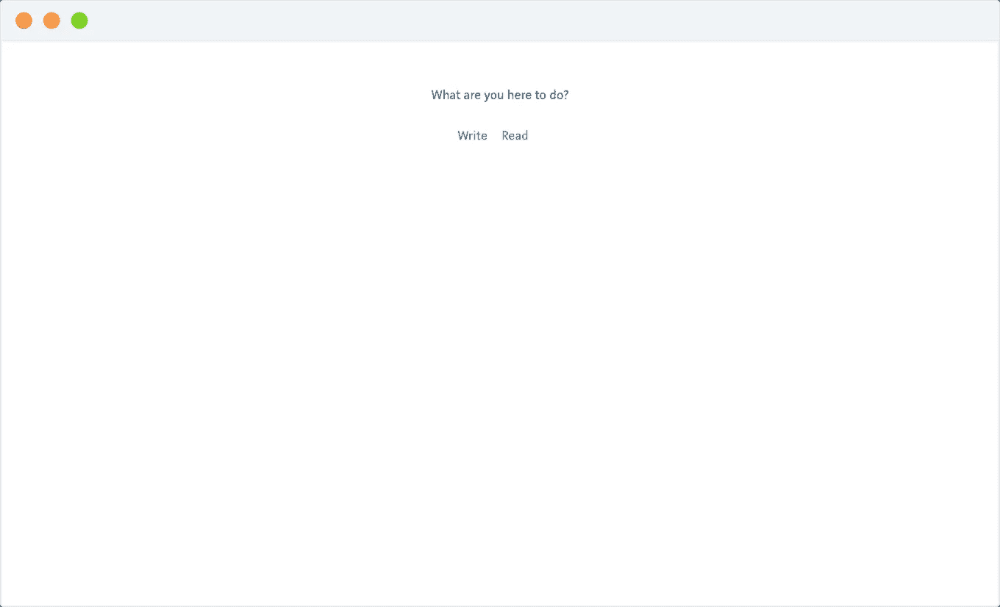
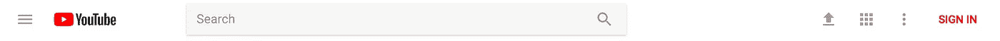

# 反增长黑客攻击

> 原文：<https://medium.com/hackernoon/anti-growth-hacking-f2ffb2810203>

“5 分钟”的 Youtube 插播变成了 10 分钟、15 分钟、30 分钟的插播。

我消费的比我想的要多。完全屏蔽网站，或者限制我的使用通常都不起作用，所以我研究了网站如何吸引注意力，并对它们进行了调整，使它们不那么令人分心。

# 不一致的激励

大多数内容平台都有动机尽可能长时间地吸引你的注意力，因为它们的收入直接或间接地与你在它们身上花费的 T2 时间联系在一起。

当你想在网站上做的和网站想让你做的不一致时，你会遇到这样的情况:

在这里，Youtube 建议一个与我正在观看的内容无关的视频。这个建议是基于我的观看历史，但没有考虑到我是否在合适的环境中想要看到这个建议。这些建议非常危险，因为我有一部分真的想点击它，因为毕竟它是基于我已经看过的视频。

As soon as you land on medium.com, you’re shown articles to read, even if your intent is to write.

平台创建者很容易忽略你的意图，以促使你以对他们有利的方式使用网站。

# 注意力保持策略

我看到内容平台用来吸引注意力的三种主要技术。

## 1.用户界面功能

**可变内容的无限滚动:**内容会在你阅读时自动加载，你不知道接下来会显示给你什么。这种机制引发了大脑中的多巴胺反应，类似于拉动老虎机。令人上瘾。大多数内容平台上都有这种无限提要。

手机:手机的观看限制促使你花更多的时间在一个应用上。主动的上下文切换需要更多的努力(被动地，通知会干扰你的沉浸感，把你带到另一个应用)。要在没有通知触发的情况下进行上下文切换，需要在最短的情况下按两次按钮以转到您之前查看的应用程序，在最长的情况下，按一次按钮，在屏幕上找到您的下一个应用程序，然后单击它以打开它。随着所有动画内容的加载，在手机上切换应用程序比在桌面浏览器上切换应用程序的时间更长，这使得你不太可能这样做。

## 2.游戏化

我们喜欢赢取积分。在一些平台上，积分作为信誉在平台内外都是有用的。

[StackOverflow](http://stackoverflow.com) 在现实世界中，用户可以利用他们在平台上的声誉，因为在 StackOverflow 上回答问题的技能通常转化为编程知识/能力[1]。Airbnb 上的主人声誉会影响你接待多少客人。

在其他情况下，积分的存在纯粹是为了提高参与度:当你给某人发一张照片时，Snapchat 就会奖励积分。

## 3.您希望(需要)点击的建议

你使用一个平台越多，它就越了解你，越了解你会点击什么建议。

这些策略并不总是用来吸引你的注意力。例如，优步应用程序会带你快速放置一个乘车点(并因此离开应用程序)。这对他们有用，因为他们的收入与你在他们的应用上花了多少时间无关，而是与你使用他们的应用的频率和距离有关。[2]

# 反增长黑客攻击

我希望能够在看到更多信息之前**选择是否消费更多信息，将内容消费变成一种主动的选择，而不是被动的习惯。这种转变耗尽了分散注意力的力量…**

我调整了 Youtube 和 Medium，让它们在播放内容之前先问一下:

Additional content and suggestions are shown only when you ask for it

The modified landing page for medium.com. This way, if you go to medium.com to write an article, you no longer have to see a feed of interesting articles to read before you get to the writing editor.

你可以试试这个 Chrome 扩展[这里](http://unhookedbrowsing.com)。将很快增加更多的网站。如果您有任何建议/要求，请随时[联系我](http://koopuluri.com/contact)。

# 进一步的工作和探索

*   研究更多的网站，收集模式，使这种方法更加稳健。网站使用遵循幂定律，因此处理前 10-20 个内容平台应该涵盖大多数内容消费。
*   **添加更多功能**(例如，使无限饲料有限)。
*   **反增长工程师手机:**解决手机问题很重要，因为大多数内容都是在手机上消费的。移动的本质给破解用户体验带来了挑战，就像你在网上一样。
*   **重新考虑移动设计**以最大化效用和最小化干扰。

互联网是强大的。我的大部分技能都是从网上的高手那里学到的。与此同时，还有一些问题:

*   **虚假信息。**
*   **意见气泡**:我很容易陷入我对世界的看法不受挑战的圈子，让我对世界的心理模型离现实更远。
*   **噪音:**费了好大劲才把高价值的内容喂进我的脑子。

在食品方面，我们看到对健康食品的需求大幅增加。这是在消费令人上瘾的垃圾食品数十年后发生的，这些垃圾食品导致了世界范围内的肥胖流行。

我认为我们以一种不健康的方式消费了太多的垃圾内容。我们将看到对更好的内容和工具的需求增加，以帮助我们以更健康的方式浏览内容。

让我们来谈谈健康的人会是什么样子。

请随意直接与联系。

这里的[镀铬扩展](http://unhookedbrowsing.com)又来了。

# 笔记

[1]可能不是点数本身，而是你在平台上的回答质量。至少它作为一个编程博客，也表明人们发现你的问题/答案是多么有用。

[2]事实上，在优步的案例中，我在他们的应用程序上花费的时间和我付费乘车的时间甚至可能存在负相关。我预测，点击数越少，放置顺风车的时间越短，他们的转化率就越高。

感谢 [Mitchell](http://mitchgordon.me) ，Nguyen 对草稿的反馈。

注意:该扩展在最新的 Youtube 版本上不工作(material UI)(感谢[米歇尔·穆尔德斯](https://medium.com/u/4ebc2714ffb7?source=post_page-----f2ffb2810203--------------------------------)指出这一点)。

when the navigation bar is in this style

我打算这个周末更新扩展来支持这个版本的 Youtube。旧版本的 Youtube 和所有版本的 Medium.com 应该工作正常。如果您有任何问题，请在下面联系/评论。

# 实验数字电视系统

[12/12]:语法更正。