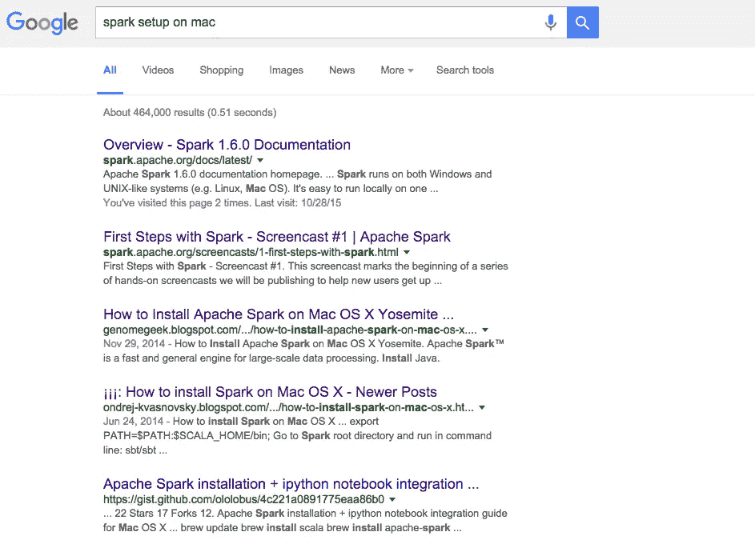
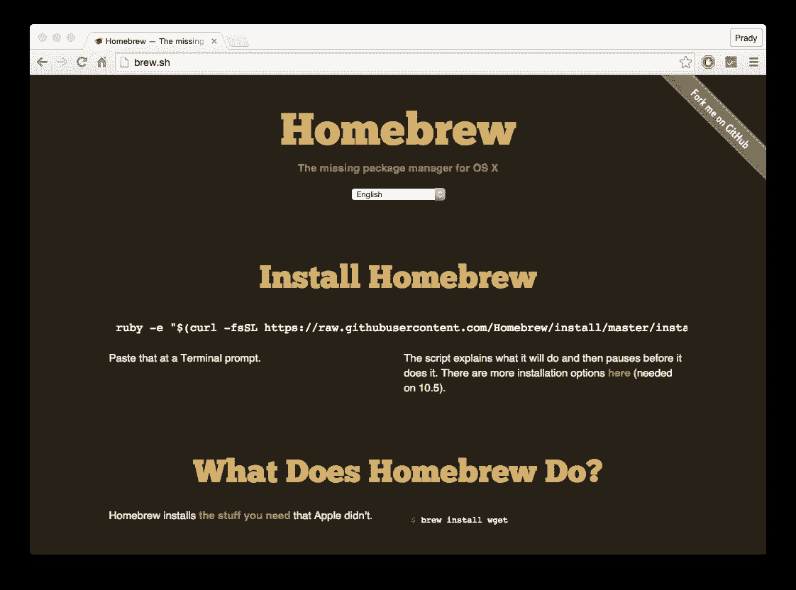
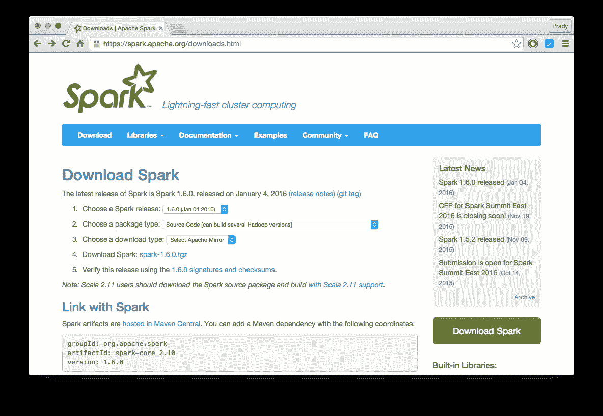
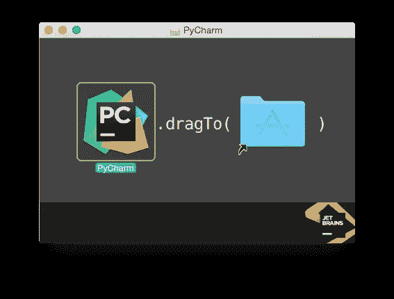

# 在 Mac OS X Yosemite 上安装 Apache Spark 1.6.0

> 原文：<https://medium.com/hackernoon/apache-spark-1-6-0-setup-on-mac-os-x-yosemite-d58076e8064e>


你没想过为什么在 Mac OS X 上又多了一个关于安装 [Apache Spark](https://hackernoon.com/tagged/apache-spark) 的帖子吗？？

如果你是这样想的，那么你就不会成功地遵循之前的教程 **:P** ，或者如果这是你第一次看到这样的教程，那么恭喜你来对地方了。

我写作的目的只是想在媒体上写一篇文章，因为我已经很久没有发表文章了。

好了，让我们回到核心话题。

所以你应该已经完成了[搜索](https://hackernoon.com/tagged/googling)的安装步骤。



You did this right ?

第一个链接不是真正的安装指南，第二个是安装指南，但它使用的是一个非常旧的 Spark 版本，其他的基本上是要遵循的步骤，而不是图片。

我们喜欢屏幕截图，不是吗？因为我们知道“一图胜千言”这句话。

所以先从第一步开始。

## 下载和安装

*   [**Brew**](http://brew.sh/) **，**一个 OS X 的包管理器。

执行下面的命令来安装工具。

```
ruby -e "$(curl -fsSL https://raw.githubusercontent.com/Homebrew/install/master/install)"
```



*   **Java**

Mac 已经有 Java 了。所以跳过这部分。

*   **Scala**

使用 brew 我们可以安装 Scala。

```
brew install scala
```

*在撰写本教程时，应该安装的 Scala 版本是 2.11.7*

*   [**阿帕奇火花**](https://spark.apache.org/downloads.html)



*   [**PyCharm**](https://www.jetbrains.com/pycharm/download/) **，**我是这个写 Python 应用的 IDE 的粉丝。*(我将再写一篇关于如何在 Spark 环境下从 IDE 中直接运行 Python 脚本的教程。)*



*   [**IntelliJ IDEA**](https://www.jetbrains.com/idea/) ，如果要用 Spark 的 Scala/Java API。

ide 的社区版是免费的。如果你是学生，JetBrains 解锁许多功能。你只需要申请使用你的学校电子邮件 id。

## 点燃火花

我总是想让事情井井有条，所以让我们把下载的 Spark 文件夹移到/usr/local/spark

```
**tar -xvzf spark-1.6.0.tgz** *# to extract the contents of the archive***mv spark-1.6.0 /usr/local/spark** *# moves the folder from Downloads to local***cd /usr/local/spark**
```

现在我们必须构建下载的 spark，否则我们无法运行程序或示例。

这可能需要一点时间(实际上比你能想到的要多)。

```
build/sbt clean assembly # builds the spark environment
```

## 测试火花装置

如果您已经有了使用 Spark 的实践经验，那么就在 shell 中编写自己的字数统计程序，否则 Spark 将不会提供几个例子来帮助我们适应环境。

外壳:

```
**./bin/spark-shell** *# Scala shell*OR**./bin/pyspark** *# Python shell*
```

Pi 示例:

```
**./bin/run-example org.apache.spark.examples.SparkPi**
```

为构建一些世界级的大数据应用程序尽最大努力。