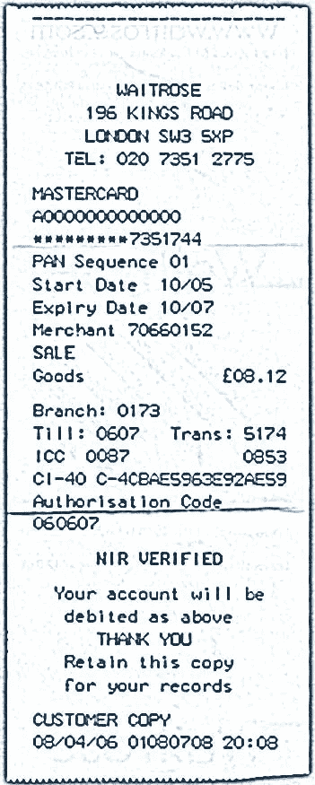

# 种族隔离 2.0:通过软件复活南非通行证法

> 原文：<https://medium.com/hackernoon/apartheid-2-0-the-resurrection-of-the-south-african-pass-laws-via-software-a735d844d195>

当托尼·布莱尔的工党政府试图将身份证引入英国时，一场全国性的运动发起了反对该计划，转折点是[一篇病毒式的文章——*弗朗西斯·斯通诺·桑德斯的电子邮件——*告诉每个人身份证的真实性质](https://marcreck.wordpress.com/2006/08/02/id-cards/)以及为什么它们对社会有害。

现在 2017 年，身份证的极权和固有的分裂思想已经变异为“身份证 2.0”。为推销这个坏主意而画的新画是可爱的、毛绒绒的，被当作有益的东西来卖，但当然，它绝不是。身份证从根本上来说是不道德的，是压迫的工具。身份证极大地方便和加强了身份盗窃，今天，它们已经没有任何用处了。

比特币和令牌化加密系统消除了人们通过生物识别或塑料卡来识别身份的需要，当然，在进行任何类型的交易时，都没有必要出现任何人的面孔、姓名地址或政府编号。即使这种卡可以合理化，也有办法让它们不那么危险。

一些初创企业正试图将这种完全过时且令人作呕的想法带入 21 世纪。这些项目背后的人缺乏想象力，危言耸听，反对人类，他们不知道自己的历史；身份证和身份证系统是极权主义反乌托邦的生命之血，而且*不*，你的系统是自愿的并不重要。最终，任何被广泛采用的身份识别系统都会悄悄地转变成一种普遍的需求。这是一个**事实。**

作为一个例子，你只需要看看有多少网站允许来自脸书、推特和谷歌的“[联合身份](https://en.wikipedia.org/wiki/Federated_identity)”登录。虽然可以在这些服务中使用一次性身份，但种族隔离 2.0 供应商提出的是一个“实名”系统，每个人都通过政府文件进行审查和检查。这不是简单的 Twitter 登录；这是一个噩梦般的场景，如果不交出你的真实姓名，你将无法在网上做任何事情。

这种卑鄙的、反人类的胡说八道的倡导者。我会说，在低端，它将有助于网上的文明对话，因为没有匿名。在另一个极端，他们承诺结束“身份盗窃”和其他灾难，事实上这些灾难是由收集个人身份信息引起的。

在 21 世纪，加密技术和比特币无处不在，**完全没有必要**用真实姓名、面孔或街道地址来识别任何人——当然永远不要用许多国家法律要求的政府标识符。

任何推广这些坏想法、构建它们或者将它们集成到软件中的人都站在了历史的对立面。他们支持[历史上最差演员](https://en.wikipedia.org/wiki/IBM_and_the_Holocaust)的意识形态，再多漂亮的网站、夸夸其谈的骗子推销员或关于“新经济”的胡言乱语也无法将这个糟糕且非常危险的想法变成好主意。

一旦每个人都明白这些系统实际上意味着什么，当它们达到社会饱和时，就会有对它们的强烈反对。我们刚刚看到了当一个群体被大规模侵犯时会是什么样子，即使数据库可以变得安全，这实际上也会使情况变得更糟，因为这使人们相信数据库是绝对真理的来源。不，把它放在“区块链”上并不能净化这个肮脏的想法。

我希望每一家制造这种邪恶的公司都燃烧起来，化为灰烬。

现在，一篇 2011 年的文章，来自 BLOGDIAL，那里有许多关于身份证的错误观点的优秀文章发表于 2002 年至 2012 年。NIR(国家身份注册)类别中所写的一切都是真实的，并且与今天相关。以下是保守党/自由民主党联合政府否决英国身份证计划后写的一篇文章。在建立和演示了数据库、卡和读卡器之后，那些准备从几代人的身份系统中赚取数十亿美元的公司被拒之门外。今天，不是一个跨国公司试图把每个人都像牛一样贴上标签；这是一个微笑的，肥胖的，说话很快的江湖骗子，他是“♩♫只是一个普通的家伙”。当然，这比一个不知名的公司更糟糕，因为人们在这些邪恶的人面前放松了警惕。

# 身份证 2.0 —有保证的身份

2011 年 5 月 23 日

在今天的《每日电讯报》上，我们毫不惊讶地读到，联合政府正在悄悄地为所有人引入身份证，只是这一次，它将是身份证 2.0，而不是工党的集中 NIR 驱动的身份证 1。

然而，旧身份证的所有问题仍然存在，并且引入了一些新的问题，我现在将指出这些问题。

> **联盟建立新的国民身份系统**
> 
> 该联盟已经悄悄地开始了新的国民身份系统的工作，不到一年前，它放弃了工党的嘲笑身份证。

没花多长时间吧？这一最新的尝试**不得不在某个时候发生**，因为英国政府拒绝排除外国人的身份证，这意味着最终英国的每个人都必须在该系统中，因为[只针对外国人是种族主义和不理性的，正如我们在](http://irdial.com/blogdial/?p=2644)之前所说的。

> 新系统的原型预计最早将于今年 10 月到位。它将致力于可靠地识别政府网站的用户，作为通过网络提供更多公共服务计划的一部分。

这是谎言。新系统是每个人身份证的原型。这不仅仅是为了获得政府的“服务”。由于各种各样的原因，无论何时广泛部署，ID 卡总是导致功能蠕变；例如，销售酒精、香烟、阿司匹林和剪刀的人可以证明他们在销售前进行了适当的身份检查，信息存储在他们的数据库中，使他们免受起诉。这是它看起来的样子:

细节决定成败:

这一次，收据将不会说 NIR，但会说“保证身份”。如果不出示您的签证或用签证付款，您将无法购买“购买前验证”清单上的任何商品。

> 乔治·奥斯本认为，这种在线转移将削减白厅的行政成本，从而有助于减轻未来几年削减开支的打击。
> 
> 包括信用卡提供商在内的几家已经拥有个人数据的私营公司将被纳入该系统。

这是一个巨大的差异，也是一个新的道德问题。以前，新工党的骗子们声称国家强制发放的身份证是可以的，因为“私营公司已经有了很多这样的数据”。这当然是一个经典的谬误论点，现在联盟正在重新想象它来证明身份证 2.0 的合理性。

如果你自愿与一家公司互动，这样他们可以为你提供服务，这是一回事(这是一件好事)，但当公司与政府合作，你将被迫使用他们的服务，这就是[法西斯主义](http://www.google.com/search?sourceid=chrome&ie=UTF-8&q=%22Fascism+should+more+properly+be+called+corporatism+because+it+is+the+merger+of+state+and+corporate+power.%22+-+Benito+Mussolini.)。

政府强迫你支付和使用它的‘服务’；他们是**非自愿**。通过与 VISA 和其他公司合作来识别您的身份，并要求您使用 VISA 来访问他们的系统，他们强迫您使用公司的服务。

这是完全不道德和不公正的。

如果政府不能按预算提供服务，那么他们就不应该提供这些服务。省钱并不是引入身份证的充分借口。

> 这些公司已经核实了他们客户的身份，所以隐私活动家希望政府不要自己收集个人数据，这与作为身份证基础的国家身份注册形成对比。

我想这是直接从公关包装中拿出来的。自工党的身份证死亡以来，宇宙的法律没有改变，这意味着当你在这个新系统中向国家表明自己的身份时，你将由他们或由卡的发行者发给你一个唯一的号码。

从你注册的那一刻起，这个号码将伴随你直到你死去。该号码将作为一个主要的数据库密钥，以跟踪您所有的购买，互动，资金转移和每次你出示卡。

这是完全相同的问题，旧的身份证系统，除了这一次，运行该系统的财政和技术负担被外包给签证，花蜜和其他裙带资本主义，法西斯公司出售他们的客户数据库给国家。

在这件事上你没有选择退出的权利。即使 VISA 要求您同意在政府门户网站上使用您的卡来识别您的身份，并且*他们*没有强迫您使用 VISA ID Card 2.0 服务，事实是*您将被迫与他们互动，因为国家将在暴力的支持下强制*您使用新系统来识别自己的身份。

> 据悉，Visa 参与了该计划，并正在进行试验，允许其客户使用信用卡信息登录政府网站。

这是向完全公司化国家过渡的又一步，在这种国家中，公司公开掌管各级政府。

> “目前，客户必须输入多个登录信息和密码才能访问不同的公共服务，有时是在同一个网站上，”负责跨政府计划的内阁办公室部长弗朗西斯·莫德说。
> 
> "这涉及到大量的重复工作，操作成本高，对用户来说非常不方便."

如果这是唯一的问题，那么[切换到打开 ID](http://openid.net/)；一次登录您所有的网站。或者停止使用网络提供“服务”。这些理由都是一派胡言。

> 他还声称，这项被称为“身份保证”的新计划也将使诈骗者更难欺骗福利和税收系统。

这是谎言。如果这不是谎言，那么他需要准确地说出为什么会这样。信用卡欺诈猖獗，使用信用卡与政府接口将允许每个持有欺诈或复制信用卡的人在向政府门户网站表明身份时伪装成其他人。

看看最近索尼公司的泄密事件就知道了，七千万人的信用卡信息、出生日期、姓名和地址都被复制了。

英国人口是 [61，838，154–2009](http://www.google.com/search?sourceid=chrome&ie=UTF-8&q=sony+playstation+breach#sclient=psy&hl=en&source=hp&q=population+of+britian&aq=f&aqi=&aql=&oq=&pbx=1&bav=on.2,or.r_gc.r_pw.&fp=fd8b79fcea61ab69)这意味着比英国人口还多的一些人的信用卡信息被复制。

这意味着，如果这样的事情发生在英国，每一个用签证表明自己身份的人都可以很容易地被冒充。 此意为*更*利益欺诈，保底。

> 政府已经通知隐私活动家，如压力集团 NO2ID 有关计划，试图避免公民自由的抗议，最终销毁身份证。

这种先发制人的打击是行不通的。关于身份证的危险，妖怪已经从瓶子里出来了。

> 但是 NO2ID 的秘书长盖伊·赫伯特警告说，新计划的“细节，尤其是法律细节将是魔鬼”。他说，尽管日程很紧，内阁办公室还没有提供细节。
> 
> 赫伯特先生说:“确认你正在与之交谈的人是你想与之交谈的人，这本身并不是一件坏事。”。
> 
> “但不管一开始的意图是好的，人们总是担心，收集和分享更多公众数据的官僚主义势在必行。”

这还不是最重要的。我敢肯定他说了很多这篇文章中没有引用的话。

> 身份保证将从明年 8 月开始实施，作为政府重大举措的一部分，如即将进行的福利制度彻底改革和在线纳税评估的改进。

他们会利用你的信用卡交易记录来确保你的消费不会超出你的纳税申报单。这是最近悄悄提出的[向‘实时税收’转变的一部分。没有比这更邪恶的了。](http://www.telegraph.co.uk/news/politics/8095731/Child-benefit-reform-virtually-unenforceable-Tory-MP-warns.html)

> 然后，它将逐步扩展，这样用户就可以使用同一个登录来使用所有在线公共服务。
> 
> [**电报**](http://www.telegraph.co.uk/technology/news/8526946/Coalition-builds-new-national-identity-system.html)

还是那句话，没必要用信用卡来做这件事；如果这是真正的问题，开放 ID 就足够了，当然，这不是问题。

就我个人而言，我认为大多数信用卡持有人在接受了多年关于网络欺诈的教育，并向自己灌输了一种健康的偏执，即在网上填写自己的信用卡信息，他们会完全理解将自己与你的 VISA 或 MasterCard 联系起来意味着什么。他们会马上意识到这是一种威胁，因为信用卡就是金钱，人们对金钱的保护比对隐私的保护更为谨慎。

当然，这也有一些其他的副作用。

那些没有信用卡的人怎么办？要么他们被排除在政府服务之外，而他们有权享受这些服务(他们是使用这些服务最多的人)，要么 VISA 将被强制发放给每个人一张 VISA 卡，这加速了现金的死亡，这是该州议程上的另一个项目。

这对 VISA 和国家来说是一个双赢的交易:

*   国家得到了一个他们不必管理的身份证系统
*   国家消除了无法追踪和免税的现金
*   VISA 开始运行英国事实上的新电子货币

与此同时，在尽职尽责地与这一新系统对接时，只有富有成效、信誉良好的纳税人才会被敲诈、勒索、最大限度征税和追踪……如果他没有脑子的话。

从社会角度来说，现在不是介绍这个的时候。有史以来最大的公民抗命行为刚刚发生，人们对裙带资本主义、[通货膨胀主义、](http://www.google.com/search?sourceid=chrome&ie=UTF-8&q=biggest+act+of+cifvl+disobedince+giggs+syperinjunction#hl=en&sugexp=ldymls&pq=biggest%20act%20of%20civil%20disobedience%20giggs%20super%20injunction&xhr=t&q=quantitative+easing+bank+of+england&cp=28&qe=cXVhbnRpdGF0aXZlIGVhc2luZyBiYW5rIG9mIA&qesig=k__zvZlMmeSRcwmGffKjBw&pkc=AFgZ2tlTsj1GOUB6OU90WFT9zporYUlGLDl1NGSUzm1GjtHZaUsD5t7ciANwpYtQW7bjh2JGIOWMiGai25EFbBnLoQ-w_6ktNw&pf=p&sclient=psy&source=hp&aq=0&aqi=&aql=&oq=quantitative+easing+bank+of+&pbx=1&bav=on.2,or.r_gc.r_pw.&fp=fd8b79fcea61ab69)[紧急救助、](http://www.google.com/search?sourceid=chrome&ie=UTF-8&q=biggest+act+of+cifvl+disobedince+giggs+syperinjunction#hl=en&sugexp=ldymls&pq=quantitative%20easing%20bank%20of%20england&xhr=t&q=gordon+brown+bailout+evil&cp=25&qe=Z29yZG9uIGJyb3duIGJhaWxvdXQgZXZpbA&qesig=HpN8qHrnYAVibUahHgGmvA&pkc=AFgZ2tlTsj1GOUB6OU90WFT9zporYUlGLDl1NGSUzm1GjtHZaUsD5t7ciANwpYtQW7bjh2JGIOWMiGai25EFbBnLoQ-w_6ktNw&pf=p&sclient=psy&source=hp&aq=f&aqi=&aql=&oq=gordon+brown+bailout+evil&pbx=1&bav=on.2,or.r_gc.r_pw.&fp=fd8b79fcea61ab69) [好战和腐败已经忍无可忍。](http://www.google.com/search?sourceid=chrome&ie=UTF-8&q=biggest+act+of+cifvl+disobedince+giggs+syperinjunction#hl=en&sugexp=ldymls&pq=new%20labour%20corruption%20war&xhr=t&q=coalition+corruption+libya+war&cp=26&qe=Y29hbGl0aW9uIGNvcnJ1cHRpb24gbGlieWEgd2Fy&qesig=iXnkZdq4ULm3uc2-NiLX8g&pkc=AFgZ2tlTsj1GOUB6OU90WFT9zporYUlGLDl1NGSUzm1GjtHZaUsD5t7ciANwpYtQW7bjh2JGIOWMiGai25EFbBnLoQ-w_6ktNw&pf=p&sclient=psy&source=hp&aq=f&aqi=&aql=&oq=coalition+corruption+libya+war&pbx=1&bav=on.2,or.r_gc.r_pw.&fp=fd8b79fcea61ab69)

去吧。[继续推](http://www.google.com/search?sourceid=chrome&ie=UTF-8&q=biggest+act+of+cifvl+disobedince+giggs+syperinjunction#sclient=psy&hl=en&source=hp&q=spanish%20revolution%202011&aq=1z&aqi=g1g-z1g3&aql=&oq=&pbx=1&bav=on.2,or.r_gc.r_pw.&fp=fd8b79fcea61ab69&pf=p&pdl=300)。

*我需要喝一杯。打倒种族隔离 2.0！* **↴**

> [黑客中午](http://bit.ly/Hackernoon)是黑客如何开始他们的下午。我们是 [@AMI](http://bit.ly/atAMIatAMI) 家庭的一员。我们现在[接受投稿](http://bit.ly/hackernoonsubmission)并乐意[讨论广告&赞助](mailto:partners@amipublications.com)机会。
> 
> 如果你喜欢这个故事，我们推荐你阅读我们的[最新科技故事](http://bit.ly/hackernoonlatestt)和[趋势科技故事](https://hackernoon.com/trending)。直到下一次，不要把世界的现实想当然！

