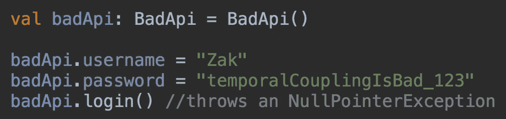
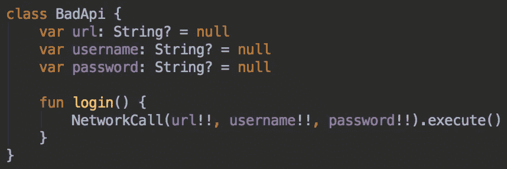
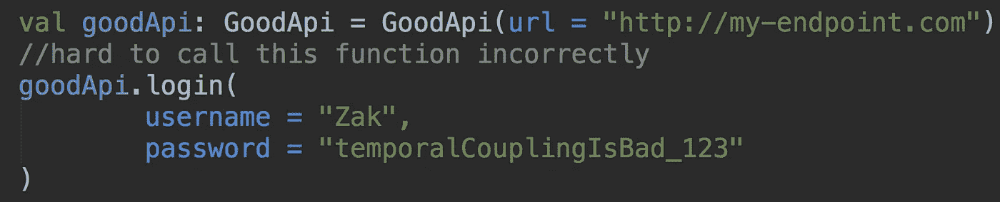
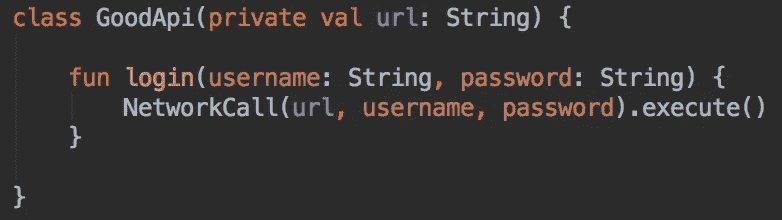
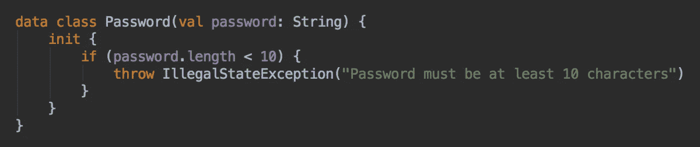

# API 设计——时间耦合

> 原文：<https://medium.com/hackernoon/api-design-temporal-coupling-2c1687173c7c>

## 通过在编译时实施明显的 API，使开发变得更加容易

时间耦合是一种严重的代码味道。对于一个开发者来说，错误地调用一个好的 API 应该是很难的。

Usage of a BadApi that is temporally coupled

上面的代码编译后，运行时抛出了一个错误。为什么？

BadApi implementation

在调用`login()`之前*没有设置`badApi.url`字段。要求一个类的某些方法以特定的顺序被调用被称为*时间耦合*，这降低了开发速度。*

# 如何避免时间耦合

Usage of a good api

除了传递无效数据，很难错误地调用这个 API。

GoodApi implementation

# 奖励积分

尽早验证，用类型安全的对象代替`Strings`。

两种可能的`.login()`实现:

1.  `fun login(username: String, password: String)`
2.  `fun login(username: Username, password: Password)`

#1 允许开发人员不小心混淆用户名和密码字段(代码可以编译，因为两个参数都是字符串)，而#2 则不可能。

代码可在 [GitHub](https://gist.github.com/ZakTaccardi/ad726135c204d632cfcdd4f7e2cd78a4) 上获得。

在 [Reddit](https://www.reddit.com/r/androiddev/comments/63mafk/avoid_temporal_coupling_in_your_apis/) 上捕捉对话！

[第二部分:API 设计——异常处理](/p/84a143e32232/)

> [黑客中午](http://bit.ly/Hackernoon)是黑客如何开始他们的下午。我们是 T21 家庭的一员。我们现在[接受投稿](http://bit.ly/hackernoonsubmission)并乐意[讨论广告&赞助](mailto:partners@amipublications.com)机会。
> 
> 如果你喜欢这个故事，我们推荐你阅读我们的[最新科技故事](http://bit.ly/hackernoonlatestt)和[趋势科技故事](https://hackernoon.com/trending)。直到下一次，不要把世界的现实想当然！

