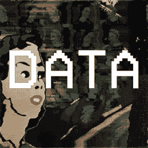

# API 是编程的入门药品

> 原文：<https://medium.com/hackernoon/api-is-the-gateway-drug-of-programming-9eadd24ede47>

## 它是编程世界中的终极入门药物

就像最常见的入门药物一样:

1.API 无处不在，种类繁多

2.这是超级容易使用，并给你最惊人的经验(UX)

3.你可以用很多不同的方式使用它(网络、手机、聊天机器人)

4.在使用它之后，你得到了零食(甜而脆的 JSON 数据)

好了，让我停止类比，让我们直接进入主题。

# **1。它无处不在，种类繁多(**[**【RapidAPI】**](https://rapidapi.com/)**)**

从[搜索 GIF](https://developers.giphy.com/docs/) ，到[制作迷因](https://api.imgflip.com/)

从[点餐](http://docs.opendining.net/api/)到[反馈](https://www.yelp.com/developers/documentation/v3/get_started)

从订机票到订酒店

在 Web(HTTP(s))API 的神奇世界中，有各种各样的 API。它们无处不在。从技术上讲，任何应用程序的每个后端都必须有一个 API 来与前端通信，但这个 API 不一定是基于 **HTTP(s)** 的。

我强烈建议你浏览一下 [RapidAPI](https://rapidapi.com/) ，它收集了所有你可以使用的令人惊叹的 API。他们列出了一个叫做 [Yoda Speak](http://yodaspeak.co.uk/) 的 API，可以把你的句子变成 **Yoda-speak！**

Pretty cool, that is. Hmmmmmm.

# **2。它超级容易使用，给你最神奇的体验(UX)**

您只需学习一次使用 API 的基础知识，您就可以进入一个全新的世界，使用最令人惊叹的 API。这就像把所有的重活都外包给别人，而你只是要求他们给你最终的结果。

This is You, Once you start to understand APIs

那么 API 的基础是什么呢？

很高兴你问了。

免责声明:我说的 API 是指 REST API。(你知道吗，别担心这个)

最基本的是 HTTP(s)，是的，这四个字母在任何网址的开头。HTTP 是 P 的一种，P 的意思是协议。协议是指一套交流时要遵循的规则。

比如，如果我把下面的表情符号发给我的女朋友🌃 🍌🍑她会明白今晚我在为晚餐做香蕉桃子奶昔。但是如果我把这一套表情符号发给我的土地女士，她可能会认为我在试着做香蕉和桃子酸奶，而不是 T4 奶昔。

所以任何协议的重要部分都是**相互理解**。

HTTP(s)定义了两个人之间的这样一种相互理解。那两个人是，给予者(服务器)和接收者(客户端)。HTTP(s)最重要的规则是:

*接收者(客户)总是通过向给予者(服务器)发出请求来发起对话，给予者(服务器)将简单地响应该请求，然后进行 STFU。*

其余的规则只是关于接收者(客户端)需要发送什么的细节，以便给予者(服务器)可以给出所请求的内容。阅读 HTTP 的[维基百科页面，看看你是否喜欢。](https://en.wikipedia.org/wiki/Hypertext_Transfer_Protocol)

# **3。你可以用很多不同的方式使用它(网络、手机、聊天机器人)**

您可以从 web 客户端(web 应用程序)使用 API

来自本地移动应用程序(Android、iOS、Windows Phone、瓶中消息)

从桌面应用程序(是的，那些东西)

从另一个 API 中(RecursiveAPIception)

来自聊天机器人 (#SubtlePlug)

连接到互联网的任何一段代码

# **4。你会得到零食(甜脆的 JSON 数据)**

一旦你理解了它的基本原理，你就会发现数据无处不在。你会对结构化数据产生兴趣。我最喜欢 JSON 这种类型，以至于如果数据是以其他形式出现的(比如 XML 之类的)，我会尝试将它转换成 JSON。所以我很容易消化。嗯 jsooonnnnn…

# 结论

我认为理解 API 并使用简单的[工具](https://hackernoon.com/tagged/tool)如[邮差](https://www.getpostman.com/)来玩它，是进入技术和[编程](https://hackernoon.com/tagged/programming)最有趣的方式。十年前我就是这样开始的。学习曲线是平缓的，你会接触到人们正在制作的所有令人惊奇的东西。我认识一些我们的非技术客户，他们开始使用我们的 API 功能构建聊天机器人，现在他们被所有的可能性惊呆了，想要学习更多的编程知识。

你们觉得怎么样？很想知道你的想法:)