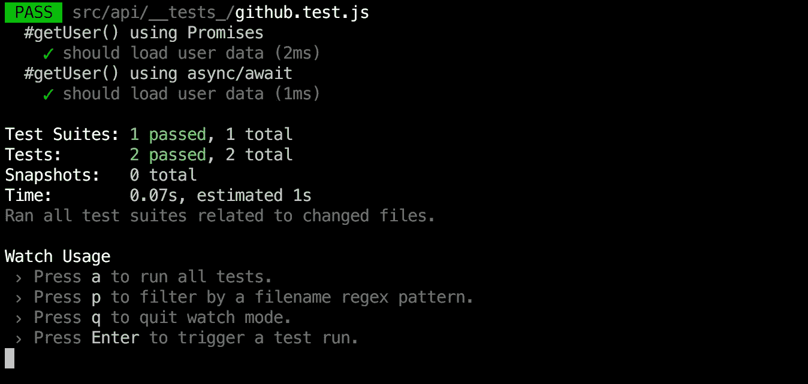
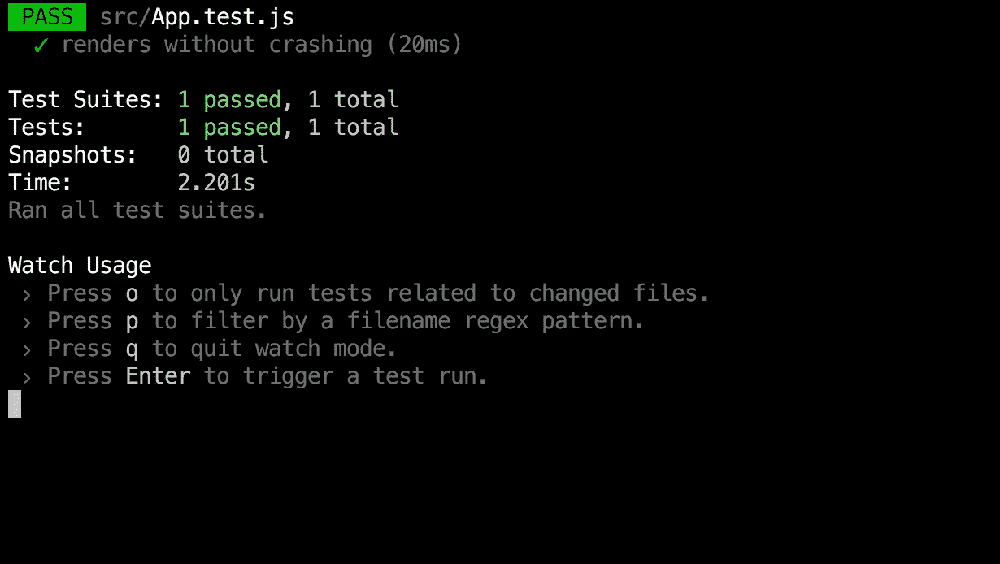
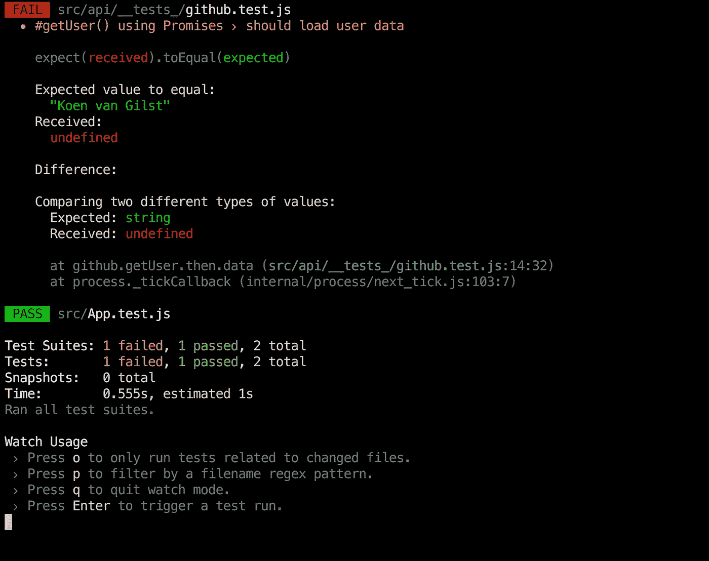

# 用 Jest 进行 API 测试

> 原文：<https://medium.com/hackernoon/api-testing-with-jest-d1ab74005c0a>

使用 Jest 的模仿特性测试异步 API 调用



Jest 是脸书开发的一个很棒的 JavaScript 测试框架。它通常用于测试 React 组件，但它也是一个非常好的通用测试框架。在本教程中，我将给出一个快速简单的演示，展示它测试异步函数的模拟能力。

[**这篇文章也发表在我自己的个人博客上。**](https://blog.koenvangilst.nl/api-testing-with-jest/)

# 嘲讽的目的

模拟异步函数(如 API 调用)而不是用真正的 API 进行测试是有用的，原因有两个:

*   它更快:您不必等到 API 响应到来，也不必处理速率限制。
*   它让你的测试变得“纯粹”，也就是说，测试成功与否只取决于你的代码，而不取决于 API 返回的数据。
*   从长远来看更容易:在开始测试某个端点之前，不需要首先登录或设置一些状态。

# 设置笑话

配置 Jest [并没有那么难](https://facebook.github.io/jest/docs/getting-started.html)，但是为了快速上手，我使用了脸书的官方入门套件 [create-react-app](https://github.com/facebookincubator/create-react-app) 。这是一个现成的 Jest 配置！

安装 create-react-app 并创建应用程序:

```
yarn global add create-react-app

create-react-app mocking-with-jest
cd mocking-with-jest/
yarn start
```

这将打开一个带有旋转 React 标志的浏览器窗口。

现在启动 Jest 测试环境:

```
yarn test
```

您应该会看到类似这样的内容:



恭喜，您现在已经启动并运行了 Jest，并准备开始编写一些测试了！

# 添加 API

我们将使用 [rest.js](https://github.com/cujojs/rest) 来发出 API 请求。Rest.js 在浏览器和 Node.js 中运行良好。

```
yarn add rest
```

在文件夹 *src* 中新建一个文件夹 *api* ，添加文件 **github.js** ，代码如下:

然后还用下面的代码添加 **request.js** :

现在，您已经准备好使用**github . getuser(' vnglst ')**发出 API 请求了。让我们在浏览器中快速测试一下。用以下代码替换文件 **App.js** 中的原始内容:

使用**纱线启动**打开浏览器并查看结果。您应该会看到一个包含我的个人资料的简单列表。有用！

# 写作测试

我们现在准备编写一些测试。让我们首先尝试对函数 **getUser** 进行单元测试。创建一个文件夹 **__tests__** ，在这个文件夹中创建一个文件 **github.test.js** ，代码如下:

使用**纱线测试**启动 Jest，您会看到以下错误信息:



这里发生了什么事？事实证明，在节点环境(Jest 用来运行测试的节点环境)中使用我们的 **getUser** 函数会使我们的请求失败。因此，即使我们的功能在浏览器中工作，它在我们的测试中失败了！当我们在节点环境中运行时，可以通过添加一个*用户代理*头来尝试解决这个问题，但是模仿现在是一个更好的解决方案。让我们开始吧！

# 创建一个模拟

创建一个文件夹 __mocks__ 并在该文件夹中创建一个文件 **request.js** (这将是父文件夹中 request.js 的模拟版本):

被模仿的函数期望文件夹 __mockData__ 中有一个 *userId.json* (即 *vnglst.json* )文件。我在这里使用了自己的 Github 用户名和数据作为示例，但是您可以根据测试需要添加任意数量的示例数据:

要让 Jest 模仿请求模块，您必须将下面一行添加到 **github.test.js** 文件中:

```
jest.mock(‘../request’)
```

现在简单的单元测试应该通过了，您已经准备好编写更复杂的测试了！

我希望你喜欢这个教程，并随时问我任何问题。你可以在 Twitter 上找到我的名字是 [@vnglst](https://twitter.com/vnglst/) 。本教程的源代码可以在这里找到:[https://github.com/vnglst/mocking-with-jest](https://github.com/vnglst/mocking-with-jest)

本教程基于 Jest 的创建者的异步例子(他们的例子可能更好)😂).一定要看看他们的其他例子。

## *奖励:使用异步/等待进行测试*

如果你正在使用 **create-react-app** 你也可以使用 async/await 来编写你的测试。这无疑使您的测试更容易编写，可读性更好:

[](http://bit.ly/HackernoonFB)[](https://goo.gl/k7XYbx)[](https://goo.gl/4ofytp)

> [黑客中午](http://bit.ly/Hackernoon)是黑客如何开始他们的下午。我们是阿美族家庭的一员。我们现在[接受投稿](http://bit.ly/hackernoonsubmission)并乐意[讨论广告&赞助](mailto:partners@amipublications.com)机会。
> 
> 如果你喜欢这个故事，我们推荐你阅读我们的[最新科技故事](http://bit.ly/hackernoonlatestt)和[趋势科技故事](https://hackernoon.com/trending)。直到下一次，不要把世界的现实想当然！

