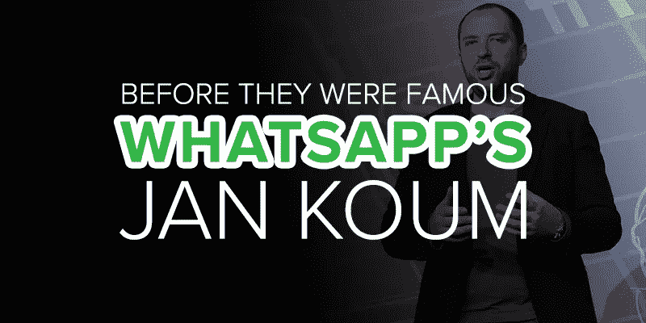
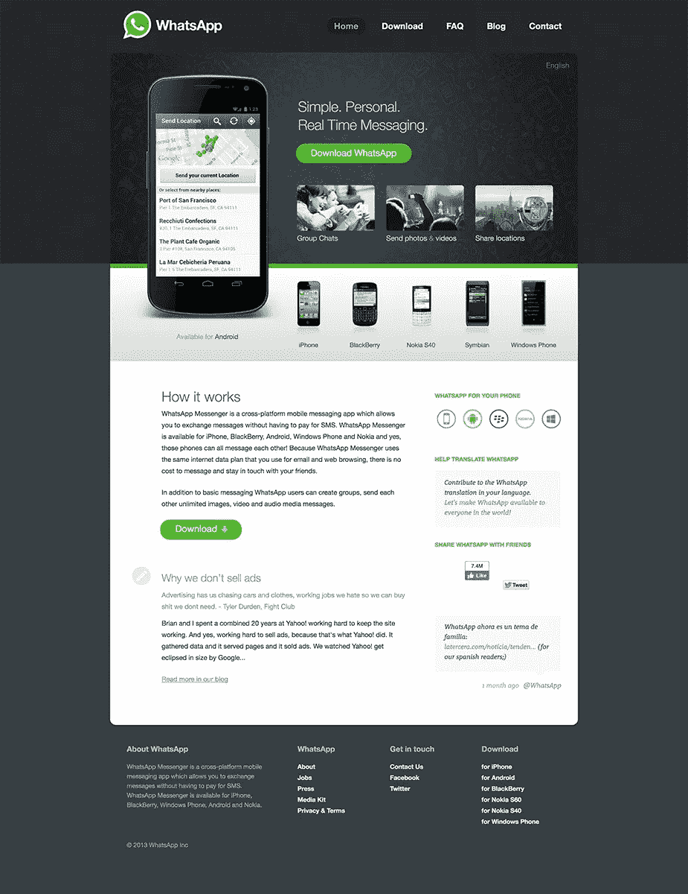
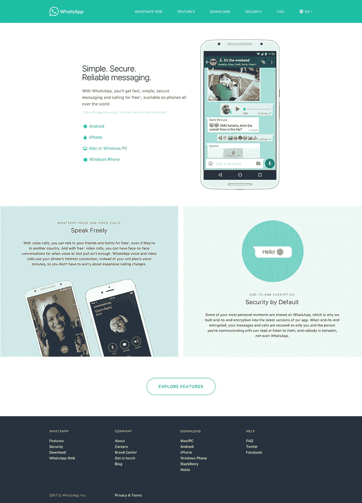
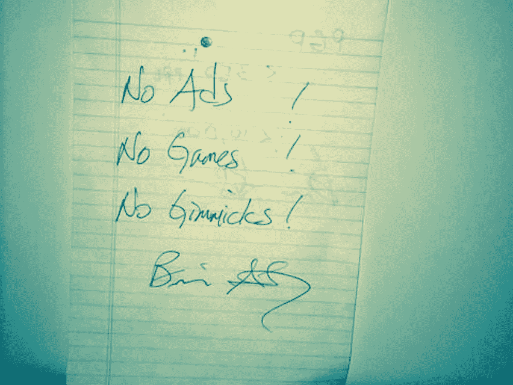

# 成名前的应用建设者:WhatsApp 的简·库姆

> 原文：<https://medium.com/hackernoon/app-builders-before-they-were-famous-whatsapps-jan-koum-a0ff6f2bb6c8>

与我们之前提到的[的其他应用开发者](https://appinstitute.com/snapchat-before-they-were-famous/)不同的是，简·库姆过着低调得多的生活。考虑到他开发了世界上第二常用的应用程序: [WhatsApp](https://www.whatsapp.com/) ，这就更加不协调了。但是随着你对 Koum 了解的越来越多，你会发现它完全符合你的性格。名利是他从未感兴趣的两个概念。在脸书宣布收购 WhatsApp 的第二天，他在 FlyerTalk 上讲述的一个故事很好地说明了这一点:

> *我要告诉你们一个与 flyertalk 有关的有趣故事:我现在正使用 M & M miles 奖励机票飞往巴塞罗纳 MWC(我在 LH455 航班上发布此信息)…很明显，我在几个月前就拿到了这些机票——为了节省公司资金，我更喜欢使用 miles。如你所知，奖励机票数量有限，而且几乎不可能在最后一刻更改……这就是它的妙处:*
> 
> 我们在周三收盘后宣布了与脸书的交易。在这个过程中，我们意识到我们可能无法在周三完成交易并签字，这可能会推迟。
> 
> 当延迟的风险成为现实时，我说:“如果我们不能在周三完成，它可能不会完成。我有周四飞往巴塞罗那的机票，这是我用里程数买的，它们不容易退款，甚至不可能更改。这件事必须在星期三之前完成，否则的话！！!"
> 
> *…因此，科技史上最大的交易之一不得不安排在我的 M & M 奖票前后🙂*

# 早年

简·库姆于 1976 年出生在乌克兰的基辅。虽然它现在是一个重要的工业、科学、教育和文化中心，但它并不总是这样。他的家没有自来水，而他成长的村庄，Koum 说:

> 我们学校太破旧了，甚至没有内部浴室。想象一下乌克兰的冬天，零下 20 度，小孩子不得不穿过停车场去上厕所。社会极度封闭:你可以阅读 1984 年，但生活在那里就是在经历它。我直到 19 岁才拥有电脑——但我有一个算盘。

16 岁时，乌克兰独立后不久，库姆和他的母亲移民到美国。但是一开始，加州山景城的生活并不轻松。他们依靠福利和食品券，十几岁的库姆做看门人来增加收入。

# 应用制造商出现了

尽管他还没有自己的电脑，Koum 还是通过阅读他买的手册和培训指南，开始尽可能地学习计算，后来他回来了。高中毕业后，库姆进入圣荷西州立大学，开始在 T2 安永会计师事务所做安全测试员。像其他著名的[创业公司](https://hackernoon.com/tagged/startup)的创始人一样，库姆从未完成他的高等教育。但在安永工作期间，库姆确实遇到了布莱恩·阿克顿，12 年后，他成为 WhatsApp 的联合创始人。

阿克顿是非常年轻的雅虎雇佣的第 44 名员工，他帮助库姆在第一次见到他 6 个月后接受了雅虎的采访。库姆加入雅虎时是一名基础设施工程师，九年后离开雅虎时，他已经是一名基础设施工程经理。

库姆在雅虎的时光大多平淡无奇。除了与阿克顿建立牢固的友谊之外，他采取的另一个值得注意的行动是加入了专注于安全的黑客组织 [w00w00。2007 年，库姆和阿克顿都从雅虎辞职，做了大多数三十多岁的人梦寐以求的事情:休假一年。](http://www.businessinsider.com/r-elite-security-posse-fostered-founders-of-whatsapp-napster-2014-07)

经过一年的南美旅行和玩极限飞盘后，他们觉得是时候想想下一步该做什么了。他们的第一步是申请脸书的职位，但没有成功。此时，第一代 iPhone 已经推出，App Store 于 2008 年 7 月推出。但是直到 Koum 在 2009 年初得到了他的第一部 iPhone，他才意识到这是一个全新行业的开始。

# WhatsApp 公司。

在 Koum 购买 iPhone 和合并 WhatsApp Inc .之间，过去了几周——而不是几个月。对于任何仍然感到好奇的人来说，这个名字就像一个问题，“怎么了？”，应用程序对查询提供主动响应。当这个状态更新应用程序在 2009 年 5 月登陆 App Store 时，没有人真正关心它，但一个月后 iOS 3.0 的发布激发了 Koum 重新设计这个应用程序。

WhatsApp 网站的演变——2009 年

尽管在线社交网络的概念在万维网的早期就已经存在，但是直到脸书和推特的引入才成为主流。认识到手机为社交网络带来的潜在增长，Koum 的新版本 WhatsApp 被设计成一个跨平台的消息应用程序，使用手机的联系人列表作为预建的网络。不用记住用户名和密码，手机号码被用作唯一的登录信息。

这款新应用于 2009 年 9 月推出，当时[阿克顿已经决定加入库姆的新公司](https://www.crunchbase.com/organization/whatsapp#/entity)。他带来了一轮种子资金，并在管理增长的同时，致力于业务的各种商业模式。Koum 从一开始就反对将广告作为一种收入模式。

> *对你来说，没有什么比与朋友和家人交流更私人的了，用广告打断交流不是正确的解决方案。[……]为了更好地定位广告，公司需要知道你在哪里，你可能在做什么，你可能和谁在一起，你可能喜欢或不喜欢什么。这是数量惊人的数据。*

2009 年，他们最大的支出是向新用户发送验证文本的成本，为了控制增长符合他们的承受能力，Koum 和 Acton 将应用程序从免费切换到付费，然后再切换回来。但是一旦应用程序允许用户发送照片，增长保持稳定——即使是作为一个付费应用程序。这款应用最终将从一次性收费 1 美元转变为每年收费 1 美元。

WhatsApp 网站的演变——2013 年

在几乎没有营销的情况下，WhatsApp 的用户群持续增长，[没过多久，风险投资人就注意到了](https://www.forbes.com/sites/parmyolson/2014/02/19/exclusive-inside-story-how-jan-koum-built-whatsapp-into-facebooks-new-19-billion-baby/2/#a4756802cbd7)。库姆和阿克顿的融资方式与他们的生活方式相似——低调。更重要的是为了保险。除了 25 万美元的种子资金，在马克·扎克伯格感兴趣时，他们只接受了另外 800 万美元的外部投资。

在扎克伯格最终提出报价之前，他们将接受另外 5200 万美元的资金，就像 WhatsApp 的最初创立一样，事情进展很快。从扎克伯格提出收购要约到收购被接受不到一个月。

WhatsApp 网站的演变— 2017

今天，简·库姆仍然是 WhatsApp 的首席执行官，但现在他的资产已经超过 90 亿美元，并且仍然在追求他和布莱恩·阿克顿在 2009 年共同的愿景——没有广告！没有游戏！没有噱头！

来源:[红杉资本](http://sequoiacapital.tumblr.com/post/77211282835/four-numbers-that-explain-why-facebook-acquired)

尽管陪审团仍然不知道用故事代替状态信息的[短命是否算一个噱头。](https://techcrunch.com/2017/03/15/whatsapp-brings-back-status/)

*原载于 2017 年 5 月 2 日*[*appinstitute.com*](https://appinstitute.com/whatsapp-before-they-were-famous/)*。*

> [黑客中午](http://bit.ly/Hackernoon)是黑客如何开始他们的下午。我们是阿妹家庭的一员。我们现在[接受投稿](http://bit.ly/hackernoonsubmission)并乐意[讨论广告&赞助](mailto:partners@amipublications.com)的机会。
> 
> 如果你喜欢这个故事，我们推荐你阅读我们的[最新科技故事](http://bit.ly/hackernoonlatestt)和[趋势科技故事](https://hackernoon.com/trending)。直到下一次，不要把世界的现实想当然！

