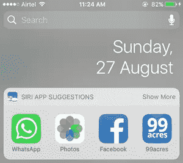
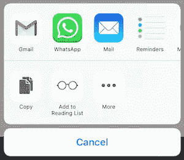
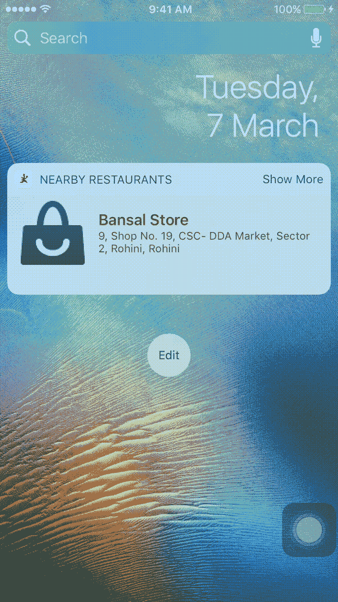
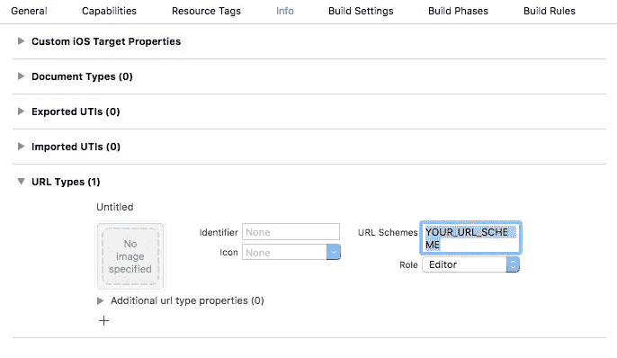
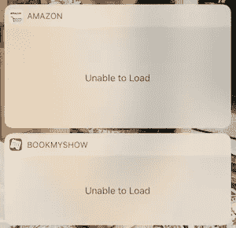

# 关于 iOS 10 中的 Today Extensions (Widget)你需要知道的一切

> 原文：<https://medium.com/hackernoon/app-extensions-and-today-extensions-widget-in-ios-10-e2d9fd9957a8>

苹果在 **iOS 8** 中引入了**应用扩展**，从那以后，它们对 iOS 应用开发领域产生了巨大的影响。让我们先从一些与扩展相关的术语开始。

# 术语

## 什么是 App 扩展？

应用程序扩展允许您将自定义功能和内容扩展到应用程序之外，并在用户与其他应用程序或系统交互时提供给用户。它用于一些特定的任务。它不是一个独立的应用。

## 延伸点

扩展绑定到系统的特定区域，称为扩展点。每个扩展最多可以有一个扩展点。

**举例**:

1.  T *oday 扩展*绑定到*通知中心*

1.  *共享扩展*只能出现在 *UIActivityViewController 中。*

## 包含应用程序

为其创建扩展的应用程序。

## 主机应用程序

启动扩展的应用程序

在接下来的章节中，您可以清楚地了解这些术语。有耐心..🙂

# 扩展生命周期

1.  用户从主机应用程序中选择应用程序扩展。
2.  系统启动应用程序扩展。扩展在主机应用程序的上下文中显示其视图。用户在应用程序扩展中执行所需的任务并取消它。
3.  用户返回到主机应用程序中的上一个上下文。在应用扩展执行其任务后不久，系统终止该扩展。

**示例:**

在上面的截图中，

1.  *App 扩展*:脸书股份扩展
2.  *包含 App* :脸书
3.  *主机 App* :照片 App

# 应用程序扩展如何通信

1.  应用程序扩展和主机应用程序之间的直接通信。系统使用进程间通信进行主机应用程序和扩展之间的通信。有来自主机应用程序的请求和来自扩展的响应。
2.  包含应用程序和主机应用程序之间没有通信。
3.  应用程序扩展和包含应用程序之间的间接通信。**举例，** *共享资源* : 1。 ***框架*** —分享代码 2。 ***App 群***——分享数据。

# 今日扩展(小部件)

小工具*是通知中心*的扩展。这些是带有一些附加功能的简单视图控制器，因此它们的生命周期与其他视图控制器一样正常工作。

***性能最重要:***

1.  使用*缓存数据。*
2.  把昂贵的操作移到*后台*。
3.  设计一个简单的用户界面。

# 今天 iOS 10 中的扩展

最初，今天的扩展是在 iOS 8 中引入的。后来在 iOS 10 中，对它进行了一些重大的改动。

**举例:***iOS 8 和 iOS 9*** ， *Show More/Show Less* 需要开发者明确处理。这是一项繁琐的任务，因为它需要约束和布局处理来根据内容调整小部件的高度。但是在 ***iOS 10*** 中，苹果提供了 API 来处理这样的功能，没有费太大的劲。**

# 如何？

在这里，我将为您提供在 *iOS 10* 中实现 *Today 扩展*所需的基本构造。在本文末尾，您可以找到一个指向*示例的链接。*

## 应用程序组-与包含应用程序共享数据

如前所述，您不能在您的扩展和它包含的应用程序之间直接共享数据。要共享数据，您需要使用**应用程序组**。

> 即使应用程序扩展包嵌套在其包含的应用程序包中，运行的应用程序扩展和包含的应用程序也不能直接访问彼此的容器。
> 
> 若要启用数据共享，请使用 Xcode 或开发者门户来启用包含应用程序及其包含的应用程序扩展的应用程序群组。接下来，在门户中注册应用程序组，并指定要在包含应用程序中使用的应用程序组。

您不能使用*标准用户默认值*在*应用扩展*和包含应用的*之间共享数据。*

仅用于包含 App 的*的数据使用*标准*之一。使用 *suiteName* 获取您想要在*扩展和包含应用*之间共享的数据。只是不要在两者中保存相同的数据。避免数据冗余。根据上下文使用这两个词。*

## *NCWidgetDisplayMode*

有两种模式可以在小部件中显示数据。这些模式在 *NCWidgetDisplayMode* 下分类为 ***紧凑*** 和 ***扩展。***

1.  *紧凑模式*具有*固定高度*和 *110*
2.  *扩展模式*用于*可变高度*根据您的内容。

*显示更多或显示更少*按钮根据*微件的活动显示模式*显示在微件的右上角，即在紧凑模式下，显示更多可见，在扩展模式下，显示更少可见。

**widgetLargestAvailableDisplayMode**表示您的应用程序支持的最大显示模式。

1.  当设置为*紧凑模式时，*您的应用程序将仅支持紧凑模式，即不再支持显示更多/显示更少功能，并且您的小部件将具有固定的高度 110。
2.  当设置为*扩展时，*应用程序将支持压缩和扩展模式，显示更多/显示更少功能将相应工作。

## 根据显示模式的处理高度

*ncwidgetprovisioning*协议提供了一个*委托*方法*widgetActiveDisplayModeDidChange(_:maxSize:)*处理*紧凑*和*扩展*模式下小工具的大小。

根据您使用的设备，小工具的 ***宽度*** 保持不变。没有规定要改变它。

小工具的 ***高度*** 可以根据*活动显示模式*改变。

***注意:*** 在扩展模式下，您可以提供给 widget 的最大高度不能超过通知中心中提供给 widget 的可见空间。

## 更新小部件

为了帮助您的小部件查看最新信息，系统偶尔会捕获小部件视图的快照。当小部件再次可见时，会显示最新的快照，直到系统用视图的实时版本替换它。

***widgetPerformUpdate***:

1.  当 widget 在后台更新*时调用。*
2.  在拍摄小部件*快照之前调用。*

## 正在打开包含“今日”扩展的应用程序

您可以使用 *open(_ URL:，completionHandler:)* 从扩展中打开包含您的应用程序

你还需要在你包含的 app 的 ***URL 类型*** 中定义 *YOUR_URL_SCHEME* 。

当包含的 app 从扩展打开时，可以在 *AppDelegate 的* *应用(_:URL:source application:annotation:)*方法中获得句柄。

## 显示/隐藏包含应用程序的小部件

如果您需要根据您想要显示的内容来显示或隐藏扩展，您可以从您包含的应用程序中进行操作。

## 框架—与包含应用程序共享代码

您不能在您的扩展和它包含的应用程序之间直接共享代码。要共享数据，需要使用**框架**。

> 您可以创建一个嵌入式框架，在您的应用程序扩展及其包含的应用程序之间共享代码。
> 
> 确保您的嵌入式框架不包含对应用程序扩展不可用的 API。如果您有一个包含此类 API 的自定义框架，您可以从包含它的应用程序安全地链接到它，但不能与应用程序包含的扩展共享该代码。App Store 拒绝任何链接到此类框架或使用不可用 API 的应用程序扩展。
> 
> 要将应用程序扩展目标配置为使用嵌入式框架，请将目标的“仅需要应用程序扩展安全 API”构建设置设置为“是”。

# 无法加载—当今扩展面临的最常见问题

无法在*今天加载扩展*主要出现在:

1.  你的分机**由于某种原因坠毁**。
2.  它占用的内存比系统提供的要多。**(内存限制:最大 16MB 左右。)**

调试您的应用程序扩展，找出确切的问题。

参考 Xcode 的**调试量表**了解内存和 CPU 利用率。

# **要记住的事情:**

1.  避免使用*滚动视图*。
2.  不支持*键盘输入。*
3.  必须*重量轻*。
4.  启动太慢的扩展被系统终止。
5.  低内存限制— *(最大 16 MB 左右。)*
6.  一些 API 对应用程序扩展不可用—共享应用程序对象、摄像头、麦克风、使用 airdrop 接收数据。

# 示例小部件

 [## pgpt10/Today-Widget

### 今日-Widget - iOS 10 和 iOS 8/iOS 9 今日扩展(Widget)

github.com](https://github.com/pgpt10/Today-Widget) 

# 促销

别忘了阅读我的其他文章:

1.  [你一直想知道的关于 iOS 通知的一切](https://medium.freecodecamp.org/ios-10-notifications-inshorts-all-in-one-ad727e03983a)
2.  [拖动&放到收藏&表— iOS 11](/@p.gpt10/drag-it-drop-it-in-collection-table-ios-11-6bd28795b313)
3.  [用渐变给它上色——iOS](https://hackernoon.com/color-it-with-gradients-ios-a4b374c3c79f)
4.  [Swift 4 中关于 Codable 的一切](https://hackernoon.com/everything-about-codable-in-swift-4-97d0e18a2999)
5.  [UICollectionViewCell 选择变得简单..！！](https://hackernoon.com/uicollectionviewcell-selection-made-easy-41dae148379d)

如果你有任何疑问，请随时发表评论。