# 应用程序邀请、寻找朋友和湿透的意大利面

> 原文：<https://medium.com/hackernoon/app-invites-friend-finding-and-drenched-spaghetti-72e0d749416>

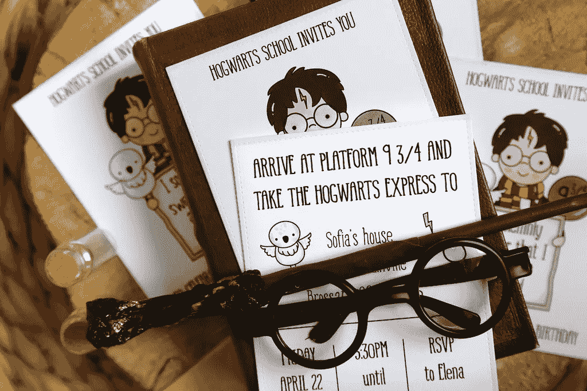

曾几何时，成功邀请人们使用你的应用或玩你的游戏就像执行脸书邀请一样简单，但一旦 FarmVille 在每个人的意大利面上撒尿，事情就变得有点棘手了。

这一趋势仍在继续。

因此，在过去的几周里，我一直在深入研究 AppStore 中一些热门的社交和照片应用程序是如何处理用户邀请的。一路走来，我学到了很多东西，我希望我可以通过阅读一篇过长的中型文章而不是创建 30 多个新帐户和浏览我不喜欢经常使用的应用程序来学习。请允许我拯救你同样的痛苦。

这是我在过去几周看的一些应用的例子。为简单起见，我们将这些应用程序分成几个容易理解的类别:

**四大:**

*   Snapchat
*   脸谱网
*   推特
*   Instagram ( [Instagram 工程](https://medium.com/u/a4c6efa67fe0?source=post_page-----72e0d749416--------------------------------))

**那些优先寻找朋友的人:**

*   Live.ly
*   动画([动画](https://medium.com/u/2acbc4a56f34?source=post_page-----72e0d749416--------------------------------))
*   音乐剧. ly
*   潜望镜([潜望镜](https://medium.com/u/c6360ffa6e88?source=post_page-----72e0d749416--------------------------------)
*   叉骨
*   维恩
*   迪士尼混音
*   基克
*   Live.me ( [Live.me](https://medium.com/u/4d899cd8dc6b?source=post_page-----72e0d749416--------------------------------) )

**优先邀请好友:**

*   WhatsApp
*   马可·波罗
*   家庭聚会( [jsneedles](https://medium.com/u/f9bc40a53ec0?source=post_page-----72e0d749416--------------------------------) )

说到本质上。我们将了解两件事，1)应用程序如何以及何时选择提示邀请，2)使用什么机制来发送邀请。

**四大巨头**

“四大”几乎不值得一提，因为总的来说，它们要么对邀请不屑一顾，要么把邀请深埋心底，更合理的做法是派一名优步司机去你朋友家，并附上一张手写的纸条，上面写着:“哟！已经下载 Twitter 了。”

我把它们包括进来是因为那里仍然有值得学习的东西。让人们邀请其他人的最佳方式永远是口口相传，这不是通过使用正确的 SDK 或 onboarding 流程可以获得的，而是通过做好自己的工作更有可能获得的。(或者只是做大。那也行得通。)

**那些优先寻找朋友的人**

“优先寻找朋友”类别中的应用程序的特点是从不提示任何人邀请朋友。

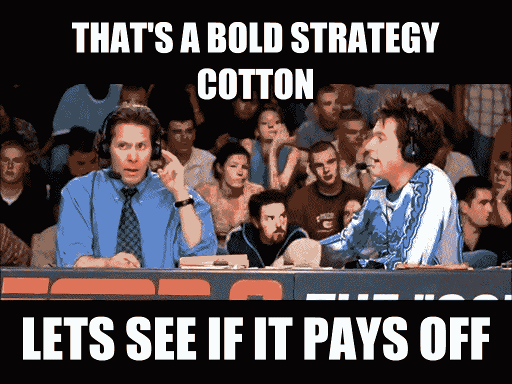

相反，入职培训通常侧重于添加已经使用该应用程序的朋友。

有几个原因让我想起了这个桶。最有意思的是，在一个崇拜 [K 因素](https://en.wikipedia.org/wiki/K-factor_(marketing))的[创业](https://hackernoon.com/tagged/startup)世界里，我挖掘的绝大多数[应用](https://hackernoon.com/tagged/apps)似乎根本不在乎这些。或者，至少，他们似乎没有优先考虑它的优化。

当然，“四大”也是如此，这让我相信，如此大比例的社交应用没有突出的邀请功能的一个原因可能是人们只是简单地复制看起来有效的东西。

不过，这可能是一个虚假的承诺。四大巨头背后有许多其他应用程序没有的力量和光泽，所以他们可能会将大型成熟社交网络的最佳实践与小型早期社交网络的最佳实践相结合。

(话又说回来，我为此查看的所有应用程序的图表都相当高，所以我知道什么呢？)

那么，这些“优先寻找朋友”的人肯定做对了什么呢？

让我自己进入这个故事，在我们自己的 onboarding in the work in progress is[Mission:Pic](http://missionpic.com)中，我们剔除了所有我们认为对你的第一次体验不重要的东西，这包括 on boarding 中几乎所有应用程序都使用的寻找朋友部分。我们希望人们尽快达到啊哈时刻，这看起来像是路上的额外颠簸。

在挖掘完一个度量之后💩-这个练习的其他应用程序太多了……我想我们错了。

通常情况下，在社交应用中拥有“朋友”对于用户体验来说是必要的或重要的。如果你的 feed 里没有朋友的照片，Instagram 是什么？这对于 Mission: Pic 来说就不那么真实了，所以很容易把寻找朋友写成不必要。但现在我相信，这一优先事项带来的最重要的因素与可用性、入职便利性甚至实际友好程度无关，而与社会证明有关。

当你浏览 30 个应用程序时，其中许多应用程序都是为你不在其中的演示服务的，当你遇到一个可以告诉你已经有几个朋友在使用他们的服务时，这是一个强有力的声明。

不过，我确实在这个木桶中错过了一些机会。对于我加载的每一个以“哦！斯宾塞已经有这个应用程序了！爽！”另一个故事的开头是这样的:

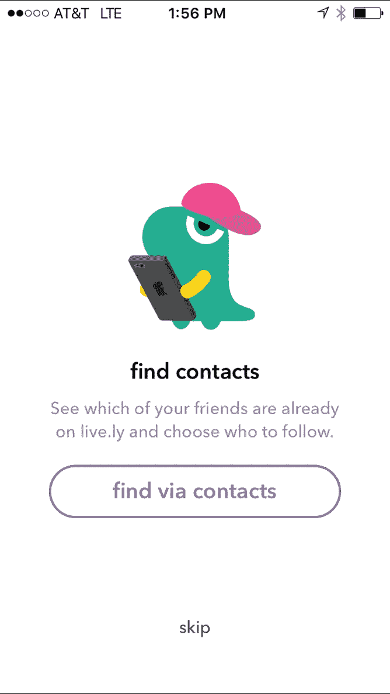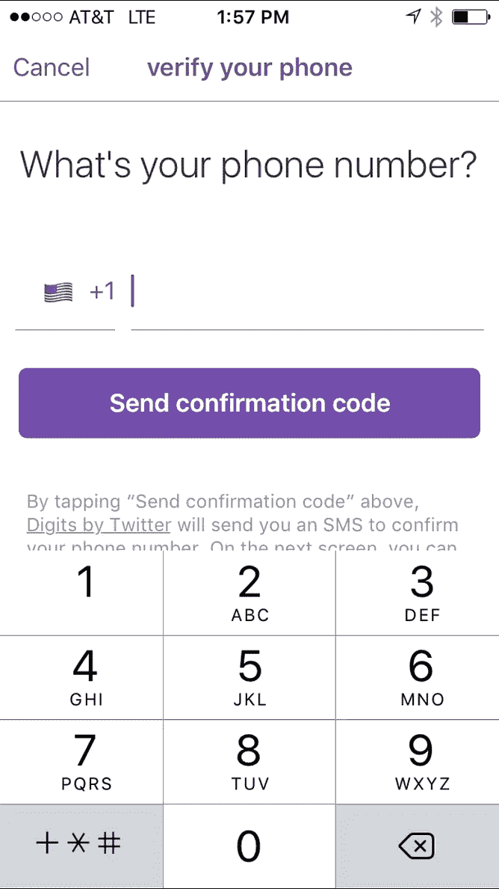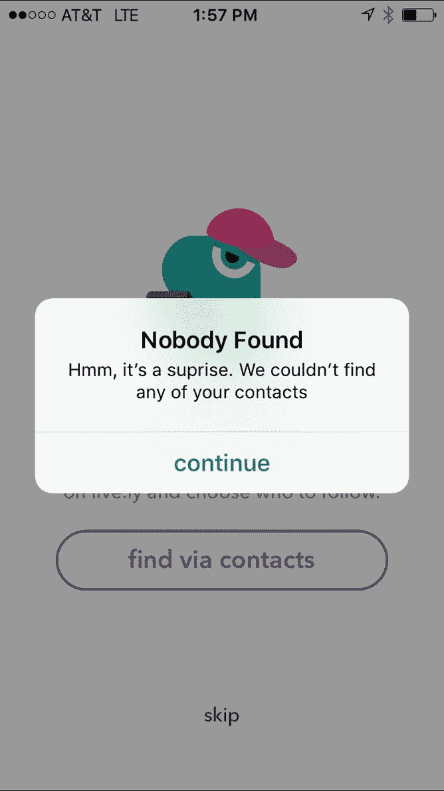

不要误解我的意思，这是一些可靠的错误处理，但是更好的错误处理不应该是这样的吗:

> 天哪！您的所有联系人都没有使用 Live.ly！我们应该解决这个问题。从您刚刚授予我们访问权限的联系人列表中，选择您想要邀请到这个友好的魔法世界的每个人。

你的用户已经进门了，想必他们有理由相信他们会喜欢你的体验，并且有理由认为和朋友在一起的体验会更好。那么，当你可以向他们展示一个装满啤酒的冷藏箱和一部给朋友打电话的电话时，为什么要向他们展示一个布满蜘蛛网的空房子呢？

Musical.ly 对此也有罪。但他们甚至没有像绅士一样处理错误的体面。只有一个空白的屏幕，上面有一个 CTA 指示我关注所有没有人。

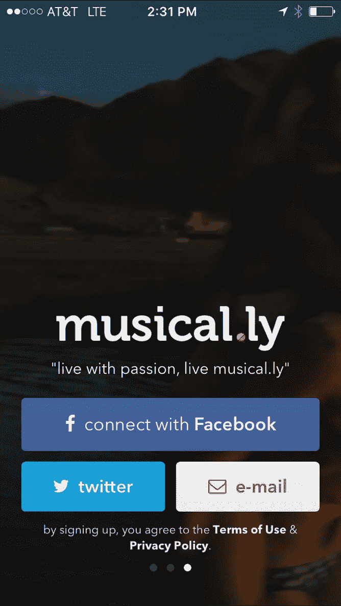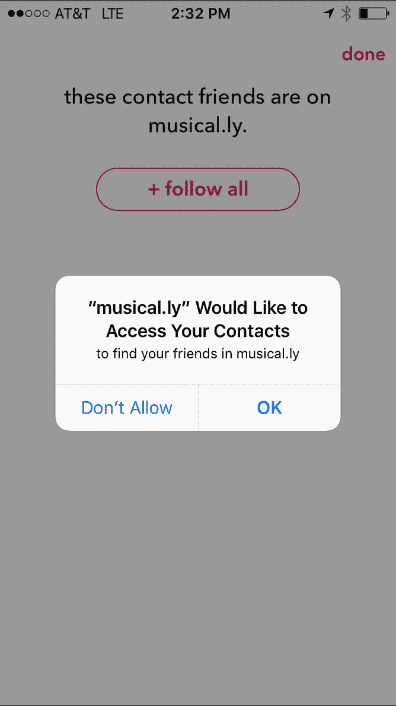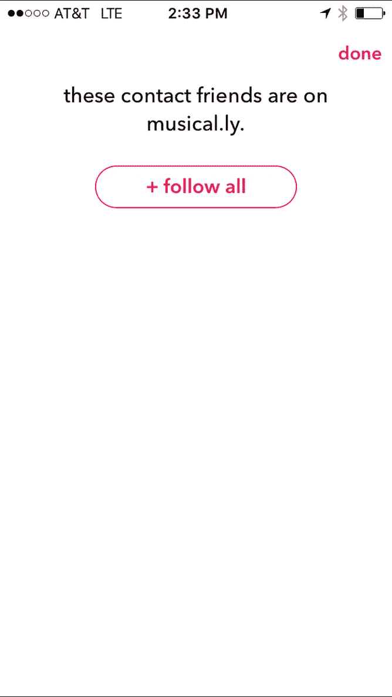

Vine 的解决方案是更努力地寻找你的朋友，允许你通过多个网络找到朋友——脸书、推特或你的联系人列表。并且，他们会为你预先加载一些推荐用户。我不小心立刻跟踪了数百人，所以他们肯定在做正确的事情。我想是的。

至少，当数百人获得一个新的神秘追随者时，他们可能会感到温暖。\_(ツ)_/

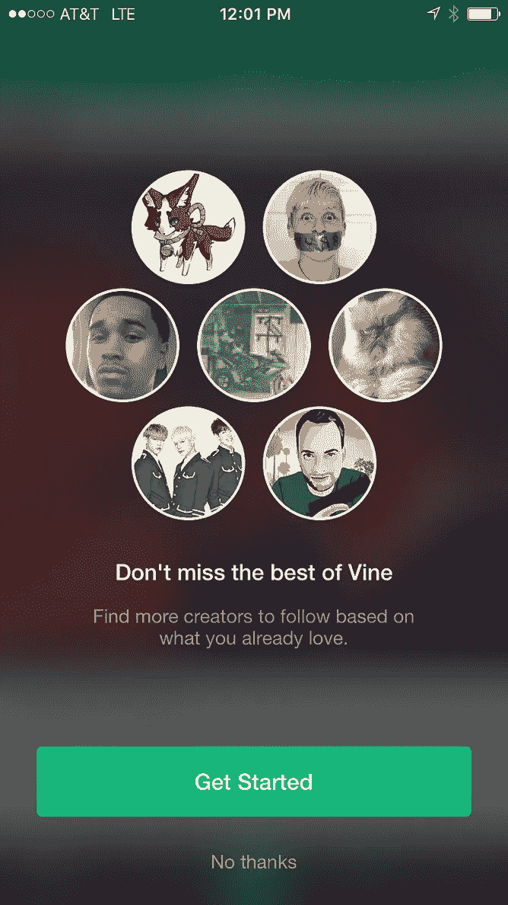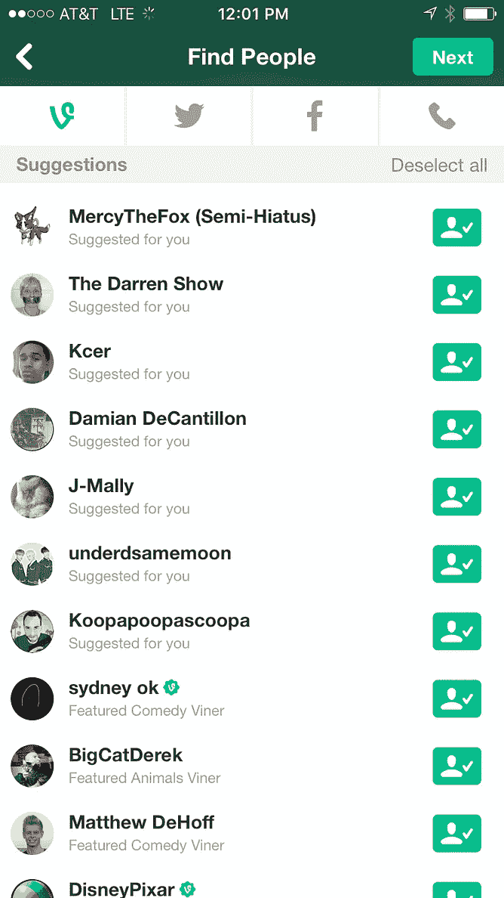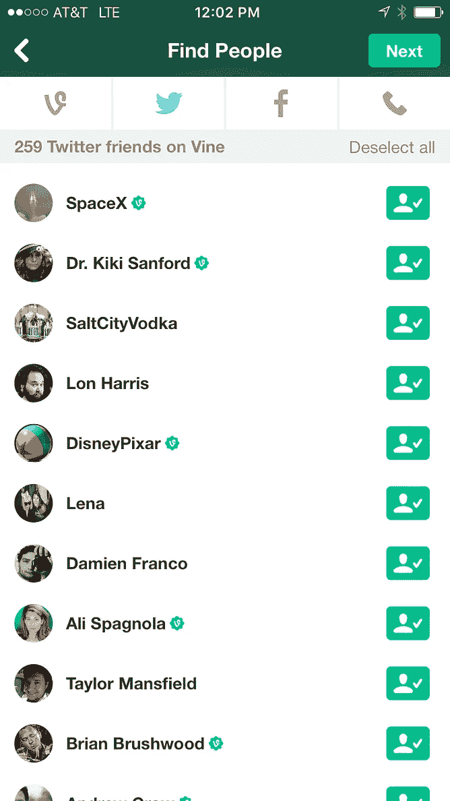

在我们进入下一个桶之前还有几件事。这一类别中没有一个应用*优先考虑*邀请朋友，但经过一些设置挖掘后，其中几个确实有一些非常有趣的邀请实现。

大多数人利用了 T2 98%的短信打开率。还有一些人通过使用 Twitter 的[数字作为注册过程的一部分，进一步简化了短信邀请体验。(两者都是。上面提到的 ly 用的是数字。)和其他的，比如 Kik，使用他们自己的土布版本的数字。](https://get.digits.com/phone-based-sign-in)

下面你可以看到来自 Flipagram、Musical.ly 和 Wishbone 的预先写好的短信，以及证明我无法养家糊口的文件。

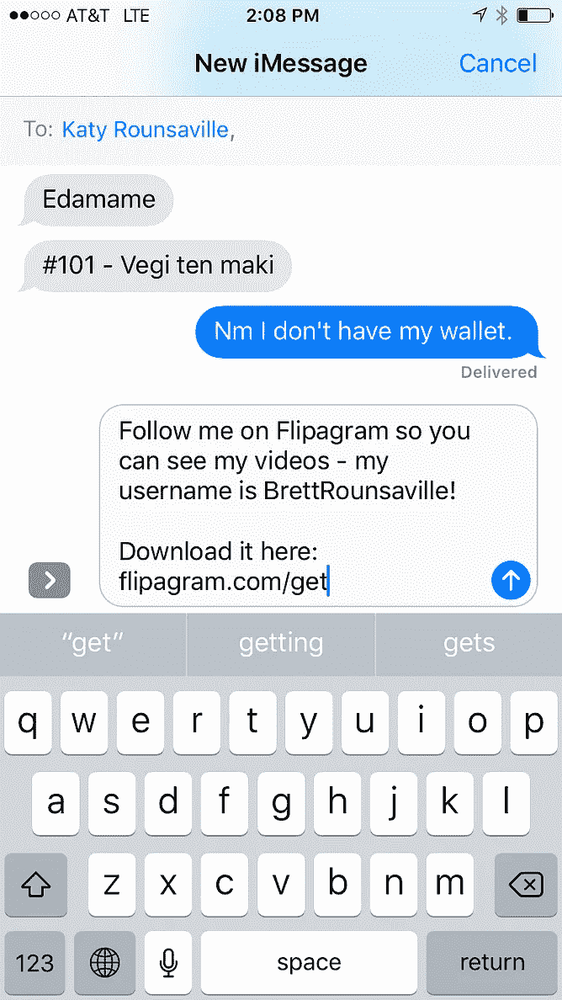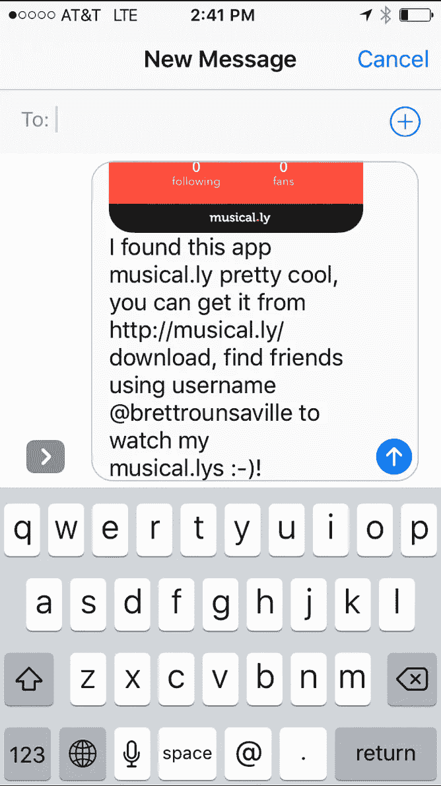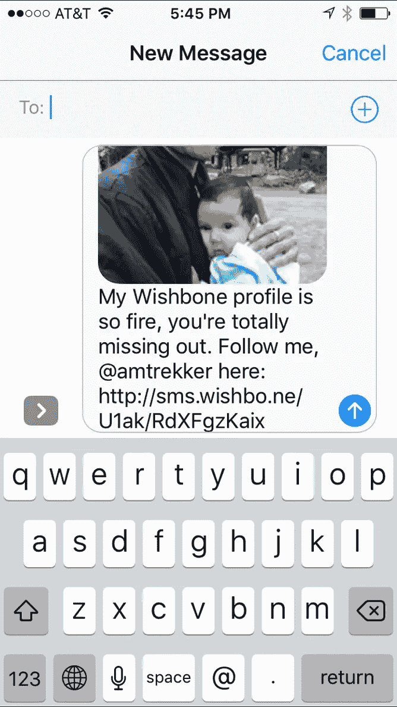

看看添加图片如何转化会很有趣。三人中有两人决定添加某种图片，尽管有理由相信加载时间和链接点击量之间存在某种关联，这可能会让你在接收信号较低的地方出师不利。

更奇怪的是，Wishbone 分享的形象只是你的头像。我不知道为什么我会想发一张自己的照片来说服一个朋友下载一个应用程序，但也许这可以传递一种信任的信息？在我看来，这是自动垃圾邮件，而 Musical.ly 选择的更像广告的图片由于某种原因却不是这样。(在评论里说说吧。)

通过短信邀请的缺点(从开发人员的角度来看)将永远是 1:1 的性质。真的没有群发短信这种事，除非你群发短信，这标志着你是一个比那些总是在你把沙发抬上三段楼梯后，但在你倒饮料前出现的人更糟糕的朋友。在人们下载之前，你不应该把你的应用放在这里。

我看到的关于这个问题的最有趣的工作来自 Live.me。他们仍然有通常的 SMS，FB 等。邀请，但他们还使用了 Facebook Messenger！我找不到任何开放率或转换统计，但这带来了一系列的奖金:

*   完全整合你的朋友图
*   允许用户发送多条一对一消息，每条消息只需额外点击一次
*   给你一个按时间顺序排列的你最近发信息的人的列表，这是一个聪明的解决办法，你可以找到所有你最亲密的朋友来发信息
*   渗透率相当于脸书和
*   我所期待的可能是一个相当高的开放率。(如果有这方面的数据请告诉我！)

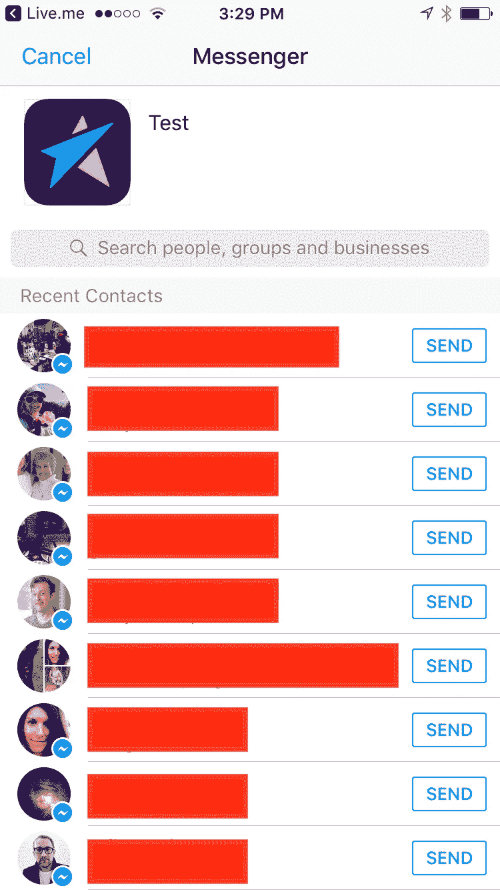

As you can see, I only speak to people without names.

好东西。偷那个。到了最后一桶。

**优先邀请朋友的人**

这种说法背后的科学比精油更少，但是那些在这个列表中优先邀请朋友的人在他们各自的列表中排名高于除了四大之外的所有人。(诚然，WhatsApp 本身就是一个庞然大物。)虽然，这背后确实有一定的逻辑。如果病毒率(k) =邀请数(i) *转化率(c)，那么你需要一些邀请。

事实上，这三个应用都做了一些聪明的事情，试图鱼与熊掌兼得。

马可波罗放弃了很多房地产来说服你邀请你的朋友。注册后的第一页是一个全屏幕，说服你连接你的联系人并开始邀请。所有的邀请都是通过短信进行的，大概是为了简化事情，避免选择死亡。他们还在屏幕顶部显示了“建议”邀请的朋友…这些朋友看起来完全是随机的。我不确定这是否明智。如果你和我一样，那么你的联系人名单中有一半是你甚至不记得见过的人。

但是这里有一个巧妙的地方，因为通过短信邀请仍然是 1:1 的提议，他们不依赖于你马上做所有的邀请。一旦你使用该应用程序，它们仍然会占据你屏幕底部的 18%，一遍又一遍地提醒你应该与马可波罗一起使用的所有朋友。

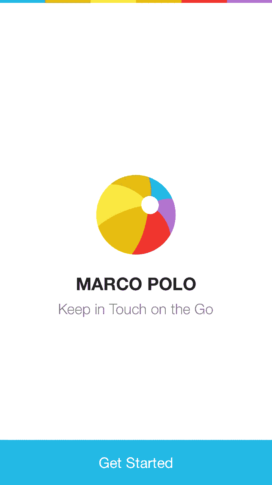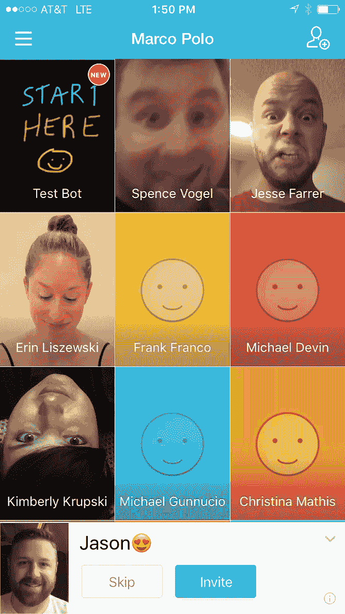

此外，如果优先寻找朋友比其他人都关注…马可波罗只是默认你关注你的联系人列表中已经使用马可波罗的每个人，所以当你打开应用程序的实际应用程序部分时，你已经有了一个充满你信任的面孔的生动页面。太棒了。

WhatsApp 采取了一种更全面的方法，允许你通过脸书(WhatsApp 的所有者)登录，然后在前台请求你“告诉一个朋友关于 WhatsApp”(为什么“朋友”是大写的，“关于”不是，我们只能猜测。*耸肩表情符号*)。

然后，你有很多选择来“告诉朋友”——邮件、信息、推特、脸书。标准的东西。

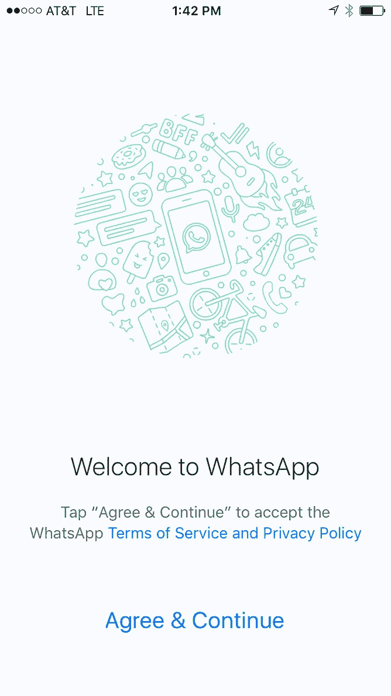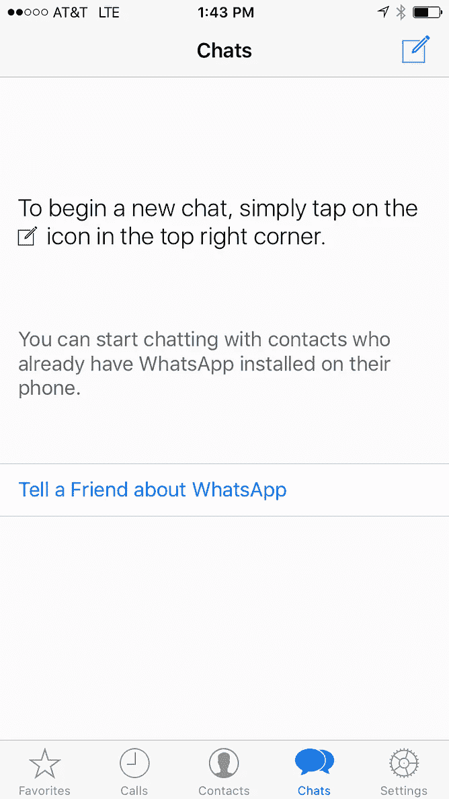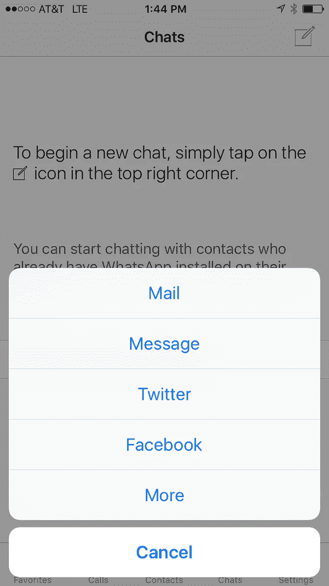

好吧，我把这个留到最后，因为虽然我把它放在优先邀请朋友的桶里，但是 Houseparty 很好地融合了优先寻找朋友和优先邀请朋友的概念。

也许是因为 Houseparty 背后的人之前已经用 Meerkat 在其他人的图形上构建过一次，这一次他们决定从头开始创建自己的图形，只允许通过电子邮件注册并使用他们自己版本的数字(虽然，我不确定非数字部分有什么功能，因为他们也强迫你输入密码和电子邮件…除非他们只是强迫双因素？请随意向我解释。)

注册后，你会发现你的朋友已经通过你的联系人使用了这个应用程序，这让你立刻获得了温暖模糊的社交证明。朋友找到了。检查！

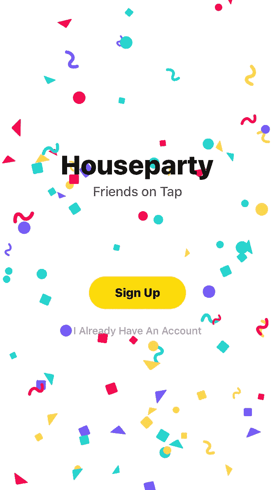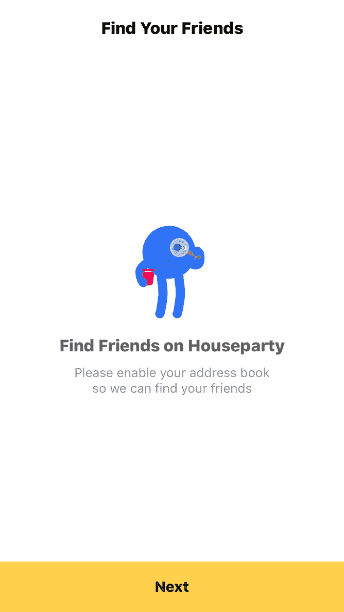

此时的危险是，如果你作为开发人员现在也选择优先考虑邀请，你可能会使你的入职流程延长一倍，甚至在你开始好的部分之前就失去新用户。但是 Houseparty 在这里做了一些聪明的事情。

它们通过在背景中显示用户界面，让你感觉你在使用这款应用程序，但前景会给你一个颜色鲜艳的通知，强迫你现在邀请朋友。入职培训已经有效完成，但用户可以选择更进一步，这样做可能会改善他们的用户体验和 Houseparty 的下载量。双赢。

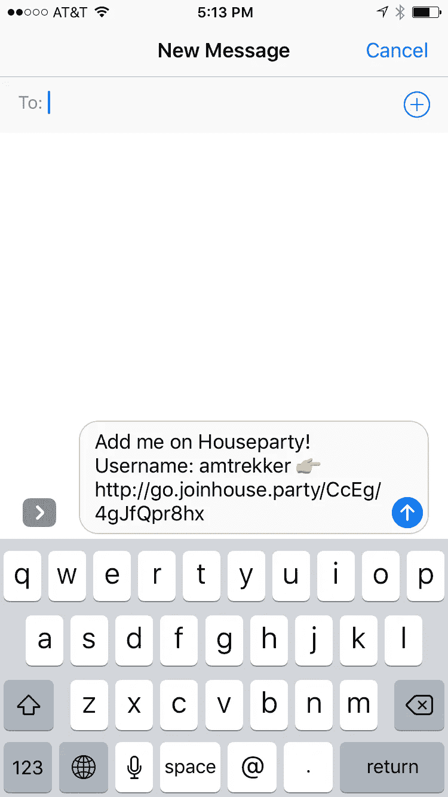

Welp，那对我来说是大量的打字和阅读，所以我要退出，但我很乐意在评论中继续讨论这些。

希望这有所帮助！让我们交谈。

> [黑客中午](http://bit.ly/Hackernoon)是黑客如何开始他们的下午。我们是 [@AMI](http://bit.ly/atAMIatAMI) 家庭的一员。我们现在[接受投稿](http://bit.ly/hackernoonsubmission)，并乐意[讨论广告&赞助](mailto:partners@amipublications.com)机会。
> 
> 如果你喜欢这个故事，我们推荐你阅读我们的[最新科技故事](http://bit.ly/hackernoonlatestt)和[趋势科技故事](https://hackernoon.com/trending)。直到下一次，不要把世界的现实想当然！

