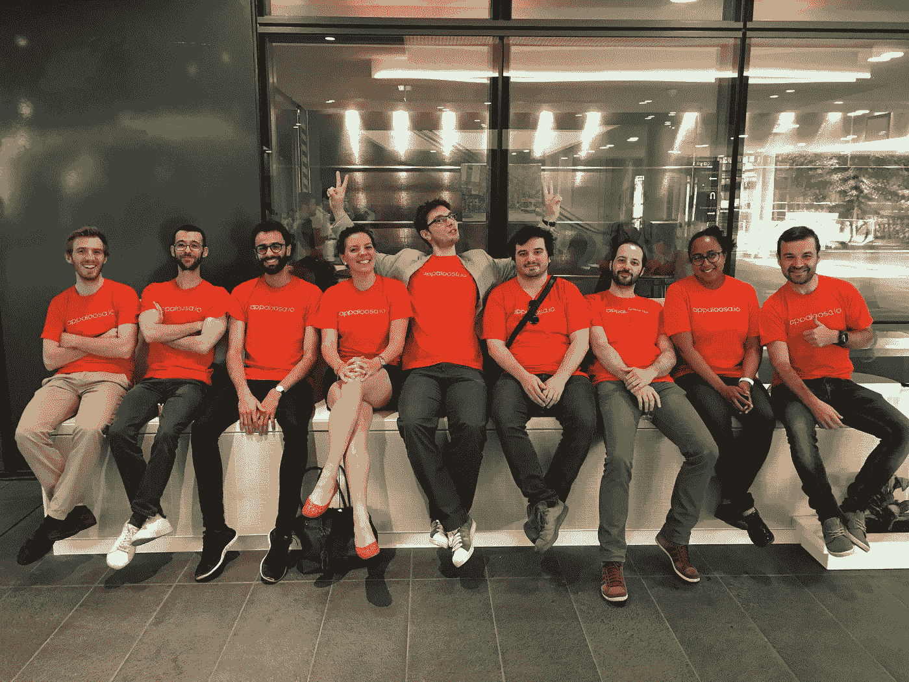

# Appaloosa 将加入炼油厂 SFO 的第一舰队！🇺🇸

> 原文：<https://medium.com/hackernoon/appaloosa-joins-the-refiners-accelaration-program-6039c6ab8bd>

**我们很高兴地宣布，我们是由** [**提炼商**](http://www.therefiners.co) **选出的 12 家在三藩市加速发展的创业公司之一！**

几周前我们讨论了我们的选择，但是**D 日来了:我们的团队上周一整合了炼油厂加速器计划的第一个车队！**

Refiners 是一个跨境加速项目，旨在让外国创业者融入硅谷文化和准则。这对任何人来说都不是秘密，许多外国企业家一旦踏上美国土地就会面临困难，在美国，人脉和导师通常是成功的关键。

这就是为什么炼油厂围绕这个项目组建了一个摇滚明星团队，包括一流的投资者、+200 名当地导师、合作伙伴、企业家和生态系统的关键人物，如 LinkedIn 的创始人雷德·霍夫曼、Xavier Niel、加里·维纳查克、麻省理工学院媒体实验室主任 Joi Ito、Phil Libin、Evernote 的创始人 Brian Solis。

自从我们的旅程开始以来，我们一直在慢慢接近美国市场:我们已经有一些美国客户，我们知道那里对我们的产品有兴趣。然而，我们当然也明白，要想取得成功，我们必须调整我们的信息、我们的战略并学习这个市场的规则。

因此，Refiners 为我们的团队提供了一个独特的机会，让我们能够得到顶尖导师的建议，在美国发展我们的业务和网络。

**去年对于** [**阿帕卢萨**](http://www.appaloosa-store.com) **:** 来说是巨大的一年

*   收入增长+300%
*   团队从 5 人增加到 13 人
*   我们现在已经通过 7，000 多个私有企业应用商店部署了 10，000，000 多个私有应用

# 我们已经准备好进入下一阶段了！

在接下来的三个月里，我们的 [**CEO 朱利安**](https://fr.linkedin.com/in/ijulien) **将会在三藩市，他的首要目标是学习和会见鼓舞人心的人。**

如果你在湾区附近，请通过[**tweet**](https://twitter.com/AppaloosaStore)**、snap (Appaloosa.io)或 email(*Julien @ appaloosa . io*)让他知道你在做什么，一起喝杯咖啡吧！**

敬请关注，我们将随时为您更新！

The almost complete Appaloosa Team

> [黑客中午](http://bit.ly/Hackernoon)是黑客如何开始他们的下午。我们是 [@AMI](http://bit.ly/atAMIatAMI) 家庭的一员。我们现在[接受投稿](http://bit.ly/hackernoonsubmission)，并乐意[讨论广告&赞助](mailto:partners@amipublications.com)机会。
> 
> 如果你喜欢这个故事，我们推荐你阅读我们的[最新科技故事](http://bit.ly/hackernoonlatestt)和[趋势科技故事](https://hackernoon.com/trending)。直到下一次，不要把世界的现实想当然！

