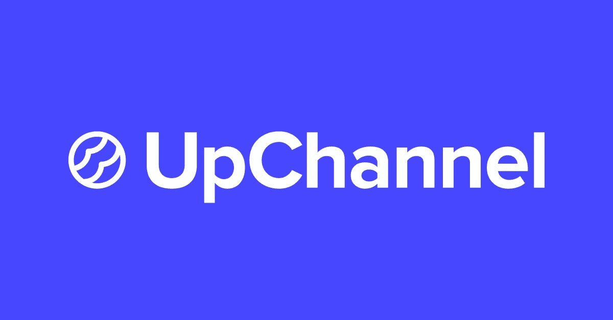

# AppCow 升级了！介绍:上行通道

> 原文：<https://medium.com/hackernoon/appcow-s-been-upgraded-introducing-upchannel-9cb4ddf0f812>

*使名称从 AppCow 切换到 UpChannel。*

在你变得过于担心之前，不要惊慌:AppCow 这款应用一如既往地成功，并且仍然给用户提供优惠。那为什么要改名呢？因为 AppCow 不仅仅是一个应用程序，我们需要一个名称来匹配我们为客户提供的令人印象深刻的服务。

以下是我们的官方描述:

*“up channel 构建了预装或引入到最终用户智能手机上的定制应用，使我们的客户能够通过移动优先的方式直接与客户互动。我们的客户通过一个简单直观的门户来实现这一点，只需点击一个按钮，就可以操作数据。我们努力提供智能软件，通过尽可能自动化和提供数据驱动的建议来简化决策，消除移动战略中的猜测。”*

这意味着什么呢？嗯，我们是一家技术公司，通过收集数据的智能手机应用程序向客户提供解决方案。从那里，数据可以用来解决问题。客户不必猜测他们的问题来自哪里，而是可以获得数据，从而更容易确定问题并找到解决方案。AppCow 只是我们制作的众多应用中的一个，因此 UpChannel 这个名字传达了我们公司的更大图景。

正如 C0 创始人雅各布·卡索夫所说，

> “我们不仅仅是一个应用程序。我们在上行频道。”

> [黑客中午](http://bit.ly/Hackernoon)是黑客如何开始他们的下午。我们是 [@AMI](http://bit.ly/atAMIatAMI) 家庭的一员。我们现在[接受投稿](http://bit.ly/hackernoonsubmission)并乐意[讨论广告&赞助](mailto:partners@amipublications.com)机会。
> 
> 如果你喜欢这个故事，我们推荐你阅读我们的[最新科技故事](http://bit.ly/hackernoonlatestt)和[趋势科技故事](https://hackernoon.com/trending)。直到下一次，不要把世界的现实想当然！

