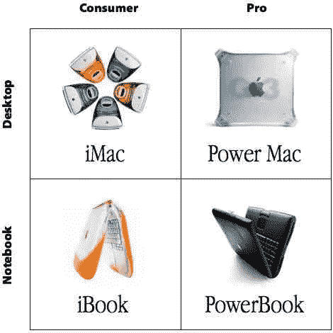

# 苹果，苹果笔记本和软件狗，天啊！

> 原文：<https://medium.com/hackernoon/apple-and-macbooks-and-dongles-oh-my-67df18ab8c7e>

Steve Jobs 2x2 matrix circa 1997

从 1983 年我第一次买苹果 IIe 开始，我就一直在使用苹果的产品。虽然在 20 世纪 90 年代的一段时间里，我主要使用 Windows 电脑工作，但大约 15 年前，我又回到了 Mac 电脑，并且一直没有回头。直到现在。

苹果公司做出的一系列决定让我想起了苹果公司在史蒂夫·乔布斯回归之前的 90 年代做出的许多决定…