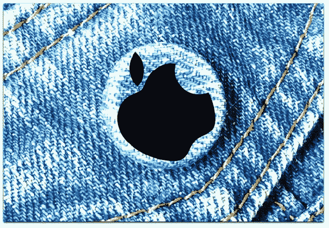

# 苹果是一家服装公司

> 原文：<https://medium.com/hackernoon/apple-is-a-clothing-company-fd821072bf59>

苹果制造的主要东西是我们自身的延伸。这就是我们的手机和笔记本电脑的现状。它们是我们几乎会穿的东西，就像我们的衣服一样。

苹果专卖店位于高档服装零售商聚集的购物区，这仅仅是巧合吗？还是说经营那些店的[安吉拉·阿伦茨](https://en.wikipedia.org/wiki/Angela_Ahrendts)是从博柏利来公司的？或者它的[手表](http://apple.com/watch)，作为时尚界所说的配件出售，对公司来说显然比我们过去所说的“外围设备”(屏幕、打印机、驱动器等)重要得多。)而苹果似乎根本不在乎后者？

苹果公司最近澄清了它与几乎所有其他科技公司的不同之处，因为它几乎绝对关心个人隐私，这是巧合吗？

苹果对设计和时尚的乔布斯式痴迷(或者 howardlindzon [称之为#fashology](https://twitter.com/howardlindzon/status/585980792645357568) )虽然有趣且重要，但也将人们的注意力从公司更深层次的专注于扩大其客户在世界上的能力上转移开了。

了解一下:苹果非常关心使用其产品的身体，蒂姆·库克最近对 FastCompany 的 Rick Tetzeli 说:“当你看到大多数解决方案时，无论是设备，还是来自大型制药公司的东西，首先也是最重要的，他们是为了获得(保险提供商)的补偿。不去想什么能帮助病人。因此，如果你不在乎报销，而我们有特权这么做，那甚至可能让智能手机市场看起来很小。”

考虑到所有这些，就很容易理解为什么苹果的产品阵容看起来陈旧了。衬衫、裙子和帽子也过时了。它们也已经存在了几千年，我们永远不会停止穿它们。

在阅读了沃尔特·莫斯伯格的最新作品《T2》后，我意识到苹果是一家服装公司。后乔布斯时代的苹果在财务上飙升，但缺乏突破性的产品。

像沃尔特和几乎所有其他人一样，我一直认为苹果是一家传统的电脑公司，拥有一位不可替代的现已去世的创始人兼首席执行官，他以设计和营销方面的点石成金而闻名。当我 2013 年 1 月在这里发布[苹果腐烂](http://blogs.harvard.edu/doc/2013/01/22/apple-rot/)时，他的缺席已经很明显了，一年后在《证明史蒂夫·乔布斯已死[中重复了同样的观点](http://blogs.harvard.edu/doc/2014/05/09/proof-that-steve-is-dead/):

> *…看看苹果有什么:*
> 
> *—iPhone 5 是一个拉伸的 iPhone 4s，是一个有洒落的 iPhone 4。4 是大约 3 年前推出的。没有机器人像 iPhone 一样光滑，但它们中的几十个拥有 iPhone 缺乏的吸引人的功能。他们来自许多不同的公司，而不仅仅是一家。*
> 
> *——iPad 唯一的新东西是视网膜屏幕(令人惊叹，但不再是独一无二的)和迷你，它们应该早几年就出来了，而* [*缺少*](http://thebottomline.as.ucsb.edu/2013/01/ipad-mini-less-than-just-the-same) *视网膜屏幕。苹果的电脑系列是对渐进主义的研究。*
> 
> 除了外观，笔记本电脑和台式机几乎没有什么新的东西，功能也减少了。(还有机型，比如 17 寸的 Macbook Pro。)这也适用于操作系统。
> 
> 除了新苹果电视的朦胧幻影，地平线上没有任何令人兴奋的东西。即使真的到了，没有什么比电视这两个字母更能说明“旧”了。

从那以后，苹果公司推出了[手表](http://apple.com/watch)(这一款的创意点)，推出了几乎看不到的(但看起来很酷) [Mac Pro](https://www.fastcompany.com/3062090/tim-cooks-apple/playing-the-long-game-inside-tim-cooks-apple) (现在也很陈旧)[取消了它的 Thunderbolt 显示屏](https://9to5mac.com/2016/07/04/apple-best-4k-5k-displays-for-mac/)，把它的[时间胶囊](http://www.apple.com/airport-time-capsule/)保持在微不足道的(几乎毫无用处的)3Tb，几乎没有改进它的[机场](http://www.apple.com/compare-wifi-models/) Wi-Fi 基站，并对它的台式机和笔记本电脑进行了最低限度的更新，以至于你可以在没有新的情况下生活几年。有点像一条好牛仔裤。

而事实上，对苹果来说最重要的是，在一个只有苹果知道它在的行业里，它比其他任何人都更好地为顾客提供配饰。

你可以从蒂姆·库克最近的同一份报告[中听到这方面的暗示:“我们的战略是尽我们所能在你生活的各个方面帮助你……无论你是坐在客厅里，在你的桌面上，在你的手机上，还是在你的车里。”](https://www.fastcompany.com/3062090/tim-cooks-apple/playing-the-long-game-inside-tim-cooks-apple)

接下来是这样的:“苹果在从它已经扮演角色的世界中获取收入方面做得非常出色，它未来的收入将更加依赖于此。霍勒斯·德迪乌(Horace Dediu)是一位颇具影响力的分析师，目前在波士顿的克莱顿·克里斯滕森颠覆性创新研究所(Clayton Christensen Institute for Disruptive Innovation)工作。据他估计，苹果客户每月每人向公司支付 40 美元的天文数字，相比之下，脸书和谷歌每月只收几分钱，亚马逊每月只收几美元。这主要是消费者购买昂贵设备的结果。但 Apple Music 和 iCloud storage 等订阅服务开始带来大量现金。服务收入目前占苹果总销售额的 12%，高于一年前的 9%。事实上，苹果的服务收入超过了脸书的总收入。库克说公司才刚刚起步。哦，是啊。“我预计会很大，”他微笑着说，在宣布这个好消息时，他的阿拉巴马口音变得更加明显。

因此，也许对苹果来说，最重要的是，它比其他任何公司都更好地为顾客提供配饰。从本质上说，这些客户租用这些配件。

我敢打赌[苹果公司周三](http://www.apple.com/apple-events/september-2016/)发布的产品将会成为你生活的一部分。听起来不像个人电脑行业的其他部分。

我们可能还记得，这几乎是史蒂夫·乔布斯发明的。

*原载于 2016 年 9 月 4 日*[*【blogs.harvard.edu*](http://blogs.harvard.edu/doc/2016/09/04/apple-is-a-clothing-company/)*。*

> [黑客中午](http://bit.ly/Hackernoon)是黑客如何开始他们的下午。我们是阿妹家庭的一员。我们现在[接受投稿](http://bit.ly/hackernoonsubmission)并乐意[讨论广告&赞助](mailto:partners@amipublications.com)机会。
> 
> 如果你喜欢这个故事，我们推荐你阅读我们的[最新科技故事](http://bit.ly/hackernoonlatestt)和[趋势科技故事](https://hackernoon.com/trending)。直到下一次，不要把世界的现实想当然！

