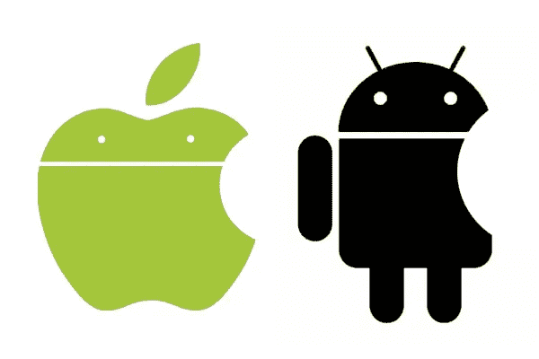

# 苹果正在腐烂，谷歌有大问题[演示]

> 原文：<https://medium.com/hackernoon/apple-is-rotting-and-googles-got-big-problems-presentation-cd911d67325f>

苹果和谷歌是当今最强大、最赚钱的科技巨头。但两人都被踢了屁股，这就是原因。

这两家公司都能挺过未来 15 年吗？也会吗？谁啊。

我很想听听你对[谷歌](https://hackernoon.com/tagged/google)和苹果[未来](https://hackernoon.com/tagged/future)的看法。就长期赌注而言，你最喜欢四大银行中的谁？

我的钱是在亚马逊上买的。原因如下…

 [## 亚马逊的末日正在扼杀电子商务

### 杰夫·贝索斯是终结者……他扼杀竞争和电子商务的速度比阿诺德说“我会回来的”还要快

hackernoon.com](https://hackernoon.com/the-amazon-apocalypse-of-ecommerce-7096ce3c6aa5) 

脸书怎么样？有人要吗？

今天的网络效应比以往任何时候都更强大，有些人甚至认为牢不可破。

 [## 网络效应、不可阻挡的垄断和创新的终结

### 强大的力量带来巨大的利润，然后即使是创新也变得肥胖和懒惰。这是 2000 年前的范式…

hackernoon.com](https://hackernoon.com/network-effects-and-the-unstoppable-unregulatable-monopolies-of-today-f5ab2ca5a5ad) 

这次不同吗？苹果的贪婪会导致它的垮台吗？语音能颠覆谷歌的大生意吗？

# 下面就来听听你的大胆预测吧。

## 在你走之前…

*如果你从这篇文章中得到了可操作的或有价值的东西，点击* ***💚或者👏点击下面的按钮*** *或* ***在脸书和推特*** *上分享文章，这样你的朋友也能从中受益。*