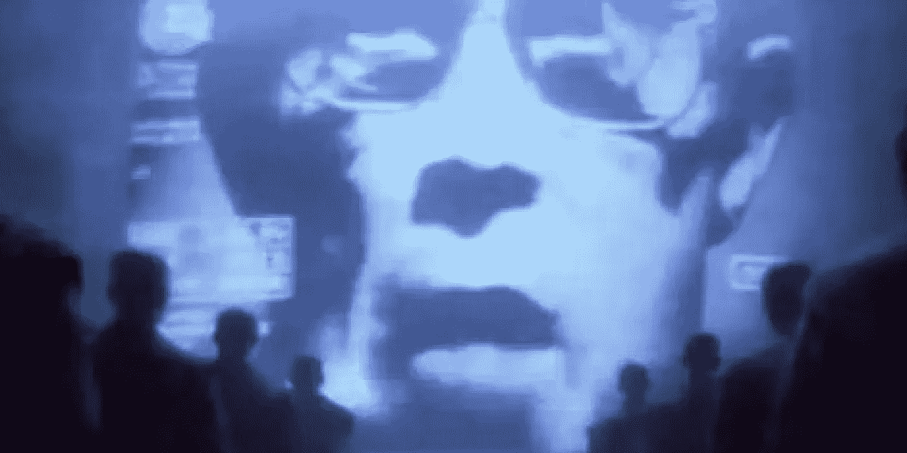
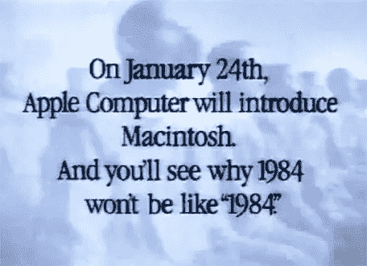
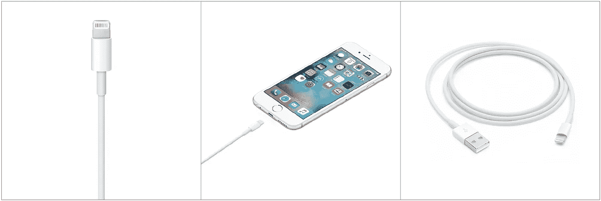
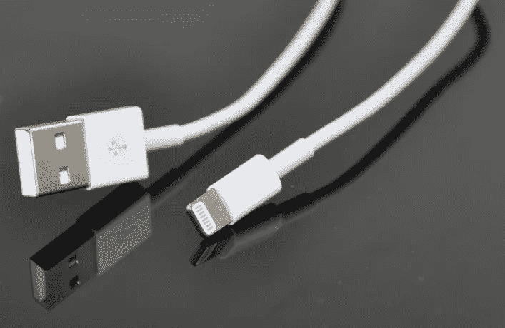
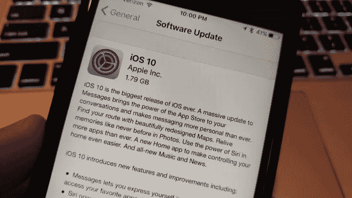
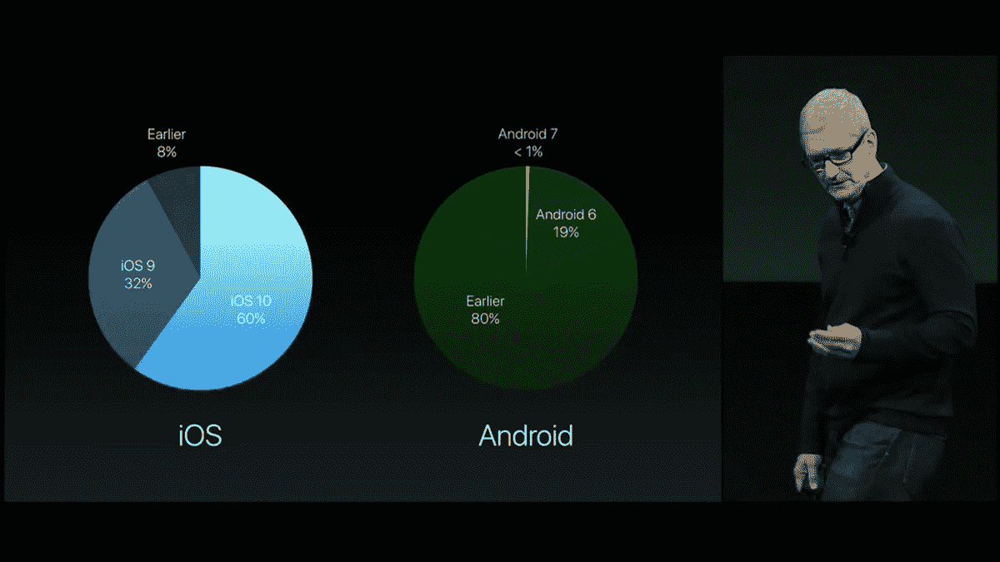

# 闪电阴谋⚡

> 原文：<https://medium.com/hackernoon/apple-the-lightning-conspiracy-9c67f8ebb101>

苹果已经永远地走向了黑暗面吗？

“Big Brother, Knock Twice If It’s You” Apple’s famous 1984 commercial, revolting against the evil Big Brother, IBM

> 2012 年 9 月 12 日，苹果推出了 [Lightning 连接器](https://en.wikipedia.org/wiki/Lightning_(connector))。我们会看到为什么 2012 年及以后，它完全像“1984”。

The packshot of the famous Apple 1984 commercial

> “Lightning 是一个 8 针连接器，携带一个**数字信号**。[……]官方 Lightning 连接器包含一个认证芯片，旨在使第三方制造商难以在未经苹果[ [*链接*](http://arstechnica.com/apple/2012/10/apple-revising-mfi-program-to-limit-third-party-lightning-accessories/) ]批准的情况下生产兼容的配件；但是，芯片已经被破解了。”[ [*链接*](http://www.techradar.com/news/computing/apple/apple-lightning-connector-what-you-need-to-know-1106884)

> 因此，携带数字信号意味着:每当你将 lightning 电缆插入 iOS 设备时，无论是苹果公司还是第三方，苹果公司都知道。数字信号是区分电缆的最佳技术，可以根据制造商 ID、零售店、首次使用日期、使用次数、总使用时间、国家、iOS 版本等等进行区分。

理论上，苹果可以延长或最大限度地延长他们在苹果商店销售的 lightning cables 的预期寿命，并减少预期寿命*——而不是拒绝，以避免* [*竞争*](https://en.wikipedia.org/wiki/Competition_law) *和* [*反垄断法*](https://en.wikipedia.org/wiki/United_States_antitrust_law) *(!)——*几乎是同一根电缆，通过阿里快递销售，在同一家中国工厂制造，比他们品牌下销售的电缆晚几分钟。

# 有计划的淘汰，从字面上扼杀产品

我对一些软性的[计划淘汰](https://en.wikipedia.org/wiki/Planned_obsolescence)没什么意见，我习惯了，也许还沉迷于新产品，更快的处理器、更大的内存、更大的屏幕尺寸、新的操作系统，所有这些我都知道自己并不真正需要。但是技术在发展，我没意见。(*不过还是少点果汁时间。*)

但这在最坏的情况下被称为“[计划报废](https://en.wikipedia.org/wiki/Planned_obsolescence)”。比近一个世纪前臭名昭著的菲比斯卡特尔要糟糕得多。

我相信很多人都经历过闪电电缆突然死亡。但是没有简单的方法来证明这个阴谋，他们死于邪恶算法的一部分。实际上，是被一个毒苹果。如果有人能证明这一点，将会有严重的法律后果。数不清的罚款和诉讼案件。哦天啊。

# 证明苹果不当行为的单一案例

嗯，我们家有 7 个功能齐全的 iOS 设备受到 lightning 连接器的影响，其中 5 个目前正在使用中。我们每个月至少埋一根避雷线( *RIP* )。我说的绝对不是断裂的、物理损坏的电缆。

尽管如此，从[阿里快递](https://www.aliexpress.com/item/1m-USB-Cable-for-iPhone-7-5-5s-6-6s-Plus-Perfect-Fit-for-Lightning-iOS/32754266359.html?spm=2114.30010308.3.49.1BXRGU&ws_ab_test=searchweb0_0,searchweb201602_4,searchweb201603_7&btsid=654e55c7-fef7-48ea-b477-c44531e9ab12)购买 3 年的股票(*所有 12 个*[*6.48 美元，含运费*](https://www.aliexpress.com/item/1m-USB-Cable-for-iPhone-7-5-5s-6-6s-Plus-Perfect-Fit-for-Lightning-iOS/32754266359.html?spm=2114.30010308.3.49.1BXRGU&ws_ab_test=searchweb0_0,searchweb201602_4,searchweb201603_7&btsid=654e55c7-fef7-48ea-b477-c44531e9ab12) )胜过从[苹果商店](http://www.apple.com/shop/product/MD818AM/A/lightning-to-usb-cable-1-m)只买一个(仅 1 个[20.69 美元，含税&运费](http://www.apple.com/shop/product/MD818AM/A/lightning-to-usb-cable-1-m))。所以，是的，我们是忠实的苹果粉丝，但这并不愚蠢，好吗？

The Lightning Cable Of The Dark Side

制造 iOS 设备的中国人在制造这些电缆方面不会真的那么差。他们能吗？哦，顺便说一句，中国人擅长制造老式的 30 针 iOS 电缆或微型 USB 电缆，一般来说，我没有看到任何人抱怨这些，除了在使用多年后坏掉。太奇怪了。 ☺】

当苹果发布 iOS 10 时，作为一种通常的预防措施，我等待着，你知道，以避免软件中的小故障可能导致的任何早期采用者的灾难。但是，作为一个天生的早期采纳者，我仍然在等待。我来告诉你为什么。

我儿子的 iPad Mini 4(2016 年 7 月购买)需要一个需要 iOS 10 功能的应用程序，准确地说是苹果的 [Swift Playgrounds](http://www.apple.com/swift/playgrounds/) 。所以我不得不升级他的。我插上电源，点击更新。大约 15 分钟后，升级完成。但是，插入的设备不再充电了。我拔掉插头，重新插上。我听到了哔哔声，短暂地[ *眨眼* ]看到了雷霆/闪电图标⚡，直到它再次消失。重复了几次，海拉斯什么也没有改变，电缆像厨房用的麻绳一样死了。(*由于这是一根标准的白色 3 英尺电缆，我真的不知道这是产品附带的原始电缆还是我上个月从阿里快递批量订购的电缆，下次我会给它们贴上标签/标记。*)

换成我的 iPhone 插的线，iPad 又开始充电了。所以刚刚更新的 iOS 设备在使用中没有任何问题。然后就在扔掉有故障的电缆之前，不知何故魔鬼戳了我一下，我用刚刚死去的 lightning 电缆插上了我的 iPhone——仍然在 iOS 9.3.5 上——却目睹了一次不可思议的复活，显然不是复苏，因为它自己奇迹般地从死亡中复活了。

Hallelujah! The Lightning Is Risen

哈利路亚，⚡，这是个奇迹！而是有选择性的。再次插上 iOS 10 iPad，不充电。皮尤。你可以不停地重复这个例行程序，很快就会发疯。)

没有人从苹果或更高的全能可以解释我为什么这种功能齐全的电缆被 iOS 10 拒绝，这是他们只能在每次 iOS 更新时做的事情，因为芯片破裂。我不会轻易买。

我不知道这是否足以证明“通过使用一种算法来数字区分功能完美的配件的不当行为”，但这足以说服我。所以我无限期地推迟了我们的家庭迁移到 iOS 10。直到最后一刻，我都不得不这样做。

问题是，这种对品牌的不信任是有腐蚀性的。我现在更倾向于认为，苹果正在降低我的 iPhone 6 的速度，让我比必要的时间更早升级到 iPhone 7，这可能永远不会发生。

现在，想想苹果为什么要把耳机接口或者 Macbook Pro 的 USB 干掉。为了卖得更多，监督哪种耳机或数据线适合苹果的底线。

当我对约翰·斯卡利以 10 英镑卖给我一台糟糕的 Mac LC、一台平板扫描仪和一台彩色打印机感到恼火，并最终永远转向 Windows 时，我也有同样的感觉。尽管有乔布斯，我也不后悔这个决定。

# 2016 年，iOS 10 的采用率下降了 33%

正如苹果刚刚宣布的那样，[其 60%的设备现在都在 iOS 10](http://mashable.com/2016/10/27/apple-ios-10-60-percent/#dVHRPC8MCOq4) 上，这是在 iOS 10 发布 42 天后(2016 年 9 月 13 日-10 月 25 日)。iOS 9 的采用(2015 年 9 月 16 日-10 月 19 日)在短短的 33 天内 [61%](https://web.archive.org/web/20151022225336/https://developer.apple.com/support/app-store/) 似乎略胜一筹。但是这里有一个 9 天的诀窍。当你将其标准化为每日数据时，iOS 9 的每日数据为 1.85 个百分点，而 iOS 10 仅为 1.43 个百分点。第一个月的日均采用率下降了 33%。部分原因可能是由于 2016 年[iOS 销量](http://files.shareholder.com/downloads/AAPL/3108050539x0x913905/66363059-7FB6-4710-B4A5-7ABFA14CF5E6/10-K_2016_9.24.2016_-_as_filed.pdf)下降了 10%。但是下降的大部分似乎与软件有关。难怪[年利润 15 年来首次下降](https://www.theguardian.com/technology/2016/oct/25/apple-profits-sales-decline-2016-iphone-7)，销售额连续第三个季度下降。我想我不是一个人。

Tim Doing The 9 Day Trick, Yet Still 1 Percentage Point Below 2015

尽管三星的电池具有爆炸性，但 2017 年对苹果来说可能不会有太大不同。像素来了，以全 G 力升级 Android 的感知形象。我相信谷歌的品牌影响力远远超过所有其他安卓制造商的总和。

因此，可能真的有数百万像我一样不开心、愤怒的忠实顾客。如果我们都放弃并迁移到我们亲爱的谷歌的 Pixel 会怎么样？

阿尔洛斯枪手。-

*如果你设法读到这里，并且经历了类似的痛苦，请点击左下方的绿色❤心形图标，这样我们就能接触到更多的人，让他们听到我们的声音。也可以随意回应你的故事。*

> [黑客中午](http://bit.ly/Hackernoon)是黑客如何开始他们的下午。我们是阿妹家庭的一员。我们现在[接受投稿](http://bit.ly/hackernoonsubmission)并乐意[讨论广告&赞助](mailto:partners@amipublications.com)的机会。
> 
> 如果你喜欢这个故事，我们推荐你阅读我们的[最新科技故事](http://bit.ly/hackernoonlatestt)和[趋势科技故事](https://hackernoon.com/trending)。直到下一次，不要把世界的现实想当然！

