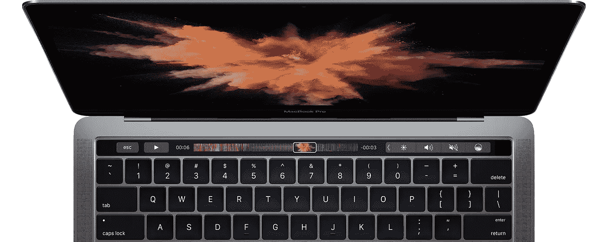
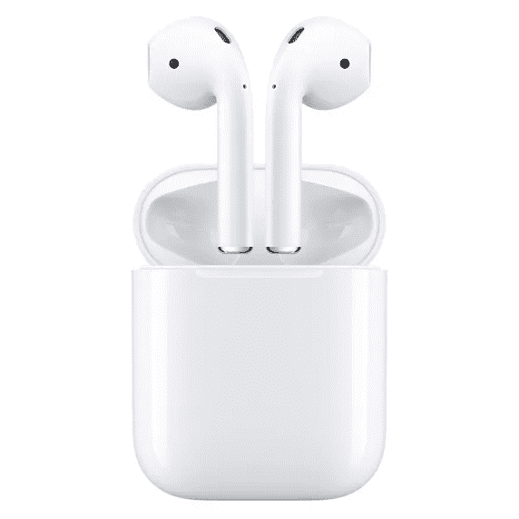
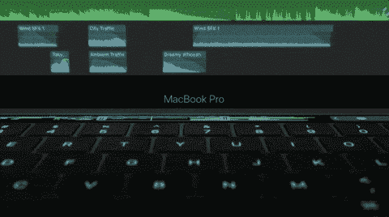
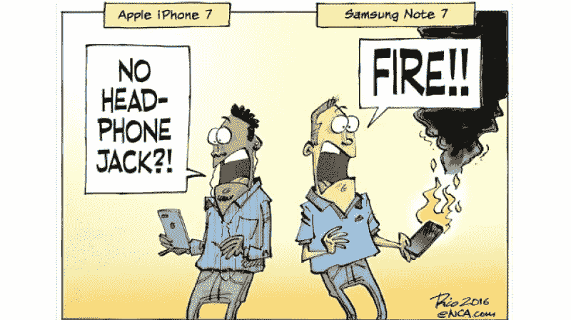
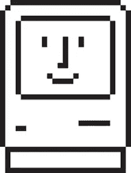

# 苹果在曲线背后茁壮成长

> 原文：<https://medium.com/hackernoon/apple-thrives-behind-the-curve-135423cc6bca>

作为全球领先的消费科技公司，苹果经常受到批评。从中国的侵犯人权，到美国每个客厅里的苹果音乐，我们仔细审视这个庞然大物的选择。

即使作为一个终身的苹果忠实者，我近年来也感到失望。在乏善可陈的 Apple Watch 和更大屏幕的移动设备之间，苹果似乎已经失去了优势。

> 但是 Touch Bar 是新的。这是故意的。市场想要一款带触摸屏的笔记本电脑，但苹果拒绝了，并以超出预期的信心和目的推出了一款产品。

有两个反复出现的对苹果的批评从未消失。苹果总是走在潮流的前面，或者落后于潮流。只是看你问谁了。

# 从不守时

苹果动作很快。他们在曲线之前移除了光盘驱动器，这被认为是一个有远见的决定。但是给我们 AirPods 代替耳机插孔仍然是 TBD——真的是 TBD。

苹果也可以慢慢来。你有那些上市晚了一点的大屏幕，就像 iPad 的触控笔一样。还有更多的例子，但你必须淡化产品愿景的重要性，以指责苹果公司不紧不慢。

# UX 是有代价的

有一个直言不讳的团体将苹果产品分解成各个组成部分来比较成本。好像未组装的计算机部件提供了与完整产品相同的价值主张。这太疯狂了。

如果你去餐馆吃饭，你的餐费会比在 Trader Joe's 买同样的食材贵。但是氛围呢？服务呢？厨师的多年经验呢？那些零件值多少钱？

你可以在 CVS 以不到 12 卷的价格在好市多买到一整箱卫生纸，但也许你不想在混凝土仓库地板上推着一辆橙色平板购物车走 90 分钟。也许你不介意走进一家位于市郊的商店，高价购买足够未来两周使用的卫生纸。

你不能把用户体验归结为一系列技术规格。大多数人愿意花更多的钱来使用一个为消费者端到端设计和制造的产品。如果做得好，他们会付更多的钱！

苹果观察趋势，看看哪些技术会持续下去，同时发现新技术如何改进他们的产品。当然，他们可以像微软那样，在经济上有意义的时候推出混合触摸屏怪物，但那将是冲动和短视的。

Touch Bar 的美妙之处在于它的设计，这也是为什么它是自 iPad 以来苹果最令人兴奋的创新。这款手表给人的感觉是缺乏创意和投机取巧(苹果后来将其重新定位为高端健身追踪器)，与此不同，这种设计感觉是不可避免的。

1.  按钮的可能性是无限的。他们是送给[软件人](https://www.youtube.com/watch?v=ReSlJ5cq5D0)的礼物。
2.  触摸条的线性特性可作为视频和音频编辑应用程序(如 Final Cut Pro 和 Logic Pro X)的直观时间线。
3.  触控 ID 现在甚至在 MacBook Pro 上有了一个合乎逻辑的家。
4.  与触摸屏笔记本电脑不同，我的显示器上不会有指纹。

# 你看到我的耳机插孔了吗？

移除 iPhone 7 上的耳机插孔感觉是苹果的特征，但以一种不吸引人的方式。这让我对苹果的反对者产生了同情。

我们很快就会进入后唱机时代，但现在这样做还为时过早。感觉更像是利用品牌以前的权力来抢占和支配市场趋势，而不是一个预言性的举动。

# 苹果应该总是慢慢来

苹果生产优质产品，我们必须有耐心。我们大多数人都知道他们在每个设计选择中都考虑了多少。三星匆忙将产品推向市场，因为它无法在质量上取胜。

三星陷入了恶性循环，为了保住市场份额，他们必须成为第一个上市的公司。那家公司如此专注于先发优势，它发布了一款真的会爆炸的手机！

因此，没有苹果，你不需要通过放弃光驱和耳机插孔来提前完成任务。花点时间在你的设计上。没人有权利催你。

只要继续发布不火的产品，我们就开心了。

# 感谢阅读！

# 击中绿色心脏，让其他人可以享受它🔥

# 在 [Twitter](https://twitter.com/hacktheproduct) 和 [Medium](/@theomiller) 上关注我吧！

> [黑客中午](http://bit.ly/Hackernoon)是黑客如何开始他们的下午。我们是 [@AMI](http://bit.ly/atAMIatAMI) 家庭的一员。我们现在[接受投稿](http://bit.ly/hackernoonsubmission)并乐意[讨论广告&赞助](mailto:partners@amipublications.com)机会。
> 
> 如果你喜欢这个故事，我们推荐你阅读我们的[最新科技故事](http://bit.ly/hackernoonlatestt)和[趋势科技故事](https://hackernoon.com/trending)。直到下一次，不要把世界的现实想当然！

