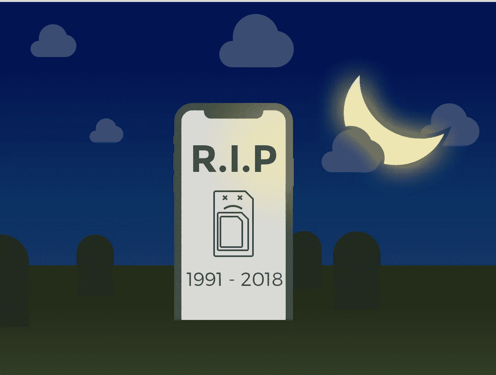
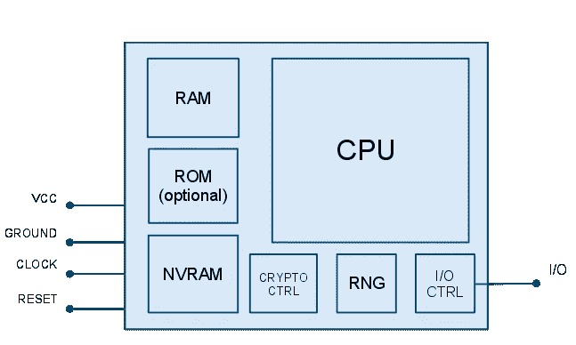
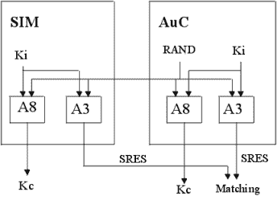

# 新款 Apple Watch 和 eSIM 的未来

> 原文：<https://medium.com/hackernoon/apple-watch-e-sim-b8cc3a2bb841>

9 月 12 日的活动是关于新 iPhones 的。尽管如此，[苹果](https://hackernoon.com/tagged/apple)在他们的产品线中引入了一些其他的重大更新。其中之一是支持蜂窝功能的 Apple Watch Series 3。

拥有一块手表、一部手机和一个可以在手腕上无限播放歌曲的 iPod 确实令人印象深刻，然而大多数评论都忽略了一个重要的细节。Apple Watch Series 3 可以成为电信行业电子 SIM (eSIM)的驱动者。首批 eSIM 设备之一——三星 Gear S3，即使在上市近一年后，[也仅在美国、韩国和新加坡支持 LTE](https://en.wikipedia.org/wiki/Samsung_Gear_S3)。苹果宣布[在 10 个国家支持 Apple Watch Series 3 的 LTE](https://www.apple.com/watch/cellular/)，2018 年将有更多国家跟进。这是移动领域 eSIM 时代的开始。我花了 9 年时间为 SIM 卡开发软件,我可能会有偏见，但我真的相信——这真的很了不起。

## SIM 简介

*披露:这一章有很多技术细节。如果你对无 SIM 卡 iPhones 的未来感到好奇，直接跳到下一部吧。*

那么，SIM 卡到底是什么，为什么我们仍然有 SIM 卡，占据了我们 iphone 的空间，而苹果正在移除迷你插孔以增加我们 iphone 的空间？

很多人认为 SIM 只是一个简单的存储卡，就像 microSD 一样，里面有你的订阅数据。然而，它是一个微型和非常安全的计算机，有 CPU，RAM，可选 ROM，NVRAM(就像计算机中的硬盘驱动器)。它有操作系统，文件系统，甚至应用程序经常运行在(drumroll…) Java 上！(嗯，javacard，完全说实话，不过还是 Java 的子集)。以下是典型的 SIM 卡架构:

您的电话套餐由几个重要部分组成。

*   一对 IMSI 和 Ki-id 以及一个密钥，用于在网络中进行标识和认证。该数据在卡个性化过程中存储在工厂中，只有您的运营商认证中心(AuC)知道该密钥。
*   OTA(空中)键。OTA —是运营商使用一系列加密短信远程更新 SIM 卡数据的方式。OTA 是可选的，但现在非常普遍。
*   还有许多与网络相关的文件，例如哪些网络在哪些国家有优先权，哪些网络被阻止，应该使用什么 iSMS 网关等等。基本上很多设置文件。

所有这些被称为*电子配置文件*的组件应该驻留在一个非常安全的芯片上。现代 SIM 卡甚至可以抵御使用电子显微镜读取其内容的攻击。

以下是网络认证和会话生成密钥过程的示例。

`RAND` -在运营商侧生成的随机序列
`A8`和`A3` -分别用于认证和会话密钥生成的加密算法
`Kc` -会话密钥
`SRES`(签名响应)-认证响应

## SIM 卡的未来

电信标准行业总体上是一个非常缓慢的行业。例如，MicroSIM (3FF)标准是在 1998 年提出的和 2003 年标准化的！又过了 7 年，这一标准才被苹果公司在其第一款 iPad 中采用。
eSIM 标准[于 2013 年推出](https://www.gsma.com/iot/wp-content/uploads/2014/01/1.-GSMA-Embedded-SIM-Remote-Provisioning-Architecture-Version-1.1.pdf)，但它不是目前在大众市场上使用的标准。首款支持 eSIM 的大众市场设备三星 Gear S3 于 2016 年底推出。而 Apple Watch 可以在运营商中推广这个标准。

要将描述文件安装到 Apple Watch eSIM，用户需要使用 iPhone。iPhone 将下载加密形式的网络运营商档案，将其切割成小块，并传送到 Apple Watch。Apple Watch 会将这个配置文件存储在调制解调器芯片的安全部分。

看起来很快(很有可能是明年)我们就会看到一部带有 eSIM 的 iPhone。我们将能够通过苹果的应用程序商店或特殊应用程序来改变我们的网络运营商。是的，苹果有可能在其 App Store 类别列表中引入“移动计划”！这可以从根本上改变我们使用移动计划的方式。您将不再需要去移动运营商商店订购或更改您的移动计划。在应用程序中点击几下，新的 SIM 卡就可以在您的手机上使用了。根据新版本的[远程 SIM 卡供应规范](https://www.gsma.com/rsp/wp-content/uploads/docs_new/SGP.22_v1.1-Technical_Specification.pdf)，您的手机将能够存储多个移动计划，并提供一种在计划之间切换的简单方法。如果你在国外旅行，这可能会特别方便。

公平地说，已经有很多 Android 智能手机支持 eSIM 硬件。从技术上来说，英特尔的 XMMTM 7260 和 XMM 7360 调制解调器以及高通骁龙 835 能够托管 eSIM。

为了安装 eSIM 配置文件，智能手机应安装本地配置文件助理(LPA)应用程序。在 iPhone 中，LPA 将由苹果公司提供。苹果不允许开发者使用 SIM 卡，而且他们将来也不可能这么做。但是很多 Android 设备都有一个 API 来发送命令到他们的 SIM 卡。这意味着在不久的将来，移动运营商可以开发出适用于 Android 手机的 LPA。启动这个过程不需要谷歌做额外的工作。

这里的问题是:谁会更快地在小手机上推出第一款功能齐全的 eSIM 苹果在下一代 iPhone 上，还是各种移动运营商在 Android 上。