# 苹果 WWDC 2017 年学生奖学金——从梦想到现实

> 原文：<https://medium.com/hackernoon/apple-wwdc-2017-from-dream-to-reality-6e536c4b5df7>

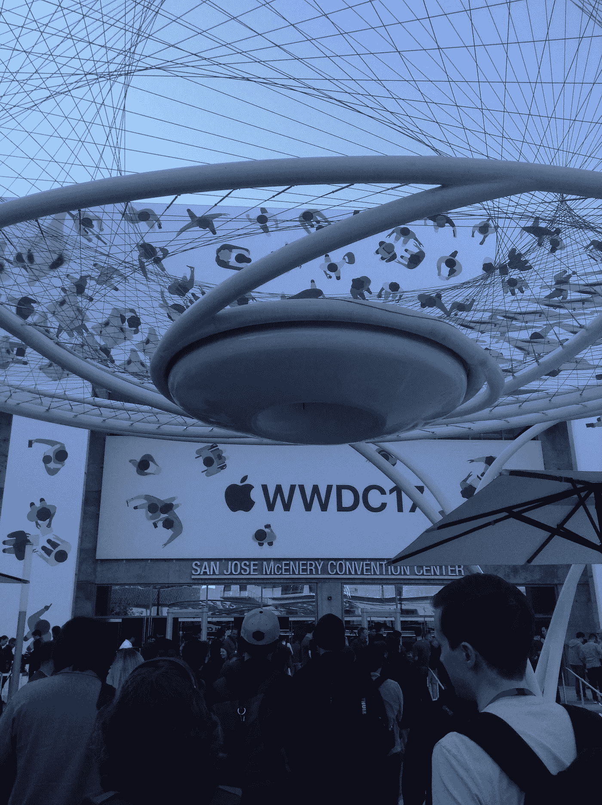

First day at WWDC

这是我如何获得学生学者奖的故事，以及我在 Dub Dub 周的经历，以及对明年任何人的一些建议。

如果有人说梦想不会真正实现，那么我可以证明它们会实现。

获得奖学金很难，但一个人应该继续努力。我被 WWDC15 和 WWDC16 拒绝了，现在我知道我为什么被拒绝了。从错误中学习。苹果喜欢好的、创新的项目，这些项目简单、容易上瘾、有目的，最重要的是它们应该好看。

今年一半的学生不到 18 岁。所以如果你认为你做不到？你应该重新考虑并申请。

去 https://developer.apple.com/wwdc/scholarships/[看看](https://developer.apple.com/wwdc/scholarships/)(明年)

同样为了获得灵感和了解苹果今年选择了什么样的应用程序:查看 https://github.com/wwdc/2017 的[，也可以在 Youtube**上搜索。**](https://github.com/wwdc/2017)

我创造了 [Happoji](https://github.com/Aviral190694/WWDC-2017-Application-Selected-Happoji) 这是一个可爱的表情符号游戏，简单却令人上瘾。游戏 [Happoji](https://github.com/Aviral190694/WWDC-2017-Application-Selected-Happoji) 的目标是点击快乐表情符号，给出积极的分数，同时防止不点击悲伤表情符号，因为它们给出消极的分数。这个游戏的概念是寻找周围的积极因素。

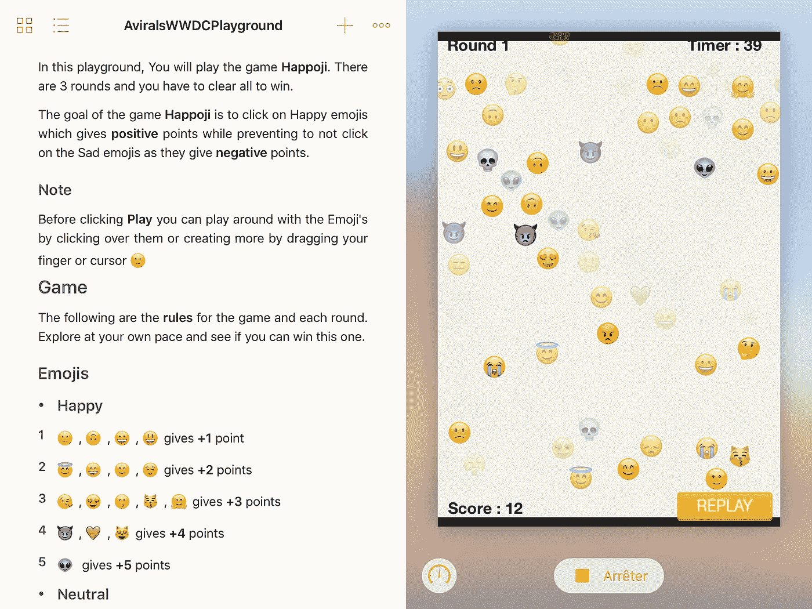

我还开源了它，因为我从其他项目中学到了很多:[https://github . com/aviral 190694/WWDC-2017-应用程序选择-Happoji](https://github.com/Aviral190694/WWDC-2017-Application-Selected-Happoji)

拿到奖学金后要做的几件事:

1.  确保更新你的简历。人们确实会检查；)
2.  跟着 [WWDCScholars](https://medium.com/u/bbbafe95eaad?source=post_page-----6e536c4b5df7--------------------------------) 努力寻找其他学者。我们有一个 Slack，Telegram，[脸书](https://hackernoon.com/tagged/facebook)和许多其他团体，他们帮了很大的忙，有时:D 也非常有趣(我记得我们都在讨论我们今年会得到什么，还有那些辩论。我们今年终于有了苹果电视，电报上的 Jony Ive 贴纸也超级棒！)
3.  关注 [@EEhare](https://twitter.com/EEhare) 。她负责我们的奖学金项目，她帮了很多忙，很棒。她会回复你的推文，帮助你解决任何问题。也是 WWDC 邮件团队努力工作的结果。他们回复得很快，会帮你解决一切问题。
4.  下载所有与 WWDC 相关的应用程序。我们有 WWDC 官方应用。WWDC 的政党(最重要的)。我们还有 wwdc.family 应用程序
5.  正如我提到的 WWDC 党的应用程序。留意周围所有的聚会和其他聚会。一定要去他们那里学习，并获得精美的礼品和食物+饮料！

我得到了奖学金和旅行补助(125 名学生得到了)。你不会相信，但苹果公司预先支付了我的机票，整个旅程只花了我 200 美元。

给印度学生和感染 ESTA 病毒的人。请认真对待你的美国签证身份。今年有一名学生被拒，其中两名印度学生在第一次被拒后幸运地拿到了签证。确保带好每一份文件，提前为签证面试做好准备，否则你会像学者 Harshit 一样在 Twitter 上获得热门话题！(我希望拉胡尔和哈什特正在读这篇文章。)

快进到我的第一次飞行。是的，第一趟去美国的航班。阿联酋航空很酷。到达酒店或宿舍后，确保适当休息。

**第 0 天:6 月 4 日——徽章领取和定位**

WWDC 正式开始于 5 号，但是你可以在 4 号拿到你的徽章和夹克。早点去，因为队伍很长，但是所有的等待都是值得的。把你的配音徽章拿在手上是一种很棒的感觉。

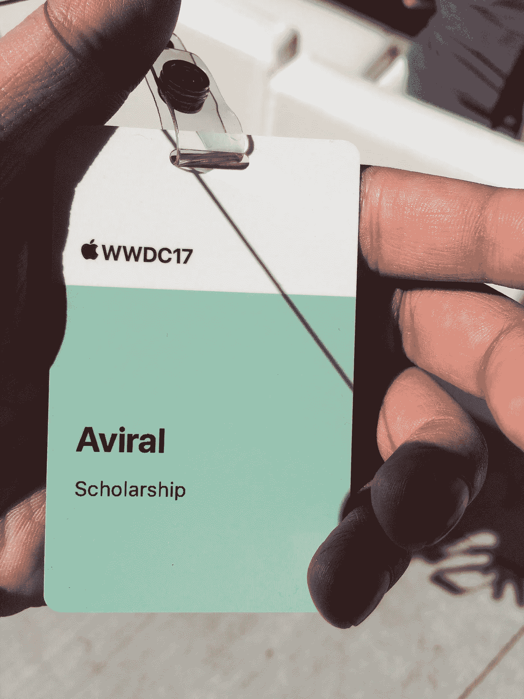

对于学者来说，苹果公司有一个特殊的迎新日，这是 T4 最好的一天。我见到了蒂姆·库克和埃丝特·海尔！

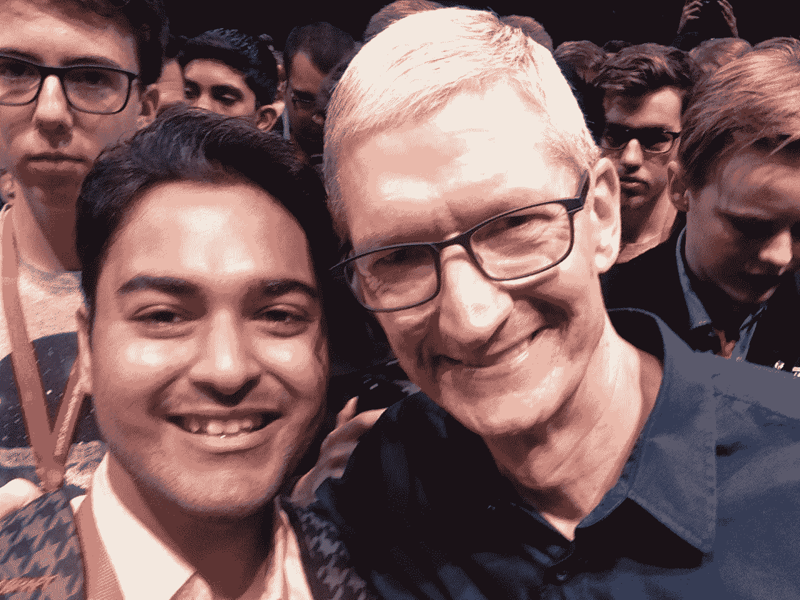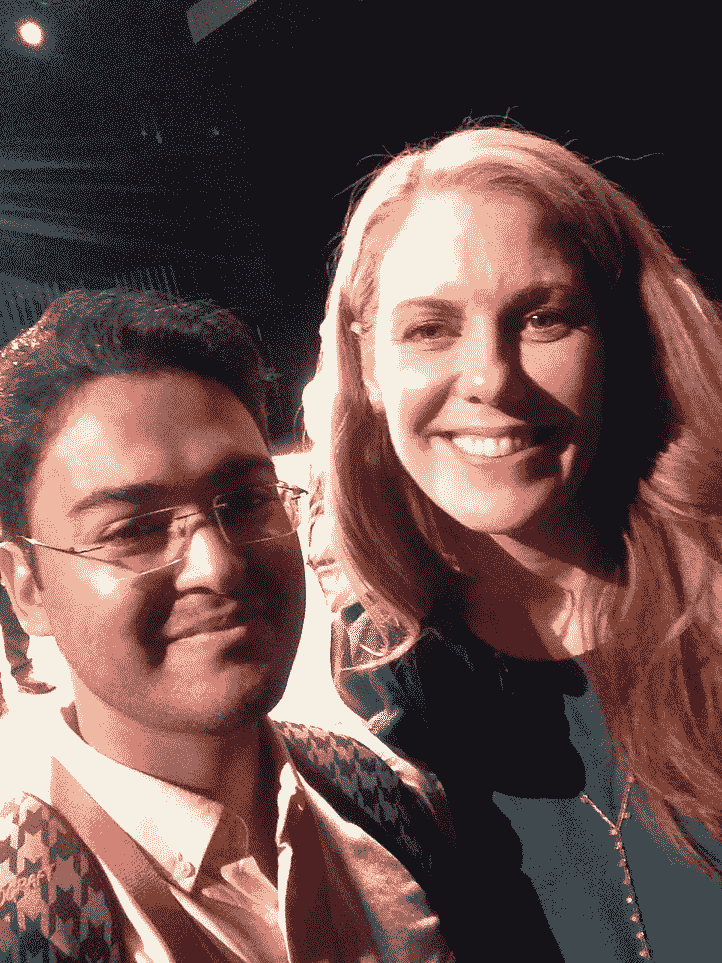

在迎新会上，苹果很少有小型会议。我们在 Apple pencil 上进行了一次很棒的会话。关于苹果如何制造它的简介，它的硬件和他们面临的问题，他们还告诉我们一个学生如何能充分利用 WWDC，我稍后也会指出这一点。

> Eshter Hare 开始介绍情况，随后是 Tim isted、Assana Fard 和团队。阿萨纳提到的一句话是:“如果很容易，那你就做错了”，我也照着这句话做了

你还有一张集体照，蒂姆·库克会神奇地出现在中间，所以如果你想要他的签名，请确保你的手机充满电，相机准备好，还有笔，另外你会遇到很多苹果高级工程师，他们会和你交谈，你可以问他们任何你想问的问题。他们是如此的谦逊，拥有丰富的知识(确保与那里的许多人交谈，并尝试获得 Twitter 账号或电子邮件)

此外，随着迎新日的结束，你会结识其他学者，所以尽量少和他们在一起，你也会从苹果公司得到一份好东西。(我们有苹果电视)

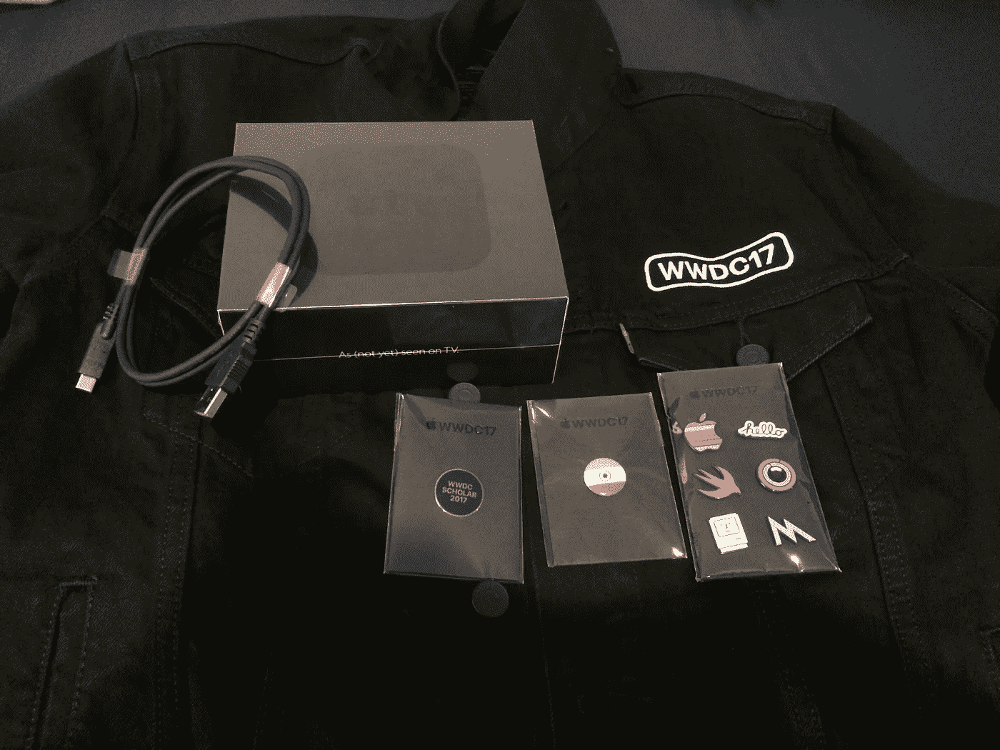

Apple Tv with WWDC jacket which one gets after the Badge!

WWDC 5 天！我会总结所有的日子，这样就不会变得更无聊。

WWDC 从基调开始。今年，我们这些学者为我们保留了座位，我们得到了皇家入场券！Keynote 很棒，发布了这么多公告。

我们还听到米歇尔·奥巴马也一定要参加午餐时间的会议。他们启发了我！

每天我们都有会议和实验室，像午餐时间会议和收集别针这样的填充活动是一件大事。每天都有来自不同公司的不同聚会，比如 MapBox、Firebase、Github 等等。

**谈论课程**:(对学生而言)不要太专注于参加课程。您可以稍后观看，因为它们将在网上提供，如果您非常感兴趣或无事可做，请参加它们。查看 https://github.com/ohoachuck/wwdc-downloader轻松下载 WWDC17 视频。

**实验室**:尽可能多地参加实验室。去实验室，即使你没有太多的线索。与周围的人交谈，你肯定会学到很多东西。

我想给出的一个一般性建议是。试着带着你商店里或半建成的应用程序去 WWDC，这样你就可以向人们展示它并获得反馈。如果你身上有东西，每个人都会更欣赏你。请务必参加基于预约的用户界面实验室和可访问性实验室。如何预约？在早上 7 点准备好注册，不要填写任何表格，尽快点击提交，因为所有的约会将在早上 7:01 完成。所以要快。

我去了**用户界面实验室**和**无障碍实验室**，他们让我大开眼界。我对 IPhone 的辅助功能一无所知，从这些功能中学习是一种享受。用户界面实验室棒极了。我个人想在 UX 建一座航母。我们开了 30 分钟的会，我觉得几秒钟就结束了。我把我的会议分成两半。我让这位高管在 15 分钟内告诉我这款应用的情况，然后我谈到了设计方法，以及思考和设计一款应用的正确方式。从那次一对一的会议中获得的学习和经验多少改变了我现在看待应用的方式，以及如何对待一个想法。

也请去应用商店和营销实验室(由于混乱，我错过了。你不需要为他们预约，但是如果你预约会更好。我仍然诅咒自己错过了他们:/)

**各位学者:)**

看起来 WWDC 是关于会议、实验室和学习苹果的。**否**。这是你可以坐在家里做的事情。和尽可能多的学者交谈。学习和倾听他们不可思议的故事。他们面对的是什么以及他们是如何到达那里的。他们在研究什么新东西！这也适用于每个人。和大会上的每个人交谈。WWDC 就是要建立联系，所以一定要走出你的舒适区，尽可能多地与人交谈，并确保联系。试着给**一些你简历的硬拷贝**，你可以给那些有兴趣给乔布斯和**名片和苹果钱包卡**(当你让别人用 IPhone 扫描你的卡 **)** 的人。

我遇到了很多同行学者，从每个人身上我学到了很多东西。与来自不同国家的人交谈是一种经历，我仍然与他们中的许多人保持联系。试着在脸书、推特、Instagram、Snapchat 和任何你可以的地方添加对方。我们还在 WWDC 应用程序中获得了一张官方照片。我还是很怀念很多学者的:/

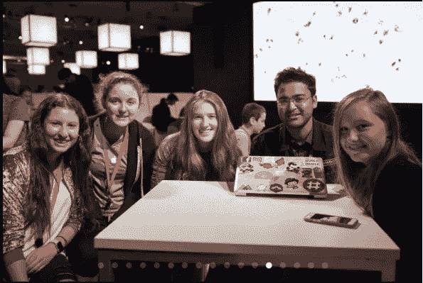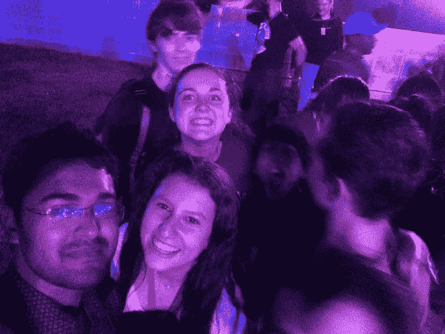

收集大头针和填充物(WWDC 日结束后) :

WWDC 今年有一件特别的事情。每个人都喜欢收集从学生到 20 多岁的开发人员的徽章。每个人都在寻找它们，我有很多关于别针的故事。从做回旋镖到绕着中心跑来跑去！苹果员工今年错过了这些徽章。它们只是给与会者看的，他们仍然对此感到难过:p

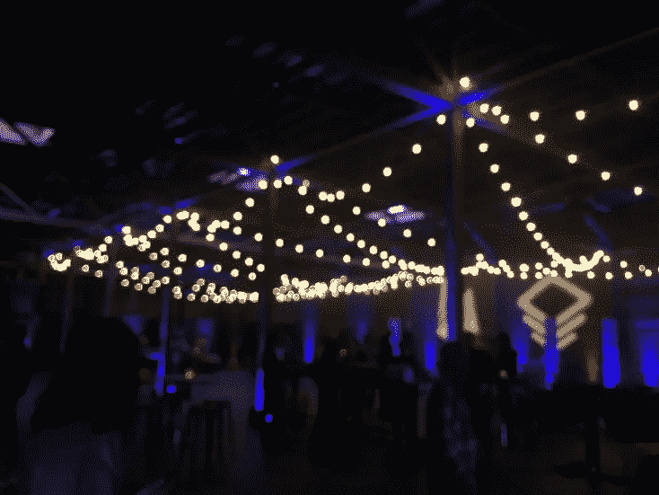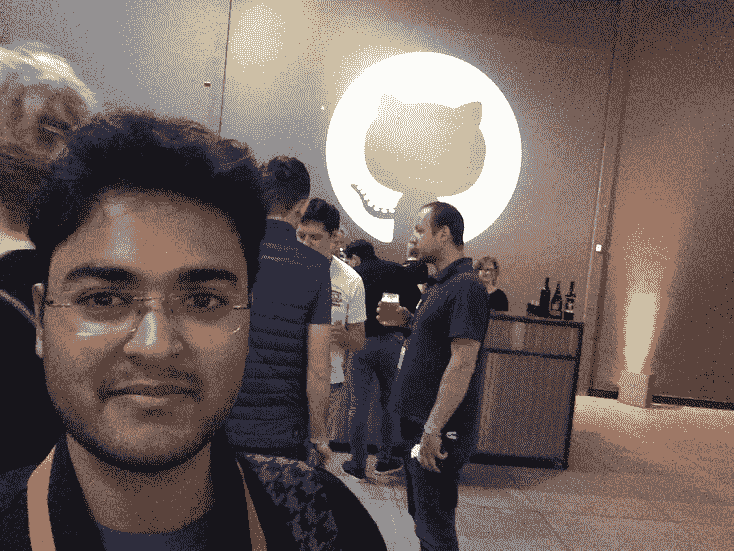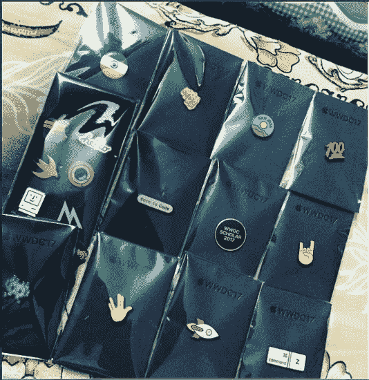

Parties and WWDC Pins. I still miss 3 of them!

每天都有很多聚会。确保向他们注册(使用 Parties 应用程序)。他们是伟大的，因为你遇到了这么多的开发者，你有游戏和饮料和独家食品+礼品。

也试着去 AltConf(我错过了),那里也不错，有很棒的开发者和会议。许多学者去了那里，并得到了大量的赃物，其中包括一个坐立不安的旋转以及:D

**WWDC 痛击**

一个字！哇哦。太棒了。美味的食物。令人惊叹的景色和天气。掉出男孩和光环。每个人都跳舞。玩有趣的游戏，享受这一天。这让每个人都充满了喜悦，我深深珍惜那些时刻。你应该看看下面的几个视频就有感觉了。

**WWDC 音乐**

WWDC 的音乐很棒。苹果挑选持续播放的好歌。我们很少有大学者列出歌曲清单并分享。可以在这里获得歌单:感谢[@ ishanderdeveloper](https://twitter.com/ishaandeveloper)[**https://play . Spotify . com/user/ishaanprasad/playlist/3n ty 2 gpohfslpcc 7 rzdlzx？play = true&UTM _ source = open . Spotify . com&UTM _ medium = open**](https://play.spotify.com/user/ishaanprasad/playlist/3nTy2gPOhfslPcc7RzdLZx?play=true&utm_source=open.spotify.com&utm_medium=open)

或者如果你不在 Spotify 上！

[**https://docs . Google . com/spreadsheets/d/1 dunmyb _ RC 8 WM 7 F2 ntloypv-rbwjtkeqkn 8 arqfqloiw/edit？usp =分享**](https://docs.google.com/spreadsheets/d/1dUMNYB_rc8wM7F2NtLOypv-RbWjtKeqKN8arqfQlOiw/edit?usp=sharing)

最后我会像 WWDC 那样结束。这是一次惊人的经历，每个学生都应该申请 WWDC18。如果你获得了学者奖，那么任何努力都是值得的。在结束超长帖子之前。给学者的最后几点建议。

**做学问的好处:**

1.  你会得到一个红色挂绳作为你的身份证，这是只给学者的。所以我们在人群中很突出，每个人都尊敬你。
2.  我们有一个特殊的奖学金休息室，它很舒适，只对学生开放。额外收获——许多苹果高管都会去奖学金休息室。一位苹果工程师兼演说家 **Bill Dudley** 在奖学金休息室给我们讲授神经网络，我也见到了 **John Geleynse** ，我觉得这是 WWDC 最美好的时刻。他告诉我们他的故事，他如何成为苹果公司的高级主管，以及他重写人类界面指南时的感受。他给了很多学者关于设计的反馈，他的建议确实起到了作用。

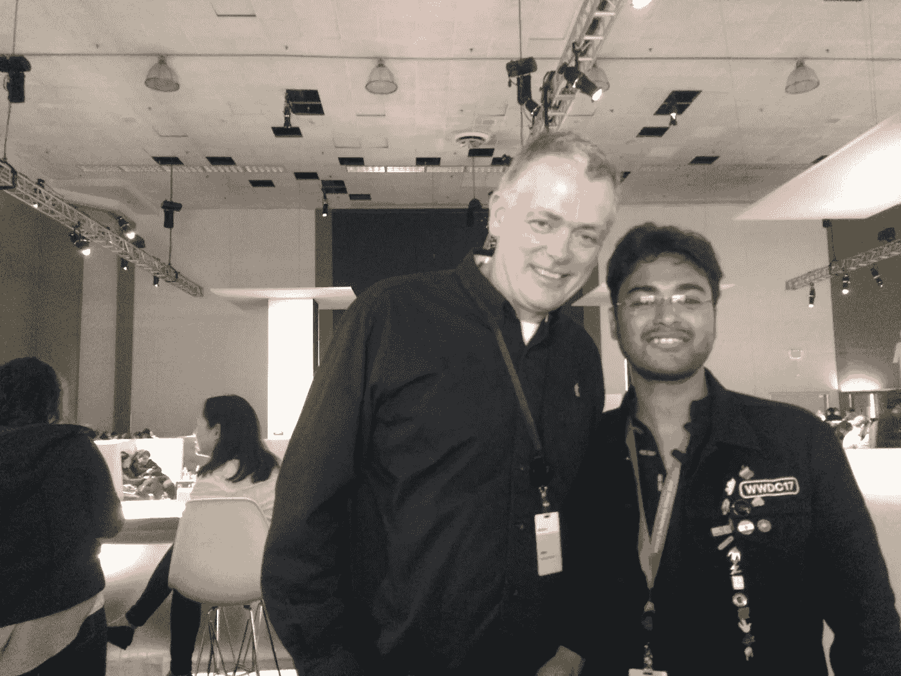

I was lucky to have a picture with John Geleysne

3.每个苹果的工程师都会和你好好说话，祝贺你拿了奖学金。作为一名学生，我们有机会提出疑问，不管这些疑问有多傻，他们都会和你坐在一起，教你。我带着愚蠢的问题去了很多实验室，但得出了一些很棒的观点，很多工程师教了我新东西。

**给学者的几点建议:**

*   正如我之前提到的。带着一个项目去 WWDC。它可以是任何东西，一个已发布的应用程序，或者只是一个你仍在做的兼职项目，但事先有一些东西会帮助你去实验室，你会感到更自信。
*   经常微笑，这有助于打破僵局。因为微笑，我得到了许多别针。
*   与人交谈并表现出关心。尽可能多与人交流，多倾听他们。你会得到很多好处和很多机会！
*   倾听每一个人，保持警惕。
*   WWDC 是一个繁忙的地方，有很多事情和其他事件一起发生。不要试图得到一切。一次只专注一件事，并把它做好。就像我上面提到的很多事情一样。不要试图做所有的事情。我错过了很多比赛，这没什么。保持水分，适当休息。
*   多去实验室而不是诊所。问任何你怀疑的问题，即使是愚蠢的问题。他们很乐意帮忙。你会像我一样学到一些东西。
*   最后也是最重要的。玩得开心。

如果你正在读这篇文章，我希望你喜欢这篇文章，也希望我的同事喜欢。我希望它能让你笑一笑。如果你喜欢它，表现出爱，如果你想编辑，如果有一些错误。让我知道:D

申请明年。平所有的学者求助。在苹果论坛上提出疑问，尽你所能寻求帮助。祝 WWDC18 好运，我想念 WWDC17，我会永远珍惜在那里度过的时光。

感谢苹果和所有人让这个梦想成真:)。感谢我的老板 Vishal Bhargava 这些年来对我的帮助！

> [黑客中午](http://bit.ly/Hackernoon)是黑客如何开始他们的下午。我们是 [@AMI](http://bit.ly/atAMIatAMI) 家庭的一员。我们现在[接受投稿](http://bit.ly/hackernoonsubmission)并乐意[讨论广告&赞助](mailto:partners@amipublications.com)机会。
> 
> 如果你喜欢这个故事，我们推荐你阅读我们的[最新科技故事](http://bit.ly/hackernoonlatestt)和[趋势科技故事](https://hackernoon.com/trending)。直到下一次，不要把世界的现实想当然！

