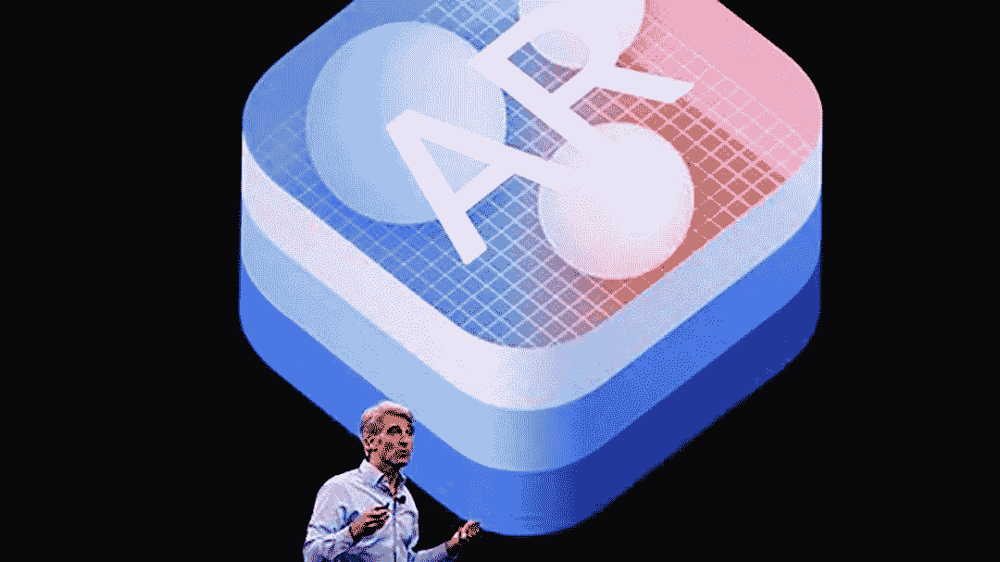
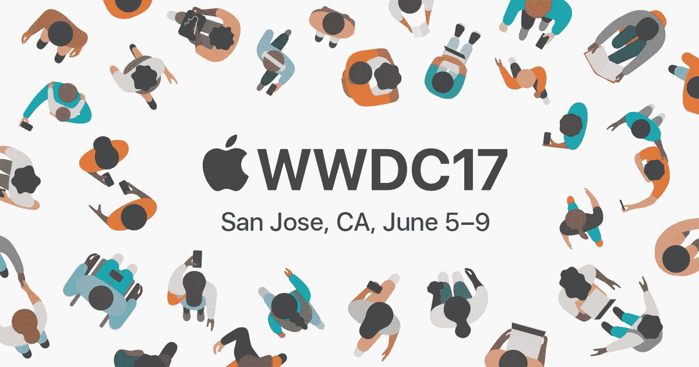
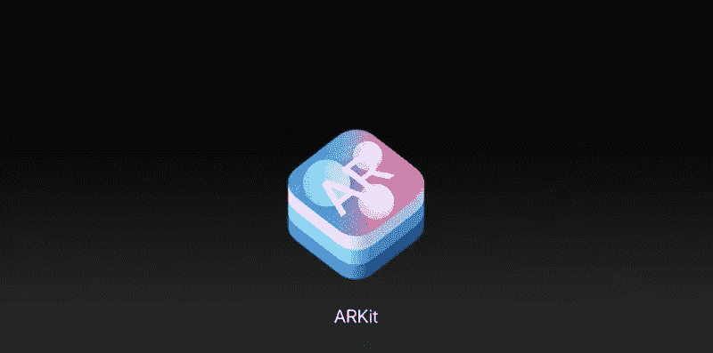
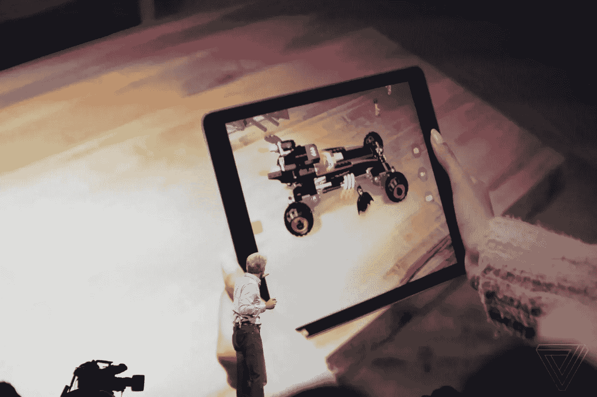
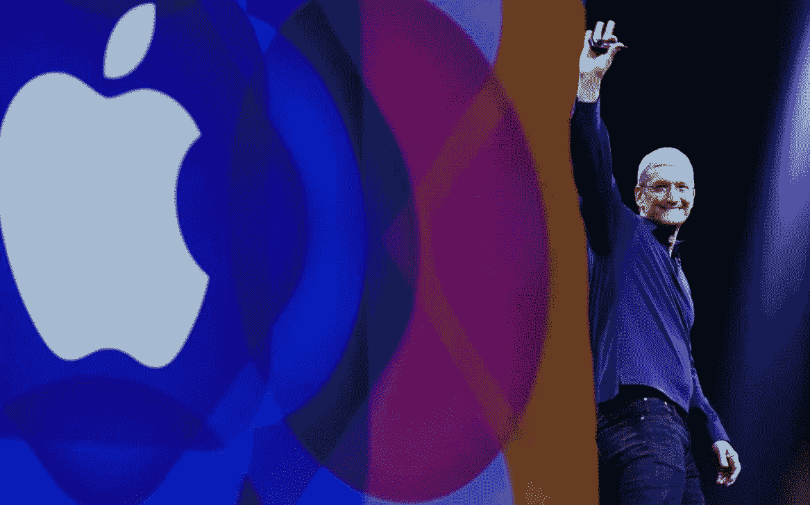

# 苹果令人失望的 VR 公告

> 原文：<https://medium.com/hackernoon/apples-disappointing-vr-announcement-b3b899ed8011>

Photo: Stephen Lam | Reuters

## 这还不是一个时代的爱情故事。

昨天在 WWDC，在 AR/VR 世界的数字热潮中，苹果宣布它首次进入“现实”空间。我的失望和绝望随之而来。

几个月来，我们一直被 2017 年秋季前后流传的谣言所戏弄。这个辉煌的时刻被认为是新 iPhone 的发布会，据报道，它要么被改造成 AR 设备，要么至少更好地利用现有的增强现实技术。我们得到了什么？宣布推出 ARKit，承诺“将 iOS 11 变成‘世界上最大的增强现实平台’。”"

这是苹果公司发布的众多声明之一。一个人说他们终于用一个家用豆荚赶上了谷歌和亚马逊，而另一个人则简单地表示一个新的操作系统即将出现。将该产品与所有这些其他公告混在一起，表明它可能不值得单独宣传，而且大多数“WWDC 宣布的十大事情”列表甚至没有提到 ARKit，直到新的 iMac 屏幕分辨率发布之后。似乎没有人对此次发布感到兴奋，似乎就连苹果公司也试图将其与其他产品混为一谈，以避免审查。

相比之下，这就像你最好的异地恋朋友几个月来告诉你他的新跑车——引擎盖上涂着红色的火焰，还有加热/冷却的真皮座椅。当你最终看到这辆车时，你会注意到它实际上是他的旧道奇霓虹自喷漆红色，前灯顶上的火焰贴纸，加热皮革座椅实际上只是内部粘有冰冷补丁的皮革座椅套。

The new ARKit preview at WWDC 2017 | Credit: [Adi Robertson](https://www.theverge.com/users/adirobertson)

# 为什么是失望而不是兴奋？

这一部分很简单:如果苹果有一款改变游戏规则的最先进的设备在几个月后发布，他们 ***就不会*** 今天宣布 ARKit。绝对不行。相反，他们会利用这几个月的时间，让已经夸张的炒作获得动力，并导致推出一款令人震惊的产品。一种人们会(如历史所表明的)排队等几天才能买到的产品。放弃这种商业策略/营销技巧的唯一原因是，苹果不会在 2017 年推出这样的设备。

# 与其说是池塘里的水花，不如说是儿童游泳池里的一只脚趾。

大多数关于昨天发布的文章都在称赞苹果对 VR 技术的新拥抱。现在，我很难做到这一点，因为他们的声明似乎不值得一个科技巨头。苹果的所有主要竞争对手都在几个月或几年前推出了产品——都带有用于 AR/VR 体验的物理设备。然而，苹果只能声称他们正在努力使 AR 和 Pokemon Go 体验更加真实，同时推出一个没有相应小工具的程序。

通常，我会欢迎对现有产品进行这种详细的重新评估，以推动整体改进——毕竟，苹果在这方面是出了名的擅长。然而，在这种情况下，苹果似乎终于向自己承认，他们不准备在今年推出实体消费产品，但也意识到他们不能等到 2018 年才能最终加入 AR/VR 领域。这一举动看起来近乎绝望。

我远非苹果内部人士，但识别他们过去的发布行为模式相当简单。苹果遵循一个公式，将主要的新品弹射到消费者空间，他们昨天在 WWDC 的所作所为实际上是在呼吁我们停止谈论 2017 年秋季的产品发布。

Apple chief executive Tim Cook at WWDC in 2015 | Credit: Bloomberg

# 我们还是需要苹果的 VR/AR。

幸运的话，他们将开始在增强、虚拟或混合现实空间中大步前进。在竞争激烈的技术世界里，2018 年是一段漫长的等待时间，但或许这段时间会花得很值。

苹果有几件事做得很好(如果昨天是个例子的话，至少直到最近)。营销、用户体验和竞争。如果我们的目标是将这种类型的技术推向未来，这些都是 VR 和 AR 所需要的——尤其是竞争，因为这是推动人们追求更好发明的动力。由于苹果因在其他公司推出类似产品很久之后才推出“更好”的产品而闻名，这种延长的延迟可能表明他们正在利用时间来完善他们的设备。

与此同时，我没有与 ARKit 合作过，我确实认为这可能会在 AR 世界中有一个好位置，所以我要去探索苹果尚未提供的唯一选项。

> [黑客中午](http://bit.ly/Hackernoon)是黑客如何开始他们的下午。我们是 [@AMI](http://bit.ly/atAMIatAMI) 家庭的一员。我们现在[接受投稿](http://bit.ly/hackernoonsubmission)，并乐意[讨论广告&赞助](mailto:partners@amipublications.com)机会。
> 
> 如果你喜欢这个故事，我们推荐你阅读我们的[最新科技故事](http://bit.ly/hackernoonlatestt)和[趋势科技故事](https://hackernoon.com/trending)。直到下一次，不要把世界的现实想当然！

