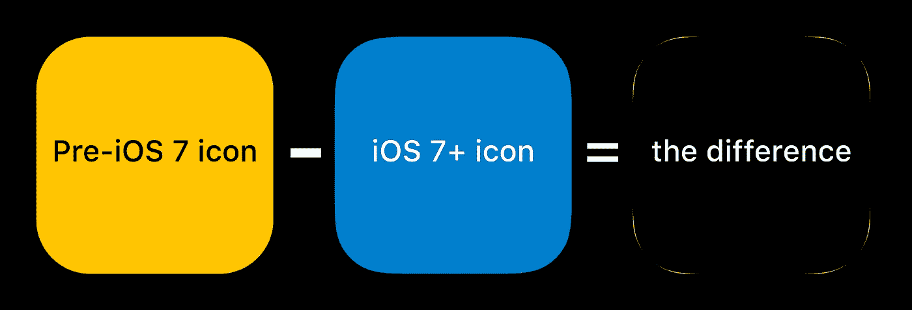
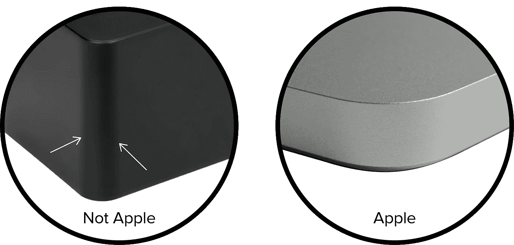
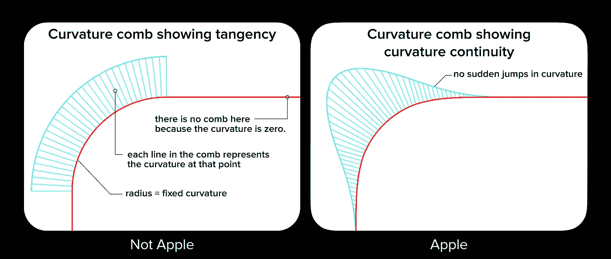

# 苹果的图标有这样的形状是有原因的

> 原文：<https://medium.com/hackernoon/apples-icons-have-that-shape-for-a-very-good-reason-720d4e7c8a14>

如果你没有沉浸在 [iOS](https://hackernoon.com/tagged/ios) 界面[设计](https://hackernoon.com/tagged/design)中，你可能会看着苹果的图标，认为它们只是一个圆形的正方形或‘round rect’。如果你一直在设计图标，你知道它们是不同的东西，可能听说过使用的单词 [squircle](https://applypixels.com/the-hunt-for-the-squircle/) (正方形和圆形的数学中间体)。如果你是一名工业设计师，你会认为这是他们硬件产品的核心特征。

自 iOS 7 以来，应用程序图标从圆形正方形变成了更复杂、更精致的东西。虽然每个人都知道苹果关注最微小的细节，但并不是每个人都看到了这个看似微小的变化背后的明显逻辑。如果你花时间在 Autodesk 的 Alias Studio surfacing 软件(苹果使用的软件)中调整曲线，你马上就会明白为什么了。答案是一致性。苹果公司在硬件和软件之间创造了设计一致性。

# 苹果的图标不是圆角矩形，因为他们的硬件产品不是。

苹果产品被描述为简约，但“简约”不应与“简单”混淆。他们在硬件产品上的表面功夫一点也不简单。除非工业设计师朋友指出，一般苹果产品所有者可能不会意识到这一点。

苹果实体产品的一个“秘密”是，它们避免相切(半径与直线在一个点相遇)，并用所谓的**曲率连续性**来加工它们的表面。一旦你知道如何在产品上发现它，你很可能开始在你周围看到它(或者更可能是缺乏它)。

# **良好表面处理的观察员指南。**

这里有两个产品是基本的矩形盒子，边缘是圆形的(左边的也有一些令人不快的起草墙，但那是另一篇关于如何成为硬件设计势利者的文章)。看看主表面上的圆形边缘的起点和终点。看到高光的急剧变化了吗？那是相切的结果。

**现在对比苹果。**

右边的 MacBook Pro 也是一个由圆形曲面连接的两个直角表面的产品。看到高光有多软了吗？这不仅仅是因为表面处理是哑光的(是的，这很有帮助)。我知道我刚才说的是“圆的”,但当然它根本不是圆的。这是一个美丽、甜美、性感的曲面，曲率不断变化，这也是苹果产品让我喜欢它们的原因之一。

**它们为什么不同？**

看看下面的曲率梳的图像(一种可视化曲率的方法)。梳子的每条线代表曲线上某一点的曲率。在左边，曲率瞬间从零变为半径值。曲率突变=突然高亮。

苹果公司的工业设计师正在设计亮点。表格如下。

在右边你可以看到曲率连续性的样子。曲率梳过渡本身是一条曲线，从零曲率开始。曲率不会突然中断，因此高光更加平滑。这种曲率上的差异很难在图标中发现，但重要的是现在图标和硬件是同一种设计语言的一部分。

苹果没有这方面的专利。任何公司都可以让他们的表面达到这种质量水平。那么他们为什么不呢？公司以前有更多的借口。过去，工程 CAD 工具并不关心这类事情。或者工程师可能不擅长他们的 CAD 工具的那个模块。或者说曲面设计工具和工程工具没有很好的发挥在一起。或者它对底线的重要性没有被认识到。

**许多工业设计师将这种工艺运用到他们设计的非苹果产品中。许多人受到他们为之设计的公司的资源和承诺的限制**(也就是说，不总是设计师的错)。

如果你想更深入地挖掘，阅读一些真正技术性的表面处理材料，并发现实际上有两个层次的曲率连续性，请查看 Autodesk 的 Alias 工具上的[教程](https://knowledge.autodesk.com/support/alias-products/learn-explore/caas/CloudHelp/cloudhelp/2014/ENU/Alias/files/GUID-9DD73E22-A5EF-4952-BB84-2CEE2109993C-htm.html)(许多能够进行曲率连续表面处理的工具之一)。

我不得不以对苹果更多的赞美和感激来结束我的演讲。特别是对于那些高管(史蒂夫·乔布斯)来说，他们将美元的力量和对制造卓越的承诺放在每个设计师梦想实现的对细节的关注之后。而现在，因为一个图标的小小改变，这一切都更多的连接到了里面的软件。谢了。

想多谈谈产品和工业设计的交集？请通过斯坦顿詹姆斯 Gmail com 或 LinkedIn 联系我

