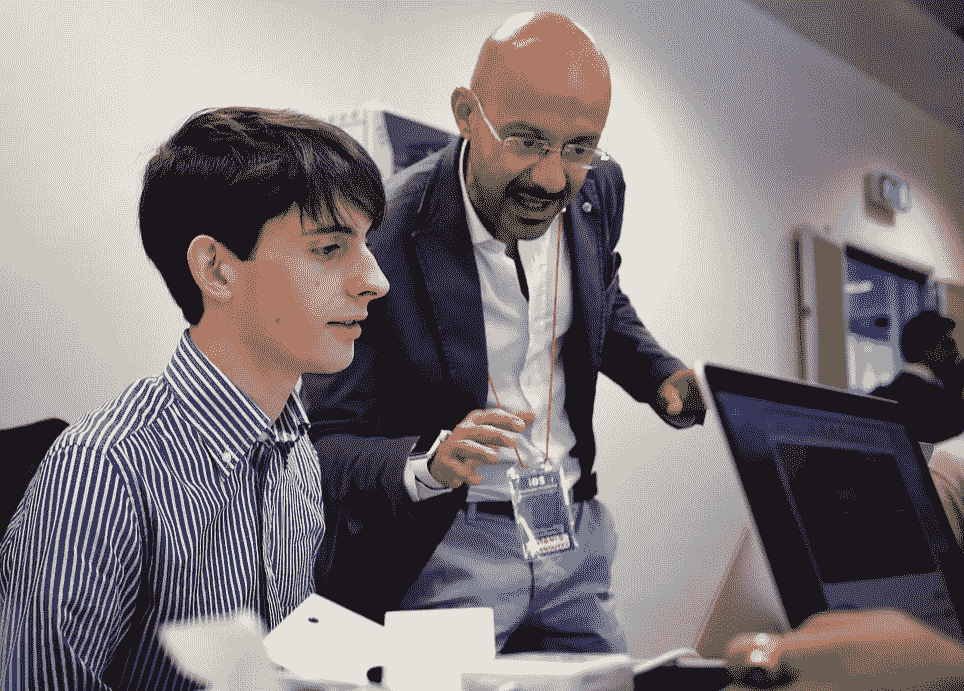

# 苹果在世界各地的 iOS 应用开发者学院

> 原文：<https://medium.com/hackernoon/apples-ios-app-developer-academies-around-the-world-60748cbe9465>

## 你需要知道的。

2016 年对于苹果 iOS 应用开发者学院来说是重要的一年，因为它在意大利、巴西、印度和印度尼西亚设立了中心，在世界各地扩张。

苹果学院将提供专门的课程，帮助数千名未来的开发者成为苹果蓬勃发展的开发者社区的一部分。该公司还将与当地合作伙伴合作，开发培训机会，以补充苹果公司自己的课程，并为学生创造额外的机会。

苹果公司首席执行官蒂姆·库克 [在那不勒斯宣布了其有史以来第二个应用开发者学院——欧洲第一个——苹果公司希望将该项目推广到世界其他国家。](http://www.apple.com/pr/library/2016/01/21Apple-Opening-Europes-First-iOS-App-Development-Center-in-Italy.html)[那不勒斯的新应用学院已经开始运营](http://www.apple.com/newsroom/2016/10/apple-opens-first-ios-developer-academy-in-naples.html)，有 200 名学生来自意大利和其他欧洲国家，包括拉托维亚、德国和荷兰。

> App Store 的巨大成功是苹果在欧洲创造超过 140 万个就业岗位的驱动力之一，并为欧洲大陆所有年龄的人和所有规模的企业提供了无限的机会。

1。库克说:“欧洲是世界上一些最具创造力的开发者的家园，我们很高兴能够帮助意大利的下一代企业家获得成功所需的技能。”。

Apple’s iOS app development center in Naples, Italy (Photos by Apple)

2。 [**巴西**](http://venturebeat.com/2016/01/21/apple-opens-its-first-european-ios-app-development-center-second-globally-in-naples-italy/)——VentureBeat 写道:“该公司还有一个 iOS 应用开发中心——在巴西——尽管几乎没有信息表明该中心的确切位置或开设时间。”

3。 [**印度**](http://www.cnbc.com/2016/05/18/apple-opens-ios-developer-center-in-india-in-search-for-growth.html)**——“印度是世界上最具活力和创业精神的 iOS 开发社区之一，”库克宣布。“随着这个新设施在孟加拉鲁鲁的启用，我们将为开发人员提供工具，帮助他们为全球客户开发创新应用。”**

**4。 [**印度尼西亚**](http://www.embassyofindonesia.org/wordpress/?p=5373)——“苹果宣布了在印度尼西亚建立一个 iOS 应用开发中心的新承诺——印度尼西亚驻华盛顿大使馆 DC 在一份声明中写道——这个开发中心将是亚洲第一个此类开发中心。”**

************

> **[黑客中午](http://bit.ly/Hackernoon)是黑客如何开始他们的下午。我们是阿妹家庭的一员。我们现在[接受投稿](http://bit.ly/hackernoonsubmission)并乐意[讨论广告&赞助](mailto:partners@amipublications.com)的机会。**
> 
> **如果你喜欢这个故事，我们推荐你阅读我们的[最新科技故事](http://bit.ly/hackernoonlatestt)和[趋势科技故事](https://hackernoon.com/trending)。直到下一次，不要把世界的现实想当然！**

****