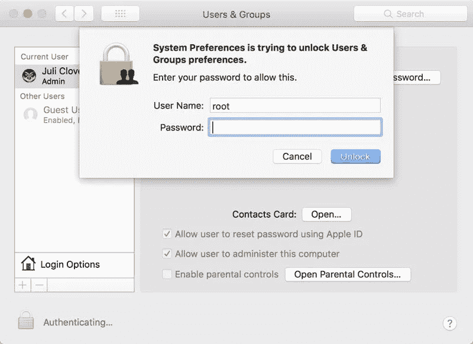

# 苹果最新的漏洞允许你只需用户名“root”就能登录任何 macOS High Sierra 账户

> 原文：<https://medium.com/hackernoon/apples-newest-bug-allows-you-to-sign-in-to-any-macos-high-sierra-account-with-just-the-username-de2913b04ca4>

这个漏洞是由勒米·埃尔金发现的，最初是在周二早上发布到 twitter 上的。要复制这个错误，只需导航到任何需要提升身份验证的提示符，将用户名替换为“root ”,同时将密码留空。然后反复点击解锁，直到它让你通过。

这允许你以超级用户的身份登录到任何运行 [macOS](https://hackernoon.com/tagged/macos) High Sierra 的设备，绕过当前所有的[安全](https://hackernoon.com/tagged/security)机制。

Entering “root” as the username and leaving the password blank gives you access after a few attempts

一个临时的解决办法是[使用密码](https://support.apple.com/en-us/HT204012)启用 root 超级用户，尽管这是一个权宜之计。预计苹果将很快发布一个热修复程序，为这个主要的安全漏洞提供补丁。

此外，您可以使用以下命令从终端更改 root 密码

`sudo passwd -u root`