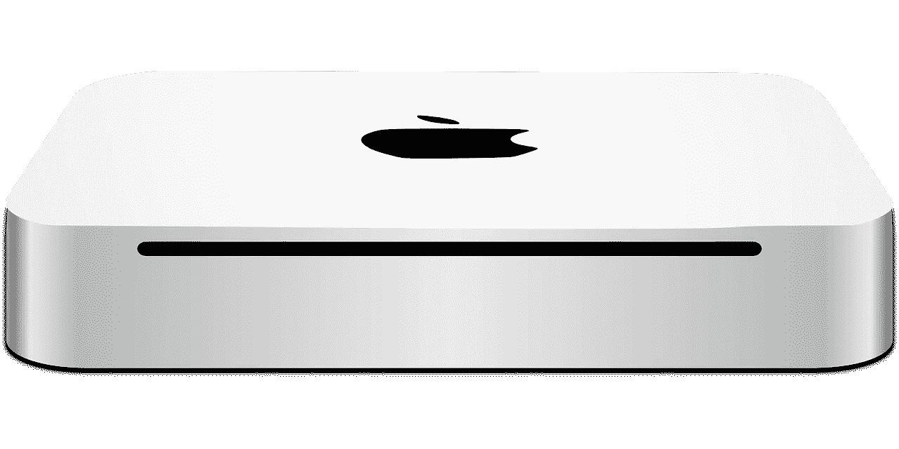
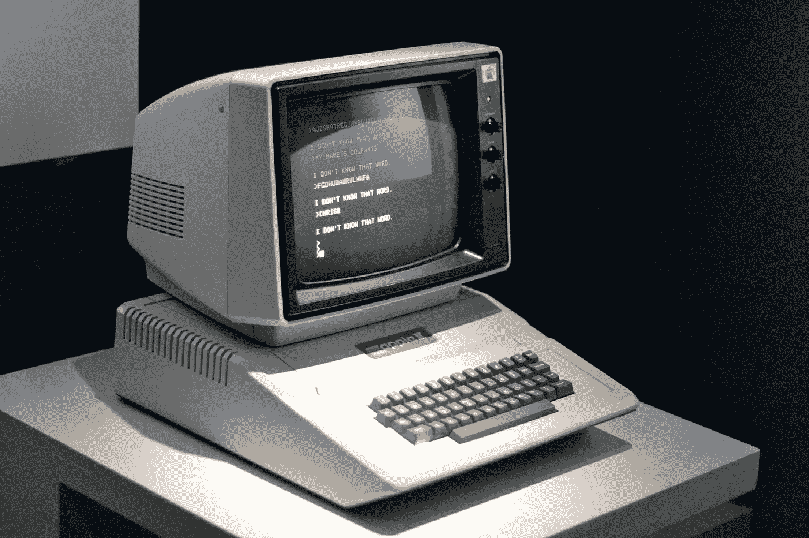
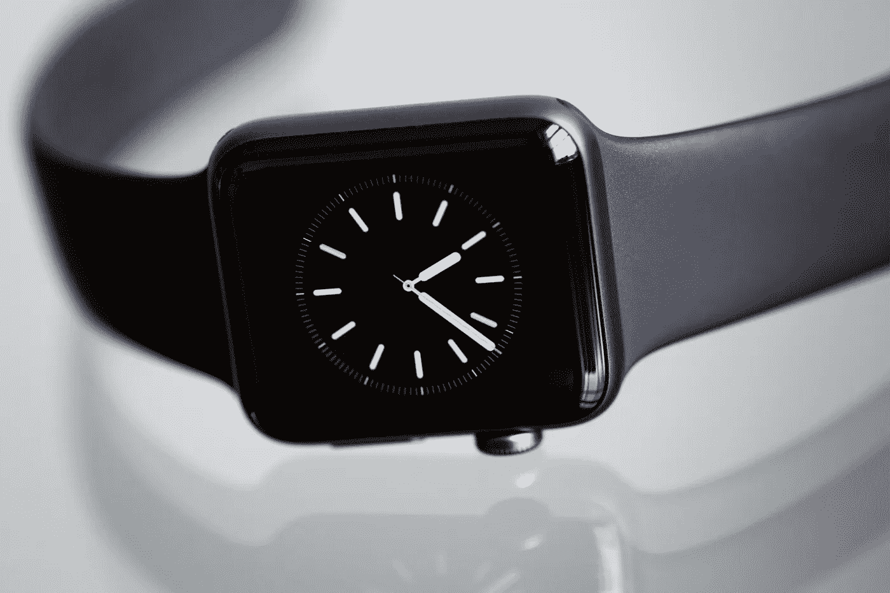
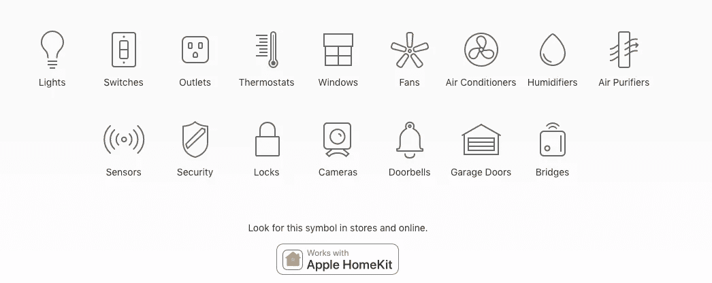

# 苹果的下一步棋？很明显。但是我们错过了。

> 原文：<https://medium.com/hackernoon/apples-next-move-it-s-obvious-but-we-re-missing-it-838024c7bfbf>

那是 1998 年，正如《好策略，坏策略》一书中所描述的，理查德·鲁梅尔特问史蒂夫·乔布斯，他将如何把 T2 的苹果公司从一个小众公司发展成为一家价值远远超过比尔·盖茨最近投资的 1 . 5 亿美元的公司。乔布斯最近回到了自己创立的公司，并成功扭转了局面。乔布斯让盖茨相信，投资苹果并让公司生存下去，将有助于微软解决与司法部之间的问题。盖茨投资了。乔布斯砍掉了 15 台台式电脑中的一台。他还减少了便携式设备的数量，专注于一台笔记本电脑。决定直接在网上销售给顾客。

Apple II By Marcin Wichary ([http://www.flickr.com/photos/mwichary/2151368358/](http://www.flickr.com/photos/mwichary/2151368358/)) [CC BY 2.0 ([http://creativecommons.org/licenses/by/2.0](http://creativecommons.org/licenses/by/2.0))], via Wikimedia Commons

这种专注让苹果削减了 80%的库存。公司又回到了游戏中。但是，以竞争对手的标准来看，苹果很小，市场份额不到 4%。战略家兼作家鲁梅尔特想知道乔布斯将如何推动公司前进；

> "**鲁梅尔特**:史蒂夫，苹果公司的这一转变令人印象深刻。但我们对个人电脑业务的所有了解都表明，苹果无法真正超越一个小的利基市场。网络效应太强了，无法颠覆 Wintel 标准。那么，从长远来看，你打算做些什么？策略是什么？”
> 
> 乔布斯:“我要等待下一件大事。”

## Homepod 是一个转移注意力的游戏吗？

在过去几天(2017 年 7 月)，苹果开始让客户在世界各地的商店测试其智能家居开发平台 Homekit。几个月前，苹果发布了其声控智能扬声器 Homepod，它与*一起播放音乐，就像音乐应该被聆听一样*，充当所有基于 Homekit 平台构建的应用程序的连接设备的中枢。一些联网设备制造商——菲利普斯、Nest、Lutron 等——已经在 Homekit 平台上开发了应用程序，你可以通过 Homepod、iPhone 或 Apple Watch 进行控制。

但在这一点上，这些都是“我也是”的东西。亚马逊、[谷歌](https://hackernoon.com/tagged/google)甚至三星([通过收购 SmartThings](https://www.recode.net/2014/8/14/11629890/internet-of-bling-samsung-buys-smartthings-for-200-million) )都有互联家庭中枢和开发者平台。在我看来，Homepod 作为音乐收听设备的定位偏离了我真正相信的苹果公司对联网家庭的规划。虽然 Homepod 是该战略的一个关键部分，但它不是这个难题的核心部分。

在进入我认为苹果的下一步行动之前，对于苹果传统上赚取大部分利润的平台/产品来说，趋势看起来并不太好。

1.  iPhone :苹果公司去年卖出了第十亿部[iPhone](https://www.apple.com/newsroom/2016/07/apple-celebrates-one-billion-iphones/)。虽然这是一个惊人的壮举，除非苹果公司打算重新尝试在新兴市场销售低价版本的 iPhone([还记得 iPhone 5C](https://www.theverge.com/2013/9/10/4714570/iphone-5c-release-date-specs-features-price-announcement) ！)，可以有把握地假设智能手机市场不是一个增长型市场。95%的美国人已经拥有一部手机，其中 77%拥有智能手机。尽管传言麻烦不断，但 iPhone 8 将售出数百万部，但这不是苹果获得下一个 500 亿美元收入的地方。
2.  **iTunes** :即使苹果音乐 *force 在你进入汽车时会自动播放*，Spotify 等流媒体服务已经蚕食了曾经由 iTunes 主导的市场。此外，虽然播客行业的增长得益于苹果比其他任何人都更早满足这一需求，但似乎越来越少的人期待他们的视频平台，有报道称，苹果的视频租赁份额已经从 2012 年的 50%以上下降到 20%至 35%。iTunes 不再像过去那样是占主导地位的音乐平台。
3.  **Macbooks** :随着全球个人电脑销量下滑——[2017 年在 Q2 售出 6110 万台，该行业下滑 4.3%，正处于连续 11 个季度出货量下降的 5 年低迷期](http://www.gartner.com/newsroom/id/3759964)——苹果正在采取行动，通过赠送一款 [Beats by Dre 耳机和合格购买](https://thenextweb.com/apple/2017/07/13/apples-giving-away-free-beats-headphones-on-mac-or-ipad-purchases/#.tnw_2Ih6uZWz)，来夺取大学生的市场份额。当你不得不扔进 300 美元的产品去卖 1000 美元的产品时，我会说生意不太好。
4.  **Apple Watch etc**:Apple Watch 的销售[数字几乎没有可核实的数据，2000 万台的销量估计(截至 2017 年 Q2 车展)表明，在推动该公司前进之前，市场还有很长的路要走。](http://fortune.com/2017/02/08/apple-watch-2016-sales/)

那么苹果的市场在哪里呢？Homekit 在苹果下一个数十亿美元的机会中扮演什么角色？我想是在电力市场。

## 能源使用案例。

Image Courtesy Apple [https://www.apple.com/ios/home/](https://www.apple.com/ios/home/)

快速浏览一下与 Homekit 兼容的产品，以及快速浏览一下上面的图片，表明苹果可能会将 Homekit 功能(此时)集中在**能源使用相关的用例**；调暗灯光、打开/关闭开关、降低/提高恒温器温度、控制空调等。即使是 Homekit 视频，也是以家中发生的一系列与能源相关的行为结束的。

能源用例是[联网家庭用例(麦肯锡)](http://www.mckinsey.com/spContent/connected_homes/index.html)中最引人注目的。互联家庭的其他两个用例，安全性和便利性，提供的机会比能源少，这个领域的大多数参与者很快就会发现这一点。亚马逊通过 Echo 专注于(并且*拥有)*便利用例，而[谷歌专注于 Home](https://madeby.google.com/home/) 并不十分明确(我将在后续的帖子中对此进行阐述)。能源使用案例最有意义，因为没有比在家庭能源领域建立品牌更能赢得消费者的心智和钱包的机会了。想想看，唯一比智能手机和我们的电脑(允许我们访问互联网)更重要的是用于为这些设备供电的电力！

## 有人知道吗？

因为我们从来都不知道苹果下一步会做什么，我会稍微策划一下，并建议**苹果的下一步将是设计一种家用电池，作为通过 Homepod 或 iPhone** 控制的家庭能源管理系统的一部分。这将使苹果能够在 T2 价值 1620 亿美元的住宅电力服务市场中占有一席之地。**是的，1620 亿美元**，这仅仅是美国一国。这就是为什么埃隆·马斯克/特斯拉正在全力开发电动汽车和家用电池。但是，如果我们回到本文开头的鲁梅尔特和乔布斯的故事，如果我们同意苹果的战略一直是“等待下一个大事件”，那么下一个大事件已经到来就不是什么难事了。它不是电动汽车，而是简单的电池。正如《金融时报》这篇精彩的[文章](https://www.ft.com/content/32c31874-610b-11e7-8814-0ac7eb84e5f1?mhq5j=e1)(付费墙)所建议的，对我们影响最大的技术是那些简单的技术。

苹果的道路实际上很简单，已经规划好了；

1.  以 100%可再生能源承诺全力投入可再生能源，并选择[领导应对气候变化的斗争](https://www.apple.com/environment/)。
2.  发展储存和优化利用可再生能源的能力。将这些功能扩展到您当前市场上的产品。*注:* *今年年初(2017)* [*苹果获得便携式设备固态电池专利*](https://www.google.com/patents/US9553468?dq=Apple%27s+granted+patent+9,197,096&hl=en&sa=X&ved=0ahUKEwju8vKFiIbVAhVGMGMKHeLrAAUQ6AEIKzAB) *。虽然这是针对 Apple Watch 等低功耗设备的，但如果该公司继续致力于固态高能电池，我不会感到惊讶。我不相信这些高能电池像一些人建议的那样是用于电动汽车的，而是用于家庭的。*
3.  开发能够通过蓝牙低能耗(ble)轻松同步所有设备的芯片，并优化电池使用。
4.  通过一款设计精美的产品将上述 1、2 和 3 扩展到您客户的家中，该产品实际上不会与市场上的其他参与者竞争，但会在一个用例中添加新功能；能量。
5.  通过控制平台和价值，像你以前做的那样(iPhone，iTunes)转移市场；为家庭提供动力的能源。

归根结底，通过专注于智能手机之外的下一件事，用令人愉悦的产品来抓住我们的心和思想。苹果已经磨砺了它的硬件，为我们打造令人愉悦的产品。苹果，有了 Homekit 和 Homepod，现在把目光转向了我们的家；苹果很快就会知道我们是如何使用能源的，因为所有这些数据都被 Homekit 平台捕获，因为它管理着其他公司制造的所有设备。苹果将采取平台和愉悦的方式，再次抓住*下一个大事件*。

那么，如何在市场中再次获胜呢？

*请分享、点赞、发微博。* [*使用我们的定制工具撰写你自己的博客文章*](http://www.harperjacobs.com/writeyourownpost/) *，并注册* [*Polymathic 每月简讯*](https://www.getrevue.co/profile/seyifabo?utm_campaign=Issue&utm_content=forwarded&utm_medium=email&utm_source=Seyi+Fabode)*——如果你已经读到这里，我敢打赌你会喜欢这两个。*