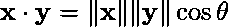
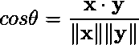
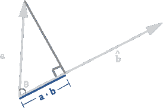
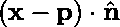
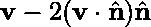
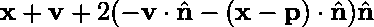
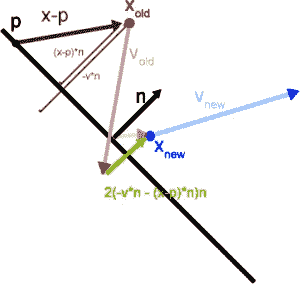
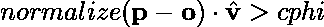

# 向量点积在游戏编程中的应用

> 原文：<https://medium.com/hackernoon/applications-of-the-vector-dot-product-for-game-programming-12443ac91f16>

这是我 5 年前写的，但从未在任何地方发布过。一个朋友的推文提醒我它在我的草稿中，我想它可能对某人有用。

点积是一个可以应用于两个等维向量的函数，有时被道德纤维较低的人称为标量或内积。通常，您会看到点积定义如下:

bold letters are vectors, ||‘s surrounding a vector means the magnitude or length of the vector, and 𝜃 (pronounced “theta”) is the angle between the two vectors.

看着吓人？换句话说，点积是两个向量之间的夹角的余弦乘以它们的长度。起初，它的用途似乎很有限，但实际上它会到处出现。让我们看几个:

# 测量方向

如果你仔细观察，你可能注意到的第一件事是，你可以通过一点重新排列得到两个向量之间角度的余弦值:

然后使用 *arccos* 函数(也称为 *cos^-1* )来获得角度，或者如果你想用你的 [CPU](https://hackernoon.com/tagged/cpu) 周期比[宜家](https://hackernoon.com/tagged/ikea)家具便宜的话，就测试典型角度的余弦值。如果两个向量 **x** 和 **y** 都是单位长度(我们通常通过在向量上方放置一个^符号来表示这一点，但是我在这里的段落中省略了^'s，因为 medium 不支持它)，那么我们不需要向量长度的除法或计算，并且可以节省平方根。如果我们更仔细地观察这个方程和余弦的性质，我们可以看到一些捷径:

*   由于将负数引入该等式的唯一方式是余弦函数，因此当且仅当向量指向彼此相距大于π/2 弧度(90 度)的方向时，点积的结果为负。简单来说:负的点积意味着向量指向不同的方向。
*   如果点积为零，则两个向量是正交的(垂直的)。
*   如果向量是单位长度，点积的结果是 1，则向量相等。

# 投影向量

假设我们想知道一个向量在某个方向上移动了多少。

示例用途包括计算角色在斜坡或墙壁方向上移动的速度，找出角色在重力方向上的速度，找出距离移动越过阈值还有多长时间，等等。

当至少一个向量是单位长度时，点积是非单位长度向量在归一化向量的轴上的投影长度(当它们都是单位长度时，它们都在彼此的方向上移动相同的量)。

一位读者指出，术语*归一化向量*(指的是单位长度指向某个向量相同方向的向量，一种称为归一化的操作)和*法线向量*(指的是垂直于表面局部平面的向量)可能会让向量数学新手感到困惑。这是一个不幸的命名冲突，但现在你知道了——它们是两回事。好的。让我们继续，因为我现在要提到另一个。

# 平面(又名墙/斜坡/三角形)

给定一个由单位法向量 **n** 和点 **p** 定义的平面，我们可以通过查看以下等式的结果是正、零还是负来找到向量 **x** 在平面的哪一侧:

positive indicates in front of the plane, negative behind, and zero indicates the point is coincident with the plane.

我们可能还想反射一个平面上的向量。假设我们在点 **x** 有一个质点，以速度 **v** 运动。我们通过检查**x+v***dt**是否与 **x** 在平面的相对侧来测试在时间片 *dt* 中是否会发生碰撞。一旦我们确认了一次碰撞(对我们来说，这将是一次弹性碰撞)，我们需要找出点质量的终点。假设平面是固定的(重量为无穷大),点质量将以相同的速度绕平面的法线反射。新速度由下式给出:*

**

*新位置由以下等式给出:*

**

*下图显示了上述关系:*

**

# *我能看看吗？*

*在我们的游戏中，我们经常想知道某个物体是否在某个观察者的视野中。给定一个在点 **p** 的观察者，一个在点 **o** 的物体，并假设该物体没有被遮挡(用一个或几个光线投射来测试)，用从观察者到该物体的归一化矢量取观察者观察方向 **v** 的点积。结果是它们之间角度的余弦值。测试观察者最大视角*CPI*的余弦值。*

**

# *后续步骤*

*这里有一些点积技巧，但还有更多发现。如果你有有用的技巧或解释，请发表评论。如果你感到有信心，也许你想冒险做下一个[叉积](https://en.wikipedia.org/wiki/Cross_product)？*

******

> *[黑客中午](http://bit.ly/Hackernoon)是黑客如何开始他们的下午。我们是 [@AMI](http://bit.ly/atAMIatAMI) 家庭的一员。我们现在[接受投稿](http://bit.ly/hackernoonsubmission)，并乐意[讨论广告&赞助](mailto:partners@amipublications.com)机会。*
> 
> *如果你喜欢这个故事，我们推荐你阅读我们的[最新科技故事](http://bit.ly/hackernoonlatestt)和[趋势科技故事](https://hackernoon.com/trending)。直到下一次，不要把世界的现实想当然！*

**