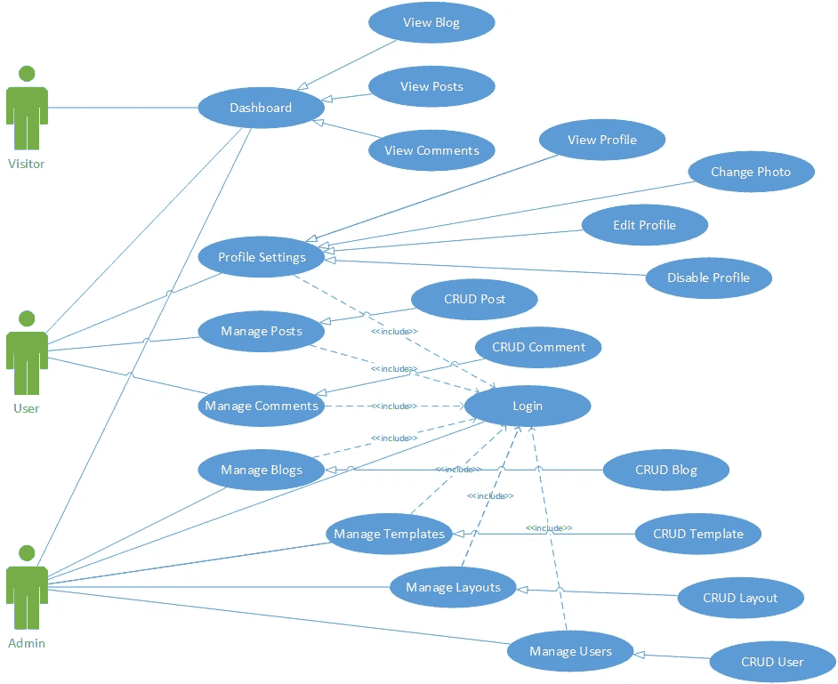
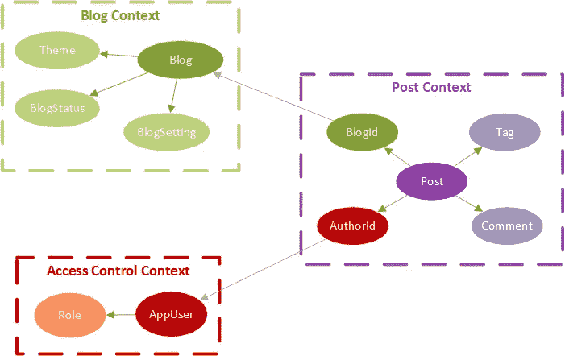
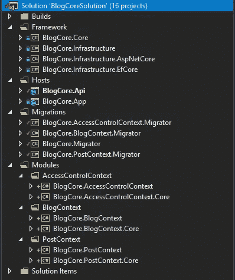
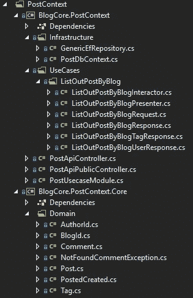

# 如何在 10 分钟内将干净的架构组织成模块化模式

> 原文：<https://medium.com/hackernoon/applying-clean-architecture-on-web-application-with-modular-pattern-7b11f1b89011>

你现在还在关心什么是**现代软件架构**？你正在搜索**最佳软件架构**来申请你的项目。深入这篇文章，它会帮助你自己回答。

就软件开发而言，在我参与的许多项目中，为了**维护和可重用性**，项目的架构非常重要。软件架构确保您构建的软件有一个框架基础。它只是喜欢主机或者房子的背景。基于此，我们有自由去建造任何我们想要的东西。

这些天我脑子里一直在想的问题是我们如何将干净的架构和模块化模式结合起来？我在代码中做了一些实验，最后，我决定在这篇文章中把它写出来。目的很简单，分享我学到的东西，并从反馈中了解更多。这篇文章是基于我在软件开发方面的经验，以及模块化方法如何带来好处并在上面应用**干净架构概念**。

# **模块化模式**

架构的模块化方法也是我们公司经常谈论的话题。回到 5 年前，我参与了一个有很多人参与的大项目，在那个时候，我们已经按照模块化的方法组织了架构。到那时，我们知道通过模块化，我们可以**将大块软件切割成许多垂直的小块软件**和**使团队工作更容易**，因为**每个团队只需要专注于他们工作的模块**。有人记得大项目中的冲突代码吗？你能花半天(或更长时间)来合并代码吗？这真是一场噩梦，不是吗。

因此，在模块化方法中，我们需要确保模块足够独立，以便它可以由不同团队中的唯一开发人员来工作。它应该在逻辑设计风格，给我们的优点

*   帮助我们的软件系统能够**扩展、重用、维护和适应**。
*   将大型整体堆栈分解成协作模块的灵活组合(整体风格)。
*   帮助**的新人容易理解**系统的业务特性和功能(因为它足够小)
*   打开**迁移到微服务架构**的大门(如果需要，但从我的角度来看不容易采用)

# **干净的建筑**

[自 2012 年以来，鲍勃大叔创造了清洁架构](https://8thlight.com/blog/uncle-bob/2012/08/13/the-clean-architecture.html)，到那时，**成为软件架构世界的重要事物**。我们可以看到 [Android](https://github.com/android10/Android-CleanArchitecture) 结合 [**MVP 模式**](https://msdn.microsoft.com/en-us/library/ff649571.aspx) 使用它来构建移动应用的软件架构。那里有几篇文章也建议对 web 应用程序使用干净的架构。今年年初，Bob 大叔出版了名为**[**清洁架构:软件结构与设计工匠指南**](https://www.amazon.com/Clean-Architecture-Craftsmans-Software-Structure/dp/0134494164)**的书。如果你以前从未读过那本书，我强烈建议你看一看。这本书提到了很多使用****设计模式**时的最佳实践，以及部署工作中的一些**技巧和诀窍。********

****关于 clean 架构的一点概述，如果你已经知道，请跳过这一步，跳到实现部分。根据 Clean Architecture，我们需要**确保下面的一些要点******

> ****1.**独立于框架**。该体系结构不依赖于某个加载功能的软件库的存在。这允许您将这样的框架用作工具，而不是将您的系统塞进它们有限的约束中。****
> 
> ****2.**可测试**。可以在没有 UI、数据库、Web 服务器或任何其他外部元素的情况下测试业务规则。****
> 
> ****3.**独立于 UI** 。用户界面可以很容易地改变，而不需要改变系统的其他部分。例如，Web 用户界面可以用控制台用户界面代替，而不需要改变业务规则。****
> 
> ****4.**独立于数据库**。您可以将 Oracle 或 SQL Server 换成 Mongo、BigTable、CouchDB 或其他。您的业务规则没有绑定到数据库。****
> 
> ****5.**独立于任何外部机构**。事实上，你的业务规则根本不了解外部世界。****

****它严格遵循图表****

********

# ******实施******

> *****“空谈是廉价的。给我看看代码。”——莱纳斯·托瓦尔兹*****

****让我们从今天的主要故事开始，任何项目都必须分析并询问客户关于**他们想为他们的系统**做什么以及**他们需要他们的系统为**做什么。他们会给我们一堆**用例**或者**用户故事**(如果有敏捷项目的话)。最后一步，我们必须画出用例图。对于那些到目前为止还不明白我说的话的人，我想分析一下博客引擎领域的一个例子。比方说，我们想建立一个博客网站，有一些功能，如阅读博客，看到这个博客的帖子，在公共界面上添加一些评论。而且我们肯定有办法在博客、帖子和评论上进行 CRUD 操作。除此之外，我们还需要登录系统，然后才能修改博客、帖子和评论。基于这个应用程序的特性需求，我们将以下面的用例图结束****

********

****现在是时候了，我将向您展示如何将模块化模式应用到这个示例中。如果你看上面的图表，你会注意到我们只有 3 个主要的东西需要管理，分别是认证、博客和文章。从领域驱动设计中获取一些想法([解决软件核心的复杂性](https://www.amazon.com/Domain-Driven-Design-Tackling-Complexity-Software/dp/0321125215)和[实现领域驱动设计](https://www.amazon.com/Implementing-Domain-Driven-Design-Vaughn-Vernon/dp/0321834577)书籍从我的角度来看是一个很好的起点)，在这种情况下是**有界上下文模式**，我将我的应用程序域分离为访问控制上下文、博客上下文和帖子上下文(我将其分为 3 个有界上下文，因为我的领域知识是这样的，由于不同的领域专家，它会与其他不同，但至少它需要整理业务需求)。让我们把它们放在一起，我们有一个图表****

********

****让我们解释一下上图，红色的访问控制上下文用于身份验证和授权任务。用绿色填充的博客上下文是用于博客管理的，包括设置博客、状态分配和主题…第三个是帖子上下文，它管理自己的评论和标签。如你所见，文章的内容与他人有关系。更多关于如何设计**有界上下文** ( **根集合**)的信息，请来到[有效集合设计](https://vaughnvernon.co/?p=838)文章，你将学到大量有用的东西。我向你保证:)****

****理论讲得太多了，现在让我们直接进入代码。由于本文的限制，我只能向您展示一个有界上下文代码，我想选择 Post 上下文，因为我认为这是最感兴趣的。这个虎视眈眈，你可以看看我的 GitHub 代码— ***本文末尾的链接给你*** 。到目前为止，你们中的一些人会问，到底什么是干净的建筑？不要惊慌。让我给你看看项目结构，然后你有其余的。****

********

****它对于构建项目是否干净？到那时，我发现**简单的结构**不仅**帮助新来者容易赶上并使用**它，而且**帮助代码读者容易理解我们想要做什么，并在**庞大的代码库中导航。

对于那些想要运行这个示例项目的人，我使用**。NET Core 2.0** 来实现，这样你至少需要安装[运行时环境](https://www.microsoft.com/net/download/core#/runtime)。****

****现在我开始解释上面的结构。首先，我们有图中的**框架文件夹**，它包含了所有与项目必需的工具包相关的东西。**记住，我们将避免在代码中使用抽象，而是使用组合**(OOP 中的[组合超过继承](https://en.wikipedia.org/wiki/Composition_over_inheritance))。博客核心。Core 不需要依赖任何框架或库，而是依赖于。NET SDK(有些情况我们称之为普通代码)。此外，我们有 3 个项目:BlogCore。基础设施，博客核心。基础设施。AspNetCore 和 BlogCore。EfCore 将依赖于 EntityFrameworkCore、AspNetCore 和其他库，如 Autofac、AutoMapper、FluentValidation、mediator……****

****第二， **Hosts 文件夹**在图的中间，我们用它来放置主机项目。您可以看到我有 2 台主机:一台用于 API (BlogCore。API)和另一个用于单页面应用程序(BlogCore。App)。****

****第三，**迁移文件夹**用于执行迁移工作，在本例中，我们迁移访问控制上下文、博客上下文和帖子上下文的数据。我们可以选择使用实体框架迁移来进行迁移，并为它们提供种子数据。否则，您也可以使用 T-SQL 脚本来进行迁移。你看着办吧，我不说哪个比别人好。****

****最后，我们有**模块文件夹**，它包含了这个应用程序的核心。我们在这里把它分成了有界的上下文文件夹，使我们的架构更加清晰。每个有界上下文有 2 个子项目，例如 BlogCore。PostContext 和 blog core . post context . core . blog core。Core 只包含域对象、契约和接口，这对于其他项目的引用来说是非常好的。规则是，如果我们有另一个模块想要使用一些类和对象，那么它应该引用<模块名>。核心和到这个项目内部的接口(**只依赖于另一个模块中的接口**)。这将使这些模块松散耦合。我们会从这种方法中获得很多好处)。****

****让我们在细节中查看后绑定上下文结构****

********

****我认为我们应该深入研究一些代码，以便更好地理解我们如何用这个项目的模块化模式实现干净的架构。****

****我们有 **Post.cs 实体**，它在 Post 上下文中充当根聚合****

****然后，我们有了**post generic repository . cs******

****我们需要为 **PostContext.cs** 创建 DbContext****

****在干净的架构中，用例非常重要，应该非常仔细地设计。在我的项目中，我将其命名为**list outpost bybloginteractor . cs******

****在处理了 Post 有界上下文的业务案例之后，我们需要聚集一些与访问控制有界上下文相关的数据，在这种情况下，我们获得它的作者信息，并使用 IUserRepository 接口获得作者的详细信息。因此我们引入了另一个名为**listboutpostblogpresenter . cs**的类****

****我们需要一个地方来注册这些依赖对象。所以**依赖注入**开始发挥作用，我们在这个项目中使用 Autofac 模块。这个想法是模块将注册它自己的所有依赖项。****

****是的，这就够了，然后我们只需要为我们所做的事情引入**API******

******重述******

****今天，我将带你走完我们如何在干净的架构中做好模块化工作的旅程。我们至少知道什么是模块化，什么是真正重要的。我们浏览了一些关于清洁建筑的概述，以及它的一些优点。最后但同样重要的是，我们知道如何使用？网芯 2.0。****

****这篇文章中没有涉及到的是**数据流**、**有界上下文之间的同步**、**单元测试**、**部署**对于 Clean Architecture…如果你们感兴趣，我会写更多关于它们的内容，只需在下面的评论框中留言即可。****

> ****这篇文章的源代码可以在 https://github.com/thangchung/blog-core[找到](https://github.com/thangchung/blog-core)****

****感谢阅读！如果你喜欢这篇文章，请点击👏符号，以便其他人可以看到它。****