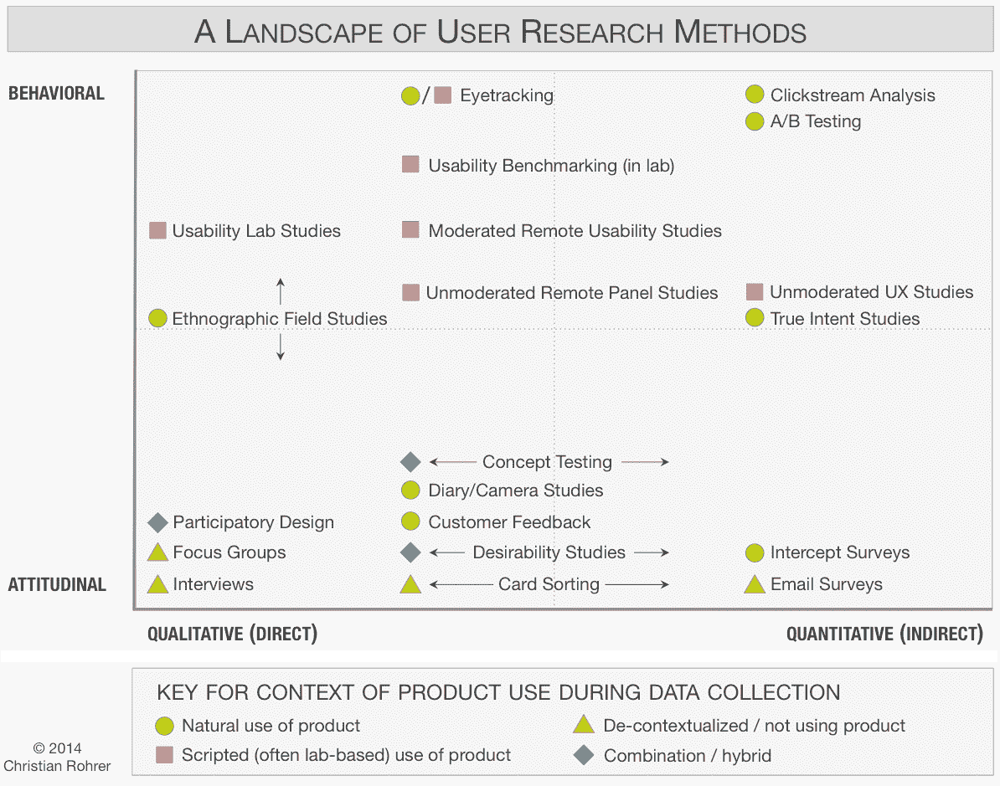
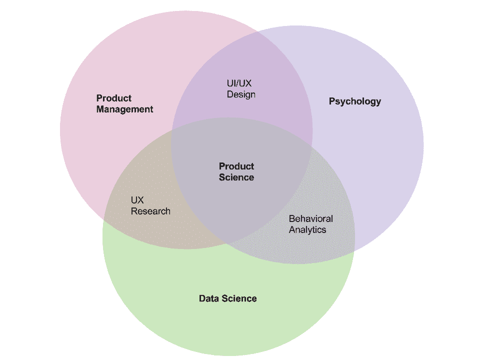
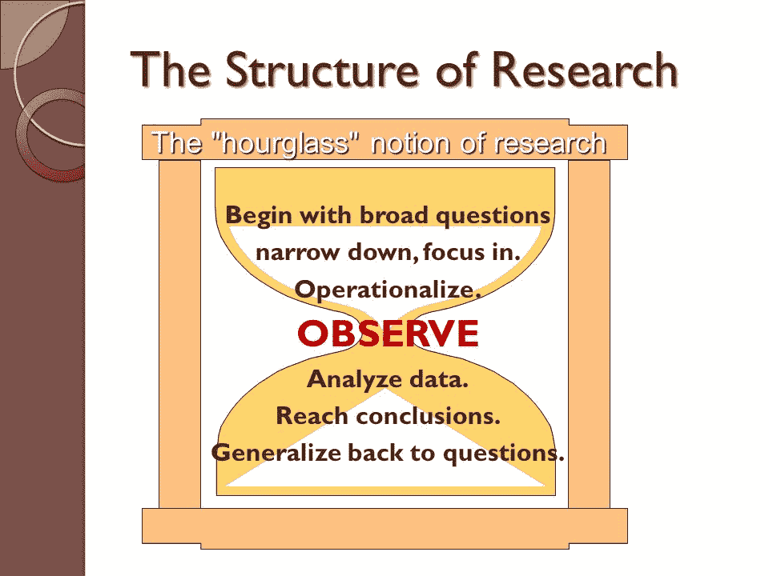

# 将传统研究方法应用于产品管理

> 原文：<https://medium.com/hackernoon/applying-traditional-research-methods-to-product-management-72aea8668788>

## “产品科学”的最佳实践源自社会科学研究的原则

**连接**

[产品管理](https://hackernoon.com/tagged/product-management)最终是关于人的——用户、[业务](https://hackernoon.com/tagged/business)利益相关者、团队成员(开发人员等)。)、投资者等——以及他们之间的互动、关系和系统。关于好的产品管理需要哪些技能，作为产品经理如何最好地设定和实现目标，以及在这个角色上取得成功所需的技能，有无数的文章。但我发现最有趣的是产品管理和传统社会科学之间日益增长的(但仍然很少)明确定义的联系——特别是社会科学的研究方面。

这篇文章旨在总结他们分享的重要的社会科学、产品管理和重叠部分(又名:产品科学)的必备知识，以便企业家可以通过利用经过实践检验的真实研究方法来改善他们的产品开发周期，并避免常见的陷阱和谬误。

**本岗位结构**

本文分为以下几个部分:

*   社会科学导论
*   产品管理简介
*   产品科学导论
*   外卖食品

“简介”部分包括以下小节:

*   这是什么？
*   示例学科
*   研究策略
*   为什么它像…

**社会科学导论**

**什么事？**

1.  一门科学的分支，研究人类社会的制度和功能，以及作为社会成员的个人的人际关系
2.  研究人类社会某一特定阶段或方面的科学

*(* [*来源*](https://www.merriam-webster.com/dictionary/social%20science) *)*

**范例学科:**

*   人类学
*   传播研究
*   经济学
*   教育
*   地理
*   历史
*   法律
*   语言学
*   政治学
*   心理学
*   社会学

*(* [*来源*](https://en.wikipedia.org/wiki/Social_science) *)*

**研究策略:**

社会研究方法通常分为两大设计类别:

*   定量设计通过可量化的证据来研究社会现象，通常依赖于许多案例的统计分析(或实验中有意设计的处理)来创建有效和可靠的一般主张。
*   定性设计强调通过直接观察、与参与者交流或文本分析来理解社会现象，可能强调上下文和主观准确性而非一般性。

有很多教科书都是关于这个话题的，所以我们在这里暂停一下，然后在后面的文章中强调重点。关于社会研究基础的更多信息，这里有一个很好的资源。

> **为什么像产品管理:**
> 
> 像产品管理一样，社会科学通常包括技术和非技术技能
> 
> 像产品管理一样，社会科学包括评估(并且经常改进)系统的功能
> 
> 像产品管理一样，社会科学研究需要分析定量和定性数据

**产品管理简介**

**是什么？**

1.  公司内部的一种组织生命周期职能，在产品生命周期的所有阶段处理产品的计划、预测、生产或营销。
2.  同样，产品生命周期管理(PLM)集成了人员、数据、流程和业务系统。

*(* [*来源*](https://en.wikipedia.org/wiki/Product_management) *)*

**示例学科:**

*   技术
*   开发运营
*   工程
*   用户
*   用户研究
*   行业专业知识
*   商业
*   办公室管理
*   金融

*(* [*来源*](/earnest-product-management/3-types-of-product-management-dec4b2d77271) *)*

**研究策略:**

产品研究通常关注产品的可用性，包括简单的研究方法，如:

*   调查
*   面谈
*   观察
*   A/B 测试

这里有一个很好的图表，展示了何时使用哪种用户体验研究方法:

([Source](https://www.nngroup.com/articles/which-ux-research-methods/))

> **为什么像社会科学:**
> 
> 像社会科学一样，产品管理包括理解思维(如动机、偏好等)。)的不同的人在不同的环境下(或在不同的情况下)
> 
> 像社会科学一样，当结合微观和宏观观点时，产品管理执行得最好
> 
> 像社会科学一样，产品管理研究需要定量和定性数据

**产品科学介绍**

**什么事？我认为这是…**

1.  这是一个多学科的框架，通过这个框架，公司可以利用有效可靠的数据开发产品创新的飞轮
2.  深入数据科学、心理学和产品管理/设计的交叉领域，增强产品开发并简化
3.  视觉上:

**示例学科:**

*   数据科学:

*统计研究/数据处理*

*   产品管理:

*技术—工程和开发/满足业务需求*

*   心理学:

*认知心理学/行为心理学/社会心理学*

**研究策略:**

使用传统的社会科学研究方法，并将其应用于产品管理和研究，我们得到了产品科学最佳实践的原则。您可能已经注意到了前面几节中的相似和重叠之处，但主要方面是:

*   使用定量和定性数据
*   态度与行为洞察
*   正在研究的内容的背景

请参见下一节，了解产品科学的关键要点及其固有优势。

> **为什么好像是社会科学和产品管理的结合:**
> 
> 像社会科学和产品管理一样，产品科学通过使用数据来改进决策
> 
> 像社会科学和产品管理一样，产品科学是多学科的
> 
> 像社会科学和产品管理一样，产品科学需要一个(或多个)拥有广泛技能和特质的领导者

**外卖**

**研究流程:**

社会科学研究和产品管理(又名:产品科学)的关键顺序可以用下图来概括:

[(Source)](http://www.socialresearchmethods.net/kb/strucres.php)

**产品科学的主要优势:**

*   用户或产品(一般)研究设计和方法

*对具有数据特定要求的 PRD 做出贡献——包括与特征相关的主要数据字段，以及更深入分析所需的次要字段*

*提高数据在产品开发反馈回路中的使用效率*

*   报告

*以清晰易懂的方式向所有利益相关方展示数据/结果*

*   数据管理

*在产品开发之前/期间评估数据库和表格的结构*

*监视器命名约定等。*

*设计稳健、可持续的仪表盘*

*   事前和事后产品(创新)分析