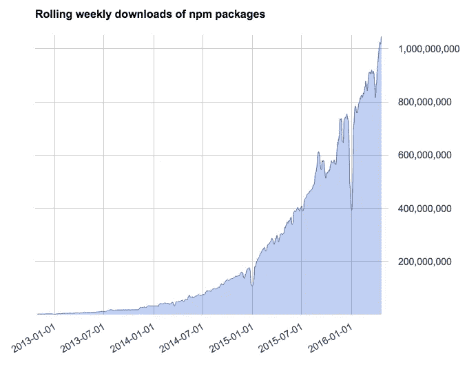

# C++依赖管理的方法，或者我们为什么要建立 Buckaroo

> 原文：<https://medium.com/hackernoon/approaches-to-c-dependency-management-or-why-we-built-buckaroo-26049d4646e7>

Photo by [Pro Image Photography](http://unsplash.com/photos/2PoWESVv0X4?utm_source=unsplash&utm_medium=referral&utm_content=creditCopyText) on [Unsplash](https://unsplash.com/?utm_source=unsplash&utm_medium=referral&utm_content=creditCopyText)

C++是一种不寻常的语言，因为它还没有一个占主导地位的包管理器([我们正在研究它](https://buckaroo.pm/)！).因此，C++开发人员已经转向跨项目重用代码的几种不同方法。

这种标准化的缺乏对生态系统产生了负面影响。有一个“仅头文件”C++库的“T2”家庭手工业(T3)——只有几个文件的小库，可以直接复制到项目中。像 [Boost](https://github.com/boostorg) 这样的单体库变得越来越大，因为添加“多一个特性”比集成更多的库更容易。我们真的可以说这两个极端中的任何一个是组织代码的最佳方式，或者它们仅仅是生态系统中的一个缺口的结果吗？

> 我们真的可以说这两个极端中的任何一个是组织代码的最佳方式，或者它们仅仅是生态系统中的一个缺口的结果吗？

作为 C++开发人员，有哪些依赖管理方法？它们有什么不同，最好的方法是什么？

# 我们要去哪里？🤔

好的，所以在决定最好的方法和解释我们为什么建造 Buckaroo 之前，重要的是明确我们想要达到的目标。什么是依赖管理解决方案，什么是好的？

## 什么是依赖管理？

依赖项管理是维护项目使用的外部库链接的过程。通过添加依赖项，您可以在项目中重用代码，这有两个好处:

1.  您不必自己编写代码。
2.  您可以从在生产环境中测试代码的其他用户社区中受益。

依赖管理器通过提供自动化工具，使得维护这些外部库变得更加容易。

## 怎样才能成为一个好的依赖管理器？

对于大多数用例，我们提出了一个好的打包解决方案必须满足的需求列表。

## **1。向项目添加新的依赖项应该很容易。**

看似显而易见，但这一点在追求其他要求时很容易被遗漏。如果很难添加依赖项，那么开发人员将更有可能重新实现功能。他们的一次性实现没有社区实现测试的好，开发者将会从其他功能上转移时间。

因为依赖关系图可能很复杂，所以传递依赖关系应该作为安装过程的一部分自动获取和解析。

## 2.理解项目所使用的依赖关系应该是很简单的。

虽然使添加依赖项变得容易鼓励了代码的重用，但是不利的一面是过度的导入可能会引入意外的复杂性。开发人员能够轻松地检查所使用的依赖项，并随着需求的变化对其进行删减，这一点至关重要。为了有助于调试，依赖关系的源代码应该随时可用。

## 3.它应该可以在所有主要平台上运行。交叉编译应该很容易，而不仅仅是事后的想法。

对 C++的一个常见误解是，与 Java 等 VM 语言不同，代码不能跨平台移植。事实是 C++是可移植的，但方式不同。Java 编译成字节码格式，这是平台无关的，可以部署在任何地方，而 C++只能在编译前移植。这意味着为了保持可移植性，C++包管理器必须为每个包提供源代码，二进制文件只是作为一种优化。

## 4.依赖项安装应该是可重复的。每个开发人员都应该构建相同的代码。

正如可再现性在构建系统中是至关重要的一样，它在任何基于构建的包管理器中都是至关重要的。可再现性意味着开发人员可以确信被测试和部署的代码是他们所期望的。这防止了细微的错误只出现在某些机器上，导致生产停机和开发人员无休止的沮丧！

## 5.依赖关系应该以项目为中心。换句话说，安装一个依赖项不应该修改您的系统。

以项目为中心的解决方案在编写软件时很重要，因为它们减少了尝试不同依赖关系时的摩擦。如果添加一个依赖项需要改变机器的配置，那么开发者会不愿意尝试；有些东西可能会坏掉，没有人愿意事后还记得如何重新配置。更糟糕的是，依赖关系可能与某些系统组件的需求不兼容。打包解决方案应该完全在项目内部工作。

## 6.发布新的包应该很容易。

当开发人员将他们的工作贡献给开源社区，或者仅仅是他们组织内的同事时，他们正在成倍地增加他们工作的影响。我们应该鼓励这一点！最好的方法是让发布包变得非常容易。流程应该是自助式的；应该不需要额外的基础设施，也不需要等待批准。

## 7.需要最少的额外基础设施，如服务器。

无论部署有多容易，额外的基础架构都会产生额外的成本，并增加另一个故障点。一个好的解决方案将尽可能使用现有的基础设施。

# 不同的方法

好了，让我们先快速总结一下不同的方法。

## 复制粘贴

这是最简单的依赖管理方法，它甚至被一些大型项目所使用！

这种方法的问题是它提供的实际管理很少。代码的可传递依赖关系必须手动解决，依赖关系升级是手动的，最关键的是，被复制的确切版本必须由开发人员跟踪。如果一个二进制文件是复制粘贴的，那么交叉编译就很困难。

然而，值得称赞的是，复制粘贴方法不需要外部工具，可复制性是免费的，设置起来也很简单。

## apt-get(及类似)

一些开发人员认为 C++已经有了一个包管理器，它已经内置在 Linux 中了。使用`apt-get`，许多 C++库可以被安装到一台目标机器上。

那么为什么不用`apt-get`？虽然`apt-get`是在你的机器上安装应用程序的一个很好的方法，但是当使用系统包管理器来管理项目级的包时会出现问题:

*   它与操作系统相关联。`apt-get`只能在 Linux 上运行，而且通常只能在 Debian 环境下运行。
*   在系统上安装二进制文件对交叉编译没有帮助。
*   它会改变你的系统。当您处理两个需要不同依赖版本的项目时会发生什么？
*   `apt-get`不保证再现性，尽管[其他包管理器](https://nixos.org/nix/)保证再现性。👍
*   您几乎无法控制所选择的 ABI、构建配置或所使用的标准库。

## Docker & apt-get🐳

解决`apt-get`问题的一个办法是在 Docker 容器中完成所有的开发。为您正在处理的每个项目创建一个容器，并简单地将每个项目依赖项作为系统依赖项安装在该容器中。

这当然有效，但是有一些限制:

*   开发本地 Windows 软件或多或少是不可能的。可以，可以在 Windows 上 Docker，但还是 Linux 环境。您将需要交叉编译，然后在 Docker 之外运行进行测试。
*   您仍然受限于`apt-get`提供的包，并且这些包会随着时间而改变。
*   Docker 以 root 身份运行，从安全角度来看是有问题的。*(更正:* [*Docker 现无根*](http://www.infoworld.com/article/3030558/application-virtualization/docker-goes-rootless-and-thats-a-good-thing.html) *)*
*   它需要大量的磁盘空间，因为 Docker 保存了系统库的副本。
*   您可能需要在 Docker 容器中第二次安装工具。
*   工具现在与项目联系在一起，所以要么团队中的每个人都必须拥有完全相同的工具，要么您将需要管理多个映像。

## Git 子模块

子模块是 Git 的一个特性，它允许您将另一个 Git 存储库作为一个文件夹包含进来。如果您已经在使用 Git，它是一个强大的附加功能，不需要额外的工具。

子模块的局限性在于它不提供依赖性解析。为什么这很重要？假设您有这样一个依赖关系图:

显然，我们可以将此归结为:

然而，子模块不允许您表达这样的需求，因此您必须手工解决。对于小项目来说，这不是问题，但是随着依赖列表的增长，这就成了问题。

最重要的是，子模块没有提供简化依赖图的方法。假设你有这样一个项目系统:

所以`B`和`C`都需要库`D`。因此，我们应该只建造`D`一次，并重复使用建造`B`和`C`的结果。子模块在这里对我们没有帮助。我们必须通过编写构建系统的脚本来手动确保这一点。

## CMake 外部项目

CMake 有一个下载外部项目的功能，叫做`ExternalProject_Add`。它有大量的设置，所以它很有可能被配置成你需要的样子。

然而:

*   它是不可复制的。`ExternalProject_Add`可以从不稳定的 URL 和 Git 分支下载模块。
*   几乎没有标准化。CMake 依赖于变量名约定，这是相当脆弱的。
*   CMake 语法😱使用起来很不愉快，并且与其他语法选择相比没有优势。
*   依赖关系解析仍然必须手动完成。

## 以项目为中心的包管理器

以项目为中心的包管理器将依赖项安装到项目文件夹中，而不是安装到系统中。可以这样想:*以项目为中心的打包经理是为了构建项目；系统包管理器用于安装软件*。

已经有很多尝试为几种语言建立一个以项目为中心的包管理器。其中最成功的无疑是 JavaScript 生态系统的 NPM。

Source: [blog.npmjs.org](http://blog.npmjs.org/post/143451680695/how-many-npm-users-are-there)

(顺便说一句，如果你正在使用 JavaScript，帮自己一个忙，考虑切换到 [Yarn](https://yarnpkg.com/) )。

# 牛仔

我们把 Buckaroo 建成了一个以项目为中心的 C++包管理器。[还有](https://github.com/pfultz2/cget) [是](https://github.com/ruslo/hunter) [的替代品](https://www.conan.io/)，我们会在另一篇文章中做一个全面的比较，但是现有的解决方案没有一个完全符合我们的要求。这是一个关于牛仔的概述。

## 1.向项目添加新的依赖项应该很容易。

Buckaroo 依赖项安装在一个命令中，例如:

## 2.理解项目所使用的依赖关系应该是很简单的。

每个项目都包含一个`buckaroo.json`文件，它指定了项目的依赖项。此外，还有一个`buckaroo.lock.json`文件，它详细说明了版本是如何被解析的。

## 3.它应该可以在所有主要平台上运行。交叉编译应该很容易，而不仅仅是事后的想法。

Buckaroo 支持 macOS、Windows(预览版)和 Linux。所有 Buckaroo 包都使用 [Buck](https://buckbuild.com/) 作为构建系统从源代码进行构建，这支持使用“构建风格”进行交叉编译。

## 4.安装依赖项应该是可重复的。每个开发人员都应该构建相同的代码。

像 Yarn 一样，Buckaroo 将依赖关系解析的确切结果保存到一个锁文件中，这确保了每个部署都使用完全相同的依赖关系。

此外，由于所有 Buckaroo 包都是用 Buck 构建的，因此它可以提供可重复的构建。CMake 不能保证这一点。

## 5.依赖关系应该以项目为中心。换句话说，安装一个依赖项不应该修改您的系统。

牛仔完全是项目本地的。只有下载缓存和一些用户设置位于项目文件夹之外。这保证了您的 [CI 服务器](https://hackernoon.com/getting-started-with-buck-build-on-travis-ci-d1208d363023)构建与您完全相同的代码。

## 6.发布新的包应该很容易。

发布一个 Buckaroo 包很简单:

1.为您的项目编写一个 Buck 构建文件
2。添加一个`buckaroo.json`文件
3。创建一个 GitHub 版本

就是这样！更多信息请参见本指南。

## 7.需要最少的额外基础设施，如服务器。

Buckaroo 利用现有的基础设施，如 GitHub，因此您不需要托管自己的服务器。

# 结论

希望这篇文章已经解释了牛仔背后的一些动机。总结一下:

*   在您的项目中使用以项目为中心的包管理器有很多好处，比如 Buckaroo。
*   使用系统包管理器来安装工具和进行部署。
*   如果您需要最少的工具，Git 子模块是一个合理的选择。
*   复制粘贴对于微小的依赖是可行的，比如 [Catch](https://github.com/philsquared/Catch) ，但是使用包管理器更方便。

## 准备好开始了吗？🤠

如果你想尝试[牛仔](http://buckaroo.pm/)，最好的起点是[文档](https://buckaroo.readthedocs.io/en/latest/)。您可以在 [Buckaroo.pm](http://buckaroo.pm/) 上浏览现有套餐，或者在[愿望清单](https://github.com/LoopPerfect/buckaroo-wishlist)上请求更多套餐。