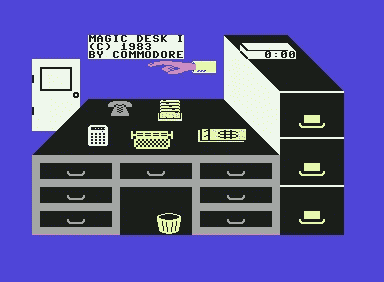
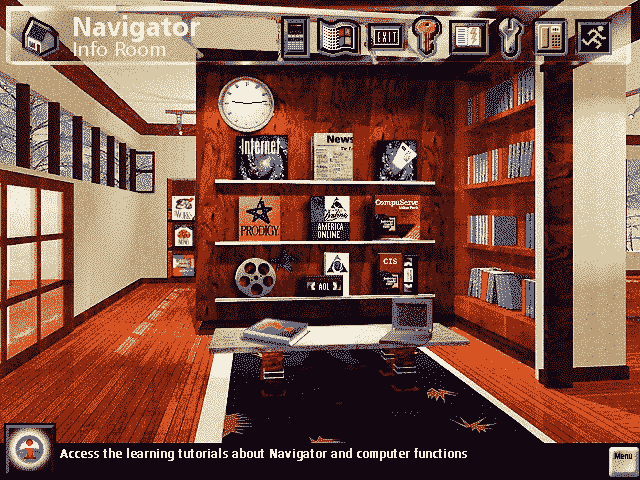
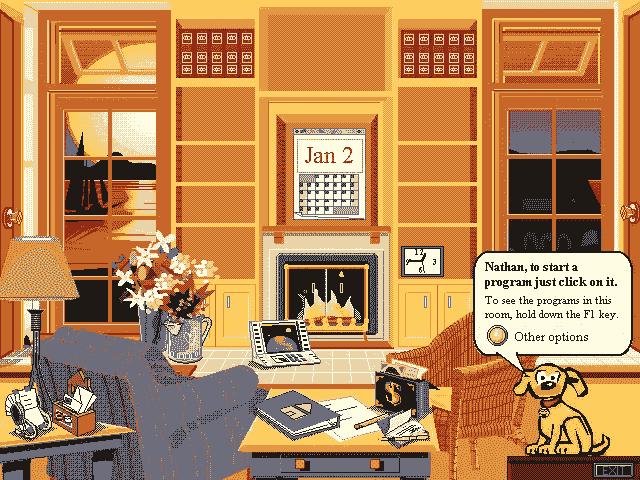
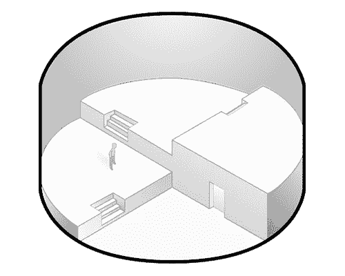

# 接近真正自然的界面

> 原文：<https://medium.com/hackernoon/approaching-a-truly-natural-interface-bd763943977e>

在过去的 50 年里，我们已经看到了无数的界面出现，有好的，有坏的，还有完全荒谬的。神奇、熟悉和强大之间的平衡在哪里？当我们制造更人性化的东西时，我们牺牲了什么？或者当我们制造更强大的东西时，我们获得了什么？有可能找到真正的平衡吗？

# 从隐喻开始

[Magic Desk](http://toastytech.com/guis/magdesk.html), for the Commodore, 1983

在图形用户界面(GUI)的早期，大量使用隐喻来创建一个人们可以用头脑思考的界面。这些隐喻中的大部分今天仍然伴随着我们，像桌面、文件、垃圾桶等等。

在一篇题为*使用界面隐喻*的文章中，Thomas D. Erickson(当时在苹果公司)解释了隐喻作为日常生活中理解工具的必要性。他说“许多人认为隐喻是一种华丽的语言，主要存在于诗歌和糟糕的小说中。这是不正确的。隐喻是我们语言和思维不可或缺的一部分。它不仅出现在诗歌和小说中，也出现在我们日常生活中。大多数情况下，我们不会注意到；隐喻是我们言语和思想中如此不变的一部分，以至于看不见。”他接着说，“我们谈论争论，就好像这是一场战争。争论的双方可以是*防守*和*进攻*。如果一个位置*站不住脚*，一个人可以*从中撤退*。论点可以有*弱点——*它们甚至可以被*摧毁*；参数可以在目标的右侧*；论点可以被*击落*。[……]我们谈论和思考论点的隐喻方式是规则，而不是例外。”*

也许第一个商业例子来自 1983 年的 Commodore，比 Macintosh 早一年。当我们回顾那些试图把电脑变成一个空间的界面时，我们很快就会发现许多早期的例子在定义它们的用途时失败了，在某些情况下，为了易用性牺牲了太多的功能。

# 引入一点魔法

到 80 年代中期，人们充分认识到，将隐喻引入技术提供了一种使计算机更容易使用和理解的方法。艾伦·凯(Alan Kay)认为，隐喻开始走得太远了。

在 1989 年一篇名为*用户界面:个人观点*的文章中，他提出了一个与严格使用隐喻不同的观点:

> “最引人注目的陷阱之一是使用术语隐喻来描述用户在屏幕上看到的东西和他们应该如何思考他们正在操作的东西之间的对应关系。我的主要抱怨是，对于需要做的事情，隐喻是一个糟糕的隐喻。在[施乐] PARC，我们创造了“用户错觉”这个短语来描述我们在设计用户界面时的想法。[……]例如，作为“要标记的纸张”的屏幕是一个暗示铅笔、画笔和打字的隐喻。很好，就目前而言。但是真正重要的是魔法——可以理解的魔法。我们是不是应该把纸的隐喻转移得如此完美，以至于屏幕像纸一样难以擦除和改变？显然不是。如果它像一张神奇的纸，那么神奇的部分才是最重要的，也是用户界面设计中最需要关注的部分。

事实上，在技术中使用严格隐喻的概念不仅令人厌倦，而且还具有局限性。他在对桌面隐喻的评论中明显提倡更多的东西:

> “我不想要一个很像我的物理办公桌的屏幕。它只是变得很乱——然而我讨厌在项目进行中清理它。我通常同时做很多不同的项目。在[施乐] PARC，他们曾经指责我把桌子塞满，直到它无用地纠结在一起，然后又丢给另一张桌子！对此的一个解决方案是“项目视图”,它最初是由 Dan Ingalls 在 Smalltalk-76 中实现的。同样，这更多的是用户的错觉，而不是隐喻。每一个区域都保存着特定项目的所有[工具](https://hackernoon.com/tagged/tools)和材料，当你离开时会自动暂停。有点像多张桌子——但真正重要的是魔力。这里的神奇之处在于，在项目区域中对系统所做的每一个改变——不管对系统的影响有多深(甚至改变整数“+”的含义)!)—在本地记录到项目区域。然而，每个项目领域都是可以相互交流的并行过程。这是一种用户错觉，很容易理解，但并没有很好地映射到物理世界。”

[Xerox Rooms](http://toastytech.com/guis/xrmw.html), 1992

桌面隐喻是使计算机更容易理解的一种可以理解的方式，但是把自己限制在一个桌面上有什么意义呢？为什么不利用大家熟悉的桌面系统来增强它的功能呢？

将信息分割到不同的空间是 Amiga 在 1985 年开始的，允许用户将他们的活动工作分成多个不同的逻辑分组。这个概念后来出现在施乐工作室(如上图)，然后出现在 macOS、Windows、BeOS 和 Linux 中。

艾伦认为，隐喻只有在为用户提供意义的范围内才是好的，也就是说，在数字领域中，没有必要坚持对具有魔力的物品施加现实世界的限制。

对于 90 年代中期出现的界面，他肯定会有一些话要说。

# 回到隐喻

From Left to Right: [Packard Bell Navigator](http://toastytech.com/guis/pbnav35.html), [Magic Cap](http://toastytech.com/guis/mcap.html), and [Microsoft Bob](http://toastytech.com/guis/bob.html), all from 1995.

到了 1995 年，我们似乎又回到了大量使用隐喻的时代。

也许 90 年代中期基于隐喻的界面中最真实的是 Packard Bell Navigator。1995 年，大多数 Packard Bell 电脑都附带了一个运行在 Windows 3.1 和 Windows 95 上的外壳。它允许用户导航到不同的房间，如客厅，工作区，信息室，或软件室，所有设置在预先渲染的山坡家园。正因为如此，这个领域很少强调定制。

Magic Cap 是 General Magic 为“个人智能通讯器”开发的操作系统，由许多麦金塔电脑老手和其他一些很快就会有影响力的人物领导，如 Android 的创始人安迪·鲁宾。魔法帽有些特别。只需听听[安迪](https://www.youtube.com/watch?v=AGm684mnar4)、[比尔](https://www.youtube.com/watch?v=4oO87e2qL8A)，或者[梅根](https://youtu.be/n-R-L2rqbpQ)谈论它。我确实相信让一个设备变得真正熟悉和为人所知的重要性，我也确实相信古怪和魅力属于我们的技术。如果通用魔法公司的软件配有足够的硬件，我认为这将是一个了不起的平台，将世界引入下一波通信。

微软 Bob 相当知名，它的消亡也相当复杂。在这里，界面没有考虑到新事物的可能性，它只是简化了计算机的正常使用。它以一种非常友好的方式做到了这一点，但是到 1995 年，人们已经经历了近十年的训练，告诉他们可以从 GUI 中期待什么，在大多数情况下，GUI 已经足够友好了。

重要的是要明白，这些想法没有一个是从硬科学中想出来的，而是受其他技术潮流的影响。然而，很明显，这些想法背后的人热情地相信他们的方法，最终，他们都朝着同一个目标努力:**让计算更人性化**。当界面消失时，我们能够发现更多，建立更多联系，最终成为更好的自己。由于我们厌恶这些失败的界面，我们今天的许多工具都是支离破碎和不可接近的；他们功利的风度，并不邀请我们去玩，去探索。因此，已经出现了一种转变，以一种合乎逻辑而又人性化的方式将两个世界的优点结合在一起。

# 回归现实

自从 90 年代中期使软件更人性化和更熟悉的尝试失败后，社区就一直小心翼翼地提出大量使用这种技术的界面。iPhone 和随后 iPad 的发布标志着我们第一次如此大规模、成功地看到这些界面。据说苹果将[的外形](https://en.wikipedia.org/wiki/Skeuomorph)元素整合到 iOS 中，以唤起那种熟悉感，尤其是当他们推出一款如此陌生和新颖的设备时。人们不仅要理解它，还要接受它，它必须传达一种熟悉感。这让人回想起艾伦·凯关于*用户幻觉*而不是隐喻的想法，允许新的能力闪耀，同时在视觉上保持熟悉的事物。

也许现在这个领域最有影响力的思想家是 Bret Victor。Bret 发表了许多演讲和文章，讲述了创建终极界面的好处，不是在屏幕上，而是在一个扩展你能力的环境中。

在他题为 [*的主题演讲中，他描绘了理想的计算空间:*](https://vimeo.com/115154289)

> 一本书想成为一个空间，你可以在里面走来走去；这感觉有点像今天的博物馆画廊，而不是一本书，所以你可以通过在里面走来走去来阅读这本书，在视觉上，空间上，有形地，使用我们为理解空间和环境而发展的所有能力。所以，你想学习线性代数，例如，你下载线性代数课本，这是整个空间；也许每一层都有一个特定的章节，你可以通过在空间中穿行来阅读这本书，与事物互动，概念以有形的物理形式呈现，你可以使用你的空间感知形式来理解材料的主旨。"

Inspired by artwork by David Hellman for Bret Victor

他小心翼翼地指出，他谈论的不是 VR 或 MR…“只是 r。”他最终希望这些启示出现在真实的物理世界中。他拥有这样一个空间的动机源于他的信念，即一旦界面与我们合作，我们就能够穿过噪音，理解更多，看到原本模糊不清的联系。有太多的东西需要学习和体验，但我们常常意识不到它的存在，因为我们用了错误的视角。

> “我想举的例子是在罗马数字时代，基本乘法被认为是一个难以置信的技术概念，只有官方数学家才能处理，”他继续说道。“但是一旦阿拉伯数字出现，你实际上可以在纸上做算术，我们发现 7 岁的孩子可以理解乘法。并不是乘法本身很难。Bret Victor 在接受 [John Pavlus](https://medium.com/u/b60987ea71ec?source=post_page-----bd763943977e--------------------------------) 的[采访](/re-form/the-utopian-ui-architect-34dead42a28)时说。

Bret 的演讲和建议似乎提倡 skeuomorphism 作为一种工具，因为它提供了熟悉感，如果做得正确，可以让我们直观地理解软件。他提倡实验和紧密的反馈循环，让我们能够直观地发现关系和联系。

我希望通过这篇文章，你能够发现一些新的东西，改变你对我们如何与计算机互动的看法。我们目前没有进行空间计算，但也许这是因为我们还没有找到正确的解决方案。当我们有一个消失的界面，一个培养联系的界面，一个坚持我们身份的界面，也许我们会知道它已经到来。随着数百次失败实验的结束，我认为我们都处在一个难以置信的个性化和强大的界面的边缘。一旦它来了，我们可以回到我们最擅长的事情:做人类。

*泰勒是* [*Holos，Inc.*](https://medium.com/u/2f011582275d?source=post_page-----bd763943977e--------------------------------) *的联合创始人之一，他在那里帮助构建虚拟现实中沉浸式计算的未来。在*[*holos . io*](http://holos.io)*报名参加他们的 beta。*

这只是试图揭开计算机界面历史系列的第一步。在接下来的几周里，请密切关注进一步的补充！

> [黑客中午](http://bit.ly/Hackernoon)是黑客如何开始他们的下午。我们是 [@AMI](http://bit.ly/atAMIatAMI) 家庭的一员。我们现在[接受投稿](http://bit.ly/hackernoonsubmission)，并乐意[讨论广告&赞助](mailto:partners@amipublications.com)机会。
> 
> 如果你喜欢这个故事，我们推荐你阅读我们的[最新科技故事](http://bit.ly/hackernoonlatestt)和[趋势科技故事](https://hackernoon.com/trending)。直到下一次，不要把世界的现实想当然！

