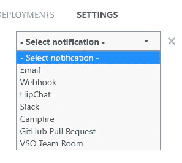
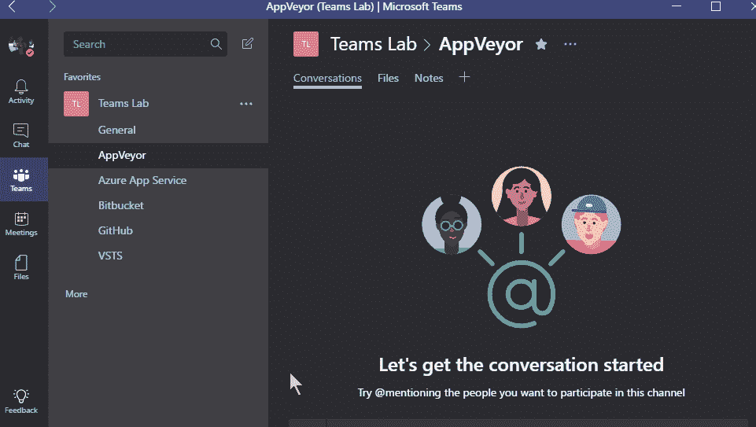
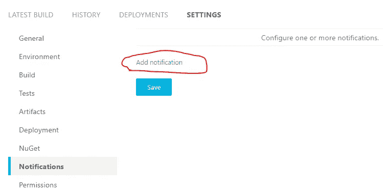
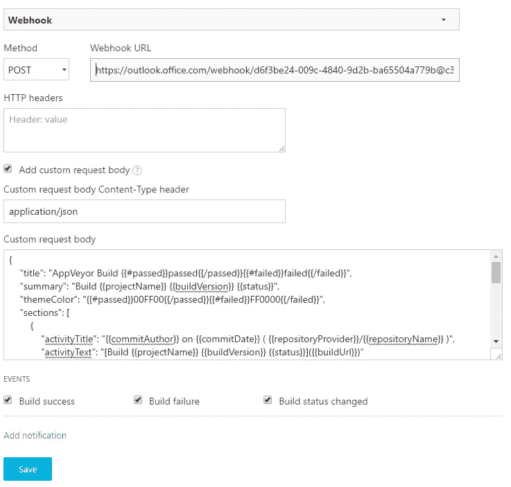
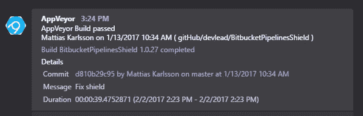

# 🛠AppVeyor ->微软团队📣

> 原文：<https://medium.com/hackernoon/appveyor-microsoft-teams-a4f810d354ee>

## 将您的 AppVeyor 构建状态通知发送到 Microsoft Teams 渠道

目前 AppVeyor 不支持通知微软团队，团队也没有准备好支持默认 AppVeyor webhook 有效负载的连接器。

但是 AppVeyor 确实支持通用的定制 webhook，它允许您使用模板定制 webhook 主体有效负载，以基本上适合任何 http 服务，而不需要中间的代理/转换服务。

在这篇文章中，将引导你完成设置自定义 webhook 的过程，以使 AppVeyor 能够与微软团队进行通信。

首先你需要在你想要获得通知的 Teams 频道上添加一个通用的传入 webhook

Team-> Channel-> Connectors -> Incoming Webhook

您可以通过点击通道、连接器后的“…”，选择一个名称，可选一个自定义图标，然后点击“创建”。一旦创建，你将有一个独特的传入网络挂钩的选择渠道。

然后它关闭到 AppVeyor，你在一个项目的设置通知部分选择“添加通知”

Custom Webhook

*   选择“网页挂钩”选项
*   方法“发布”
*   输入您团队的网页挂钩 url
*   选中“添加自定义请求正文”
*   使用“应用程序/json”作为自定义请求正文内容类型标题
*   输入一个[小胡子](http://mustache.github.io/mustache.5.html)模板，将[默认](https://www.appveyor.com/docs/notifications/#webhook-payload-default)有效载荷转换成一个团队消息卡
*   检查您想要哪些状态的通知

然后只需点击保存，就大功告成了。你可以随心所欲地使用消息模板，这是我使用的一个，你可以随意窃取它:

这将生成一条大致如下的消息:

Microsoft Teams AppVeyor build status notification

如果你使用 yml 文件配置 AppVeyor，当然可以在那里添加你的团队通知，这里有一个例子 *appveyor.yml* 文件:

总而言之，启用状态通知只需几个步骤，只需一点点努力，您就可以定制它们的外观，以包含您需要的信息！

*PS。
如果你有很多项目，你可以使用 PowerShell 之类的东西来自动化这个过程，我在以前的博文中已经提到过了*

 [## 减少过期 NuGet 密钥的痛苦

### 所以在今年六月，NuGet 团队写了一篇博文“NuGet API key expiration”，他们基本上写了所有…

medium.com](/@devlead/reduce-the-pain-of-expiring-nuget-keys-794acd97127a)  [## 切换到微软团队

### 通过 REST APIs 和 PowerShell 自动过渡到新服务，降低准入门槛

medium.com](/@devlead/switching-to-microsoft-teams-a647b9eab982) 

*。DS*

> [黑客中午](http://bit.ly/Hackernoon)是黑客如何开始他们的下午。我们是 [@AMI](http://bit.ly/atAMIatAMI) 家庭的一员。我们现在[接受投稿](http://bit.ly/hackernoonsubmission)，并乐意[讨论广告&赞助](mailto:partners@amipublications.com)机会。
> 
> 如果你喜欢这个故事，我们推荐你阅读我们的[最新科技故事](http://bit.ly/hackernoonlatestt)和[趋势科技故事](https://hackernoon.com/trending)。直到下一次，不要把世界的现实想当然！

