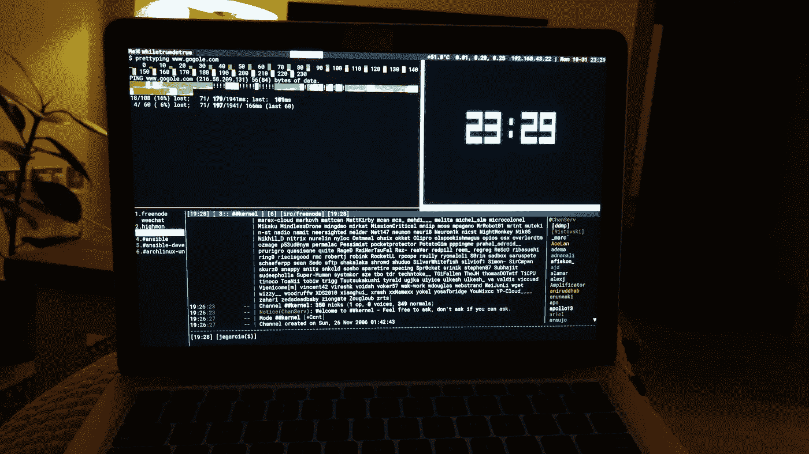
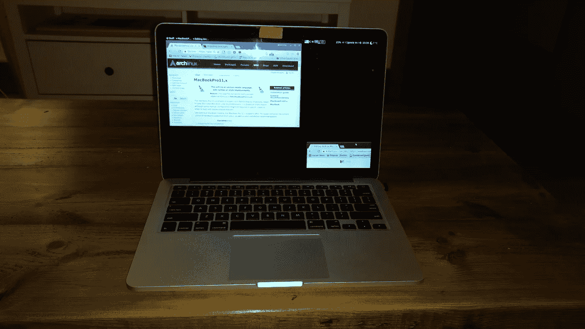

# Macbook Pro 上的 Arch

> 原文：<https://medium.com/hackernoon/arch-on-macbook-pro-72b91da683a>

有很多关于这个的文章，也有很多有用的信息，但是我想写一点关于这个的。

我后来对 osx 相当恼火，从不可信的来源安装的整个许可，自制程序路径改变等，有一段时间我用 OSX，因为它让我更快地“到达那里”，因为我不需要做任何配置(wifi /多屏幕/风扇控制/ thermald /等/我对此有点强迫症)。

上周，我决定给阿奇一次机会，我有一台 macbook 11，1[https://wiki.archlinux.org/index.php/MacBookPro11,x](https://wiki.archlinux.org/index.php/MacBookPro11,x)，这是一台配备视网膜的 2013 年末电脑。我有一些在笔记本电脑上使用 linux 的经验，我知道这并不容易，但我抱着最好的希望，尝试了一下。

我没有分区，我已经决定为 Arch 使用完整的驱动器，所以没有 EFI 魔法，我已经纯粹地为 AUR 使用 Arch，因为我有时懒得从 git 克隆，最好是最先进的(我确信我将需要 broadcom chispsets)

不管怎样，这是我所面临的一系列问题:

*   Retina (xfce 需要一个自定义主题才可用)[使用 xfce hidpi 主题]
*   Vtty 字体太小[ vconsole.conf ]
*   broadcom wl 4360，随机断开[yaourt]
*   休眠/暂停到内存工作！
*   触控板…mtrack 做得不错…无法与 osx [yaourt]相比
*   电池寿命(我开始接受我不会得到 9 个小时，我得到 5 个 tlp powertop mbpfancontrol 和其他)
*   这可能是我的强迫症了，但空闲时比 osx [:S]热 10 度

在我开始这一切之前，我知道会有一些牺牲要做，因为我们都知道当驱动程序必须被逆向工程(4360)等时，有些事情并不顺利，但总的来说我很高兴。它看起来很棒，我需要的东西几乎都是开箱即用的(多屏、wifi、暂停)

这些文章帮助了我

 [## 在我的 MacBook 上运行 Arch Linux

### 如何启动它并教会它超能力

medium.com](/phils-thought-bubble-of-recent-stuff/arch-linux-running-on-my-macbook-2ea525ebefe3)  [## MacBookPro11，x - ArchWiki

### MacBook Pro 11，x 由苹果在 2013 年末和 2014 年年中发货的配备 Retina 显示屏的型号组成。喜欢它的…

wiki.archlinux.org](https://wiki.archlinux.org/index.php/MacBookPro11,x)  [## 在 MacBook Pro Retina 2014 上运行 Arch Linux，支持 DM-Crypt、LVM 和暂停到磁盘

### 法语版 2015-12-08 - gummiboot 已集成到 systemd 2015-11-06 -关于风扇控制的章节 2015-03…

loicpefferkorn.net](https://loicpefferkorn.net/2015/01/arch-linux-on-macbook-pro-retina-2014-with-dm-crypt-lvm-and-suspend-to-disk/)  [## MacBook Pro 上的双引导 Arch Linux 安装

### 在 Macbook Pro 上安装 Arch Linux 的过程有很多注意事项，但这是我见过的最光滑的机器了

codylittlewood.com](http://codylittlewood.com/arch-linux-on-macbook-pro-installation/)  [## 在 MacBook Pro 上安装 Arch Linux

### 也许在另一篇我有更多空间和时间的文章中，我会详细说明在我的电脑上安装 GNU/Linux 的所有原因…

mchladek.me](https://mchladek.me/post/arch-mbp/) 

最后

 [## 在 Apple MacBook Pro 上安装(加密的)Arch Linux

### 按照迈克尔·克拉德克的风格，我认为如果我写一份关于……的总结，对我未来的自己和他人都是有用的

visual-assault.org](https://visual-assault.org/2016/03/05/install-encrypted-arch-linux-on-apple-macbook-pro/) 

抱歉，图片:)

总的来说，我很高兴再次完全控制我的笔记本电脑，我很惊讶有多少事情没有失败，开箱即用，你应该试试。

> [黑客中午](http://bit.ly/Hackernoon)是黑客如何开始他们的下午。我们是 [@AMI](http://bit.ly/atAMIatAMI) 家庭的一员。我们现在[接受投稿](http://bit.ly/hackernoonsubmission)，并乐意[讨论广告&赞助](mailto:partners@amipublications.com)机会。
> 
> 如果你喜欢这个故事，我们推荐你阅读我们的[最新科技故事](http://bit.ly/hackernoonlatestt)和[趋势科技故事](https://hackernoon.com/trending)。直到下一次，不要把世界的现实想当然！

