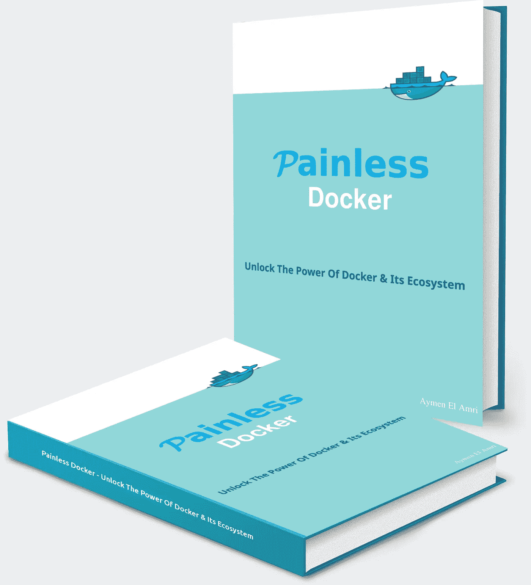
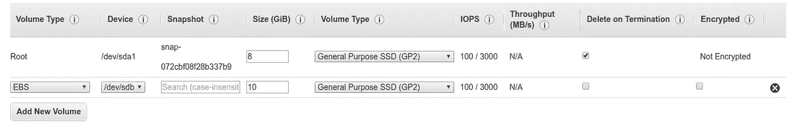
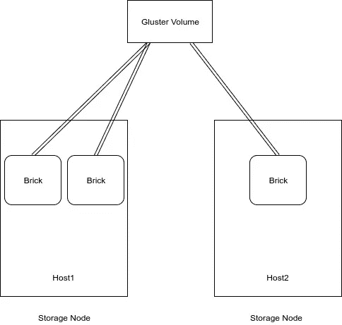
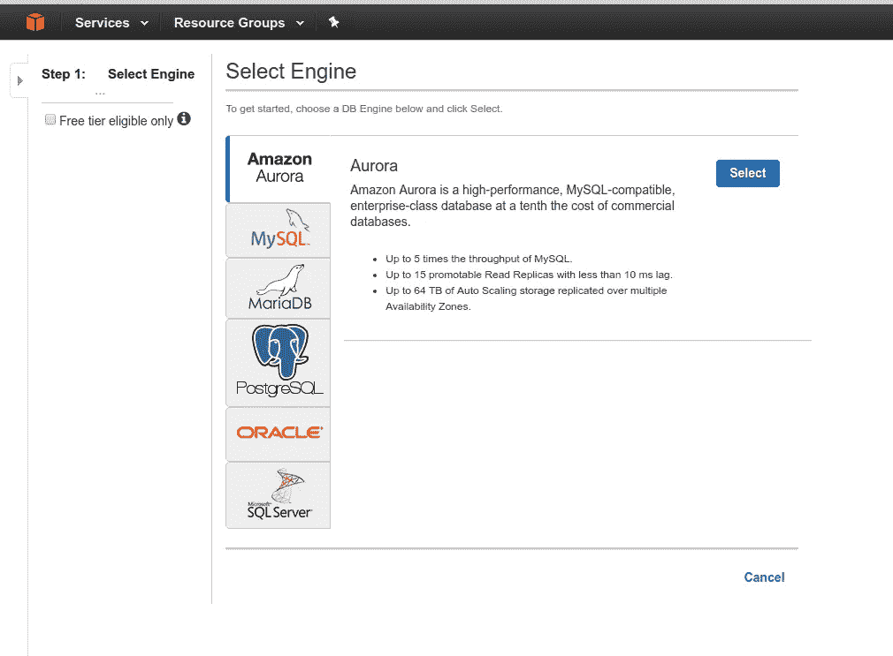
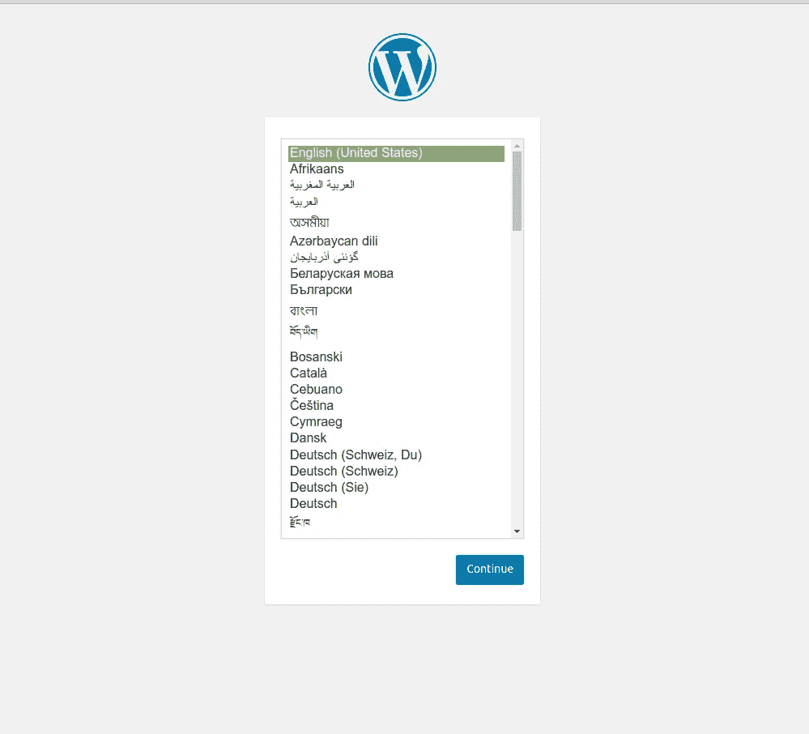
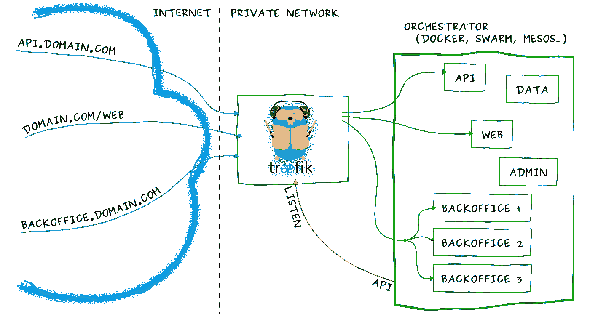
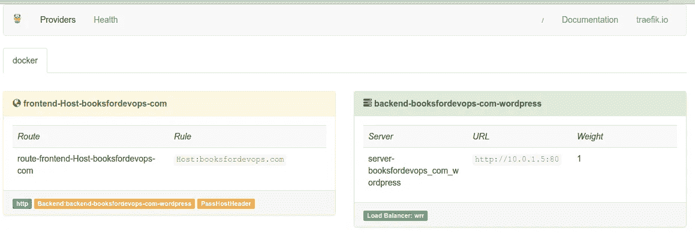
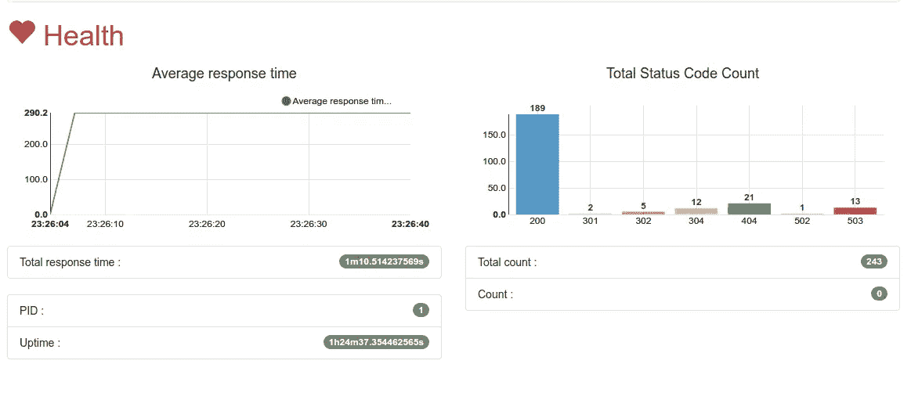
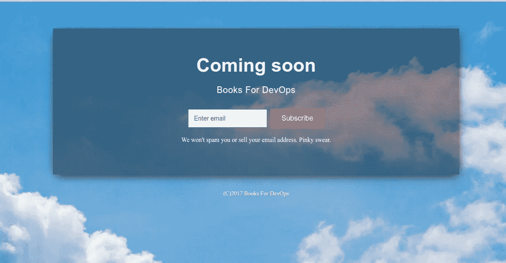

# 使用 Docker Swarm、Traefik & GlusterFS 构建一个高度可用和可伸缩的 Wordpress(第一部分)

> 原文：<https://medium.com/hackernoon/architecting-a-highly-available-and-scalable-wordpress-using-docker-swarm-traefik-glusterfs-a69186e9f0e>

## 放弃

此内容是我们在线课程/培训的一部分/灵感来源。在 2019 年的**黑色星期五期间，我们对这些材料提供高达 80%的折扣。**

您可以在这里享受折扣[。](http://bf.eralabs.io)

[](http://bf.eralabs.io)

Docker 是一个强大的工具，然而学习如何正确使用它可能需要很长时间，特别是在容器生态系统快速增长的情况下，这可能会令人困惑，这就是为什么我有了开始编写[无痛 Docker](http://painlessdocker.com) 的想法。

[无痛 Docker](http://painlessdocker.com) 是一个完整而详细的指南(针对初学者和中级水平)来**创建**、**部署**、**优化**、**安全**、**跟踪**、**调试**、**日志**、**编排**、&、**监控** Docker 和 Docker 集群以创建一个高

这篇文章在[无痛 Docker 书](http://painlessdocker.com)的**加成章节**中有更详细的介绍。

[](http://painlessdocker.com)

使用 Docker、Docker Swarm、Amazon RDS (Aurora) + EC2、GlusterFS & Traefik，我们将创建一个高度可用和可扩展的 WordPress 集群。

# 准备基础设施

我正在使用亚马逊的 EC2 机器，但是你可以使用你喜欢的基础设施。

首先在两个不同的可用性区域中创建两台( *EC2)* 机器**。**

在本教程中，我使用:

```
eu-west-1a
eu-west-1b
```

第一台机器将是群集群的*管理者*，第二台机器将是*工作者*。

**这只是一个例子**，但这取决于您希望集群的可用性如何，**您可以创建 3 个(或更多)管理器来提高可用性**。

管理器将有一个公共的 *IP* ，因为它将接收所有传入的请求并将它们重定向到 Docker，Docker 将处理位于*管理器*(本例中是同一台机器)中的容器和位于*工作器*中的容器之间的内部负载平衡。

别忘了给每台机器加一个*弹性块存储器*。



我们应该有两个实例:


使用`lsbsk`，我们可以验证 *EBS* 是否安装在我们的机器上:

```
**NAME**    MAJ:MIN RM SIZE RO TYPE MOUNTPOINT
xvda    202:0    0   8G  0 disk 
`-xvda1 202:1    0   8G  0 part /
xvdb    202:16   0  10G  0 disk
```

在每台机器上，创建我们的*文件系统*:

```
**sudo** mkfs.xfs /dev/xvdb
```

# 使用 GlusterFS 创建可信池

GlusterFS 是一个横向扩展的网络连接存储文件系统。

使用通用的现成硬件，您可以为媒体流、数据分析和其他数据和带宽密集型任务创建大型分布式存储解决方案。

GlusterFS 最初由 Gluster，Inc .开发，后来由 Red Hat，Inc .开发，这是 Red Hat 在 2011 年收购 Gluster 的结果。

让我们从安装 *GlusterFS* 开始:

```
apt-get  **install** -y glusterfs-**server**
```

如果您正在使用另一个*操作系统*或另一个 *Linux* 发行版，请根据您的需要修改这个命令。


GlusterFS Logo

**注意:**我创建了一台没有公共 *IP* (即 *worker* )的机器，这台机器将无法访问互联网并安装 *GlusterFS* ，除非你设置一个亚马逊 *NAT 实例*。如果你只是做一些测试或者不熟悉 *AWS* ，创建一个带有公共 *IP* 的机器或者创建一个 *EIP* 然后将其分配给机器。

创建一个挂载目标(*砖块*):

```
**mkdir** -p /glusterfs/bricks/booksfordevops.com
```

**注意**:砖块是底层磁盘*文件系统*上的一个目录。如果其中一块砖出现故障，则说明硬件故障导致数据不可用。

使用 *fstab* 锉刀将 *EBS* 永久安装到新砖块上；

```
/dev/xvdb /glusterfs/bricks/booksfordevops.com xfs    defaults        0 0
```

现在使用`mount /dev/xvdb`来应用我们添加到 *fstab* 文件中的修改。

在每个`/glusterfs/bricks/booksfordevops.com`挂载点下有一个用于 *GlusterFS* 卷的目录:

```
**mkdir** /glusterfs/bricks/booksfordevops.com/wordpress
```

让我们将这几行添加到每台服务器上的`/etc/hosts/`文件中，我们将在下面的步骤中用到它:

```
172.31.43.166 node1
172.31.14.90 node2
```

*节点 1* 是*管理者*节点 2 是我们的*工人*。为了测试这个配置，您可以从`node1`中执行:`ping node2`:

```
**PING** node2 (172.31.14.90) 56(84) bytes of data.
64 bytes from node2 (172.31.14.90): icmp_seq=1 ttl=64 time=0.857 ms
```

从*管理器* ( *node1* )中，键入以下命令建立 *Gluster* 集群节点信任关系:

```
**gluster** peer probe node2
```

您应该有`peer probe: success`作为输出，否则检查您的防火墙设置或跟踪您的日志。

现在我们有了一个工作的 *GlusterFS* 可信池。

一个 *GlusterFS* 存储池是一个存储服务器的可信网络(在我们的例子中是 *node1* 和 *node2* )。当我们启动第一台服务器时，存储池仅由该服务器组成。当我们向存储池添加额外的 *node2* 存储服务器时(使用来自已经受信任的 *node1* 存储服务器的 *probe* 命令)，我们创建了一个包含 2 台服务器的受信任存储池。



An Example Of A GlusterFS Architecture

现在，从管理服务器，我们应该创建一个双向镜像卷，我们将使用以下命令将其命名为`booksfordevops-com-wordpress`:

```
gluster volume create booksfordevops_com-wordpress replica 2 node1:/glusterfs/bricks/booksfordevops.com/wordpress node2:/glusterfs/bricks/booksfordevops.com/wordpress
```

您将得到以下输出:

```
volume **create**: booksfordevops_com-wordpress: success: please **start** the volume **to** access **data**
```

如果你输入`gluster volume list`就可以看到音量

```
booksfordevops_com-wordpress
```

现在你应该使用`gluster volume start booksfordevops_com-wordpress`来启动它:

如果一切正常，您将得到与此类似的输出:

```
**volume** start: booksfordevops_com-wordpress: success
```

我们的卷应该是健康的，但是您可以使用`gluster volume status`来检查它的状态:

```
Status **of** volume: booksfordevops_com-wordpress
Gluster process                             TCP Port  RDMA Port  Online  Pid
------------------------------------------------------------------------------
Brick node1:/glusterfs/bricks/booksfordevop
s.com/wordpress                             49152     0          Y       1868 
Brick node2:/glusterfs/bricks/booksfordevop
s.com/wordpress                             49152     0          Y       17591
NFS Server on localhost                     N/A       N/A        N       N/A  
Self-heal Daemon on localhost               N/A       N/A        Y       1894 
NFS Server on node2                         2049      0          Y       17612
Self-heal Daemon on node2                   N/A       N/A        Y       17613Task Status **of** Volume booksfordevops_com-wordpress
------------------------------------------------------------------------------
There are no active volume tasks
```

既然 *GlusterFS* 服务器已经设置好了，我们需要设置客户端。让我们(在每个节点中)创建一个目录，供集群的每个节点中的客户端使用:

```
**mkdir** -p /data/booksfordevops_com-wordpress
```

我们需要从*节点 1* 在*节点 2* 上挂载一个共享目录，并从*节点 2* 在*节点 1* 上挂载同一个目录。

在*节点 1* 上，在`/etc/fstab`文件的末尾增加这一行:

```
node2:/booksfordevops_com-wordpress       /data/booksfordevops_com-wordpress       glusterfs     defaults,_netdev  0  0
```

在*节点 2* 上，在`/etc/fstab`文件的末尾增加这一行:

```
node1:/booksfordevops_com-wordpress       /data/booksfordevops_com-wordpress       glusterfs     defaults,_netdev  0  0
```

然后在两台主机上，键入`mount -a`。

# 创造我们的蜂群

下一步是在两台主机上安装 Docker:

```
**curl** -fsSL https://get.docker.com/ | sh
```

然后初始化 Swarm 集群:

```
**docker** swarm init
```

在*管理器*上执行最后一个命令，你将得到一个在*工作器*上执行的命令:

```
**docker** swarm join \
    --token XXXXXX-x-xxxxxxxxxxxxxxxxxxxxxxxxx-xxxxxxxxxxxxx \
    172.31.43.116:2377
```

如果一切正常，工人*将加入集群:*

```
**This** node joined a swarm as a worker.
```

# 部署我们的应用程序

在本教程中，我们想要创建一个 *Wordpress* 博客，我们可以在我们的 *GlusterFS* 可信池中托管 *Mysql* 或 *MariaDB* 数据库，但是在我的具体例子中，我创建了一个 *Aurora* 数据库。



我们将在我们创建的存储池中托管 *Wordpress* 文件，指向`/data/booksfordevops_com-wordpress`。

这是我们将要部署的 Docker Compose v3 文件:

```
version: '3'
networks:
  booksfordevops_com-network:services:
  wordpress:
    image: wordpress:4.7.3-php7.1-apache
    ports:
      - 8000:80
    networks:
      - booksfordevops_com-network
    volumes:
      - /data/booksfordevops_com-wordpress:/var/www/html
    environment:
      WORDPRESS_DB_HOST: xxxxx.cluster-xxxxx.eu-west-1.rds.amazonaws.com:3306
      WORDPRESS_DB_USER: user
      WORDPRESS_DB_PASSWORD: password
      WORDPRESS_DB_NAME: db_name
      WORDPRESS_TABLE_PREFIX: wp_
    deploy:
      mode: replicated
      replicas: 1
      labels: [APP=WORDPRESS]
      restart_policy:
        condition: always
```

**注意:**出于安全原因，不要将 *docker-compose.yml* 文件与``/data/booksfordevops_com-wordpress`中的 *Wordpress* 文件放在同一个目录中，它将被公开访问。

为了部署我们的网站，我们应该执行以下命令:

```
**docker** stack deploy --compose-file=docker-compose.yml booksfordevops_com
```

我们可以使用类似于下面的命令来部署 *Wordpress* 应用程序:

```
docker network -d overlay booksfordevops_com-networkdocker service create --name booksfordevops_com_wordpress \
--publish 8000:80 \
--mount type=bind,source=/data/wp,target=/var/www/html \
-e WORDPRESS_DB_HOST=x.cluster-x.eu-west-1.rds.amazonaws.com:3306 \
-e WORDPRESS_DB_USER=user \
-e WORDPRESS_DB_PASSWORD=password \
-e WORDPRESS_DB_NAME=db_name \
-e WORDPRESS_TABLE_PREFIX=wp_  \
--replicas 1 \
--network booksfordevops_com-network \
wordpress:4.7.3-php7.1-apache
```

但是将所有这些放在 Docker Compose v3 文件中是部署我们的应用程序的一种更有组织的方式。

你的全新安装可能会有一些前提问题，你需要执行这些命令:

```
cd /data/booksfordevops_com-wordpress**chown** www-data:www-data  -R *find . -type d -**exec** **chmod** 755 {} \; find . -type f -**exec** **chmod** 644 {} \;
```

在两个服务器中，您现在可以注意到 *Wordpress* 文件从服务容器挂载到主机卷:

```
**ls** -lrth /data/booksfordevops_com-wordpress-rw-r*--r--  1 www-data www-data  418 Sep 25  2013 index.php*
-rw-r*--r--  1 www-data www-data 3.3K May 24  2015 wp-cron.php*
-rw-r*--r--  1 www-data www-data  364 Dec 19  2015 wp-blog-header.php*
-rw-r*--r--  1 www-data www-data 1.6K Aug 29  2016 wp-comments-post.php*
-rw-r*--r--  1 www-data www-data 3.0K Aug 31  2016 xmlrpc.php*
-rw-r*--r--  1 www-data www-data 5.4K Sep 27 21:36 wp-activate.php*
-rw-r*--r--  1 www-data www-data 4.5K Oct 14 19:39 wp-trackback.php*
-rw-r*--r--  1 www-data www-data  30K Oct 19 04:47 wp-signup.php*
-rw-r*--r--  1 www-data www-data 3.3K Oct 25 03:15 wp-load.php*
-rw-r*--r--  1 www-data www-data  34K Nov 21 02:46 wp-login.php*
-rw-r*--r--  1 www-data www-data 2.4K Nov 21 02:46 wp-links-opml.php*
-rw-r*--r--  1 www-data www-data  16K Nov 29 05:39 wp-settings.php*
-rw-r*--r--  1 www-data www-data  20K Jan  2 18:51 license.txt*
-rw-r*--r--  1 www-data www-data 7.9K Jan 11 05:15 wp-mail.php*
-rw-r*--r--  1 www-data www-data 7.3K Jan 11 17:46 readme.html*
drwxr-xr-x 18 www-data www-data 8.0K Mar  6 16:00 wp-includes
drwxr-xr-x  9 www-data www-data 4.0K Mar  6 16:00 wp-admin
-rw-r*--r--  1 www-data www-data 2.7K Mar 19 19:41 wp-config-sample.php*
-rw-r*--r--  1 www-data www-data 3.2K Mar 19 19:41 wp-config.php*
drwxr-xr-x  4 www-data www-data   52 Mar 19 19:51 wp-content
```

如果您在每台服务器上检查创建的块，您会发现相同的文件:

```
**ls** -lrth /glusterfs/bricks/booksfordevops.com
```

在这一步，我们有一个工作的 *Wordpress* 安装，你可以使用*管理器*的 *IP* 地址和端口 *8000* 来访问它。



# 添加 Traefik:

*Træfɪk* 是一个 *HTTP* 反向代理和负载均衡器，用于部署微服务并支持 Docker 和 Docker Swarm(以及其他后端，如*mesos*/*marathon*、 *Consul* 、 *Etcd* 、 *Zookeeper* 、 *BoltDB* 、 *Amazon ECS* 和

**

*让我们创建一个服务，在管理器(`--constraint=node.role==manager`)上运行 *Traefik* 。反向代理将在单独的网络上运行(`--network traefik-net`)。*

```
*docker network -d overlay traefik-net;docker service create --name traefik \
--constraint=node.role==manager \
--publish 80:80 \
--publish 8080:8080 \
--mount type=bind,source=/var/run/docker.sock,target=/var/run/docker.sock \
 --network traefik-net \
traefik:v1.1.0-rc1 \
--docker \
--docker.swarmmode \
--docker.domain=traefik \
--docker.watch \
--web*
```

**

# *更新 Wordpress 服务*

*为了让我们的 *Wordpress* 网站与 *Traefik* 一起工作，我们将更新它的 *docker-compose* 文件，并将其添加到同一个 *Traefik* 网络`traefik-net`。我还添加了一些与 *Traefik* 相关的标签，如*端口*和*前端。规则*:*

```
*version: '3'
networks:
  traefik-net:
    external: true
  booksfordevops_com-network:services:
  wordpress:
    image: wordpress:4.7.3-php7.1-apache
    ports:
      - 8001:80
    networks:
      - booksfordevops_com-network
      - traefik-net
    volumes:
      - /data/booksfordevops_com-wordpress:/var/www/html
    environment:
      WORDPRESS_DB_HOST: xxxx.cluster-xxxxx.eu-west-1.rds.amazonaws.com:3306
      WORDPRESS_DB_USER: user
      WORDPRESS_DB_PASSWORD: password
      WORDPRESS_DB_NAME: db_name
      WORDPRESS_TABLE_PREFIX: wp_ deploy:
      mode: replicated
      replicas: 2
      labels: 
        APP: WORDPRESS
        traefik.port: 80
        traefik.frontend.rule: "Host:booksfordevops.com,www.booksfordevop.com" restart_policy:
        condition: on-failure*
```

*使用以下命令更新部署*

*`docker stack deploy --compose-file=docker-compose.yml booksfordevops_com`*

*您可以使用简单的 *curl* 来检查配置的域是否可访问，在我的例子中:*

```
***curl** -H Host:booksfordevops.com  [http://127.0.0.1](http://127.0.0.1)*
```

*您还可以转到 health dashboard，以便查看我们的应用程序的响应时间和状态代码等信息。*

**

# *我们学到了什么*

*我们看到了如何构建一个高度可用的网站，其中存储和计算分布在两个不同的区域。*

*在每台 *EC2* 机器中，我们可以将 *Wordpress* 扩展到多个容器，并拥有另一个级别的弹性。*

*我们的反向代理可以检查每个容器的健康状况，并设法将流量重定向到工作的容器。*

*我们使用现代工具和技术，如:*

*   *亚马逊 RDS*
*   *亚马逊 EC2*
*   *GlusterFS*
*   *码头工人*
*   *码头工人群*
*   *特拉菲克*

*我们的网站正在运行，您可以订阅并等待 DevOps 发布的[书籍。](http://booksfordevops.com/)*

*[](http://booksfordevops.com/)*

# *连接更深*

*本文是[无痛 Docker 书的一部分:释放 Docker 的力量&它的生态系统](http://painlessdocker.com/)。*

*[无痛码头](http://painlessdocker.com)是一个实用的指南，以现实世界为基础**来掌握**码头**和**其生态系统**。***

*无痛 Docker 是一个完整而详细的指南，用于创建、部署、优化、保护、跟踪、调试、记录、编排和监控 Docker 和 Docker 集群。通过这本书，你将学习如何在开发和生产环境中使用 Docker，以及它们之间的 DevOps 管道，以构建现代微服务应用。*

*如果你对这篇文章有共鸣，请订阅 [DevOpsLinks](http://devopslinks.com) : **一个由来自世界各地&热情的 DevOps、SysAdmins &开发人员组成的在线社区**。*

*你可以在 [Twitter](https://twitter.com/eon01) 、 [Clarity](https://clarity.fm/aymenelamri/) 或者我的[博客](http://eon01.com/blog)上找到我，你也可以查看我的书:[salt stack For devo PS](http://saltstackfordevops.com)&[The jump start Up](http://thejumpstartup.com)。*

**

*如果你喜欢这篇文章，请推荐并分享给你的追随者。*

*[](http://bit.ly/HackernoonFB)**[](https://goo.gl/k7XYbx)**[](https://goo.gl/4ofytp)*

> *[黑客中午](http://bit.ly/Hackernoon)是黑客如何开始他们的下午。我们是阿美族家庭的一员。我们现在[接受投稿](http://bit.ly/hackernoonsubmission)并乐意[讨论广告&赞助](mailto:partners@amipublications.com)机会。*
> 
> *如果你喜欢这个故事，我们推荐你阅读我们的[最新科技故事](http://bit.ly/hackernoonlatestt)和[趋势科技故事](https://hackernoon.com/trending)。直到下一次，不要把世界的现实想当然！*

**