# 使用 Docker Swarm & Traefik 构建高度可扩展的 Golang API

> 原文：<https://medium.com/hackernoon/architecting-a-highly-scalable-golang-api-with-docker-swarm-traefik-875d1871cc1f>

这篇文章将向你展示如何设置一个**群集群**，部署几个微服务，并创建一个反向代理服务(用 [**Traefik**](https://traefik.io/) )负责在它们的基本 URL 上路由请求。

如果您还没有创建一个 Swarm 集群，您可以使用下面的 shell 脚本来设置一个包含 3 个节点(1 个管理器和 2 个工作器)的集群

发出以下命令来执行脚本:

> chmod +x setup.sh
> 
> 。/setup.sh

上述命令的输出如下:

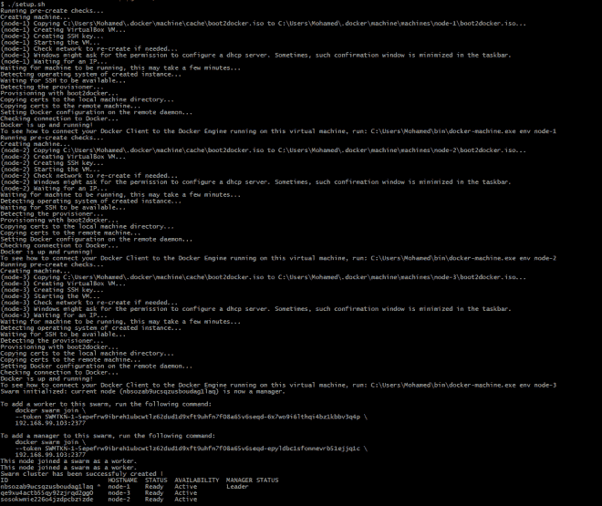

此时，我们有 3 个节点:

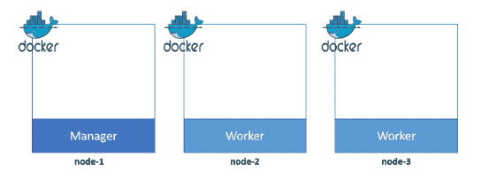

我们的示例微服务应用程序由两部分组成。**书籍 API** 和**电影 API** 。对于这两个部分，我已经为您准备了可以从 [DockerHub](https://hub.docker.com/u/mlabouardy/) 中提取的图像。

两张图片的 **Dockerfiles** 可以在我的 [Github](https://github.com/mlabouardy/alb-go) 上找到。

用以下内容创建 *docker-compose.yml* 文件:

*   我们使用一个名为 *traefik-net* 的**覆盖网络**，在其上我们添加我们想要向 **Traefik** 公开的服务。
*   我们使用*约束*在 Swarm manager 上的 workers & Traefik 上部署 API。
*   Traefik 容器被配置为在端口 **80** 上侦听标准 HTTP 流量，但也为 web 仪表板公开端口 **8080** 。
*   docker 套接字( **/var/run/docker.sock** )的使用允许 Traefik 监听 **Docker 守护进程**事件，并在容器启动/停止时重新配置自身。
*   trfik 使用标签 *traefik.frontend.rule* 来确定哪个容器用于哪个请求路径。
*   *配置*部分从 *config.toml* 中为 Traefik 创建一个配置文件(它启用 **Docker** 后端)

为了部署我们的堆栈，我们应该执行以下命令:

> docker stack deploy-compose-file docker-compose . yml API

让我们检查一下覆盖网络:

> 码头网络

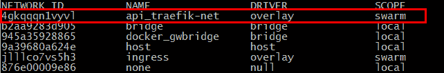

Traefik 配置:

> docker 配置 ls

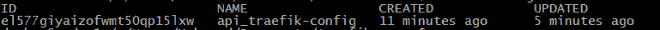

要显示配置内容:

> docker 配置检查 API _ traefik-config-pretty

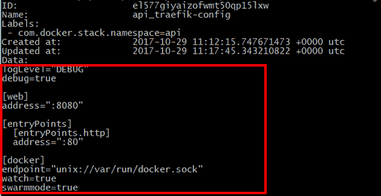

最后，列出所有服务:

> docker 堆栈 ps api

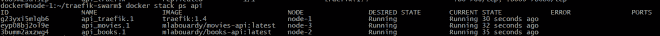

在上面的列表中，你可以看到 3 个容器正在**节点-1** 、**节点-2** & **节点-3** 上运行:

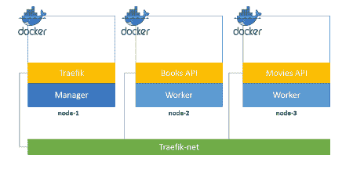

如果你把你最喜欢的浏览器(不是你的 IE)指向**Traefik Dashboard URL**(**http://MANAGER _ NODE _ IP:8080**)你应该会看到前端和后端都定义得很好:

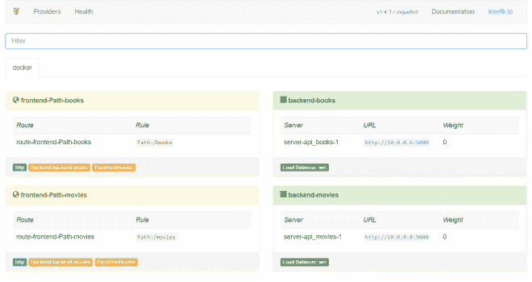

如果你查看[**http://MANAGER _ NODE _ IP/books**，](http://MANAGER_NODE_IP/books,)你会得到一个图书列表:

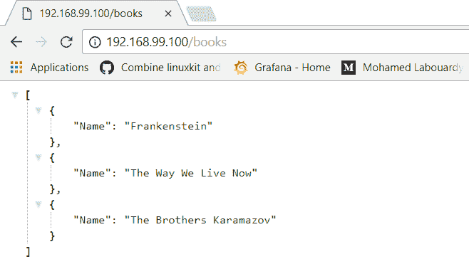

如果用 **/movies** 替换基本 URL:

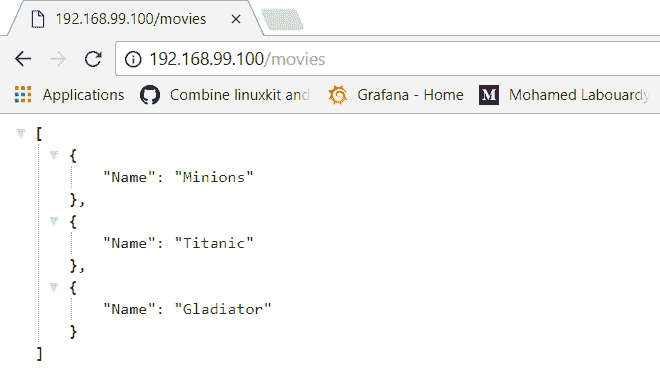

如果我们想要扩展书籍和电影 API，会发生什么？用 **docker 服务秤**命令:

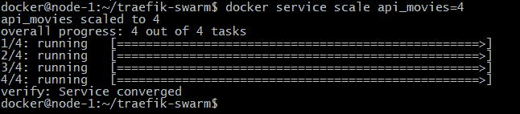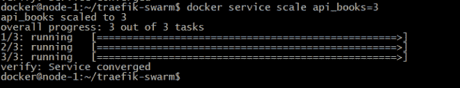

我们可以确认:

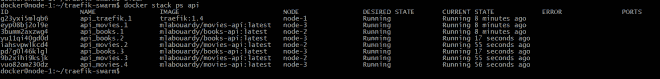

显然 **Traefik** 确实意识到我们启动了更多的容器，并使它们自动对右侧前端可用:

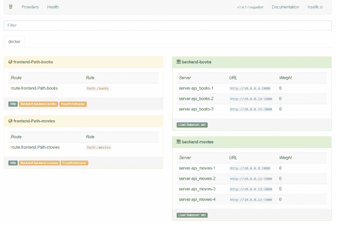

在下图中，您会发现经理已经决定使用[循环调度](https://en.wikipedia.org/wiki/Round-robin_scheduling)策略在**节点-2** (其中 3 个)和**节点-3** (其中 4 个)上调度新容器:

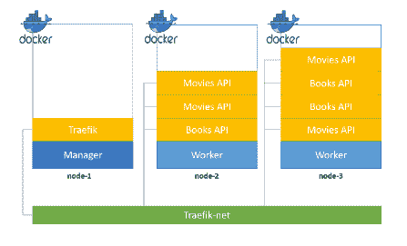