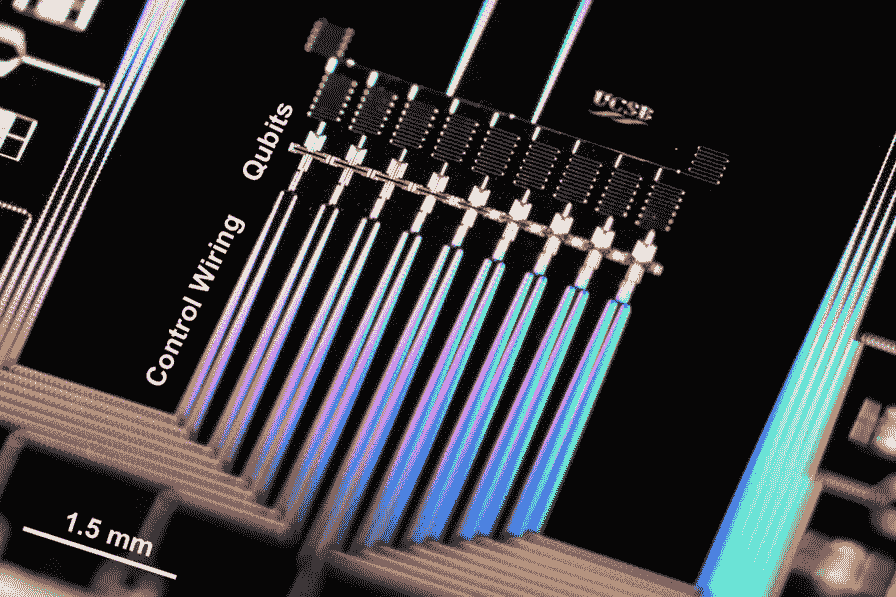
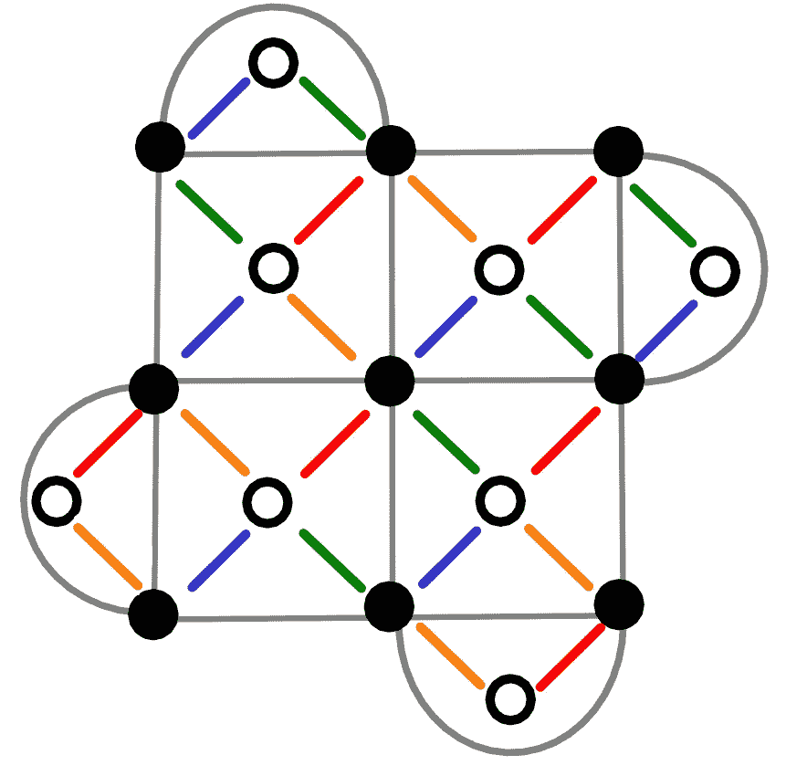

# 谷歌是不是要造世界上第一个量子比特？

> 原文：<https://medium.com/hackernoon/are-google-about-to-build-the-worlds-first-qubit-71da2be83528>

Google device with nine qubits or zero qubits, depending on how you count. Credit: Julian Kelly/Google.

量子位是量子计算的基本单位。所以量子硬件开发者显然喜欢吹嘘他们有多少。虽然有些人声称他们的设备中有数千个，但实际上还没有人制造过哪怕一个。

我们用量子位这个名字有几个不同的用途。一个是物理量子位。*物理*部分指的是这些是真实的、现实生活中的物体。*位*部分告诉我们，这些对象应该有两种可能的状态。qu 代表量子，因为我们需要以量子力学的方式来操纵状态。

任何名副其实的量子位也应该有极低的噪声。我们操纵它们和与它们互动的方式应该近乎完美。作为实验物理学的一项成就，它们一定处于顶峰:科学和工程的奇迹。

即便如此，他们还不够好。对于[量子计算机](https://hackernoon.com/tagged/quantum-computer)来说，近乎完美几乎没用。

这并不比我们对普通计算机的期望更高。你的屏幕上有数百万个像素，但如果只有一个像素在随机移动，你就会注意到。同样的道理也适用于你程序中的数百万比特。只需要几个切换值，因为他们对一切都变得毫无意义感到厌烦。

当我们编程时，我们经常忘记我们计算机中的比特有实际的物质形式。我们认为它们是一个抽象的概念，纯洁而不朽。否则，软件开发将是一个非常不同的活动。

量子程序在设计时也考虑到了同样的完美程度。要运行它们，我们需要*逻辑量子位*:量子信息本身概念的体现。

构建逻辑量子位需要我们驯服它们物理表亲的野性。我们需要量子纠错。许多物理量子位被聚集在一起，并被欺骗而变得比它们各部分的总和还要大。我们使用的物理量子比特越多，效果越好。噪声呈指数下降，直到我们可以确定在计算过程中不会出现一个错误。

这不是没有代价的。我们必须毫不在意花费几百个物理量子位来建立一个单一的逻辑量子位。但如果这意味着实现量子计算的全部承诺，这将是值得的。

量子纠错最流行的设计是表面码。对于最小的表面代码，需要 17 个物理量子位。这些将建立一个逻辑量子位，但没有足够的复杂性来实际做任何事情。

像这样的事情还没有实现。要了解原因，让我们看看需要什么。

这是一个表面代码。这 17 个黑色和白色的点是物理量子位。24 条彩色线代表了某种量子操作，受控非。对于每一对相连的量子位，这个操作应该可以干净直接地完成。

给所有这些受控的机器人布线是主要的挑战。仅仅在我们的量子处理器中有 17 个量子位是不够的。我们还需要指令集来支持这个特定的流程网络。

在一条线上有一堆物理量子位已经是旧闻了，两条线相邻也是可行的。但是表面代码所需的 2D 连接点阵要复杂得多。

这非常棘手，它可能会改变量子计算的前景。可以说，IBM 和谷歌目前处于领先地位，他们用超导电路构建量子位。但是其他方法也不远了。基于捕获离子的量子比特已经被用来做一些基于量子纠错的令人印象深刻的事情(见[这里](https://arxiv.org/abs/1403.5426))。

即便如此，谷歌仍承诺在今年年底前实现这一目标以及更多目标。他们承诺 49 个物理量子位的 7x7 点阵。

 [## 谷歌计划展示量子计算的优势

### 长期以来，量子计算机一直有望完成某些不可能完成的计算——或者至少…

spectrum.ieee.org](https://spectrum.ieee.org/computing/hardware/google-plans-to-demonstrate-the-supremacy-of-quantum-computing) 

与其他设备相比，这将是一个巨大的进步，如 16 个物理量子位的 IBMs 2x8 晶格。

 [## IBM 将量子系统的计算能力提高了一倍，开发人员在 IBM Quantum 上执行了 30 万次以上的实验…

### 了解更多关于 IBM 新的 16 量子位量子处理器的信息，现在可以在 Q Experience 上进行测试访问实验…

developer.ibm.com](https://developer.ibm.com/dwblog/2017/quantum-computing-16-qubit-processor/) 

IBM 设备具有足够的连接性，可以将物理量子位转化为逻辑*位*。在接下来的几个月里，它将会做很多更酷的事情，正如你所期待的那样，它是这个领域最前沿的设备。但是制造一个逻辑量子位不会是它的成就之一。

事实上，谷歌的 49 个量子位将是如此具有革命性，很难相信我们会在今年年底前看到它。今年更现实的里程碑是 IBM 的 17 量子位设备和谷歌的 20 量子位设备。两者都有足够的量子位来开始使用表面代码。但是他们有正确的布局吗？只有时间能证明一切。

我们可能不用等太久。约翰·马丁尼，负责建造谷歌量子设备的家伙，将在下周给[一个演讲。标题…](https://qec2017.gatech.edu/Schedule)

> *用表面代码*测量逻辑误差标度

表面代码肯定在科技巨头的雷达上。世界上第一个逻辑量子比特要来了。谷歌的 20 量子比特设备已经管好了吗？

**更新:**贝特里奇的标题定律指出“任何以问号结尾的标题都可以用*不*这个词来回答。”这次法律没有让我们失望。谷歌的 22 量子位设备将只是两排 11 量子位的[:对于表面代码来说连接不够好。他们的目标当然是建立一个逻辑量子位，但许多其他人也是如此。在达到这个里程碑之前，IBM 和 Google 的超导量子位可能会被囚禁离子量子位超越。试图达到未来的里程碑也可能带来其他架构，如自旋量子位。量子计算机的发展还有许多激动人心的日子。](https://twitter.com/MJBiercuk/status/906552742700654593)

[*在 Twitter 上找到我*](https://twitter.com/decodoku)