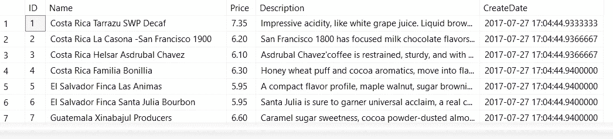
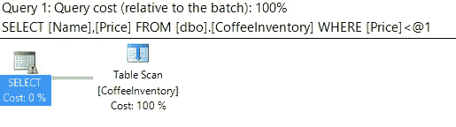
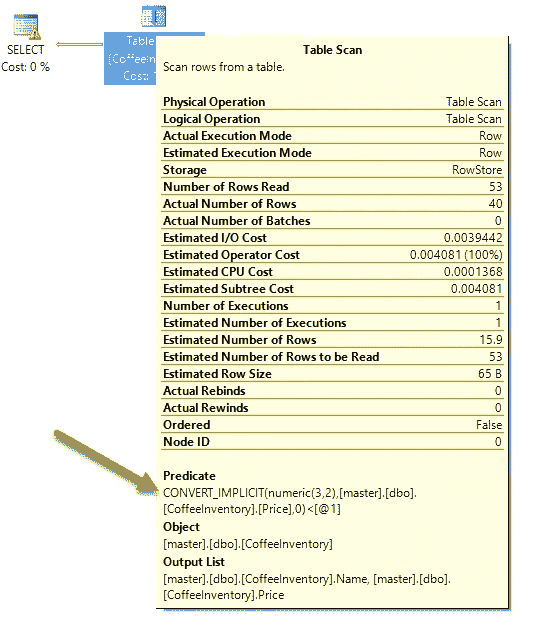
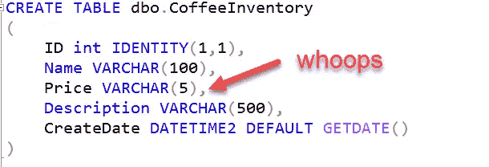
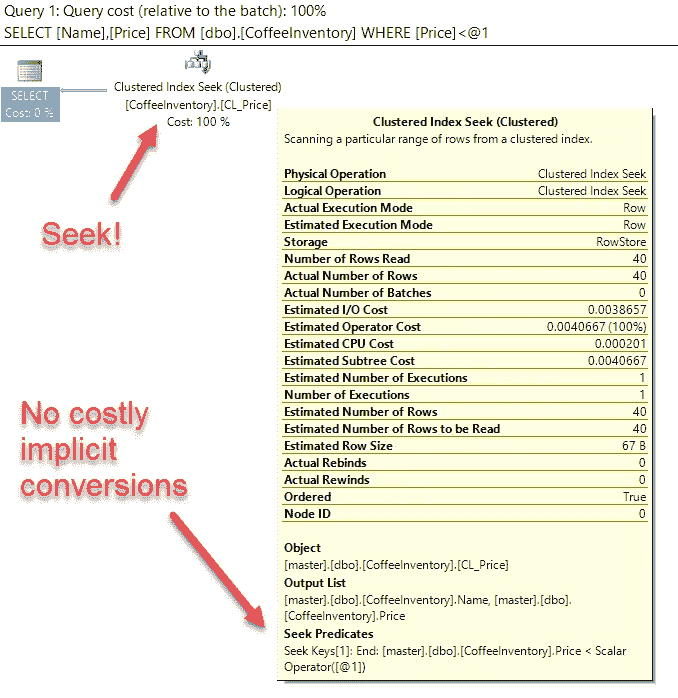

# 隐式转换会降低 SQL 查询性能吗？

> 原文：<https://medium.com/hackernoon/are-implicit-conversions-killing-your-sql-query-performance-70961e547f11>


Photo by [chuttersnap](https://unsplash.com/photos/gts_Eh4g1lk?utm_source=unsplash&utm_medium=referral&utm_content=creditCopyText) on [Unsplash](https://unsplash.com/?utm_source=unsplash&utm_medium=referral&utm_content=creditCopyText)

Watch this post on [YouTube](https://www.youtube.com/watch?v=RqpApsRJpYc&feature=youtu.be)

您是否遇到过运行缓慢的查询，即使您已经为它创建了索引？

发生这种情况有几种不同的原因。我最常看到的一种情况发生在下面的场景中。

## 我要一杯浓缩咖啡

假设我有一个[表 dbo。咖啡库存](https://gist.github.com/bertwagner/e1225294ae73f2d74575d834e93597e8)的咖啡豆和价格，我每周从[我最喜欢的生咖啡豆供应商](https://www.sweetmarias.com/)那里获取。它看起来像这样:

```
-- Make sure Actual Execution Plan is on
-- Let's see what our data looks like
SELECT * FROM dbo.CoffeeInventory
```



If you want to follow along, you can get this data set from [this GitHub Gist](https://gist.github.com/bertwagner/e1225294ae73f2d74575d834e93597e8)

我希望能够高效地查询这个表并根据价格进行过滤，所以接下来我创建了一个索引，如下所示:

```
CREATE CLUSTERED INDEX CL_Price ON dbo.CoffeeInventory (Price)
```

现在，我可以编写我的查询来找出低于我愿意支付的咖啡价格:

```
SELECT Name, Price FROM dbo.CoffeeInventory WHERE Price < 6.75
```

您希望这个查询非常快，并使用聚集索引查找，对吗？

**错了！**



What the heck?

当我在谓词中过滤的列上添加聚集索引时，为什么 SQL 会扫描表？事情不应该是这样的！

亲爱的读者，如果我们更仔细地观察表扫描操作，我们会注意到一个叫做 CONVERT_IMPLICIT 的小东西:



CONVERT_IMPLICIT: ruiner of fast queries

CONVERT_IMPLICIT 在做什么？顾名思义，它在执行查询时必须转换一些数据(与我在查询中指定了显式的 CAST()或 convert()函数相反)。

它需要这样做的原因是因为我将 Price 列定义为 VARCHAR(5):



Who put numeric data into a string datatype? Someone who hasn’t had their coffee yet today.

然而，在我的查询中，我将与一个数字`WHERE Price < 6.75`进行比较。 [SQL Server](https://hackernoon.com/tagged/sql-server) 说它不知道如何比较字符串和数字，所以它必须将 VARCHAR 字符串转换为数字(3，2)。

这是痛苦的。

为什么？因为 SQL 正在为我的表中的每一行执行到数值数据类型的隐式转换。因此，它不能使用索引，因为它最终必须扫描整个表，首先将每条记录转换为数字。

这不仅仅发生在数字和字符串转换上。[微软发布了一整张图表](https://docs.microsoft.com/en-us/sql/t-sql/data-types/data-type-conversion-database-engine)详细说明了什么类型的数据类型比较会强制进行隐式转换:


[https://docs.microsoft.com/en-us/sql/t-sql/data-types/data-type-conversion-database-engine](https://docs.microsoft.com/en-us/sql/t-sql/data-types/data-type-conversion-database-engine)

那可是好多橙圈/隐式转换啊！

## 如何更快的查询我的咖啡？

在这种情况下，我们有两个选择。

1.  修复我们的表的数据类型，使之与实际存储在其中的数据保持一致(数据管理员喜欢这样)。
2.  不会导致 SQL Server 转换列中的每一行。

上面的第一条是不言自明的，如果你能做到的话，这是更好的选择。但是，如果您不能修改列类型，您最好这样编写您的查询:

```
SELECT Name, Price FROM dbo.CoffeeInventory WHERE Price < '6.75'
```



因为我们对等价的数据类型进行比较，所以 SQL Server 不需要进行任何转换，我们的索引就会被使用。呜-呼！

## 我的服务器的其余部分呢？

还记得上面的图表吗？有许多不同的数据比较可以强制 SQL Server 进行痛苦的列端隐式转换。

幸运的是， [Jonathan Kehayias](https://www.sqlskills.com/blogs/jonathan/finding-implicit-column-conversions-in-the-plan-cache/) 编写了一个很棒的查询，可以帮助您通过查询计划缓存找到列端隐式转换。运行他的查询是识别查询中发生的大多数隐式转换的一个很好的方法，这样您就可以返回并修复它们——然后为您改进的查询性能[而高兴](https://hackernoon.com/tagged/performance)！

*还在读书？你可能会喜欢在 Twitte 上关注我*

*喜欢这篇文章吗？请推荐给它一颗绿色的心*💚*下图。*