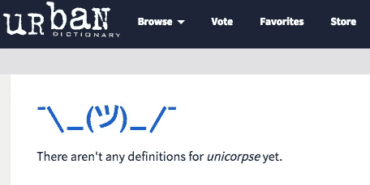

# 盈利能力在创业公司中有多重要？

> 原文：<https://medium.com/hackernoon/are-profitable-startups-for-losers-e3394af85887>

每天都有另一个高调的创始人，比如 Ruby on Rails 的创始人([反颠覆狂热文章](https://medium.com/u/54bcbf647830#.lkl8rz7zc)。

反独角兽。[看到吉尔特加入单体](http://www.marketwatch.com/story/another-billion-dollar-tech-startup-smacked-by-reality-2015-12-14)我们应该感到高兴吗？

相反，我们被建议创建自力更生的盈利创业公司。忘记风投和投资者，按照自己的方式去做。掌握自己的命运。5000 万美元的 100%比 10 亿美元的 5%好得多。

根据 [Circa](https://medium.com/u/e5bd2241b388?source=post_page-----e3394af85887--------------------------------) 的联合创始人 [Matt Galligan](https://medium.com/u/9e1633b0e7ad?source=post_page-----e3394af85887--------------------------------) 的说法，他在《创业公司本周[的](https://medium.com/u/ca9aa8cba00a?source=post_page-----e3394af85887--------------------------------)[这一集](http://thisweekinstartups.com/nextbit-futurekitchen-circa-launchmw/)中哀叹他们只有创始人的董事会(大约 55 分钟)。事实证明，当事情变糟时，一个能够做出艰难决定的有经验的董事会是非常重要的。

此外，有一家盈利的创业公司意味着你有本可以用于增长、客户或产品的钱。但你却未雨绸缪。你认为你的竞争对手会做出同样的决定吗？(怀疑)他们很可能又筹集了一轮。

> 那么我们应该走哪条路呢？

1.  如果你比你的同龄人成长得更快，尽你所能筹集资金。放弃一些控制权，延迟盈利，去争取> 10X，接管市场。
2.  如果你比你的同龄人成长得慢，回到产品上来。关掉 VCs，打开 12 包拉面。尽可能延长“盈利能力”,直到比你的同行增长得更快。

# 为什么增长如此重要？

> 成长是创业公司的货币。收入、页面浏览量、留存率，甚至利润都不如增长重要。

为什么？因为我们不卖金宝汤。我们不卖伟哥。我们销售一种没有专利保护的伪独一无二的软件产品。任何人都可以(也愿意)立即复制它。所以我们的公司还活着的唯一原因是我们设法比其他公司领先几步。(网络效应、独特数据、时间等)

由于我们周围的大部分世界并不遵循同样的规则，我们往往变得过于自信。我们认为我们已经在 1000 万用户，1000 万美元的收入，10%的市场渗透率，50%的 EBITDA 中实现了不朽。

相反，我们应该将一切重新投资于增长。我们的时间、我们的利润、我们的股权和风险投资(在上面第一条提到的正确时间)。大多数独角兽投资都是合理的，我会挑战你们中的任何人，让他们放弃当前任何一只独角兽的 A 轮投资。你给我展示一家超过 100 万美元、年增长率超过 20%的 SaaS 初创公司，不管他们的利润有多少，我都会投资。

> [黑客中午](http://bit.ly/Hackernoon)是黑客如何开始他们的下午。我们是 [@AMI](http://bit.ly/atAMIatAMI) 家庭的一员。我们现在[接受投稿](http://bit.ly/hackernoonsubmission)并乐意[讨论广告&赞助](mailto:partners@amipublications.com)机会。
> 
> 如果你喜欢这个故事，我们推荐你阅读我们的[最新科技故事](http://bit.ly/hackernoonlatestt)和[趋势科技故事](https://hackernoon.com/trending)。直到下一次，不要把世界的现实想当然！

