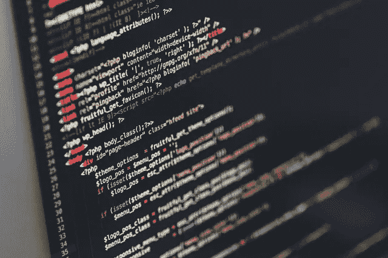
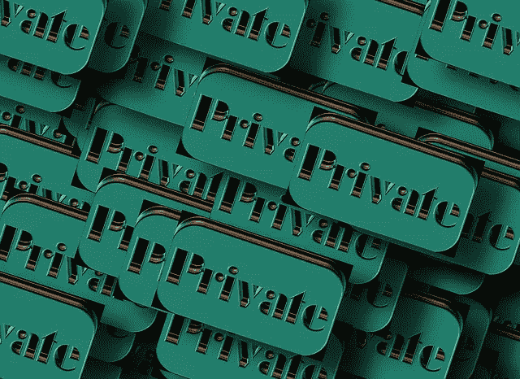

# 软件开发者是一股向善的力量吗？

> 原文：<https://medium.com/hackernoon/are-software-developers-a-force-for-good-afa76944669>

不久前，我看了这场辩论。在这场特别的辩论中，双方都在争论基督教是否是一股向善的力量。
虽然这篇文章与一般的宗教无关，但它引发了我思考了一段时间的一些事情。我一直在思考软件开发行业的道德和伦理，更准确地说，*软件开发人员是一种好的力量吗？*

我们生活在一个有趣的时代，在这个时代，算法每天都在变得更快、更准确。处理能力和数据存储能力几乎是无限的时代。

我们也生活在这样一个时代，获取技术比以往任何时候都更便宜，而且每天都在增长。

考虑到这一点，提出以下问题是很重要的:*我们正在创建什么样的软件？我们在向同行提供什么样的产品？我们考虑过我们工作的危险吗？*

***小免责声明:*** *我知道不是所有的软件都是危险的，其实大部分都不是。许多科学上的进步都是因为我们的工作才成为可能。因为我们的工作，每天都有很多好事发生！*

作为一名软件开发人员，我很少考虑与我的工作相关的含义和道德伦理。

这让我很担心。因为如果我们仔细想想，软件正被用于非常可疑和肮脏的事情。

快速浏览网上广告。你认为我们看到的几乎每一个添加都符合我们的需求是巧合吗？他们知道你需要新鞋，而且你正在考虑买一台新电脑。他们甚至知道你最喜欢什么样的电影和书籍。绝对不是巧合。

真实故事时间。我一直在寻找去马拉喀什的机票，因为我想去那里看看。我一打开脸书，去马拉喀什的旅游广告就开始了。

我花了一些时间试图确定软件开发实际上对社会有害的领域，我得出了 3 个主要领域。我认为这些地区是最危险的，值得好好深入研究一下。

# 武器

我觉得这个挺明显的。在大多数现代战争中，软件起了促进作用，并且[存在于](https://defensesystems.com/articles/2017/02/27/solarium.aspx)之中。软件正在促进更新更致命武器的发展。老实说，不管他们怎么说，使用武器不会带来任何好处。

# 隐私

每次我们打开电脑时，都会收集数据。像谷歌和脸书这样的公司拥有庞大的用户数据库，他们知道一切，你去过哪里，你喜欢什么，谁是你的朋友…一切！数据在公司之间传递。其中一些公司并没有最好的意图。

不仅如此，[操作系统](http://www.washingtonsblog.com/2013/06/microsoft-programmed-in-nsa-backdoor-in-windows-by-1999.html)还有[后门](https://falkvinge.net/2013/11/17/nsa-asked-linus-torvalds-to-install-backdoors-into-gnulinux/)，这样你就可以被监视。

作为这些系统背后的软件开发者，我们正积极致力于根除现代社会的支柱之一**自由**。

# 上瘾

[上瘾很真实](http://www.newyorker.com/science/maria-konnikova/internet-addiction-real-thing)。如今，产品的成功是以对其上瘾的人数来衡量的。当人们无法登录他们最喜欢的网站或社交网络时，他们会感到焦虑。人们感觉他们的手机在口袋里震动，即使手机不在那里。这是我们醒来后做的第一件事，也是睡觉前做的最后一件事。被联系起来。

我知道这一点，我在同一条船上。不管怎样，我也沉迷于连接。

企业有完整的团队研究如何让用户沉迷于他们的产品，即时奖励，不断通知，喜欢和竖起大拇指，这都是有据可查的。

想猜猜是谁的工作推动了这一切吗？

# 总结一下

乍一看，软件开发似乎是一个相当无害的职业。我们早上到达，做一些编程，然后离开。我们也是相当内向的人。我们能做什么坏事？

但如果我们仔细观察，就会发现背后隐藏着巨大的责任。也许是时候看看我们做了什么，以及它可能产生的影响。

是时候停止将它仅仅视为一个技术职位了，是时候用道德的眼光看待它了。

我认为软件开发人员是一种好的力量吗？

肯定！

但是还有很多工作要做！

> [黑客中午](http://bit.ly/Hackernoon)是黑客如何开始他们的下午。我们是 [@AMI](http://bit.ly/atAMIatAMI) 家庭的一员。我们现在[接受投稿](http://bit.ly/hackernoonsubmission)并乐意[讨论广告&赞助](mailto:partners@amipublications.com)机会。
> 
> 如果你喜欢这个故事，我们推荐你阅读我们的[最新科技故事](http://bit.ly/hackernoonlatestt)和[趋势科技故事](https://hackernoon.com/trending)。直到下一次，不要把世界的现实想当然！

