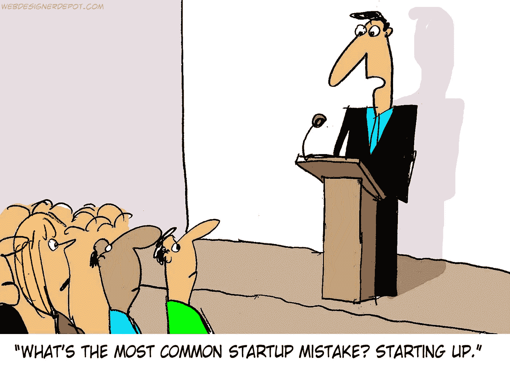

# 创业公司死了吗？

> 原文：<https://medium.com/hackernoon/are-startups-dead-ee78bd7314b7>

Image Courtesy : WebDesingerSpot

今天，我们更接近 2030 年，而不是 2000 年。那些看似“昨日重现”的事件实际上已经很久了。自第一台 iPod 发布以来，大约 14 年过去了，今天，我们站在让虚拟现实这样的幻想获得商业成功的边缘。

大约在 21 世纪初，工业巨头的公司法和严格的规章制度在普通人眼中开始变得邪恶。人们开始害怕走进这些巨大的混凝土建筑，害怕变成一只车轮中的仓鼠。

如果你问我，我会说脸书是世纪之交以来第一个成功的创业公司。为自己工作，穿着拳击短裤去办公室，有随时随地工作的自由，这种想法太有利可图了。困在 IBM 小隔间里的人们，穿着他们的西装制服，整天粘在显示器前，只能梦想这个平行宇宙。

## 是不是好得不像真的？

到了 2015 年，我们被创业公司包围了。从叫出租车、租旅馆、给我们送饭到照顾我们的孩子，他们什么都想做。

少数人幸存下来，许多人摔倒在地。他们中的一些人太没有经验了，无法处理这笔钱，一些人面临着“T0”成立的“T1”的反弹，但大多数人都死了，因为他们是“T2”，试图解决一个不存在的问题。

例如，在班加罗尔(印度的硅谷)有一段时间，大约有 34 个食品厨房相互平行运作。如今只剩下 3、4 家。他们没有共同努力给最终用户一个更简单的体验，而是用太多的选择把他们搞糊涂了。

## 是时候掸掉旧西装和领带，回去了？或者是？

让我们试着分析一下这些初创企业到底哪里出了问题。

*   *收入模式，什么？永远不要忘记，不仅仅是创意在经营企业，金钱也是。你需要想出钱从哪里来维持你的生意。*
*   年轻企业家在管理投资者资金方面缺乏经验；在雇佣新人、购买更大的办公室、过度广告上花费过多导致了大量现金的流失和许多创业公司的致命崩溃。
*   *目光的变幻无常；佐马托建立了自己的配送链，与 TinyOwl & Foodpanda 竞争，但惨败。Zomato 成立时是一个餐厅聚合器，收集了印度几乎每家餐厅的数据。冒险进入一个饱和市场的想法并不正确。合伙会更明智。*
*   *那些该死的风投*；虽然投资者对做生意至关重要，但今天的风险资本家已经迷失了方向。他们想挤牛奶，直到它变干。你需要耐心来推动业务增长。这增加了每个人过度表现的压力，这通常会破坏整个结构和愿景。

这是否意味着创业公司的概念是有缺陷的？不，绝对不是！

这个时代催生了如此多成功的创业公司；优步、Flipkart、亚马逊、Snapchat、Pinterest、Groupon，甚至脸书。但是在你进入这个领域之前，要对你的产品/服务有一个清晰的愿景，一个明确的执行计划，并对你的财务状况有足够的把握。

## 永远记住，今天几乎每一家老牌公司都曾经是在某人的车库或地下室里成立的“初创公司”。

> [黑客中午](http://bit.ly/Hackernoon)是黑客如何开始他们的下午。我们是 [@AMI](http://bit.ly/atAMIatAMI) 家庭的一员。我们现在[接受投稿](http://bit.ly/hackernoonsubmission)并乐意[讨论广告&赞助](mailto:partners@amipublications.com)机会。
> 
> 如果你喜欢这个故事，我们推荐你阅读我们的[最新科技故事](http://bit.ly/hackernoonlatestt)和[趋势科技故事](https://hackernoon.com/trending)。直到下一次，不要把世界的现实想当然！

