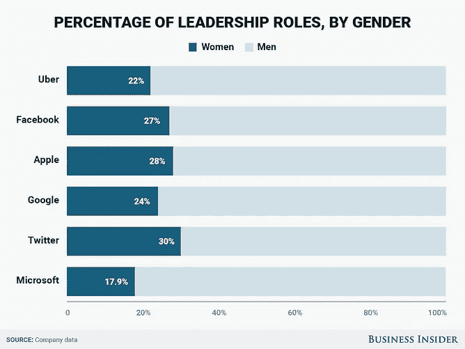
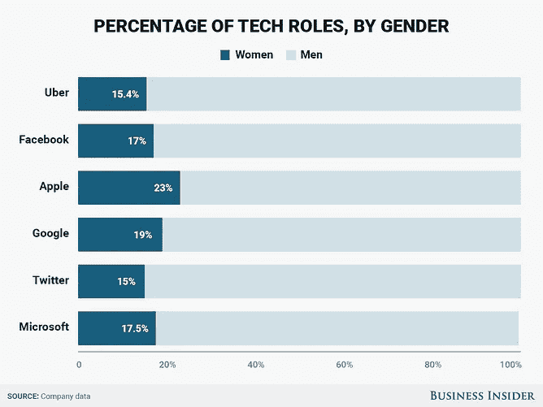
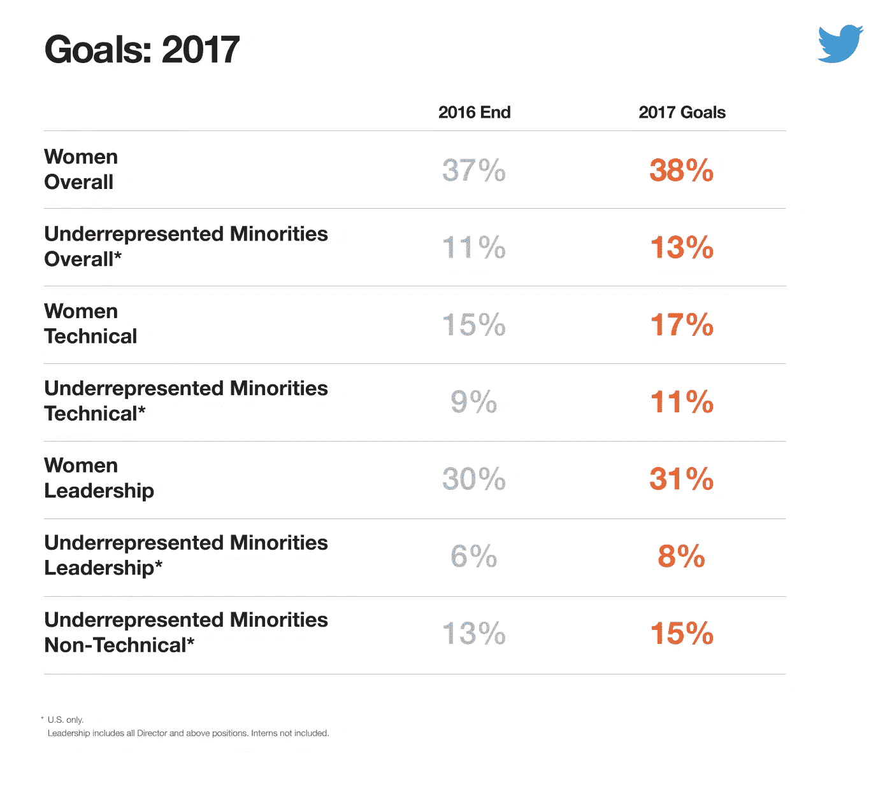

# 科技集团不擅长多元化吗？

> 原文：<https://medium.com/hackernoon/are-tech-group-bad-at-diversity-988a965390dc>

## 这是文化问题吗？

正如《纽约时报》今天报道的那样，优步已经解雇了“20 多名员工，以配合对其工作场所文化的内部调查”，值得看看科技世界的多样性。

许多大型科技公司的多元化仍然是一个大问题。

看看苹果、脸书、谷歌、微软、推特和优步，你会发现平均只有 32.3%的员工是女性，但如果你只考虑技术职位，这个数字会下降到平均 17.8%。

就种族多样性而言，平均超过 55%的劳动力是白人。对于领导角色，这一比例高达 70%以上。

如果你看看这些公司的董事会，这些数字看起来特别糟糕:

*   苹果公司的八名董事会成员中有两名女性，分别是钟彬娴和苏珊·瓦格纳；
*   脸书的八名[中有两名女性，该公司首席执行官雪莉·桑德伯格和](https://investor.fb.com/corporate-governance/?section=board)[苏·德斯蒙德-赫尔曼](https://medium.com/u/e49a244b1177?source=post_page-----988a965390dc--------------------------------)；
*   在谷歌母公司 Alphabet 的 12 名董事会成员中，只有三名女性，黛安·格林、安·马瑟和雪莉·蒂尔曼；
*   [微软董事会中的三位女性](https://news.microsoft.com/leadership/)，泰瑞·李斯特-斯托尔、桑德拉·彼得森、帕德玛丝蕾·沃瑞尔；
*   在 Twitter，10 名董事会成员中有三名女性——玛莎·莱恩·福克斯、黛布拉·李和马乔里·M·斯卡迪诺。
*   优步的六人董事会中有一名女性，即 T2·阿里安娜·赫芬顿·T3，她一直试图指导公司及其联合创始人兼首席执行官 T4·特拉维斯·卡兰尼克从内部改变文化。

为什么总的来说人数这么少？数字重要吗？

数字当然很重要，如

“我们对包容性和多样性的承诺是我们的根本，也是我们服务有效性的关键，”[一篇强调 2016 年公司多样性成就的 Twitter 博客文章写道](https://blog.twitter.com/2017/building-a-more-inclusive-twitter-in-2016)。

但尽管如此，他们承认:“我们知道我们的行动——其中许多是 2016 年的新行动——不可能立竿见影。我们专注于持续的努力，这将帮助我们吸引更多不同的人才，创造伟大的经历和职业生涯，并培养一种完全符合 Twitter 自身社区精神的归属感文化。”

对于 2017 年，Twitter 的目标似乎有点平淡无奇，目标是实现 37%的女性比例，比 2016 年增加 1%，并将代表不足的少数群体从 11%增加到 13%。

Twitter 联合创始人兼首席执行官[杰克·多西](https://medium.com/u/ab69c5472679?source=post_page-----988a965390dc--------------------------------)在与电影圈的演员们坐下来谈的时候评论[:“我们把很多注意力放在我们没有的人和我们有的人上，以及如何培养他们。”](https://www.theverge.com/2017/4/24/15410796/the-circle-twitter-livestream-jack-dorsey-tech-diversity-problem-causes)

但是当被问及“缺乏多样性是否是一个世代的事情，仍然作为一个回声存在？或者我们并不像自己认为的那么先进……如果这还是一个需要解决的问题的话？”他回答说:

“实际上，我不太确定。我不确定原因是什么。其中一些可能归结于位置和许多这些事情开始的地方，只是抓住一个特定的地点而不是真正扩大。我认为首先要承认这一点，然后像这样，我们可以采取的最切实的步骤是什么，我们可以实际上融入我们的 DNA 和我们每天的实践中，这一直是我们的焦点。但这是个好问题。”

[Bernard C. Coleman III](https://medium.com/u/d31cb259070d?source=post_page-----988a965390dc--------------------------------) ，[优步](https://medium.com/u/b97b1b381b5a?source=post_page-----988a965390dc--------------------------------)的多元化和包容性全球主管，在[该公司有史以来的第一份多元化报告](https://www.uber.com/diversity/)中写道，“多元化和包容性是一个巨大的机会——利用不同的经验和想法建立更好的工作场所和更好的公司的机会。”

他补充道:“通过利用员工的差异为集体利益服务，你可以取得惊人的进步。"

优步的 Kalanick [告诉 Business Insider](http://www.businessinsider.com/uber-diversity-report-comparison-google-apple-facebook-microsoft-twitter-2017-3) 他们的第一份多元化报告“是表明多元化和包容性是优步优先考虑的第一步。”

> 我知道我们公布数据的速度太慢，而展示我们变革承诺的最佳方式是通过透明度。为了取得进步，重要的是我们要衡量什么是重要的。

但优步的数字似乎并没有反映出那里的陈述，特别是如果你考虑到该公司一直面临的许多问题，包括来自前员工的公开骚扰和性别歧视指控，如[苏珊·j·福勒](https://www.susanjfowler.com/blog/2017/2/19/reflecting-on-one-very-strange-year-at-uber)、[艾米·韦提诺](https://medium.com/u/a1e2cece5dd1?source=post_page-----988a965390dc--------------------------------)和[凯拉(key-ay-luh)](https://medium.com/u/1ee3c4d27ddb?source=post_page-----988a965390dc--------------------------------) 。

“是的，毫无疑问，有一些坏苹果。但是这不是一个系统性的问题，”阿里安娜·赫芬顿在三月份告诉 CNN。“重要的是，以前不存在的结构现在正在到位，以确保妇女、少数族裔和所有人在优步感到完全舒适。”

[在最近的一篇文章](https://techcrunch.com/2017/05/07/beyond-the-diversity-report/)中，TechCrunch 的[梅根·罗斯·迪基](https://medium.com/u/a238f6a167e4?source=post_page-----988a965390dc--------------------------------)强调说，“自从[在 2013 年](http://money.cnn.com/2013/03/17/technology/diversity-silicon-valley/index.html)发布第一份多样性数据以来，由于信息自由法案的要求，以及随后许多知名科技公司自愿披露，几乎没有什么变化”，许多科技集团尚未公布他们的数据，包括 Lyft、Snap、Spotify 和特斯拉。

Dickey 认为，“虽然多元化报告[……]在透明度和问责制方面是好的，但它们在其他方面几乎没有什么成就”，而且它们似乎没有影响或冲击一家公司的文化，因为“它们没有为那些可能感到被边缘化、被忽视、被歧视或被骚扰的人改善工作环境。”

> 这告诉我们，原始数字和百分比对文化没有影响。

精神食粮！

> [黑客中午](http://bit.ly/Hackernoon)是黑客如何开始他们的下午。我们是 [@AMI](http://bit.ly/atAMIatAMI) 家庭的一员。我们现在[接受投稿](http://bit.ly/hackernoonsubmission)并乐意[讨论广告&赞助](mailto:partners@amipublications.com)机会。
> 
> 如果你喜欢这个故事，我们推荐你阅读我们的[最新科技故事](http://bit.ly/hackernoonlatestt)和[趋势科技故事](https://hackernoon.com/trending)。直到下一次，不要把世界的现实想当然！

