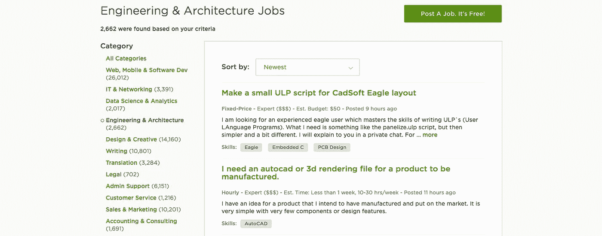
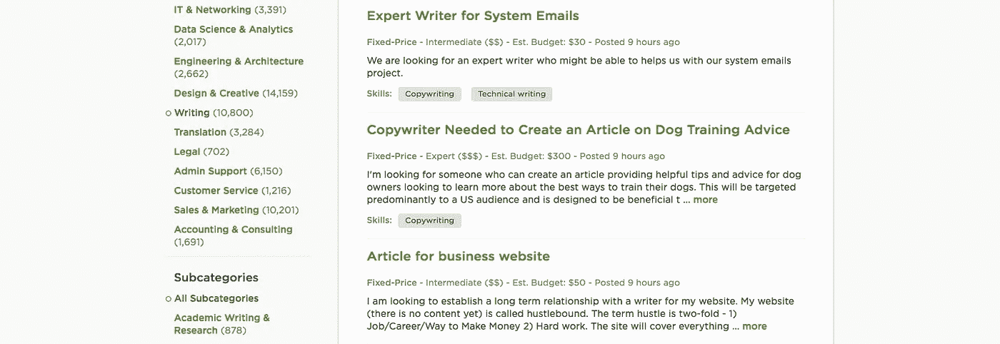
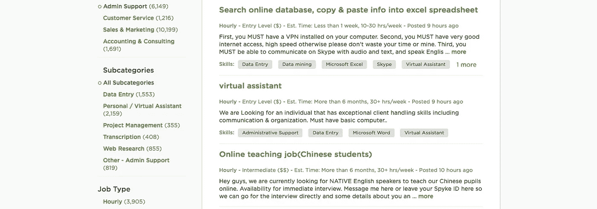

# 那些工作值得你去做吗？

> 原文：<https://medium.com/hackernoon/are-those-upwork-jobs-worth-your-while-8794321c438>

正如我上次谈到 [Upwork](http://julieewald.com/find-freelance-jobs-without-upwork/) 时提到的，并不是每个人都是超级粉丝。如果你花足够的时间在 [Reddit](https://www.reddit.com/r/Upwork/) 的正确部分，你会认为所有的 [Upwork](https://hackernoon.com/tagged/upwork) 工作完全是垃圾。见鬼，有时我甚至怀疑我是否都在那里，因为我一直在说我是多么热衷于那个网站。

这是因为自由职业者找到的很多高端工作都是垃圾……至少对他们来说是这样。他们说一个人的垃圾是另一个人的财富，我认为这种思路也适用于自由职业者的工作。但是有些只是垃圾——让我们现实一点。

那么，你怎么知道那份工作是否值得你再花一秒钟去考虑，更不用说申请了呢？当我在 Upwork 上看到一个[工作](https://hackernoon.com/tagged/job)时，我会评估以下内容，以决定我是否应该给它更多的时间。

# 评估升级作业

## 关键词

我看着一个列表标题和显示在求职信息中的前几个词，让我知道一份工作是否适合我。我寻找那些能表明我喜欢做的事情的词语作为灯塔，相反的是危险信号。

例如，当我搜索“营销策略”演出，看到一个提到 SEO 或 Adwords 的列表时，我会快速浏览预览。如果没有任何迹象表明我草率地忽略了它，我会让它继续下去。但如果我看到有人提到 Hubspot、集客营销或一些不同领域的内容，我就会注意。

## 经验水平

如果有人想在“入门级”招聘，这意味着他们希望支付更低的工资。他们雇佣的人可能会在工作中迷失方向，这只是一个不幸的副作用。中级意味着他们仍然不想付很多钱，但他们希望有人更精通一点。专家意味着他们想要一个真正了解他们的东西的人，他们甚至想付更多的钱。

如果你刚刚起步或处于中间地带，那就有点模糊了。初学者可能有机会从事中级工作。根据演出的情况，中级人员真的可以选择任何一种方式。专家真的可以适用于任何事情，但这并不意味着利率会适合他们。这就把我们带到了…

## 速度

对于钟点工，除非有人把他们愿意支付的价格塞进清单，否则除了首选的经验级别之外，你真的没什么可说的了。

使用固定价格列表，您可以获得一条重要的附加信息:他们的预算！如果有人想支付比你低的价格，你就离开。

但有时这可能很棘手，因为一些雇主使用低得离谱的占位符。其他人可能会列出一个工作单位(一篇文章、一个列表或一张编辑过的图片)的预算，尽管需要完成多项工作。如果列表中的其余部分没有发出危险信号，这可能值得申请和询问。但是不要乐观。有很多人在寻找真正廉价的工作，因此 Reddit 上有很多讨厌的人。

## 首选资格

现在我认为你可以试着反驳其中一个，但是如果你不是雇主想要的，你可能无法说服他们。如果我在北美寻找一个以英语为母语且有 90%成功得分的人，我很可能会忽略一个有 60%成功得分但母语不是英语的德国人。

即使你能说服，如果你不符合客户的要求，Upwork 可能也不会向他们展示你和你的提议。你的申请被藏了起来，除非雇主去挖掘，否则他们不会发现。即使他们找到了，也会有红色的大标记提醒他们你不是他们要找的人。

## 反馈

如果雇主反馈不好，我不想和他们一起工作。如果他们因为要求高或难以共事而被嘲笑，我会通过。你可能也想。如果客户是个麻烦，我不想参与任何项目。

当我在那里的时候，我检查以前演出的细节。如果他们曾经和其他人合作过类似于他们现在寻找的工作，这是值得注意的。看看利率或支出，因为他们可能会想要一个类似的利率。还有，看职称。如果他们每隔一周就尝试一个新的开发者，你真的想成为下一个吗？

## 列表

现在我真的*看了*清单。我主要寻找**不切实际的期望**或者客户没有真正理解事情如何运作的迹象。

他们想仅仅因为在他们的网站上增加一个博客就能看到流量的激增吗？他们要求在 48 小时内定制 WordPress 网站吗？他们想要一个新的标志吗？

当一个潜在的客户要求一些不可行的或者让他们失望的事情时，我会拒绝。说“不”比花时间培养一个领导更容易…然后可能就不一起工作了。

在你可能遇到的任何后续工作中，可能有许多其他危险信号。不同的专业领域也会有不同的问题领域。

## 沟通

关于演出的交流对我来说是成败的关键。

当我申请 Upwork 工作时，我总是会问一些问题。如果潜在客户懒得回答任何一个问题，这就是一个大的危险信号。更糟糕的是，当他们只回答一个问题，选择一堆问题中最不相关的。

另一个质量问题是清晰度。如果我不能理解客户想要什么，我就没有办法去满足他们。如果他们不清楚，我不想要这份工作。

没有及时回应也是有问题的。我有一次面试持续了几个月。花了两周或更长时间才得到回复！如你所料，当我收到潜在客户的回复时，回复都很简短，通常不回答我的任何问题。我只能想象在真正的演出上和他交流有多困难！

## 箍

最后，如果有人想让你跳过不必要的关卡，我说不行。要得到一份工作确实需要一些努力，但有些人只是玩了些恶作剧。这包括 NDA 只是为了知道工作是什么，或者在提案中包括样本定制段落(基本上是免费试用)。

很少会遇到潜在客户提出额外要求的情况，但这种情况确实存在。而且很臭。我觉得不值得你浪费时间。

# [获得与工作地点无关的工作的 5 个基本技巧](http://julieewald.com/5-essential-tips-landing-location-independent-jobs/)

[2016 年 11 月 1 日](http://julieewald.com/5-essential-tips-landing-location-independent-jobs/)

## [如何在不工作的情况下找到自由职业](http://julieewald.com/find-freelance-jobs-without-upwork/)

[2016 年 10 月 27 日](http://julieewald.com/find-freelance-jobs-without-upwork/)

## [有哪些在哪里都能做的职业？](http://julieewald.com/careers-you-can-do-anywhere/)

[2016 年 10 月 25 日](http://julieewald.com/careers-you-can-do-anywhere/)