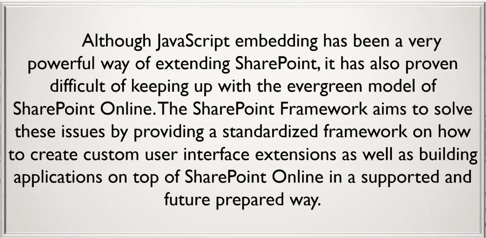

# 如今的 SharePoint 开发人员处境危险吗？

> 原文：<https://medium.com/hackernoon/are-todays-sharepoint-developers-in-jeopardy-cd4e9a11ad69>

我最近在纽约举办了一次全球 Office 365 开发者训练营。我介绍了 SharePoint [框架](https://hackernoon.com/tagged/framework)。它是相当面向演示的，我被问了很多很棒的问题。问题很棒，我最喜欢这种来回提问的方式。然而，这次经历让我想起了去年 7 月的 SharePoint 周六活动。我坐在一个家伙的旁边，[罗布·温莎](http://lanyrd.com/profile/robwindsor/)，他介绍了打字稿[编程](https://hackernoon.com/tagged/programming)语言。点击这里阅读他的摘要:[http://lanyrd.com/2017/spsnyc/sfrxry/](http://lanyrd.com/2017/spsnyc/sfrxry/)。我是 TypeScript 的忠实粉丝，我很高兴听到其他人谈论它。他的演讲吸引了一大群人，而且他还有一个很棒的问答环节。

他的问答和我在训练营的问答都强烈地向我暗示，今天的许多 SP 开发者可能处于危险之中，而他们甚至没有意识到这一点。我来解释一下原因。

对于那些不知道的人，微软在今年(2017 年)2 月发布了 SharePoint Framework (SPFx)。我是这样总结的:

> SPFx 是微软的一项尝试，旨在使当今的开发人员能够使用通用前端开发工具来创建 SharePoint web 部件。

这过于简化了，如果你愿意，可以在这里阅读更多相关内容，获得更深入的解释:[https://docs . Microsoft . com/en-us/SharePoint/dev/spfx/SharePoint-framework-overview](https://docs.microsoft.com/en-us/sharepoint/dev/spfx/sharepoint-framework-overview)

为此，SPFx 采用了常用工具，包括:

*   节点 JS
*   吞咽
*   网络包
*   以打字打的文件
*   约曼
*   反应

# 为什么是危险？

这是一个危险的部分——如果你是一个经验丰富的 SP 开发人员，甚至是架构师，这意味着你有 5 到 7 年甚至更长的使用 SharePoint 的经验。如果这是对你的描述，那么你已经努力学习如何使用过时的技术自定义 SharePoint。大多数情况下，你所学的任何关于服务器端 JavaScript 的知识在 SharePoint 在线世界中都是不相关的，至少说来有趣，这个在线世界每天都在变大。服务器端并不是唯一的担忧。大多数 SP 定制店都会定期通过 JavaScript 注入来修改 SharePoint。我们通过脚本编辑器 web 部件或内容编辑器 web 部件或者可能将它添加到母版页等来实现这一点。再次，我过于简化，但我认为这涵盖了地图很好。

与此同时，微软已经发布了 SPFx，它根本不使用 hacky 脚本编辑器和 CEWPs。它创建了真正的、绑定的 web 部件，具有属性窗格和健壮的部署策略，并使用了大量“全栈”开发人员每天都在使用的工具。

在我这个周末的训练营演讲和回忆我在 7 月份 Rob W 的演讲中回忆的问题的性质之间，我认为今天的许多 SP 专业人士突然非常落后于形势。在某种程度上，我们总是落后于这个快节奏的技术世界，至少在某些方面。然而，SP pro 可能没有意识到他们落后于趋势有多远。

我在想象我儿子的朋友和一名经验丰富的服务器端 SharePoint 开发人员之间的竞赛，前者目前是 DC 华盛顿州计算机科学专业的三年级学生，后者已经构建了复杂的工作流，可能由事件接收器触发，它发出电子邮件并使用 SP 对象模型来创建、删除和更新列表项。比赛是“使用 SharePoint framework 创建一个针对具有半打列表列的 SharePoint 列表的 CRUD 应用程序。”一方面，您有经验丰富的 SP 专业人员，另一方面，您有一个大学生，他几乎只知道客户端开发，并且习惯于理所当然地使用 REST APIs。

那个大学生可能不会赢得比赛，但他们两个都会在一周内完成。大学生可能真的会赢。

我不知道我到底想通过这样一篇博文达到什么目的。我想，我所看到的让我担心，我认识的许多 SP 专业人士和我不认识的许多人可能没有意识到他们与 SharePoint 定制的当前方向有多么脱节。客户端开发范式在许多公司都处于上升阶段，如果你不注意，你最终会成为别人的午餐:)。所以，我想这个故事的寓意是——关注正在发生的事情，拥抱这些新工具，让自己跟上速度。没那么难，但是很重要。

想法？