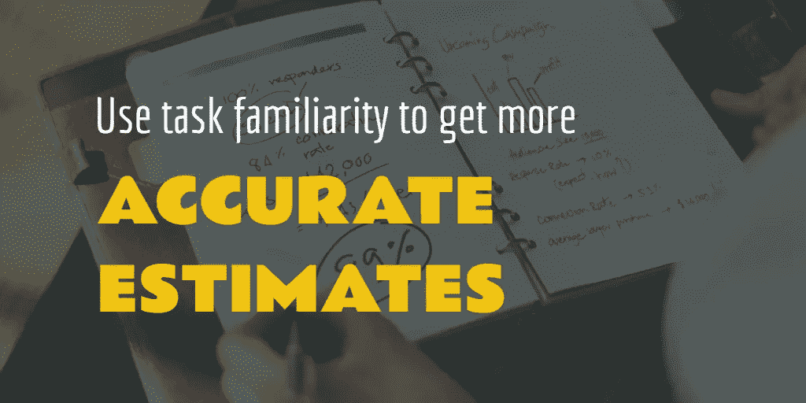
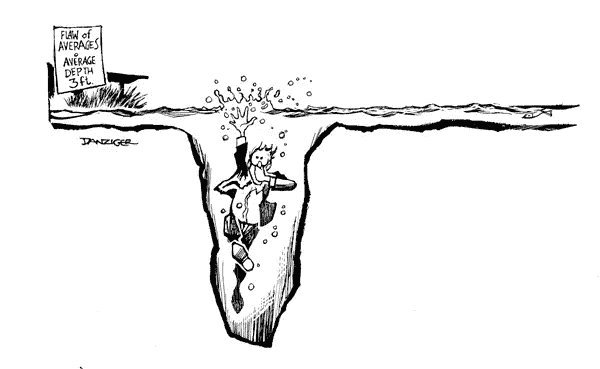
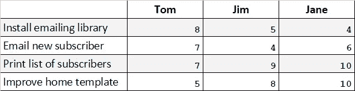

# 敏捷和瀑布忽略了任务评估的一个重要元素

> 原文：<https://medium.com/hackernoon/are-we-ignoring-some-valuable-aspects-when-doing-estimates-aa3ca92c4d9>

从我第一次做评估开始，对我来说很明显**以前的任务经验对准确评估非常有帮助**。举例来说，如果你已经安装了一个[特定的](https://hackernoon.com/tagged/particular)库很多次，那么此时你应该很清楚这通常需要多长时间，对吗？

# 当前的方法做什么

团队中的每个人对每项任务的熟悉程度都不一样，所以**不管是一个人评估所有的任务，还是从几个人的评估中取平均值都没关系。在这两种情况下，都会丢失有价值的信息。**

奇怪的是，这种熟悉的因素在很大程度上被我工作过的团队忽略了。例如，我目前的工作是“规划扑克”，它试图让一些人对一个估计达成一致。问题是，如果他们中只有一个人以前真正执行过这样的任务呢？那个家伙很难让其他人都同意他的观点。平均估计会导致完全无用的结果。

瀑布也有类似的问题，如果不是更糟的话。通常在这种环境下，团队领导会做评估，或者他会将评估委托给另一个团队成员。再次，[程序员](https://hackernoon.com/tagged/programmer)经验被忽略。永远不要让一个人做所有的评估。

# 同龄人的压力掩盖了这个问题

另一个在评估过程中通常被忽略的相关因素是:**谁将真正实施它？**当然，如果你给一项任务贴上低复杂度的标签，然后把它分配给一个以前没有这种任务经验的人，那么这个估计是不准确的。任何将评估与实施分开的系统都无法避免这个问题。

一些团队试图通过让实现者重新估计来减轻这一点，但是这样你就浪费了时间去估计两次，而且，根据我的经验，**如果估计相差很大，那么实现者就会受到来自同行的压力**试图让他同意之前的估计。

# 关注任务熟悉度的好处

关注任务熟悉度的一个有趣的事情是，人们似乎对这个指标完全没有兴趣。他们知道自己要么知道，要么不知道，所以猜测自然会少一些。

如果你喜欢数字，你可以在你的团队中进行一项调查，以衡量每个人对每项任务的熟悉程度。从更准确的数据出发，你的结论应该更有价值。

首先构建一个包含团队成员和任务的表格，让每个单元格都有一个从 0 到 10 的数字，以衡量每个成员对该任务的熟悉程度。做完这些，你就可以用这个表来帮助你做决定和计算有价值的事情。

Measuring how familiar each person is with a task can give you valuable insight on your team

*   为了最大化执行速度，只需将每个任务分配给最熟悉的人。
*   为了**最大化你的团队的潜力**，通过给每个人分配不太熟悉的任务，让人们学到更多。让他们保持在一个具有挑战性但不是法老的努力水平。
*   **让新成员和那些已经熟悉你分配给新成员的任务的人一起组队，让他们快速上手**。
*   为您的团队建立一个通用的技术熟悉度表，衡量每项技术(反应、角度等。)对比每个成员对它的熟悉程度，这将让你**知道将新技术引入你的堆栈**会产生多大的影响。

> [黑客中午](http://bit.ly/Hackernoon)是黑客如何开始他们的下午。我们是 [@AMI](http://bit.ly/atAMIatAMI) 家庭的一员。我们现在[接受投稿](http://bit.ly/hackernoonsubmission)并乐意[讨论广告&赞助](mailto:partners@amipublications.com)机会。
> 
> 如果你喜欢这个故事，我们推荐你阅读我们的[最新科技故事](http://bit.ly/hackernoonlatestt)和[趋势科技故事](https://hackernoon.com/trending)。直到下一次，不要把世界的现实想当然！

