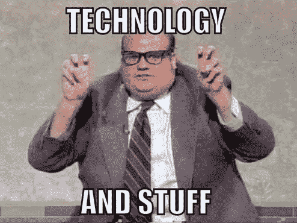

# 你真的精通技术吗？3 种方法让你不再伪装，变得自信

> 原文：<https://medium.com/hackernoon/are-you-actually-fluent-in-technology-3-ways-to-stop-faking-it-and-get-confident-e3684539f986>

在我积极参与指导黑客马拉松之前，我会告诉你我非常精通技术——也就是说，直到我接触了信息技术办公室，并意识到我有多少不知道。这无疑是一次令人谦卑的经历，但它也帮助我对我目前生活方式中许多我认为理所当然的方面获得了欣赏。现在，我对为什么“谷歌”是如此优雅的“谷歌”，为什么更新对您的移动应用程序很重要，当我失去信号时如何对我的无线互联网进行故障诊断，有了更高层次的了解……不胜枚举。

现在，虽然我发现知识总是很重要，但我的大脑没有空间来存放我积累的每一条信息。相反，我保留了足够的钱。我不需要成为技术女王，我的优势在于我热衷的不同领域。

所以你要做的第一件事就是克服自己的状态和学习方式。你在很多方面都很重要——无论你如何学习，无论你有什么样的激情。但是现在让我们来谈谈你如何能变得更流利。

**设备综述**

我最近收集了我所有的技术(个人的和专业的),这样我就可以摆弄我的设置，并把它们全部弄糟。我的目标是找出我的存储、我的同步、我的云以及任何在后台运行的自动化任务。我很快就确切地知道了我所知道的，以及我在哪里需要帮助。我还没有机会，但我计划访问我们的 it 服务台和一些当地商店，以帮助我得到排序。他们每周都会举办很棒的研讨会，来帮助我们这些稍微有点技术挑战的人。

**节目方**

那么，你在电脑或设备上到底用的是什么呢？什么是程序？人们谈论的硬件到软件的术语是什么？

*程序:*

为计算机或其他机器提供自动执行特定任务的编码指令。

*硬件:*

计算机或其他电子系统的线路和其他物理组件。

*软件:*

计算机使用的程序和其它操作信息。

现在检查你的程序的健康状况，你需要更新你的版本吗？如果因为你的程序还困在 1999 年，和普林斯开派对，而有一些很棒的功能你不能使用，那就糟了。

宋大喊一声:

唷。现在您已经运行了最新版本…让我们继续吧！

**车间作业**

我怎么强调这一点都不为过。我知道这意味着脱下你的网飞睡衣，从你繁忙的日程中抽出一些时间来学习，但是我可以向你保证，如果你离开研讨会时感觉比刚来时更糟，我会亲自免费给你买一份披萨或咖啡。走出去，与该领域的专家交谈，向他们学习他们的工作。

如果是初级班，周围都是比你年轻 20 岁的人，那完全没问题。我记得当我上滑雪课时，有一群 7 岁的孩子在踢我的屁股，但这不会阻止我完成课程并学习如何滑雪。我们一起吃过雪，雪从来没有这么好吃过。

去车间的目的是沉浸在知识中。你是一块海绵，这意味着很多东西进来了，只有一部分留了下来。我个人感到欣慰的是，没有人能知道所有的事情，但你不需要知道所有的事情，你需要知道足够多的事情来知道你不知道的事情，以及如何发现你是否/何时需要知道它。

这三个练习应该帮助你诚实地评估你的技术技能，并开始建立你的自信。很快你将成为技术大使！我鼓励你们每个人熟悉生活中的技术，了解它能做什么以及它如何能做得更好，然后想象你可以使用该技术来改善你的生活(或他人的生活)的方式。这是一个不可思议的工具，如果你愿意接受挑战，你有能力释放它的潜力。

如果你想和我就这个话题进行进一步的头脑风暴，请联系我: [experimentalcivics.io](https://www.experimentalcivics.io/)

祝你好运，工作愉快！