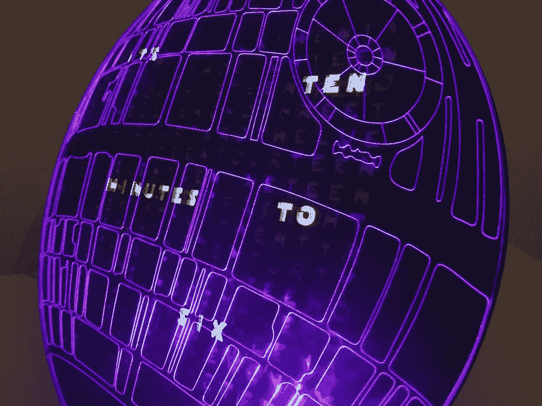
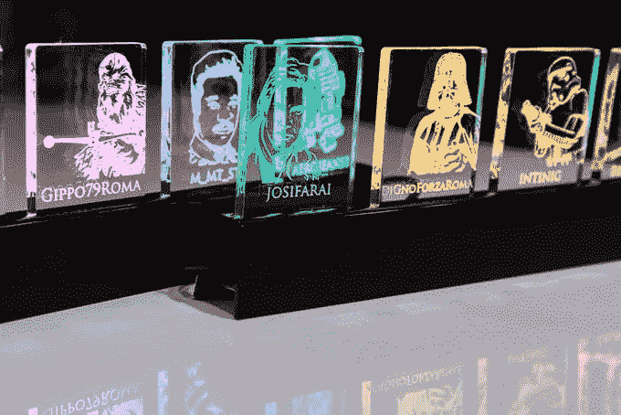

# 你是个绝地武士吗？创造你自己的受星球大战启发的技术

> 原文：<https://medium.com/hackernoon/are-you-an-iot-jedi-create-your-own-star-wars-inspired-tech-4c36ce8d4535>

## 从头盔到全息记录仪，这些基于粒子的物联网项目非常适合任何原型学徒。

很久以前，在一个遥远的星系里。。。(老实说，就在不久前)，[黑客](https://www.hackster.io/)和[粒子](https://www.particle.io/)合作创建了世界上第一个受《星球大战》启发的[物联网](https://hackernoon.com/tagged/iot)挑战！

如果你不熟悉这些联盟团体，Hackster 是一个社区，初学者和专业人士可以在这里分享他们的互联网连接硬件，并向其他制造商学习。[另一方面，Particle](https://hackernoon.com/tagged/particle) 是一个全栈物联网云平台，提供开发工具和硬件，将日常物品连接到互联网。很容易理解为什么这是一次完美的合作。

在这里，我决定收集比赛中最好的作品并与大家分享。也许它们可以启发你创建自己的有趣、有创意、有参考价值的受《星球大战》启发的物联网项目。

# 用最小有效剂量制造的星球大战机器人翻译头盔

这些[机器人翻译头盔](https://www.hackster.io/vastemptinessinside/star-wars-droid-translator-helmets-359bea?ref=challenge&ref_id=22&offset=0)允许用户互相看起来像机器人，并和机器人说话。当使用者相互交谈时，其他人都会听到机器人的噪音，但这些头盔的佩戴者实际上可以相互理解！

它是如何工作的？简单来说，头盔可以感知用户何时说话，并发出机器人的噪音。用户的声音由*喉式话筒*(喉式麦克风)拾取，然后传输到第二个用户的头盔中。很酷，对吧？

如果你想建造自己的头盔，创造者留下了一套非常详细的说明和示意图。

# 乔迪·摩尔制作的死星字钟

首先，[这个项目](https://particle.hackster.io/moors7/death-star-word-clock-44ff10)不仅仅是一个类似死星的文字时钟，它还可以作为一个数字时钟，玩蛇，并复制[黑客帝国](https://www.youtube.com/watch?v=NMczPnrDszg)中的“数字雨”效果。

黑客使互动变得简单和可定制，所以你可以根据自己的需要改变时钟的功能。如果你想建造这个时钟，你还必须建造外壳和文字设计(以及实现声音和集成适当的电子设备)。虽然还有许多其他的复杂问题，但是时钟是由一个网页控制的，并且是用粒子 Javascript 库制作的。

如果你好奇，完整的原理图在这里。

# Stefano Guglielmetti 制作的在线测力仪

一直玩 front，但是不喜欢没有朋友一起玩？[在线测力器](https://www.hackster.io/jeko23/the-online-force-detector-018342)可能是你的不二之选！当你的朋友连接到 PlayStation 网络时，这些有机玻璃标志会实时亮起。

它是如何工作的？一个[粒子光子](https://store.particle.io/#photon)每分钟轮询一次 Javascript API，看看是否有人在线。如果一个朋友确实在线，API 会用一个包含相应符号的正确颜色信息的字符串来响应。

上面的模型只有 8 盏灯，但有很多方法可以定制它，以添加更多的连接或用于不同的服务(Twitter，电子邮件，脸书，无论你想要什么)。完整的原理图在这里是。

# 戴夫·克拉克为眼光敏锐的绝地制作的全息记录灯

使用[全息记录仪灯](https://particle.hackster.io/daveclarke/holocron-lamp-for-the-discerning-jedi-0d1f07)，你可以使用原力打开或关闭全息记录仪。你只需在灯上方挥挥手，灯就会升起并打开。

没有一套非常具体的指令来说明这是如何创建的，但你可以想象其中包含了大量的编码和电路。尽管创造者留下了大量的视觉图表。该项目围绕粒子光子物联网开发板构建，并使用 3D 打印材料构建外壳。

# 其他星球大战物联网项目

在 [Hackster.io](https://www.hackster.io/contests/particle-star-wars) 上还有许多其他令人惊叹的受星球大战启发的物联网项目。以下是其他原创和独特的伟大项目。如果上面的一个项目没有启发你，也许下面的一个可以:

*   [像西斯尊主一样进入房间](https://particle.hackster.io/peejster/enter-the-house-like-a-sith-lord-337d91):在你进入房间的任何时候播放“帝国进行曲”主题。
*   [使用原力。。。还是你的脑电波？](https://www.hackster.io/Imetomi/use-the-force-or-your-brainwaves-9e839b?ref=challenge&ref_id=22&offset=3):一个思维控制系统，可以让你用意念控制机器人、电脑上的光标或者灯光。
*   [绝地电灯开关](/the-mission/the-3-apps-that-make-me-smarter-b9ede9b42ff4):用一个蓝色的闪光开关取代你那无聊的旧电灯开关，它可以用你的手来控制。
*   互动星球大战 3D Ar:互动艺术，有一个运动传感器和一个超声波距离传感器。每当有人站在它面前，达斯·维德的光剑就会亮起来，眼睛发出红光。
*   R2-D2——天气助理:曾经想要 R2-D2 告诉你外面有多热或多冷吗？这是给你的项目。

当然，还有许多其他星球大战主题启发的项目。他们只是在等待一个年轻的学徒或大师！