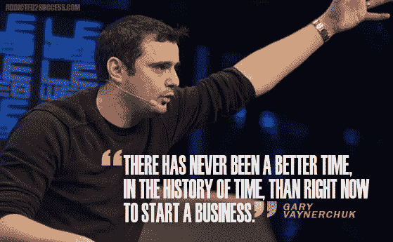
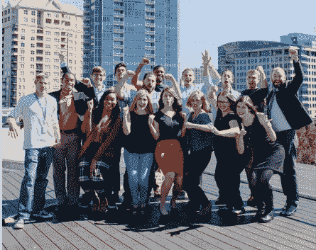

# 你是#碾压 It 还是碾压自己创业？一个充满激情的故事

> 原文：<https://medium.com/hackernoon/are-you-crushingit-or-crushing-yourself-building-a-startup-a-story-of-raw-passion-fae4825eeb9c>

我心目中的英雄之一是加里·范尼查克。他的书 [*刺拳，刺拳，刺拳，右勾拳*](http://www.amazon.com/Jab-Right-Hook-Story-Social/dp/006227306X/) 让我大吃一惊，我刚看完 [*碾压它*](http://www.amazon.com/Crush-Time-Cash-Your-Passion/dp/0061914177/) 。这个人是一个传奇，我很高兴他能来我的家乡亚特兰大参加三月份由 saleloft 主办的 [Rainmaker 大会。我很兴奋终于见到他，看到一些原始的激情。](https://sdrcloud.splashthat.com/)

对于那些不熟悉 Gary 的人来说，[看一下这个视频](https://www.youtube.com/watch?v=hSjNhtk-Yik)，这里是他的五大语录，会让你热血沸腾。大声说出这些名言，你就会明白我的意思。他说的这些话真的很有力量，充满了激情，你会感觉到的。

1.  **振作起来，引起别人的注意。**
2.  **看着镜子里的自己，问自己，我余生每天想做什么？去吧。**
3.  **你不是开车长大的。你想通了。**
4.  你可以拼命推销，但如果你的产品很差，你就死定了。
5.  梦想它很容易，但实现它却困难得多。工作！

我喜欢加里表现出来的热情和他做大事时的那种#积极进取的精神。就在我读完 [*粉碎它的时候*](http://www.amazon.com/Crush-Time-Cash-Your-Passion/dp/0061914177/)*发生了一件大事。我的公司， [Terminus](https://terminus.com/) ，是一家总部位于亚特兰大的基于账户的营销公司，在 ARR 中获得了 100 万美元，而我们只用了 9 个月就做到了！我们现在正在努力让我们的收入在 2016 年翻三番(正如他们在[创业](https://hackernoon.com/tagged/startup)世界中所说的那样)。下面是我们是如何做到的，以及我们#HustleMuscle 的故事。*

*在任何一家初创公司，你都会疯狂地工作几个小时，将你的生命和灵魂倾注到你的公司。你会戴上比你想象中更多的帽子。你又爱又恨。但不管怎样，你对公司的成败影响最大，这才是你坚持下去的动力。因为你想要成功，所以当你喝酒、吃饭甚至睡觉的时候，你都在想着你的创业。这种生活方式现在看起来完全正常，但在过去的一年后，它提出了一个问题…*

> ***创业是碾压 it 还是碾压自己？***

*当我回顾 2015 年时，我发现这一年团队合作非常出色，也充满了竞争。见鬼，我们和 G2Crowd 一起帮助建立了一个 [ABM 类别，](http://terminus.com/blog/g2crowd-wins-the-race-on-creating-the-first-account-based-marketing-category/)[做了三次大型的# FlipMyFunnel 会议，有超过 1000 名与会者](https://flipmyfunnel.com/)，可能最重要的成就是在 [Terminus 团队](https://www.linkedin.com/pulse/journey-million-dollar-arr-9-months-startup-hustle-sangram-vajre?trk=mp-author-card)雇佣了 24 名新的摇滚明星，这真的感觉像一个真正的家庭。*

**

*因此，我尽最大努力观察 Terminus 的每一个团队成员，并总结出 10 个理由，说明为什么我觉得我们只是在#碾压 It，谢天谢地，在这个过程中没有碾压我们自己。*

> ***10 种方法让你知道自己正在#创业***

1.  ***是关于做一些你从未做过的事情。Terminus 的 3 号员工阿曼达·菲洛(Amanda Faillo)为州政府组织活动，她想转行。 [Brad Wilkerson](https://www.linkedin.com/in/wilkersonbrad) 来特斯联之前从事财务会计工作。他们现在正震撼着我们的销售开发团队，每周都有创纪录数量的演示，脸上带着灿烂的笑容，好像他们已经这样做了很多年。***
2.  ***说的是付出 2000%。我们客户成功团队的西德妮·史密斯和卡伦·托弗姆 T20 不会回家，除非他们已经尽一切努力确保每一位客户都满意。这些女士很棒。我们称他们为“基德尼团队”,因为我们离不开他们。***
3.  *这是关于早点来的问题。 [Lucas Ulloque](https://www.linkedin.com/in/lucas-ulloque-ab342978) ，离开 Salesforce Pardot 领导我们的销售开发团队，在其他人进入办公室之前就来树立榜样，特别是对我们的新员工 [Kirby Oscar](https://www.linkedin.com/in/kirby-oscar-45263583) 和 [Geoffrey Hanan](https://www.linkedin.com/in/geoffrey-hanan-a2844352) 。*
4.  ***这是关于建立一个社区。** [我们营销团队的 Nikki Nixon](https://www.linkedin.com/in/nikkinixon) 致力于建立一个 [#FlipMyFunnel 社区](https://flipmyfunnel.com/)来帮助创新的 B2B 销售和营销专业人士尽可能地学习基于客户的营销。我开玩笑说她的头衔应该是翻转漏斗导演。*
5.  ***讲的是退一步进十步。我们的销售主管 Tonni Bennett 非常专注于建立一支优秀的团队来增加收入。她后退一步，意识到她需要帮助管理销售客户经理和特别提款权，这就是卢卡斯加入的原因。现在，她令人敬畏的 AEs 团队包括[斯图尔特·马龙](https://www.linkedin.com/in/stuartmaron)、[克里斯·瑞恩](https://www.linkedin.com/in/chrisreene)和[扎克·帕特森](https://www.linkedin.com/in/zach-patterson-58865b41?)都在全力推动公司前进，以达到我们 3 倍的收入目标。***
6.  *这是关于到达终点线，然后再跑一圈。劳伦·帕特里克正在帮我写第一本关于 ABM 的书。我们非常兴奋 [*基于账户的虚拟营销*](http://www.amazon.com/Account-Based-Marketing-Dummies-Sangram-Vajre/dp/1119224853) 将于 4 月 18 日推出，她已经为我们在 Q2 的销售支持制定了内容库建设计划。*
7.  *这是关于奉献时间去做正确的事情。 [Kipp Ramsey](https://www.linkedin.com/in/kippramsey) ，我们的招聘人员和文化传播者，正在寻找新的方法，使新“终结者”的入职过程更加顺利，并给每个员工一个惊人的第一周及以后。*
8.  ***这是关于建立一种伟大的文化。** [Stevie Vines](https://www.linkedin.com/in/stevievines) 和 [Brandon Cummings](https://www.linkedin.com/in/brandon-cummings-63997257) 工程团队为我们公司创办了一个[图书](https://hackernoon.com/tagged/book)俱乐部！我们公司有几个人和他们的配偶一起阅读这本书，每个月都聚在一起。谈论#工作家庭。*
9.  ***这是关于帮助建立职业生涯的。**我们的实习生——[乔希·福勒](https://www.linkedin.com/in/joshuarfowler)、[亚当·佩洛](https://www.linkedin.com/in/perlowadam)和[杰夫·朗皮林](https://www.linkedin.com/in/jeffronpirin)——远远超出了那些只会打印页面和带午餐的刻板实习生。他们正在做实实在在的工作，帮助我们的公司成长，在一家快节奏的初创公司解决实际问题，同时永远塑造他们的未来。*
10.  *这是关于做你一直想做的事情。特斯联首席执行官兼联合创始人[埃里克·斯皮特](https://www.linkedin.com/in/ericspett)一直知道自己想成为一名企业家。我们的首席技术官兼联合创始人[埃里克·瓦斯](https://www.linkedin.com/in/ericvass)知道他想要打造一款令人惊叹的产品。这正是我们在挑战 B2B 营销和销售行业现状时所做的事情。*

*我很好奇其他创业公司的创始人是如何看待白手起家创业的。在我的下一篇文章中，我很乐意分享更多关于如何不击垮自己，专注于在创业公司享受工作和生活的快乐时光。你的创业经历如何？#Crushingit 对你来说意味着什么？*

*   **原发布于 LinkedIn Pulse**

******

> *[黑客中午](http://bit.ly/Hackernoon)是黑客如何开始他们的下午。我们是 [@AMI](http://bit.ly/atAMIatAMI) 家庭的一员。我们现在[接受投稿](http://bit.ly/hackernoonsubmission)，并乐意[讨论广告&赞助](mailto:partners@amipublications.com)机会。*
> 
> *如果你喜欢这个故事，我们推荐你阅读我们的[最新科技故事](http://bit.ly/hackernoonlatestt)和[趋势科技故事](https://hackernoon.com/trending)。直到下一次，不要把世界的现实想当然！*

**